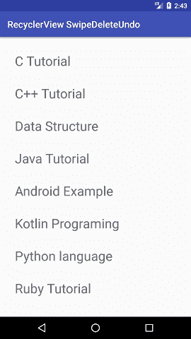

# 安卓刷卡删除回收利用 UNDU 查看项目

> 原文：<https://www.javatpoint.com/android-swipe-to-delete-recyclerview-items-with-undu>

在本教程中，我们将创建一个示例，通过使用撤消功能滑动项目来删除 *RecyclerView* 的项目。为此，我们将使用在安卓支持库 V7 中添加的*项目触摸助手*类。此类用于创建滑动以删除 RecyclerView 中的项目。它有一个*简单回调*类，用于配置为滑动或移动回收视图中的项目而执行的事件。

## ItemTouchHelper 类

这是一个实用程序类，提供了添加滑动以消除和拖放 RecyclerView 项目的功能。根据我们实现的功能，它会覆盖 onMove()或 onSwipe()回调方法。

## 安卓刷卡删除回收查看项目示例

用下面的代码创建一个**MainActivity.java**类。

### activity_main.xml

```

ass with the following code.
activity_main.xml
<?xml version="1.0" encoding="utf-8"?>
<android.support.design.widget.CoordinatorLayout xmlns:android="http://schemas.android.com/apk/res/android"
    xmlns:app="http://schemas.android.com/apk/res-auto"
    xmlns:tools="http://schemas.android.com/tools"
    android:layout_width="match_parent"
    android:layout_height="match_parent"
    android:fitsSystemWindows="true"
    tools:context="example.javatpoint.com.recyclerviewswipedeleteundo.MainActivity">

    <android.support.design.widget.AppBarLayout
        android:layout_width="match_parent"
        android:layout_height="wrap_content"
        android:theme="@style/AppTheme.AppBarOverlay">

        <android.support.v7.widget.Toolbar
            android:id="@+id/toolbar"
            android:layout_width="match_parent"
            android:layout_height="?attr/actionBarSize"
            android:background="?attr/colorPrimary"
            app:popupTheme="@style/AppTheme.PopupOverlay" />

    </android.support.design.widget.AppBarLayout>

    <include layout="@layout/content_main" />

</android.support.design.widget.CoordinatorLayout>

```

* * *

### content_main.xml

```

<fragment xmlns:android="http://schemas.android.com/apk/res/android"
    xmlns:app="http://schemas.android.com/apk/res-auto"
    xmlns:tools="http://schemas.android.com/tools"
    android:id="@+id/fragment"
    android:name="example.javatpoint.com.recyclerviewswipedeleteundo.MainActivityFragment"
    android:layout_width="match_parent"
    android:layout_height="match_parent"
    app:layout_behavior="@string/appbar_scrolling_view_behavior"
    tools:layout="@layout/fragment_main" />

```

* * *

### MainActivity.java

```

package example.javatpoint.com.recyclerviewswipedeleteundo;

import android.os.Bundle;
import android.support.v7.app.AppCompatActivity;
import android.support.v7.widget.Toolbar;

public class MainActivity extends AppCompatActivity {

    @Override
    protected void onCreate(Bundle savedInstanceState) {
        super.onCreate(savedInstanceState);
        setContentView(R.layout.activity_main);
        Toolbar toolbar = (Toolbar) findViewById(R.id.toolbar);
        setSupportActionBar(toolbar);

    }
}

```

* * *

创建布局**常规 _item.xml** ，在正常模式下显示。

### 正则项. xml

```

<?xml version="1.0" encoding="utf-8"?>
<LinearLayout xmlns:android="http://schemas.android.com/apk/res/android"
    android:id="@+id/regularLayout"
    android:layout_width="match_parent"
    android:layout_height="wrap_content"
    android:orientation="vertical"
    android:padding="@dimen/activity_horizontal_margin">

    <TextView
        android:id="@+id/list_item"
        android:layout_width="match_parent"
        android:layout_height="wrap_content"
        android:text="Regular Layout"
        android:textSize="28sp" />
</LinearLayout>

```

* * *

创建一个布局**sweep _ item . XML**，它出现在 sweep 项目的时间段。

### swipe_item.xml

```

<?xml version="1.0" encoding="utf-8"?>
<LinearLayout xmlns:android="http://schemas.android.com/apk/res/android"
    android:id="@+id/swipeLayout"
    android:layout_width="match_parent"
    android:layout_height="wrap_content"
    android:background="@color/swipebackground"
    android:orientation="horizontal"
    android:padding="@dimen/activity_horizontal_margin"
    android:visibility="visible"
    android:weightSum="3">

    <TextView
        android:layout_width="match_parent"
        android:layout_height="wrap_content"
        android:layout_weight="1"
        android:text="@string/archived_label"
        android:textColor="@android:color/white"
        android:textSize="24sp" />

    <TextView
        android:id="@+id/undo"
        android:layout_width="match_parent"
        android:layout_height="wrap_content"
        android:layout_weight="2"
        android:gravity="end"
        android:paddingBottom="5dp"
        android:paddingLeft="16dp"
        android:paddingRight="16dp"
        android:paddingTop="5dp"
        android:text="@string/undo_label"
        android:textColor="@android:color/white"
        android:textSize="22sp"
        android:textStyle="bold" />

</LinearLayout>

```

* * *

### customlayout.xml

```

<?xml version="1.0" encoding="utf-8"?>
<FrameLayout xmlns:android="http://schemas.android.com/apk/res/android"
    android:layout_width="match_parent"
    android:layout_height="wrap_content">
    <!-- Swipe Layout-->
    <include layout="@layout/swipe_item" />
    <!-- Regular Layout-->
    <include layout="@layout/regular_item" />
</FrameLayout>

```

* * *

创建一个扩展了*项目触摸助手的实用程序类**SwipeUtil.java**。SimpleCallback* 类，并重写其 onMove()、onSwiped()、onChildDraw()方法。当我们对一个项目执行扫动操作时，会调用 onscreen()方法，onChildDraw()方法包含了在扫动 RecyclerView 的项目时绘制画布的实现逻辑。

### SwipeUtil.java

```

package example.javatpoint.com.recyclerviewswipedeleteundo;

import android.content.Context;
import android.graphics.Canvas;
import android.graphics.Color;
import android.graphics.Paint;
import android.graphics.PorterDuff;
import android.graphics.drawable.ColorDrawable;
import android.graphics.drawable.Drawable;
import android.support.v4.content.ContextCompat;
import android.support.v7.widget.RecyclerView;
import android.support.v7.widget.helper.ItemTouchHelper;
import android.view.View;

public abstract class SwipeUtil extends ItemTouchHelper.SimpleCallback {

    private Drawable background;
    private Drawable deleteIcon;
    private int xMarkMargin;
    private boolean initiated;
    private Context context;
    private int leftcolorCode;
    private String leftSwipeLable;

    public SwipeUtil(int dragDirs, int swipeDirs, Context context) {
        super(dragDirs, swipeDirs);
        this.context = context;
    }

    private void init() {
        background = new ColorDrawable();
        xMarkMargin = (int) context.getResources().getDimension(R.dimen.ic_clear_margin);
        deleteIcon = ContextCompat.getDrawable(context, android.R.drawable.ic_menu_delete);
        deleteIcon.setColorFilter(Color.WHITE, PorterDuff.Mode.SRC_ATOP);
        initiated = true;
    }

    @Override
    public boolean onMove(RecyclerView recyclerView, RecyclerView.ViewHolder viewHolder, RecyclerView.ViewHolder target) {
        return false;
    }

    @Override
    public abstract void onSwiped(RecyclerView.ViewHolder viewHolder, int direction);

    @Override
    public int getSwipeDirs(RecyclerView recyclerView, RecyclerView.ViewHolder viewHolder) {

        return super.getSwipeDirs(recyclerView, viewHolder);
    }

    @Override
    public void onChildDraw(Canvas c, RecyclerView recyclerView, RecyclerView.ViewHolder viewHolder,
                            float dX, float dY, int actionState, boolean isCurrentlyActive) {

        View itemView = viewHolder.itemView;
        if (!initiated) {
            init();
        }

        int itemHeight = itemView.getBottom() - itemView.getTop();
        //Setting Swipe Background
        ((ColorDrawable) background).setColor(getLeftcolorCode());
        background.setBounds(itemView.getRight() + (int) dX, itemView.getTop(), itemView.getRight(), itemView.getBottom());
        background.draw(c);

        int intrinsicWidth = deleteIcon.getIntrinsicWidth();
        int intrinsicHeight = deleteIcon.getIntrinsicWidth();

        int xMarkLeft = itemView.getRight() - xMarkMargin - intrinsicWidth;
        int xMarkRight = itemView.getRight() - xMarkMargin;
        int xMarkTop = itemView.getTop() + (itemHeight - intrinsicHeight) / 2;
        int xMarkBottom = xMarkTop + intrinsicHeight;

        //Setting Swipe Icon
        deleteIcon.setBounds(xMarkLeft, xMarkTop + 16, xMarkRight, xMarkBottom);
        deleteIcon.draw(c);

        //Setting Swipe Text
        Paint paint = new Paint();
        paint.setColor(Color.WHITE);
        paint.setTextSize(48);
        paint.setTextAlign(Paint.Align.CENTER);
        c.drawText(getLeftSwipeLable(), xMarkLeft + 40, xMarkTop + 10, paint);

        super.onChildDraw(c, recyclerView, viewHolder, dX, dY, actionState, isCurrentlyActive);
    }

    public String getLeftSwipeLable() {
        return leftSwipeLable;
    }

    public void setLeftSwipeLable(String leftSwipeLable) {
        this.leftSwipeLable = leftSwipeLable;
    }

    public int getLeftcolorCode() {
        return leftcolorCode;
    }

    public void setLeftcolorCode(int leftcolorCode) {
        this.leftcolorCode = leftcolorCode;
    }
}

```

* * *

创建一个**ItemViewHolder.java**类，并扩展 recycle view . view holder。

### ItemViewHolder.java

```

package example.javatpoint.com.recyclerviewswipedeleteundo;

import android.support.v7.widget.RecyclerView;
import android.view.View;
import android.widget.LinearLayout;
import android.widget.TextView;

public class ItemViewHolder extends RecyclerView.ViewHolder {

    public LinearLayout regularLayout;
    public LinearLayout swipeLayout;
    public TextView listItem;
    public TextView undo;

    public ItemViewHolder(View view) {
        super(view);

        regularLayout = view.findViewById(R.id.regularLayout);
        listItem =  view.findViewById(R.id.list_item);
        swipeLayout = view.findViewById(R.id.swipeLayout);
        undo =  view.findViewById(R.id.undo);
    }
}

```

* * *

创建扩展回收视图的适配器类**MyAdapter.java**。适配器<itemviewholder>类并重写其 onCreateViewHolder()，onBindViewHolder()方法。</itemviewholder>

### MyAdapter.java

```

package example.javatpoint.com.recyclerviewswipedeleteundo;

import android.os.Handler;
import android.support.v7.widget.RecyclerView;
import android.view.LayoutInflater;
import android.view.View;
import android.view.ViewGroup;
import java.util.ArrayList;
import java.util.HashMap;
import java.util.List;

public class MyAdapter extends RecyclerView.Adapter {

    private List <string>dataList;
    private List <string>itemsPendingRemoval;

    private static final int PENDING_REMOVAL_TIMEOUT = 3000; // 3sec
    private Handler handler = new Handler(); // hanlder for running delayed runnables
    HashMap <string runnable="">pendingRunnables = new HashMap<>(); // map of items to pending runnable, to cancel the removal

    public MyAdapter(List <string>dataList) {
        this.dataList = dataList;
        itemsPendingRemoval = new ArrayList<>();
    }

    @Override
    public ItemViewHolder onCreateViewHolder(ViewGroup parent, int viewType) {
        View itemView = LayoutInflater.from(parent.getContext()).inflate(R.layout.customlayout, parent, false);
        return new ItemViewHolder(itemView);
    }

    @Override
    public void onBindViewHolder(ItemViewHolder itemViewHolder, int position) {

        final String data = dataList.get(position);

        if (itemsPendingRemoval.contains(data)) {
            /** show swipe layout and hide regular layout */
            itemViewHolder.regularLayout.setVisibility(View.GONE);
            itemViewHolder.swipeLayout.setVisibility(View.VISIBLE);
            itemViewHolder.undo.setOnClickListener(new View.OnClickListener() {
                @Override
                public void onClick(View v) {
                    undoOpt(data);
                }
            });
        } else {
            /** show regular layout and hide swipe layout*/
            itemViewHolder.regularLayout.setVisibility(View.VISIBLE);
            itemViewHolder.swipeLayout.setVisibility(View.GONE);
            itemViewHolder.listItem.setText(data);
        }
    }

    private void undoOpt(String customer) {
        Runnable pendingRemovalRunnable = pendingRunnables.get(customer);
        pendingRunnables.remove(customer);
        if (pendingRemovalRunnable != null)
            handler.removeCallbacks(pendingRemovalRunnable);
        itemsPendingRemoval.remove(customer);
        // this will rebind the row in "normal" state
        notifyItemChanged(dataList.indexOf(customer));
    }

    @Override
    public int getItemCount() {
        return dataList.size();
    }

    public void pendingRemoval(int position) {

        final String data = dataList.get(position);
        if (!itemsPendingRemoval.contains(data)) {
            itemsPendingRemoval.add(data);
            // this will redraw row in "undo" state
            notifyItemChanged(position);
            //create, store and post a runnable to remove the data
            Runnable pendingRemovalRunnable = new Runnable() {
                @Override
                public void run() {
                    remove(dataList.indexOf(data));
                }
            };
            handler.postDelayed(pendingRemovalRunnable, PENDING_REMOVAL_TIMEOUT);
            pendingRunnables.put(data, pendingRemovalRunnable);
        }
    }

    public void remove(int position) {
        String data = dataList.get(position);
        if (itemsPendingRemoval.contains(data)) {
            itemsPendingRemoval.remove(data);
        }
        if (dataList.contains(data)) {
            dataList.remove(position);
            notifyItemRemoved(position);
        }
    }

    public boolean isPendingRemoval(int position) {
        String data = dataList.get(position);
        return itemsPendingRemoval.contains(data);
    }
}</string></string></string></string> 
```

* * *

创建一个**MainActivityFragment.java**类并扩展碎片类。在这个类中，设置适配器 MyAdapter.java 类和实用程序 SwipeUtil.java 类。

### fragment_main.xml

```

<RelativeLayout xmlns:android="http://schemas.android.com/apk/res/android"
    xmlns:tools="http://schemas.android.com/tools"
    android:layout_width="match_parent"
    android:layout_height="match_parent"
    android:paddingBottom="@dimen/activity_vertical_margin"
    android:paddingLeft="@dimen/activity_horizontal_margin"
    android:paddingRight="@dimen/activity_horizontal_margin"
    android:paddingTop="@dimen/activity_vertical_margin"
    tools:context="example.javatpoint.com.recyclerviewswipedeleteundo.MainActivityFragment"
    tools:showIn="@layout/activity_main">

    <android.support.v7.widget.RecyclerView
        android:id="@+id/recyclerView"
        android:layout_width="match_parent"
        android:layout_height="match_parent"/>
</RelativeLayout>

```

* * *

### 主要活动碎片.java

```

package example.javatpoint.com.recyclerviewswipedeleteundo;

import android.support.v4.app.Fragment;
import android.os.Bundle;
import android.support.v4.content.ContextCompat;
import android.support.v7.widget.LinearLayoutManager;
import android.support.v7.widget.RecyclerView;
import android.support.v7.widget.helper.ItemTouchHelper;
import android.view.LayoutInflater;
import android.view.View;
import android.view.ViewGroup;
import java.util.ArrayList;
import java.util.List;

public class MainActivityFragment extends Fragment {

    private RecyclerView mRecyclerView;
    private MyAdapter myAdapter;
    String[] listValue = {"C Tutorial","C++ Tutorial","Data Structure","Java Tutorial","Android Example","Kotlin Programing","Python language","Ruby Tutorial",".Net Tutorial","MySQL Database"};
    public MainActivityFragment() {
    }

    @Override
    public View onCreateView(LayoutInflater inflater, ViewGroup container,
                             Bundle savedInstanceState) {
        View mView = inflater.inflate(R.layout.fragment_main, container, false);
        mRecyclerView = mView.findViewById(R.id.recyclerView);
        return mView;
    }

    @Override
    public void onResume() {
        super.onResume();
        LinearLayoutManager linearLayoutManager = new LinearLayoutManager(getActivity());
        linearLayoutManager.setOrientation(LinearLayoutManager.VERTICAL);
        mRecyclerView.setLayoutManager(linearLayoutManager);
        myAdapter = new MyAdapter(getData());
        mRecyclerView.setAdapter(myAdapter);

        setSwipeForRecyclerView();
    }

    private List getData() {
        List <string>modelList = new ArrayList<>();
        for (int i = 0; i < listValue.length; i++) {
            modelList.add(listValue[i]);
        }
        return modelList;
    }

    private void setSwipeForRecyclerView() {

        SwipeUtil swipeHelper = new SwipeUtil(0, ItemTouchHelper.LEFT, getActivity()) {
            @Override
            public void onSwiped(RecyclerView.ViewHolder viewHolder, int direction) {
                int swipedPosition = viewHolder.getAdapterPosition();
                myAdapter = (MyAdapter)mRecyclerView.getAdapter();
                myAdapter.pendingRemoval(swipedPosition);
            }

            @Override
            public int getSwipeDirs(RecyclerView recyclerView, RecyclerView.ViewHolder viewHolder) {
                int position = viewHolder.getAdapterPosition();
                myAdapter = (MyAdapter) mRecyclerView.getAdapter();
               if (myAdapter.isPendingRemoval(position)) {
                     return 0;
                }
                return super.getSwipeDirs(recyclerView, viewHolder);
            }
        };

        ItemTouchHelper mItemTouchHelper = new ItemTouchHelper(swipeHelper);
        mItemTouchHelper.attachToRecyclerView(mRecyclerView);
        //set swipe label
        swipeHelper.setLeftSwipeLable("Archive");
        //set swipe background-Color
        swipeHelper.setLeftcolorCode(ContextCompat.getColor(getActivity(), R.color.swipebackground));
    }
}</string> 
```

* * *

### strings.xml

```

<resources>
    <string name="app_name">RecyclerView SwipeDeleteUndo</string>
    <string name="action_settings">Settings</string>
    <string name="hello_blank_fragment">Hello blank fragment</string>
    <string name="undo_label"><u>Undo</u></string>
    <string name="archived_label">Archive</string>
</resources>

```

* * *

### dimens.xml 文件

```

<resources>
    <dimen name="fab_margin">16dp</dimen>
    <dimen name="activity_horizontal_margin">16dp</dimen>
    <dimen name="activity_vertical_margin">16dp</dimen>
    <dimen name="ic_clear_margin">56dp</dimen>
    <dimen name="text_size_medium">20sp</dimen>
</resources>

```

* * *

### colors.xml

```

<?xml version="1.0" encoding="utf-8"?>
<resources>
    <color name="colorPrimary">#3F51B5</color>
    <color name="colorPrimaryDark">#303F9F</color>
    <color name="colorAccent">#FF4081</color>
    <color name="swipebackground">#cf0b4e</color>
</resources>

```

**输出:**

  

* * *