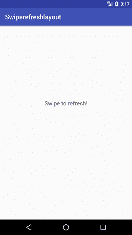

# 滑动以刷新安卓活动(滑动刷新)

> 原文：<https://www.javatpoint.com/swipe-to-refresh-android-activity>

在本教程中，我们将在安卓系统中创建滑动刷新功能。为此，应使用**swiperefershlayout**小部件。

**swiperefershlayout**的实例在 refreslistener 上添加了一个*方法，并实现了将在刷新时加载的代码逻辑。当用户滑动时，垂直滑动会显示一个独特的进度条。进度条在显示进度动画时调用设置刷新(真)，或者调用设置刷新(假)取消。*

## 滑动以刷新安卓活动示例

在 **activity_main.xml** 文件中，实现 SwipeRefreshLayout 小部件。

### activity_main.xml

```

<?xml version="1.0" encoding="utf-8"?>
<android.support.v4.widget.SwipeRefreshLayout xmlns:android="http://schemas.android.com/apk/res/android"
    xmlns:app="http://schemas.android.com/apk/res-auto"
    xmlns:tools="http://schemas.android.com/tools"
    android:id="@+id/refreshLayout"
    android:layout_width="match_parent"
    android:layout_height="match_parent"
    tools:context="example.javatpoint.com.swiperefreshlayout.MainActivity">

    <RelativeLayout
        android:layout_width="wrap_content"
        android:layout_height="wrap_content">

        <TextView
            android:id="@+id/textView"
            android:layout_width="wrap_content"
            android:layout_height="wrap_content"
            android:layout_alignParentTop="true"
            android:layout_centerHorizontal="true"
            android:layout_marginTop="229dp"
            android:text="Hello World!"
            android:textSize="18dp"
            app:layout_constraintBottom_toBottomOf="parent"
            app:layout_constraintLeft_toLeftOf="parent"
            app:layout_constraintRight_toRightOf="parent"
            app:layout_constraintTop_toTopOf="parent" />
    </RelativeLayout>
</android.support.v4.widget.SwipeRefreshLayout>

```

* * *

创建一个活动**MainActivity.java**并添加以下代码。在本课中，我们将检查刷卡时的网络连接。

### MainActivity.java

```

package example.javatpoint.com.swiperefreshlayout;

import android.content.Context;
import android.graphics.Color;
import android.net.ConnectivityManager;
import android.net.NetworkInfo;
import android.support.v4.widget.SwipeRefreshLayout;
import android.support.v7.app.AppCompatActivity;
import android.os.Bundle;
import android.widget.TextView;

public class MainActivity extends AppCompatActivity {
    SwipeRefreshLayout swipeRefreshLayout;
    TextView textView;
    @Override
    protected void onCreate(Bundle savedInstanceState) {
        super.onCreate(savedInstanceState);
        setContentView(R.layout.activity_main);
        swipeRefreshLayout = findViewById(R.id.refreshLayout);
        textView = findViewById(R.id.textView);
        swipeRefreshLayout.setOnRefreshListener(new SwipeRefreshLayout.OnRefreshListener() {
            @Override
            public void onRefresh() {
                       swipeRefreshLayout.setRefreshing(false);
                       //your code on swipe refresh
                       //we are checking networking connectivity
                        boolean connection=isNetworkAvailable();
                        if(connection){
                            textView.setText("internet connect");
                            textView.setTextColor(Color.GREEN);
                        }
                        else{
                            textView.setText("not connected");
                            textView.setTextColor(Color.RED);
                        }

            }
        });
        swipeRefreshLayout.setColorSchemeColors(Color.YELLOW);
    }
    public boolean isNetworkAvailable(){

        ConnectivityManager connectivityManager=(ConnectivityManager) this.getApplicationContext().getSystemService(Context.CONNECTIVITY_SERVICE);
        NetworkInfo networkInfo=connectivityManager.getActiveNetworkInfo();
        return networkInfo !=null;
    }
}

```

* * *

### 必需的权限

在**和**文件中添加 uses-permission。下面给出的权限用于访问网络连接。

```

<uses-permission android:name="android.permission.ACCESS_NETWORK_STATE"/>

```

 

* * *