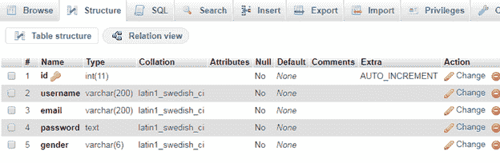
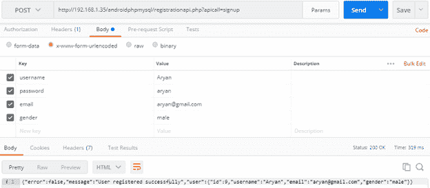
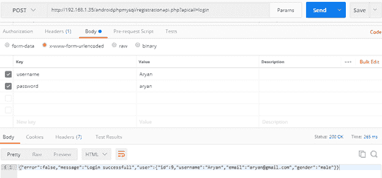
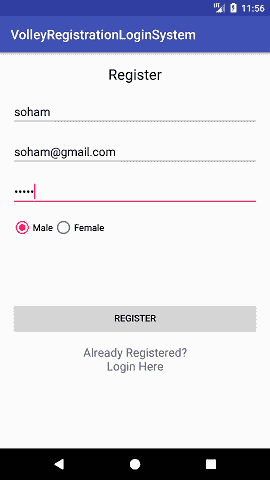
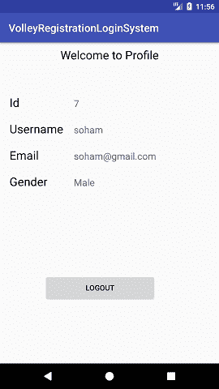
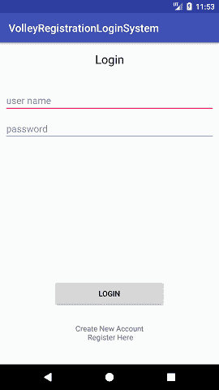
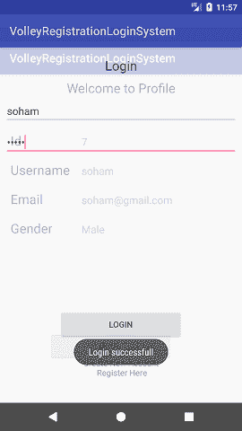
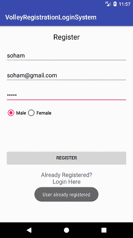

# 截击库-注册、登录和注销

> 原文：<https://www.javatpoint.com/android-volley-library-registration-login-logout>

在本教程中，我们将使用凌空库和 JSON 创建基本用户*注册*和*登录模块*。凌空是一个 HTTP 库，它为我们的应用程序提供了网络连接的设施。

使用凌空库的优势如下:

*   更简单、更快速的请求管理。
*   提供高效的网络管理。

对于服务器端的数据处理，我们使用 *PHP* 配合 *XAMPP 服务器*和 *MySQL* 进行数据操作。

在创建 Android 应用程序模块之前，让我们首先创建服务器端数据处理 API 代码，用于在 PHP 和 MySQL 中注册和登录。

1.创建一个名为**注册登录**和表**用户**的数据库，其中包含以下字段。



2.在***C:\ xampp \ htdocs \ androidphpmysql 目录*** 内用 PHP 和数据库编写以下连接建立代码。

在 **androidphpmysql** (您的项目位置)目录中，创建一个**connection.php**文件并编写以下代码。

### connection.php

```

<?php
$servername = "localhost";
$username = "root";
$password = "";
$database = "registerlogin";
$conn = new mysqli($servername, $username, $password, $database);
if ($conn->connect_error) {
    die("Connection failed: " . $conn->connect_error);
}
?>

```

T2】

3.在 **androidphpmysql** 目录下创建一个**registrationapi.php**文件，并编写以下代码。该文件处理来自安卓应用程序的请求，并以 JSON 数组的形式向安卓应用程序生成响应。

### registrationapi.php

```

<?php 
  require_once 'connection.php';
  $response = array();
  if(isset($_GET['apicall'])){
  switch($_GET['apicall']){
  case 'signup':
 	if(isTheseParametersAvailable(array('username','email','password','gender'))){
 	$username = $_POST['username']; 
 	$email = $_POST['email']; 
 	$password = md5($_POST['password']);
 	$gender = $_POST['gender']; 

 	$stmt = $conn->prepare("SELECT id FROM users WHERE username = ? OR email = ?");
 	$stmt->bind_param("ss", $username, $email);
 	$stmt->execute();
 	$stmt->store_result();

 	if($stmt->num_rows > 0){
 		$response['error'] = true;
 		$response['message'] = 'User already registered';
 		$stmt->close();
 	}
 	else{
 		$stmt = $conn->prepare("INSERT INTO users (username, email, password, gender) VALUES (?, ?, ?, ?)");
 		$stmt->bind_param("ssss", $username, $email, $password, $gender);

 		if($stmt->execute()){
 			$stmt = $conn->prepare("SELECT id, id, username, email, gender FROM users WHERE username = ?"); 
 			$stmt->bind_param("s",$username);
 			$stmt->execute();
 			$stmt->bind_result($userid, $id, $username, $email, $gender);
 			$stmt->fetch();

 			$user = array(
 			'id'=>$id, 
 			'username'=>$username, 
 			'email'=>$email,
 			'gender'=>$gender
 			);

 			$stmt->close();

 			$response['error'] = false; 
 			$response['message'] = 'User registered successfully'; 
 			$response['user'] = $user; 
 		}
 	}

}
else{
 	$response['error'] = true; 
 	$response['message'] = 'required parameters are not available'; 
}
break; 
case 'login':
  if(isTheseParametersAvailable(array('username', 'password'))){
 	$username = $_POST['username'];
  	$password = md5($_POST['password']); 

	$stmt = $conn->prepare("SELECT id, username, email, gender FROM users WHERE username = ? AND password = ?");
 	$stmt->bind_param("ss",$username, $password);
  	$stmt->execute();
 	$stmt->store_result();
 	if($stmt->num_rows > 0){
 	$stmt->bind_result($id, $username, $email, $gender);
 	$stmt->fetch();
 	$user = array(
 	'id'=>$id, 
 	'username'=>$username, 
 	'email'=>$email,
 	'gender'=>$gender
 	);

 	$response['error'] = false; 
 	$response['message'] = 'Login successfull'; 
 	$response['user'] = $user; 
 }
 else{
 	$response['error'] = false; 
 	$response['message'] = 'Invalid username or password';
 }
}
break; 
default: 
 $response['error'] = true; 
 $response['message'] = 'Invalid Operation Called';
}
}
else{
 $response['error'] = true; 
 $response['message'] = 'Invalid API Call';
}
echo json_encode($response);
function isTheseParametersAvailable($params){
foreach($params as $param){
 if(!isset($_POST[$param])){
	 return false; 
  }
}
return true; 
}
?>

```

要检查您的 PHP 应用编程接口是否正常工作，您可以使用 REST 客户端，如邮递员工具。

要查看 API 的注册码，可以通过<key value="">参数传递注册的 URL。</key>



同样，可以通过传递带有有效<key value="">参数的登录 URL 来检查登录动作。</key>



现在，在安卓应用程序中，我们将为用户注册、用户登录和在主活动中显示用户详细信息(作为配置文件)创建三个活动类。

在布局中创建一个 *activity_main.xml* ，并添加下面的代码。此活动用于将用户的详细信息显示为配置文件。

### activity_main.xml

```

<?xml version="1.0" encoding="utf-8"?>
<android.support.constraint.ConstraintLayout xmlns:android="http://schemas.android.com/apk/res/android"
    xmlns:app="http://schemas.android.com/apk/res-auto"
    xmlns:tools="http://schemas.android.com/tools"
    android:layout_width="match_parent"
    android:layout_height="match_parent"
    tools:context="example.javatpoint.com.volleyregistrationloginsystem.MainActivity">

    <LinearLayout
        android:layout_width="match_parent"
        android:layout_height="fill_parent"
        android:layout_marginBottom="8dp"
        android:layout_marginEnd="8dp"
        android:layout_marginStart="8dp"
        android:layout_marginTop="8dp"
        android:orientation="vertical"
        app:layout_constraintBottom_toBottomOf="parent"
        app:layout_constraintEnd_toEndOf="parent"
        app:layout_constraintHorizontal_bias="0.0"
        app:layout_constraintStart_toStartOf="parent"
        app:layout_constraintTop_toTopOf="parent"
        app:layout_constraintVertical_bias="0.0">

        <TextView
            android:layout_width="fill_parent"
            android:layout_height="wrap_content"
            android:gravity="center"
            android:text="Welcome to Profile"
            android:textAppearance="@style/Base.TextAppearance.AppCompat.Large" />

        <TableLayout
            android:layout_width="match_parent"
            android:layout_height="wrap_content"
            android:layout_marginTop="50dp">

            <TableRow>

                <TextView
                    android:layout_width="wrap_content"
                    android:layout_height="wrap_content"
                    android:padding="10dp"
                    android:text="Id"
                    android:textAppearance="@style/Base.TextAppearance.AppCompat.Large" />

                <TextView
                    android:id="@+id/textViewId"
                    android:layout_width="wrap_content"
                    android:layout_height="wrap_content"
                    android:padding="10dp"
                    android:text="id"
                    android:textAppearance="@style/Base.TextAppearance.AppCompat.Medium" />

            </TableRow>

            <TableRow>

                <TextView
                    android:layout_width="wrap_content"
                    android:layout_height="wrap_content"
                    android:padding="10dp"
                    android:text="Username"
                    android:textAppearance="@style/Base.TextAppearance.AppCompat.Large" />

                <TextView
                    android:id="@+id/textViewUsername"
                    android:layout_width="wrap_content"
                    android:layout_height="wrap_content"
                    android:padding="10dp"
                    android:text="username"
                    android:textAppearance="@style/Base.TextAppearance.AppCompat.Medium" />

            </TableRow>

            <TableRow>

                <TextView
                    android:layout_width="wrap_content"
                    android:layout_height="wrap_content"
                    android:padding="10dp"
                    android:text="Email"
                    android:textAppearance="@style/Base.TextAppearance.AppCompat.Large" />

                <TextView
                    android:id="@+id/textViewEmail"
                    android:layout_width="wrap_content"
                    android:layout_height="wrap_content"
                    android:padding="10dp"
                    android:text="useremail"
                    android:textAppearance="@style/Base.TextAppearance.AppCompat.Medium" />

            </TableRow>

            <TableRow>

                <TextView
                    android:layout_width="wrap_content"
                    android:layout_height="wrap_content"
                    android:padding="10dp"
                    android:text="Gender"
                    android:textAppearance="@style/Base.TextAppearance.AppCompat.Large" />

                <TextView
                    android:id="@+id/textViewGender"
                    android:layout_width="wrap_content"
                    android:layout_height="wrap_content"
                    android:padding="10dp"
                    android:text="gender"
                    android:textAppearance="@style/Base.TextAppearance.AppCompat.Medium" />

            </TableRow>

        </TableLayout>

        <Button
            android:id="@+id/buttonLogout"
            android:layout_width="210dp"
            android:layout_height="50dp"
            android:layout_marginTop="150dp"
            android:layout_marginLeft="75dp"
            android:text="Logout" />
    </LinearLayout>

</android.support.constraint.ConstraintLayout>

```

现在，用下面的代码在布局目录中创建一个 *activity_login.xml* 文件。此活动用于用户登录用户界面。

### activity_login.xml

```

<?xml version="1.0" encoding="utf-8"?>
<android.support.constraint.ConstraintLayout xmlns:android="http://schemas.android.com/apk/res/android"
    xmlns:app="http://schemas.android.com/apk/res-auto"
    xmlns:tools="http://schemas.android.com/tools"
    android:layout_width="match_parent"
    android:layout_height="match_parent"
    tools:context="example.javatpoint.com.volleyregistrationloginsystem.LoginActivity">

    <TextView
        android:layout_width="fill_parent"
        android:layout_height="wrap_content"
        android:layout_marginEnd="8dp"
        android:layout_marginStart="8dp"
        android:layout_marginTop="16dp"
        android:gravity="center"
        android:text="Login"
        android:textAppearance="@style/Base.TextAppearance.AppCompat.Large"
        app:layout_constraintEnd_toEndOf="parent"
        app:layout_constraintHorizontal_bias="1.0"
        app:layout_constraintStart_toStartOf="parent"
        app:layout_constraintTop_toTopOf="parent" />

    <EditText
        android:id="@+id/etUserName"
        android:layout_width="fill_parent"
        android:layout_height="wrap_content"
        android:layout_marginBottom="8dp"
        android:layout_marginEnd="8dp"
        android:layout_marginStart="8dp"
        android:layout_marginTop="8dp"
        android:ems="10"
        android:inputType="textPersonName"
        android:hint="user name"
        app:layout_constraintBottom_toBottomOf="parent"
        app:layout_constraintEnd_toEndOf="parent"
        app:layout_constraintHorizontal_bias="0.0"
        app:layout_constraintStart_toStartOf="parent"
        app:layout_constraintTop_toTopOf="parent"
        app:layout_constraintVertical_bias="0.144" />

    <EditText
        android:id="@+id/etUserPassword"
        android:layout_width="fill_parent"
        android:layout_height="wrap_content"
        android:layout_marginEnd="8dp"
        android:layout_marginStart="8dp"
        android:layout_marginTop="8dp"
        android:hint="password"
        android:ems="10"
        android:inputType="textPassword"
        app:layout_constraintEnd_toEndOf="parent"
        app:layout_constraintStart_toStartOf="parent"
        app:layout_constraintTop_toBottomOf="@+id/etUserName" />

    <Button
        android:id="@+id/btnLogin"
        android:layout_width="210dp"
        android:layout_height="50dp"
        android:layout_marginBottom="8dp"
        android:layout_marginEnd="8dp"
        android:layout_marginStart="8dp"
        android:layout_marginTop="8dp"
        android:text="Login"
        app:layout_constraintBottom_toBottomOf="parent"
        app:layout_constraintEnd_toEndOf="parent"
        app:layout_constraintStart_toStartOf="parent"
        app:layout_constraintTop_toBottomOf="@+id/etUserName"
        app:layout_constraintVertical_bias="0.754" />

    <TextView
        android:id="@+id/tvRegister"
        android:layout_width="wrap_content"
        android:layout_height="wrap_content"
        android:layout_marginBottom="8dp"
        android:layout_marginEnd="8dp"
        android:layout_marginStart="8dp"
        android:layout_marginTop="8dp"
        android:gravity="center"
        android:text="Create New Account\n Register Here"
        app:layout_constraintBottom_toBottomOf="parent"
        app:layout_constraintEnd_toEndOf="parent"
        app:layout_constraintStart_toStartOf="parent"
        app:layout_constraintTop_toBottomOf="@+id/btnLogin"
        app:layout_constraintVertical_bias="0.405" />

    <ProgressBar
        android:id="@+id/progressBar"
        android:visibility="gone"
        style="?android:attr/progressBarStyle"
        android:layout_width="wrap_content"
        android:layout_height="wrap_content"
        android:layout_marginBottom="8dp"
        android:layout_marginEnd="8dp"
        android:layout_marginStart="8dp"
        android:layout_marginTop="8dp"
        app:layout_constraintBottom_toBottomOf="parent"
        app:layout_constraintEnd_toEndOf="parent"
        app:layout_constraintStart_toStartOf="parent"
        app:layout_constraintTop_toTopOf="parent"
        app:layout_constraintVertical_bias="0.456" />

</android.support.constraint.ConstraintLayout>

```

使用以下代码在布局目录中创建一个 *activity_register.xml* 文件。此活动用于用户注册用户界面。

### activity_register.xml

```

<?xml version="1.0" encoding="utf-8"?>
<android.support.constraint.ConstraintLayout xmlns:android="http://schemas.android.com/apk/res/android"
    xmlns:app="http://schemas.android.com/apk/res-auto"
    xmlns:tools="http://schemas.android.com/tools"
    android:layout_width="match_parent"
    android:layout_height="match_parent"
    tools:context="example.javatpoint.com.volleyregistrationloginsystem.RegisterActivity">

    <LinearLayout
        android:layout_width="match_parent"
        android:layout_height="519dp"
        android:layout_centerVertical="true"
        android:layout_marginBottom="8dp"
        android:layout_marginEnd="8dp"
        android:layout_marginStart="8dp"
        android:layout_marginTop="8dp"
        android:orientation="vertical"
        android:padding="10dp"
        app:layout_constraintBottom_toBottomOf="parent"
        app:layout_constraintEnd_toEndOf="parent"
        app:layout_constraintStart_toStartOf="parent"
        app:layout_constraintTop_toTopOf="parent"
        app:layout_constraintVertical_bias="0.0">

        <TextView
            android:layout_width="fill_parent"
            android:layout_height="wrap_content"
            android:text="Register"
            android:gravity="center"
            android:textAppearance="@style/Base.TextAppearance.AppCompat.Large" />

        <EditText
            android:id="@+id/editTextUsername"
            android:layout_width="match_parent"
            android:layout_height="wrap_content"
            android:layout_marginBottom="8dp"
            android:layout_marginTop="20dp"
            android:hint="Username"
            android:inputType="text" />

        <EditText
            android:id="@+id/editTextEmail"
            android:layout_width="match_parent"
            android:layout_height="wrap_content"
            android:layout_marginBottom="8dp"
            android:layout_marginTop="8dp"
            android:hint="Email"
            android:inputType="textEmailAddress" />

        <EditText
            android:id="@+id/editTextPassword"
            android:layout_width="match_parent"
            android:layout_height="wrap_content"
            android:layout_marginBottom="8dp"
            android:layout_marginTop="8dp"
            android:fontFamily="sans-serif"
            android:hint="Password"
            android:inputType="textPassword" />

        <RadioGroup
            android:id="@+id/radioGender"
            android:layout_width="match_parent"
            android:layout_height="wrap_content"
            android:layout_marginBottom="8dp"
            android:layout_marginTop="8dp"
            android:orientation="horizontal">

            <RadioButton
                android:id="@+id/radioButtonMale"
                android:layout_width="wrap_content"
                android:layout_height="wrap_content"
                android:checked="true"
                android:text="Male" />

            <RadioButton
                android:id="@+id/radioButtonFemale"
                android:layout_width="wrap_content"
                android:layout_height="wrap_content"
                android:text="Female" />

        </RadioGroup>

        <Button
            android:id="@+id/buttonRegister"
            android:layout_width="match_parent"
            android:layout_height="wrap_content"
            android:layout_marginBottom="8dp"
            android:layout_marginTop="90dp"
            android:text="Register" />

        <TextView
            android:id="@+id/textViewLogin"
            android:layout_width="match_parent"
            android:layout_height="wrap_content"
            android:layout_marginBottom="8dp"
            android:layout_marginTop="8dp"
            android:text="Already Registered?\nLogin Here"
            android:textAlignment="center"
            android:textAppearance="@style/Base.TextAppearance.AppCompat.Medium" />
    </LinearLayout>

    <ProgressBar
        android:visibility="gone"
        android:id="@+id/progressBar"
        android:layout_width="wrap_content"
        android:layout_height="wrap_content"
        android:layout_centerHorizontal="true"
        android:layout_centerVertical="true" />

</android.support.constraint.ConstraintLayout>

```

在 **build.gradle** 文件中添加**凌空**库依赖。

### build.gradle

```

implementation 'com.android.volley:volley:1.0.0'

```

用下面的代码创建一个名为*User.java*的数据模型类。

### User.java

```

package example.javatpoint.com.volleyregistrationloginsystem;

public class User {
    private int id;
    private String name, email, gender;

    public User(int id, String name, String email, String gender) {
        this.id = id;
        this.email = email;
        this.gender = gender;
        this.name = name;
    }

    public int getId() {
        return id;
    }

    public void setId(int id) {
        this.id = id;
    }

    public String getName() {
        return name;
    }

    public void setName(String name) {
        this.name = name;
    }

    public String getEmail() {
        return email;
    }

    public void setEmail(String email) {
        this.email = email;
    }

    public String getGender() {
        return gender;
    }

    public void setGender(String gender) {
        this.gender = gender;
    }
}

```

我们需要定义调用服务器端应用编程接口的网址。

创建一个*URLs.java*类并定义网址。

### urls . java

```

package example.javatpoint.com.volleyregistrationloginsystem;

public class URLs {
    private static final String ROOT_URL = "http://192.168.1.35/androidphpmysql/registrationapi.php?apicall=";
    public static final String URL_REGISTER = ROOT_URL + "signup";
    public static final String URL_LOGIN= ROOT_URL + "login";
}

```

### VolleySingleton.java

```

package example.javatpoint.com.volleyregistrationloginsystem;

import android.content.Context;
import com.android.volley.Request;
import com.android.volley.RequestQueue;
import com.android.volley.toolbox.Volley;

public class VolleySingleton {
    private static VolleySingleton mInstance;
    private RequestQueue mRequestQueue;
    private static Context mCtx;

    private VolleySingleton(Context context) {
        mCtx = context;
        mRequestQueue = getRequestQueue();
    }

    public static synchronized VolleySingleton getInstance(Context context) {
        if (mInstance == null) {
            mInstance = new VolleySingleton(context);
        }
        return mInstance;
    }

    public RequestQueue getRequestQueue() {
        if (mRequestQueue == null) {
            // getApplicationContext() is key, it keeps you from leaking the
            // Activity or BroadcastReceiver if someone passes one in.
            mRequestQueue = Volley.newRequestQueue(mCtx.getApplicationContext());
        }
        return mRequestQueue;
    }

    public <T> void addToRequestQueue(Request<T> req) {
        getRequestQueue().add(req);
    }
}

```

创建一个名为*SharedPreferences.java*的类。在这个类中，我们使用**共享引用**类来存储用户详细信息。SharedPreferences 类包含四个具有以下功能的方法:

*   **userLogin():** 此方法用于登录后将用户信息存储在 SharedPreferences 中。
*   **isLoggedIn():** 此方法检查用户是否已经登录。
*   **getUser():** 此方法获取用户信息如果登录。
*   **注销():**该方法清除共享引用数据，进行用户注销。

### sharedprefixmanager . Java

```

package example.javatpoint.com.volleyregistrationloginsystem;
import android.content.Context;
import android.content.Intent;
import android.content.SharedPreferences;

public class SharedPrefManager {

    private static final String SHARED_PREF_NAME = "volleyregisterlogin";
    private static final String KEY_USERNAME = "keyusername";
    private static final String KEY_EMAIL = "keyemail";
    private static final String KEY_GENDER = "keygender";
    private static final String KEY_ID = "keyid";
    private static SharedPrefManager mInstance;
    private static Context ctx;

    private SharedPrefManager(Context context) {
        ctx = context;
    }
    public static synchronized SharedPrefManager getInstance(Context context) {
        if (mInstance == null) {
            mInstance = new SharedPrefManager(context);
        }
        return mInstance;
    }

    //this method will store the user data in shared preferences
    public void userLogin(User user) {
        SharedPreferences sharedPreferences = ctx.getSharedPreferences(SHARED_PREF_NAME, Context.MODE_PRIVATE);
        SharedPreferences.Editor editor = sharedPreferences.edit();
        editor.putInt(KEY_ID, user.getId());
        editor.putString(KEY_USERNAME, user.getName());
        editor.putString(KEY_EMAIL, user.getEmail());
        editor.putString(KEY_GENDER, user.getGender());
        editor.apply();
    }

    //this method will checker whether user is already logged in or not
    public boolean isLoggedIn() {
        SharedPreferences sharedPreferences = ctx.getSharedPreferences(SHARED_PREF_NAME, Context.MODE_PRIVATE);
        return sharedPreferences.getString(KEY_USERNAME, null) != null;
    }

    //this method will give the logged in user
    public User getUser() {
        SharedPreferences sharedPreferences = ctx.getSharedPreferences(SHARED_PREF_NAME, Context.MODE_PRIVATE);
        return new User(
                sharedPreferences.getInt(KEY_ID, -1),
                sharedPreferences.getString(KEY_USERNAME, null),
                sharedPreferences.getString(KEY_EMAIL, null),
                sharedPreferences.getString(KEY_GENDER, null)
        );
    }

    //this method will logout the user
    public void logout() {
        SharedPreferences sharedPreferences = ctx.getSharedPreferences(SHARED_PREF_NAME, Context.MODE_PRIVATE);
        SharedPreferences.Editor editor = sharedPreferences.edit();
        editor.clear();
        editor.apply();
        ctx.startActivity(new Intent(ctx, LoginActivity.class));
    }
}

```

现在在*MainActivity.java*类中，如果用户登录了我们会显示用户信息，否则重定向到*LoginActivity.java*类。 **onClick()** 方法用于在点击按钮时注销用户。

### MainActivity.java

```

package example.javatpoint.com.volleyregistrationloginsystem;

import android.content.Intent;
import android.support.v7.app.AppCompatActivity;
import android.os.Bundle;
import android.view.View;
import android.widget.Button;
import android.widget.TextView;

public class MainActivity extends AppCompatActivity implements View.OnClickListener{

    TextView id,userName,userEmail,gender;
    Button btnLogout;
    @Override
    protected void onCreate(Bundle savedInstanceState) {
        super.onCreate(savedInstanceState);
        setContentView(R.layout.activity_main);
        if(SharedPrefManager.getInstance(this).isLoggedIn()){
            id = findViewById(R.id.textViewId);
            userName = findViewById(R.id.textViewUsername);
            userEmail = findViewById(R.id.textViewEmail);
            gender = findViewById(R.id.textViewGender);
            btnLogout = findViewById(R.id.buttonLogout);
            User user = SharedPrefManager.getInstance(this).getUser();

            id.setText(String.valueOf(user.getId()));
            userEmail.setText(user.getEmail());
            gender.setText(user.getGender());
            userName.setText(user.getName());

            btnLogout.setOnClickListener(this);
        }
        else{
            Intent  intent = new Intent(MainActivity.this,LoginActivity.class);
            startActivity(intent);
            finish();
        }
    }
    public void onClick(View view){
        if(view.equals(btnLogout)){
            SharedPrefManager.getInstance(getApplicationContext()).logout();
        }
    }
}

```

在*LoginActivity.java*类中，我们检查用户是否已经登录，如果是则重定向到*MainActivity.java*类，否则允许用户登录。

**StringRequest** 类的**凌空**库用于网络模块。StringReuest 类的对象接受请求方法类型、URL 和响应的参数。

### LoginActivity.java

```

package example.javatpoint.com.volleyregistrationloginsystem;

import android.content.Intent;
import android.support.v7.app.AppCompatActivity;
import android.os.Bundle;
import android.text.TextUtils;
import android.view.View;
import android.widget.EditText;
import android.widget.ProgressBar;
import android.widget.Toast;
import com.android.volley.AuthFailureError;
import com.android.volley.Request;
import com.android.volley.Response;
import com.android.volley.VolleyError;
import com.android.volley.toolbox.StringRequest;
import org.json.JSONException;
import org.json.JSONObject;
import java.util.HashMap;
import java.util.Map;

public class LoginActivity extends AppCompatActivity {
    EditText etName, etPassword;
    ProgressBar progressBar;
    @Override
    protected void onCreate(Bundle savedInstanceState) {
        super.onCreate(savedInstanceState);
        setContentView(R.layout.activity_login);

        if (SharedPrefManager.getInstance(this).isLoggedIn()) {
            finish();
            startActivity(new Intent(this, MainActivity.class));
        }

        progressBar = findViewById(R.id.progressBar);
        etName = findViewById(R.id.etUserName);
        etPassword = findViewById(R.id.etUserPassword);

        //calling the method userLogin() for login the user
        findViewById(R.id.btnLogin).setOnClickListener(new View.OnClickListener() {
            @Override
            public void onClick(View view) {
                userLogin();
            }
        });

        //if user presses on textview not register calling RegisterActivity
        findViewById(R.id.tvRegister).setOnClickListener(new View.OnClickListener() {
            @Override
            public void onClick(View view) {
                finish();
                startActivity(new Intent(getApplicationContext(), RegisterActivity.class));
            }
        });
    }

    private void userLogin() {
        //first getting the values
        final String username = etName.getText().toString();
        final String password = etPassword.getText().toString();
        //validating inputs
        if (TextUtils.isEmpty(username)) {
            etName.setError("Please enter your username");
            etName.requestFocus();
            return;
        }

        if (TextUtils.isEmpty(password)) {
            etPassword.setError("Please enter your password");
            etPassword.requestFocus();
            return;
        }

        //if everything is fine
        StringRequest stringRequest = new StringRequest(Request.Method.POST, URLs.URL_LOGIN,
                new Response.Listener<String>() {
                    @Override
                    public void onResponse(String response) {
                        progressBar.setVisibility(View.GONE);

                        try {
                            //converting response to json object
                            JSONObject obj = new JSONObject(response);

                            //if no error in response
                            if (!obj.getBoolean("error")) {
                                Toast.makeText(getApplicationContext(), obj.getString("message"), Toast.LENGTH_SHORT).show();

                                //getting the user from the response
                                JSONObject userJson = obj.getJSONObject("user");

                                //creating a new user object
                                User user = new User(
                                        userJson.getInt("id"),
                                        userJson.getString("username"),
                                        userJson.getString("email"),
                                        userJson.getString("gender")
                                );

                                //storing the user in shared preferences
                                SharedPrefManager.getInstance(getApplicationContext()).userLogin(user);
                                //starting the profile activity
                                finish();
                                startActivity(new Intent(getApplicationContext(), MainActivity.class));
                            } else {
                                Toast.makeText(getApplicationContext(), obj.getString("message"), Toast.LENGTH_SHORT).show();
                            }
                        } catch (JSONException e) {
                            e.printStackTrace();
                        }
                    }
                },
                new Response.ErrorListener() {
                    @Override
                    public void onErrorResponse(VolleyError error) {
                        Toast.makeText(getApplicationContext(), error.getMessage(), Toast.LENGTH_SHORT).show();

                    }
                })
        {
            @Override
            protected Map<String, String> getParams() throws AuthFailureError {
                Map<String, String> params = new HashMap<>();
                params.put("username", username);
                params.put("password", password);
                return params;
            }
        };

        VolleySingleton.getInstance(this).addToRequestQueue(stringRequest);
    }
}

```

*RegisterActivity.java*类用于注册用户。该类首先检查用户登录是否为真，否则重定向至*MainActivity.java*类，允许用户注册。

类似于*LoginActivity.java*类，我们使用**凌空**库的 **StringRequest** 类进行网络连接，传递类型请求方法、URL 和响应的参数。**回应。监听器<字符串> ()** 方法处理服务器生成的响应。

### RegisterActivity.java

```

package example.javatpoint.com.volleyregistrationloginsystem;

import android.content.Intent;
import android.support.v7.app.AppCompatActivity;
import android.os.Bundle;
import android.text.TextUtils;
import android.view.View;
import android.widget.EditText;
import android.widget.ProgressBar;
import android.widget.RadioButton;
import android.widget.RadioGroup;
import android.widget.Toast;
import com.android.volley.AuthFailureError;
import com.android.volley.Request;
import com.android.volley.Response;
import com.android.volley.VolleyError;
import com.android.volley.toolbox.StringRequest;
import org.json.JSONException;
import org.json.JSONObject;
import java.util.HashMap;
import java.util.Map;

public class RegisterActivity extends AppCompatActivity {
    EditText editTextUsername, editTextEmail, editTextPassword;
    RadioGroup radioGroupGender;
    ProgressBar progressBar;
    @Override
    protected void onCreate(Bundle savedInstanceState) {
        super.onCreate(savedInstanceState);
        setContentView(R.layout.activity_register);
        progressBar = findViewById(R.id.progressBar);

        //if the user is already logged in we will directly start the MainActivity (profile) activity
        if (SharedPrefManager.getInstance(this).isLoggedIn()) {
            finish();
            startActivity(new Intent(this, MainActivity.class));
            return;
        }

        editTextUsername = findViewById(R.id.editTextUsername);
        editTextEmail = findViewById(R.id.editTextEmail);
        editTextPassword = findViewById(R.id.editTextPassword);
        radioGroupGender = findViewById(R.id.radioGender);

        findViewById(R.id.buttonRegister).setOnClickListener(new View.OnClickListener() {
            @Override
            public void onClick(View view) {
                //if user pressed on button register
                //here we will register the user to server
                registerUser();
            }
        });

        findViewById(R.id.textViewLogin).setOnClickListener(new View.OnClickListener() {
            @Override
            public void onClick(View view) {
                //if user pressed on textview that already register open LoginActivity
                finish();
                startActivity(new Intent(RegisterActivity.this, LoginActivity.class));
            }
        });

    }

    private void registerUser() {
        final String username = editTextUsername.getText().toString().trim();
        final String email = editTextEmail.getText().toString().trim();
        final String password = editTextPassword.getText().toString().trim();

        final String gender = ((RadioButton) findViewById(radioGroupGender.getCheckedRadioButtonId())).getText().toString();

        //first we will do the validations
        if (TextUtils.isEmpty(username)) {
            editTextUsername.setError("Please enter username");
            editTextUsername.requestFocus();
            return;
        }

        if (TextUtils.isEmpty(email)) {
            editTextEmail.setError("Please enter your email");
            editTextEmail.requestFocus();
            return;
        }

        if (!android.util.Patterns.EMAIL_ADDRESS.matcher(email).matches()) {
            editTextEmail.setError("Enter a valid email");
            editTextEmail.requestFocus();
            return;
        }

        if (TextUtils.isEmpty(password)) {
            editTextPassword.setError("Enter a password");
            editTextPassword.requestFocus();
            return;
        }

        StringRequest stringRequest = new StringRequest(Request.Method.POST, URLs.URL_REGISTER,
                new Response.Listener<String>() {
                    @Override
                    public void onResponse(String response) {
                        progressBar.setVisibility(View.GONE);

                        try {
                            //converting response to json object
                            JSONObject obj = new JSONObject(response);
                            //if no error in response
                            if (!obj.getBoolean("error")) {
                                Toast.makeText(getApplicationContext(), obj.getString("message"), Toast.LENGTH_SHORT).show();

                                //getting the user from the response
                                JSONObject userJson = obj.getJSONObject("user");

                                //creating a new user object
                                User user = new User(
                                        userJson.getInt("id"),
                                        userJson.getString("username"),
                                        userJson.getString("email"),
                                        userJson.getString("gender")
                                );

                                //storing the user in shared preferences
                                SharedPrefManager.getInstance(getApplicationContext()).userLogin(user);

                                //starting the profile activity
                                finish();
                                startActivity(new Intent(getApplicationContext(), MainActivity.class));
                            } else {
                                Toast.makeText(getApplicationContext(), obj.getString("message"), Toast.LENGTH_SHORT).show();
                            }
                        } catch (JSONException e) {
                            e.printStackTrace();
                        }
                    }
                },
                new Response.ErrorListener() {
                    @Override
                    public void onErrorResponse(VolleyError error) {
                        Toast.makeText(getApplicationContext(), error.getMessage(), Toast.LENGTH_SHORT).show();
                    }
                }) {
            @Override
            protected Map<String, String> getParams() throws AuthFailureError {
                Map<String, String> params = new HashMap<>();
                params.put("username", username);
                params.put("email", email);
                params.put("password", password);
                params.put("gender", gender);
                return params;
            }
        };

        VolleySingleton.getInstance(this).addToRequestQueue(stringRequest);
    }
}

```

在 *AndroidManifest.xml* 文件中添加以下权限

```

    <uses-permission android:name="android.permission.ACCESS_NETWORK_STATE"/>
    <uses-permission android:name="android.permission.INTERNET"/>

```

### AndroidManifest.xml

```

<?xml version="1.0" encoding="utf-8"?>
<manifest xmlns:android="http://schemas.android.com/apk/res/android"
    package="example.javatpoint.com.volleyregistrationloginsystem">
    <uses-permission android:name="android.permission.ACCESS_NETWORK_STATE"/>
    <uses-permission android:name="android.permission.INTERNET"/>
    <application
        android:allowBackup="true"
        android:icon="@mipmap/ic_launcher"
        android:label="@string/app_name"
        android:roundIcon="@mipmap/ic_launcher_round"
        android:supportsRtl="true"
        android:theme="@style/AppTheme">
        <activity android:name=".MainActivity">
            <intent-filter>
                <action android:name="android.intent.action.MAIN" />

                <category android:name="android.intent.category.LAUNCHER" />
            </intent-filter>
        </activity>
        <activity android:name=".LoginActivity" />
        <activity android:name=".RegisterActivity"></activity>
    </application>

</manifest>

```

**输出:**

 
 


* * *