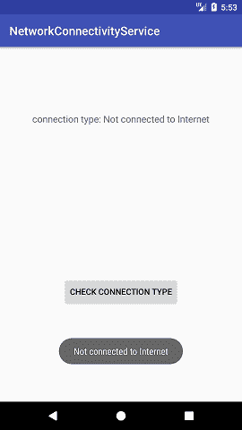

# 安卓网络连接服务

> 原文：<https://www.javatpoint.com/android-network-connectivity-services>

安卓网络连接服务允许我们检查设备的网络连接信息。在执行基于互联网服务的任务(如从服务器(互联网)获取数据或将数据写入服务器)时，检查设备的互联网连接非常重要。

使用安卓网络连接服务，我们还可以确定安卓设备的网络类型。可以是 **TYPE_WIFI (wifi)、TYPE_MOBILE** (移动电话)、 **TYPE_BLUETOOTH** (蓝牙)等类型。

## 安卓网络连接服务示例

让我们创建一个简单的示例来检查设备的网络连接及其类型。

要访问设备的网络连接，我们需要在 AndroidMenifest.xml 文件中提供网络访问权限。

```

<uses-permission android:name="android.permission.ACCESS_NETWORK_STATE" />

```

在布局的 *activity_main.xml* 文件中添加以下代码。对于访问设备的网络状态，不需要布局文件。这里，我们使用 *activity_main.xml* 文件仅用于存储网络类型的状态。

### activity_main.xml

```

<?xml version="1.0" encoding="utf-8"?>
<android.support.constraint.ConstraintLayout xmlns:android="http://schemas.android.com/apk/res/android"
    xmlns:app="http://schemas.android.com/apk/res-auto"
    xmlns:tools="http://schemas.android.com/tools"
    android:layout_width="match_parent"
    android:layout_height="match_parent"
    tools:context="example.javatpoint.com.networkconnectivityservice.MainActivity">

    <TextView
        android:id="@+id/textView"
        android:layout_width="wrap_content"
        android:layout_height="wrap_content"
        android:textSize="16dp"
        android:layout_marginBottom="8dp"
        android:layout_marginEnd="8dp"
        android:layout_marginStart="8dp"
        android:layout_marginTop="8dp"
        android:contentDescription="networkstate"
        android:text="Network state ?"
        app:layout_constraintBottom_toBottomOf="parent"
        app:layout_constraintEnd_toEndOf="parent"
        app:layout_constraintRight_toRightOf="parent"
        app:layout_constraintStart_toStartOf="parent"
        app:layout_constraintTop_toTopOf="parent"
        app:layout_constraintVertical_bias="0.183" />

    <Button
        android:id="@+id/button"
        android:layout_width="wrap_content"
        android:layout_height="wrap_content"
        android:layout_marginEnd="8dp"
        android:layout_marginStart="8dp"
        android:text="Check Connection Type"
        android:layout_marginTop="392dp"
        app:layout_constraintEnd_toEndOf="parent"
        app:layout_constraintStart_toStartOf="parent"
        app:layout_constraintTop_toTopOf="parent" />

</android.support.constraint.ConstraintLayout>

```

创建一个名为 NetworkState.java 的 java 类。该类包含一个 *getConnectivityStatus()* 方法，该方法根据当前网络连接返回常量整数值。

代码**上下文。CONNECTIVITY_SERVICE)** 用于返回访问网络属性的 **ConnectivityManager** 类的实例。

### NetworkState.java

```

package example.javatpoint.com.networkconnectivityservice;

import android.content.Context;
import android.net.ConnectivityManager;
import android.net.NetworkInfo;

public class NetworkState {
    public static int TYPE_NOT_CONNECTED = 0;
    public static int TYPE_WIFI = 1;
    public static int TYPE_MOBILE = 2;

    public static int getConnectivityStatus(Context context) {
        ConnectivityManager cm = (ConnectivityManager) context.getSystemService(Context.CONNECTIVITY_SERVICE);
        NetworkInfo activeNetwork = cm.getActiveNetworkInfo();
        if (null != activeNetwork) {
            if(activeNetwork.getType() == ConnectivityManager.TYPE_WIFI)
                return TYPE_WIFI;

            if(activeNetwork.getType() == ConnectivityManager.TYPE_MOBILE)
                return TYPE_MOBILE;
        }
        return TYPE_NOT_CONNECTED;
    }

    public static String getConnectivityStatusString(Context context) {
        int conn = NetworkState.getConnectivityStatus(context);
        String status = null;
        if (conn == NetworkState.TYPE_WIFI) {
            status = "Wifi enabled";
        } else if (conn == NetworkState.TYPE_MOBILE) {
            status = "Mobile data enabled";
        } else if (conn == NetworkState.TYPE_NOT_CONNECTED) {
            status = "Not connected to Internet";
        }
        return status;
    }
}

```

创建一个名为*NetworkReceiver.java*的接收器类，并扩展**广播接收器**类。这个类处理设备网络状态的变化。设备网络状态发生变化时调用**broadcastreceiver**类的 **onReceive()** 方法。

### NetworkReceiver.java

```

package example.javatpoint.com.networkconnectivityservice;
import android.content.BroadcastReceiver;
import android.content.Context;
import android.content.Intent;
import android.widget.Toast;

public class NetworkReceiver extends BroadcastReceiver {
    static String  status =null;
    @Override
    public void onReceive(Context context, Intent intent) {
        status = NetworkState.getConnectivityStatusString(context);
        Toast.makeText(context, status, Toast.LENGTH_LONG).show();
        if(status == "Wifi enabled"){
            //your code when wifi enable
        }
        else if(status=="Mobile data enabled"){
            //your code when TYPE_MOBILE network enable
        }
        else if(status=="Not connected to Internet"){
            //your code when no network connected
        }
    }
}

```

在*MainActivity.java*课程中，我们通过单击按钮在文本视图中显示设备的网络状态。

### MainActivity.java

```

package example.javatpoint.com.networkconnectivityservice;

import android.support.v7.app.AppCompatActivity;
import android.os.Bundle;
import android.view.View;
import android.widget.Button;
import android.widget.TextView;
import android.widget.Toast;

public class MainActivity extends AppCompatActivity {

    Button button;
    TextView textView;
    @Override
    protected void onCreate(Bundle savedInstanceState) {
        super.onCreate(savedInstanceState);
        setContentView(R.layout.activity_main);
        button = findViewById(R.id.button);
        textView = findViewById(R.id.textView);
        button.setOnClickListener(new View.OnClickListener() {
            @Override
            public void onClick(View v) {
                NetworkReceiver receiver = new NetworkReceiver() ;
                String networkStatus = receiver.status;
                textView.setText("connection type: "+networkStatus);
                Toast.makeText(getApplicationContext(), networkStatus, Toast.LENGTH_LONG).show();
            }
        });
    }
}

```

在 *AndroidMenifest.xml* 文件中，添加网络访问权限和处理 BroadcastReceiver 类中发生的更改的 receiver 类。

### androidmenifest . xml 文件

```

<?xml version="1.0" encoding="utf-8"?>
<manifest xmlns:android="http://schemas.android.com/apk/res/android"
    package="example.javatpoint.com.networkconnectivityservice">
    <uses-permission android:name="android.permission.ACCESS_NETWORK_STATE"/>
    <uses-permission android:name="android.permission.INTERNET"/>
    <application
        android:allowBackup="true"
        android:icon="@mipmap/ic_launcher"
        android:label="@string/app_name"
        android:roundIcon="@mipmap/ic_launcher_round"
        android:supportsRtl="true"
        android:theme="@style/AppTheme">
        <activity android:name=".MainActivity">
            <intent-filter>
                <action android:name="android.intent.action.MAIN" />

                <category android:name="android.intent.category.LAUNCHER" />
            </intent-filter>
        </activity>
        <receiver
            android:name=".NetworkReceiver"
            android:enabled="true">
            <intent-filter>
                <action android:name="android.net.conn.CONNECTIVITY_CHANGE" />
                <action android:name="android.net.wifi.WIFI_STATE_CHANGED" />
            </intent-filter>
        </receiver>
    </application>

</manifest>

```

**输出**

 

* * *