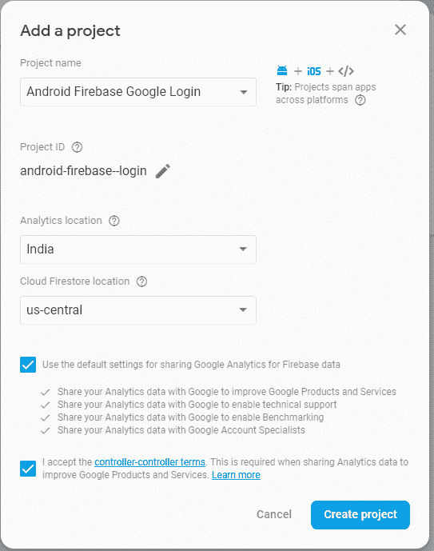
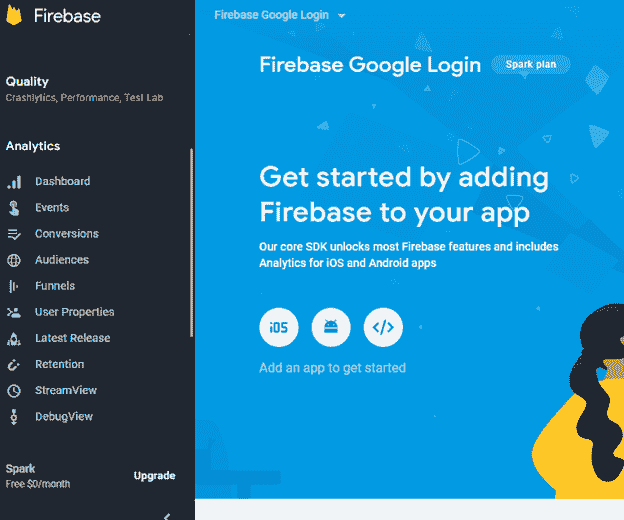
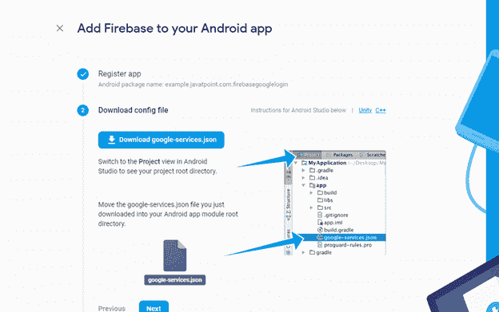
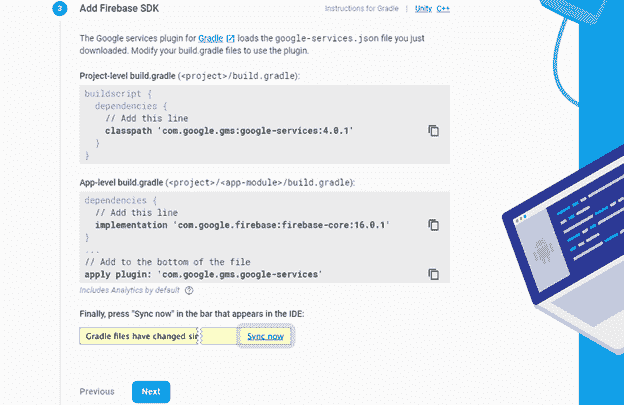
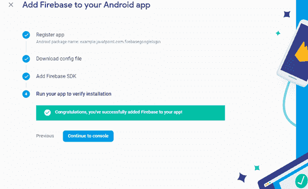
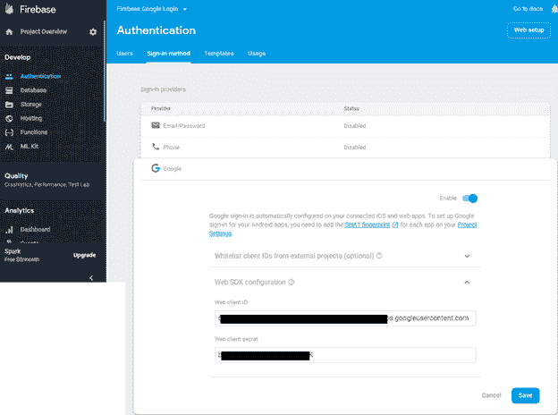
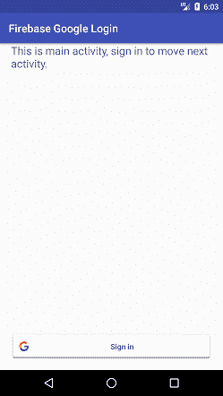
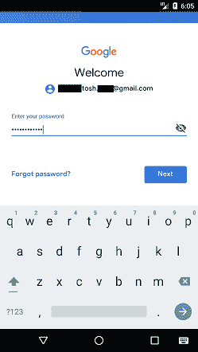
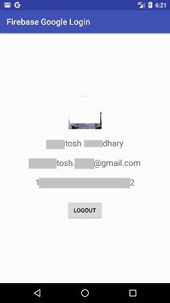
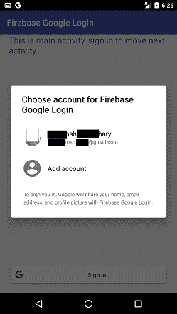

# 安卓 Firebase 认证-谷歌登录

> 原文：<https://www.javatpoint.com/android-firebase-authentication-google-login>

**Firebase 身份验证**提供后端服务，以便轻松使用 SDK 和内置的用户界面库来验证应用程序中的用户。大多数应用程序都需要用户的身份，在知道他们的状态后，应用程序会将用户的数据安全地保存在云中。它旨在建立一个安全的认证系统。

使用 Firebase 身份验证，我们将对谷歌、脸书、GitHub、Twitter 等的登录进行身份验证。

在本教程中，我们将使用**谷歌**和**Firebase API**在我们的安卓应用程序中集成 Firebase 身份验证的谷歌登录功能。

## 在谷歌 Firebase 帐户上创建和配置安卓应用程序的步骤

1.在[https://firebase.google.com/](https://firebase.google.com/)创建一个 Firebase 开发者账号，点击“转到控制台”。

2.点击**【添加项目】**。

3.填写项目名称并选择分析位置、云 Firestore 位置，接受控制器条款并点击**“创建项目”**。



4.当你的新项目成功完成后，点击**“继续”**。


5.选择**‘安卓’**平台 SDK。



6.通过提供所需的应用信息将您的应用注册到 Firebase，然后点击**“注册应用”**。

我们可以通过以下步骤获得应用证书 SHA-1 密钥:

1.  打开安卓项目。
2.  从右侧面板打开“渐变”选项卡。
3.  双击“登录报告”。
4.  我们将在“格拉德勒控制台”上找到我们的应用 SHA-1 键。


7.现在下载**‘Google-services . JSON’**文件，将其整合到安卓应用中，点击**‘下一步’**。



8.在中添加 firebase SDK 依赖项。升级应用程序的文件，然后在 IDE 中单击“立即同步”，然后单击**“下一步”**。



**build . grade le(项目)**

```

dependencies {
    classpath 'com.android.tools.build:gradle:3.0.1'
    classpath 'com.google.gms:google-services:4.0.1'

    // NOTE: Do not place your application dependencies here; they belong
    // in the individual module build.gradle files
}

```

**构建梯度(模块)**

```

dependencies {
    implementation fileTree(dir: 'libs', include: ['*.jar'])
    implementation 'com.android.support:appcompat-v7:27.1.1'
    implementation 'com.android.support.constraint:constraint-layout:1.1.3'
    testImplementation 'junit:junit:4.12'
    androidTestImplementation 'com.android.support.test:runner:1.0.2'
    androidTestImplementation 'com.android.support.test.espresso:espresso-core:3.0.2'
    implementation 'com.google.firebase:firebase-auth:16.0.3'
    implementation 'com.google.firebase:firebase-core:16.0.3'
    implementation 'com.google.android.gms:play-services-auth:16.0.0'
    implementation 'com.github.bumptech.glide:glide:3.7.0'
}
apply plugin: 'com.google.gms.google-services'

```

### AndroidManifest.xml

在 AndroidManifest.xml 文件中添加**互联网**权限以访问网络连接。

```

<uses-permission android:name="android.permission.INTERNET" />

```

9.运行你的应用程序验证安装配置，如果一切正常，它会显示一条成功消息，然后点击**“继续控制台”**。



10.在控制台页面选择**认证**-gt；**签到方式**-gt；**谷歌**-gt；**启用**，点击**【保存】**。



## 以谷歌登录为例的安卓 Firebase 认证

在这个例子中，我们将在我们的安卓应用程序中集成 Firebase 身份验证和谷歌登录。一旦用户通过谷歌登录成功登录，我们将使用 Firebase 身份验证对他们进行身份验证，然后将用户重定向到下一个活动(ProfileActivity)并显示他们的详细信息。

我们需要将下载的**‘Google-services . JSON’**文件粘贴到我们的 Android 项目 app 目录中。

### activity_main.xml

在 activity_main.xml 文件中添加以下代码。在本活动中，我们实现了自定义的谷歌登录按钮。

```

<?xml version="1.0" encoding="utf-8"?>
<RelativeLayout xmlns:android="http://schemas.android.com/apk/res/android"
    xmlns:app="http://schemas.android.com/apk/res-auto"
    xmlns:tools="http://schemas.android.com/tools"
    android:layout_width="match_parent"
    android:layout_height="match_parent"
    tools:context="example.javatpoint.com.firebasegooglelogin.MainActivity">

    <TextView
        android:id="@+id/textView"
        android:layout_width="wrap_content"
        android:layout_height="wrap_content"
        android:layout_marginLeft="20dp"
        android:layout_marginRight="20dp"
        android:textSize="20dp"
        android:text="This is main activity, sign in to move next activity." />

    <com.google.android.gms.common.SignInButton
        android:layout_width="match_parent"
        android:layout_height="wrap_content"
        android:id="@+id/sign_in_button"
        android:layout_marginLeft="20dp"
        android:layout_marginRight="20dp"
        android:layout_alignParentBottom="true"
        android:layout_marginBottom="20dp">

    </com.google.android.gms.common.SignInButton>

</RelativeLayout>

```

### strings.xml

在 string.xml 文件中添加您的 web 客户端 id。甚至你可以在程序中使用默认的谷歌网络客户端 id。

```

<resources>
    <string name="app_name">Firebase Google Login</string>
    <string name="web_client_id">xxxxxxxx..place your web client id here</string>
</resources>

```

### MainActivity.java

在 MainActivity.java 类中添加以下代码。MainActivity.java 类中使用的类和方法的功能如下所示:

1.  **新的 FirebaseAuth。authstatestiner**(){ }作为身份验证监听器，检查用户是否登录。如果用户成功登录，我们会放置其他 firebase 逻辑。
2.  新的谷歌符号。Builder ()方法配置谷歌登录，使用 requestEmail 选项获取用户数据。
3.  点击登录按钮，调用**验证。Google signinapi . getsignintent(Google API client)**并以 startActivityForResult()开始意图。
4.  活动结果()我们得到了谷歌登录请求的结果。
5.  如果**handlesiginresult(结果)**返回 true，我们使用 idToken 获得谷歌认证。
6.  调用 **firebaseAuthWithGoogle(凭证)**与 Google 进行 Firebase 身份验证。

如果 Firebase 身份验证成功，我们将用户重定向到下一个活动(ProfileActivity.java)。

```

package example.javatpoint.com.firebasegooglelogin;

import android.content.Intent;
import android.support.annotation.NonNull;
import android.support.v7.app.AppCompatActivity;
import android.os.Bundle;
import android.util.Log;
import android.view.View;
import android.widget.Toast;

import com.google.android.gms.auth.api.Auth;
import com.google.android.gms.auth.api.signin.GoogleSignInAccount;
import com.google.android.gms.auth.api.signin.GoogleSignInOptions;
import com.google.android.gms.auth.api.signin.GoogleSignInResult;
import com.google.android.gms.common.ConnectionResult;
import com.google.android.gms.common.SignInButton;
import com.google.android.gms.common.api.GoogleApiClient;
import com.google.android.gms.tasks.OnCompleteListener;
import com.google.android.gms.tasks.Task;
import com.google.firebase.auth.AuthCredential;
import com.google.firebase.auth.AuthResult;
import com.google.firebase.auth.FirebaseAuth;
import com.google.firebase.auth.FirebaseUser;
import com.google.firebase.auth.GoogleAuthProvider;

public class MainActivity extends AppCompatActivity implements GoogleApiClient.OnConnectionFailedListener {

    private static final String TAG = "MainActivity";
    private SignInButton signInButton;
    private GoogleApiClient googleApiClient;
    private static final int RC_SIGN_IN = 1;
    String name, email;
    String idToken;
    private FirebaseAuth firebaseAuth;
    private FirebaseAuth.AuthStateListener authStateListener;

    @Override
    protected void onCreate(Bundle savedInstanceState) {
        super.onCreate(savedInstanceState);
        setContentView(R.layout.activity_main);

        firebaseAuth = com.google.firebase.auth.FirebaseAuth.getInstance();
        //this is where we start the Auth state Listener to listen for whether the user is signed in or not
        authStateListener = new FirebaseAuth.AuthStateListener(){
            @Override
            public void onAuthStateChanged(@NonNull FirebaseAuth firebaseAuth) {
                // Get signedIn user
                FirebaseUser user = firebaseAuth.getCurrentUser();

                //if user is signed in, we call a helper method to save the user details to Firebase
                if (user != null) {
                    // User is signed in
                    // you could place other firebase code
                    //logic to save the user details to Firebase
                    Log.d(TAG, "onAuthStateChanged:signed_in:" + user.getUid());
                } else {
                    // User is signed out
                    Log.d(TAG, "onAuthStateChanged:signed_out");
                }
            }
        };

        GoogleSignInOptions gso =  new GoogleSignInOptions.Builder(GoogleSignInOptions.DEFAULT_SIGN_IN)
                .requestIdToken(getString(R.string.web_client_id))//you can also use R.string.default_web_client_id
                .requestEmail()
                .build();
        googleApiClient=new GoogleApiClient.Builder(this)
                .enableAutoManage(this,this)
                .addApi(Auth.GOOGLE_SIGN_IN_API,gso)
                .build();

        signInButton = findViewById(R.id.sign_in_button);
        signInButton.setOnClickListener(new View.OnClickListener() {
            @Override
            public void onClick(View view) {
                Intent intent = Auth.GoogleSignInApi.getSignInIntent(googleApiClient);
                startActivityForResult(intent,RC_SIGN_IN);
            }
        });
    }

    @Override
    public void onConnectionFailed(@NonNull ConnectionResult connectionResult) {

    }

    @Override
    protected void onActivityResult(int requestCode, int resultCode, Intent data) {
        super.onActivityResult(requestCode, resultCode, data);
        if(requestCode==RC_SIGN_IN){
            GoogleSignInResult result = Auth.GoogleSignInApi.getSignInResultFromIntent(data);
            handleSignInResult(result);
        }
    }

    private void handleSignInResult(GoogleSignInResult result){
        if(result.isSuccess()){
            GoogleSignInAccount account = result.getSignInAccount();
            idToken = account.getIdToken();
            name = account.getDisplayName();
            email = account.getEmail();
            // you can store user data to SharedPreference
            AuthCredential credential = GoogleAuthProvider.getCredential(idToken, null);
            firebaseAuthWithGoogle(credential); 
        }else{
            // Google Sign In failed, update UI appropriately
            Log.e(TAG, "Login Unsuccessful. "+result);
            Toast.makeText(this, "Login Unsuccessful", Toast.LENGTH_SHORT).show();
        }
    }
    private void firebaseAuthWithGoogle(AuthCredential credential){

        firebaseAuth.signInWithCredential(credential)
                .addOnCompleteListener(this, new OnCompleteListener<AuthResult>() {
                    @Override
                    public void onComplete(@NonNull Task<AuthResult> task) {
                        Log.d(TAG, "signInWithCredential:onComplete:" + task.isSuccessful());
                        if(task.isSuccessful()){
                            Toast.makeText(MainActivity.this, "Login successful", Toast.LENGTH_SHORT).show();
                            gotoProfile();
                        }else{
                            Log.w(TAG, "signInWithCredential" + task.getException().getMessage());
                            task.getException().printStackTrace();
                            Toast.makeText(MainActivity.this, "Authentication failed.",
                                    Toast.LENGTH_SHORT).show();
                        }

                    }
                });
    }

    private void gotoProfile(){
        Intent intent = new Intent(MainActivity.this, ProfileActivity.class);
        intent.setFlags(Intent.FLAG_ACTIVITY_NEW_TASK | Intent.FLAG_ACTIVITY_CLEAR_TASK);
        startActivity(intent);
        finish();
    }
    @Override
    protected void onStart() {
        super.onStart();
        if (authStateListener != null){
            FirebaseAuth.getInstance().signOut();
        }
        firebaseAuth.addAuthStateListener(authStateListener);
    }

    @Override
    protected void onStop() {
        super.onStop();
        if (authStateListener != null){
            firebaseAuth.removeAuthStateListener(authStateListener);
        }
    }

}

```

### profile_activity.xml

在 profile_activity.xml 文件中添加以下代码。ImageView 用于显示用户配置文件图像，TextView 用于显示姓名、电子邮件、id 和注销按钮。

```

<?xml version="1.0" encoding="utf-8"?>
<RelativeLayout xmlns:android="http://schemas.android.com/apk/res/android"
    xmlns:app="http://schemas.android.com/apk/res-auto"
    xmlns:tools="http://schemas.android.com/tools"
    android:layout_width="match_parent"
    android:layout_height="match_parent"
    tools:context="example.javatpoint.com.firebasegooglelogin.ProfileActivity">

        <LinearLayout
            android:layout_width="match_parent"
            android:layout_height="match_parent"
            android:gravity="center"
            android:orientation="vertical">
            <ImageView
                android:layout_width="80dp"
                android:layout_height="80dp"
                android:id="@+id/profileImage"
                />
            <TextView
                android:layout_width="wrap_content"
                android:layout_height="wrap_content"
                android:id="@+id/name"
                android:text="name"
                android:textSize="20dp"
                android:layout_marginTop="20dp"/>
            <TextView
                android:layout_width="wrap_content"
                android:layout_height="wrap_content"
                android:id="@+id/email"
                android:textSize="20dp"
                android:text="email"
                android:layout_marginTop="20dp"/>
            <TextView
                android:layout_width="wrap_content"
                android:layout_height="wrap_content"
                android:id="@+id/userId"
                android:textSize="20dp"
                android:text="id"
                android:layout_marginTop="20dp"/>
            <Button
                android:layout_width="wrap_content"
                android:layout_height="wrap_content"
                android:id="@+id/logoutBtn"
                android:text="Logout"
                android:layout_marginTop="30dp"/>
        </LinearLayout>
</RelativeLayout>

```

### ProfileActivity.java

在这个 ProfileActivity.java 类中，我们获取用户信息并显示它们。GoogleSignInResult 类实现了 Result 接口，该接口表示调用 Google Play Services 的 API 方法的最终结果。

GoogleSignInAccount 类保存了用户的必要信息。

```

package example.javatpoint.com.firebasegooglelogin;

import android.content.Intent;
import android.support.annotation.NonNull;
import android.support.v7.app.AppCompatActivity;
import android.os.Bundle;
import android.view.View;
import android.widget.Button;
import android.widget.ImageView;
import android.widget.TextView;
import android.widget.Toast;

import com.bumptech.glide.Glide;
import com.google.android.gms.auth.api.Auth;
import com.google.android.gms.auth.api.signin.GoogleSignInAccount;
import com.google.android.gms.auth.api.signin.GoogleSignInOptions;
import com.google.android.gms.auth.api.signin.GoogleSignInResult;
import com.google.android.gms.common.ConnectionResult;
import com.google.android.gms.common.api.GoogleApiClient;
import com.google.android.gms.common.api.OptionalPendingResult;
import com.google.android.gms.common.api.ResultCallback;
import com.google.android.gms.common.api.Status;
import com.google.firebase.auth.FirebaseAuth;

public class ProfileActivity extends AppCompatActivity implements GoogleApiClient.OnConnectionFailedListener {
    Button logoutBtn;
    TextView userName,userEmail,userId;
    ImageView profileImage;
    private GoogleApiClient googleApiClient;
    private GoogleSignInOptions gso;
    @Override
    protected void onCreate(Bundle savedInstanceState) {
        super.onCreate(savedInstanceState);
        setContentView(R.layout.activity_profile);

        logoutBtn = findViewById(R.id.logoutBtn);
        userName = findViewById(R.id.name);
        userEmail = findViewById(R.id.email);
        userId = findViewById(R.id.userId);
        profileImage = findViewById(R.id.profileImage);

        gso =  new GoogleSignInOptions.Builder(GoogleSignInOptions.DEFAULT_SIGN_IN)
                .requestEmail()
                .build();

        googleApiClient=new GoogleApiClient.Builder(this)
                .enableAutoManage(this,this)
                .addApi(Auth.GOOGLE_SIGN_IN_API,gso)
                .build();

        logoutBtn.setOnClickListener(new View.OnClickListener() {
            @Override
            public void onClick(View view) {
                FirebaseAuth.getInstance().signOut();
                Auth.GoogleSignInApi.signOut(googleApiClient).setResultCallback(
                        new ResultCallback<Status>() {
                            @Override
                            public void onResult(Status status) {
                                if (status.isSuccess()){
                                    gotoMainActivity();
                                }else{
                                    Toast.makeText(getApplicationContext(),"Session not close",Toast.LENGTH_LONG).show();
                                }
                            }
                        });
            }
        });
    }

    @Override
    protected void onStart() {
        super.onStart();
        OptionalPendingResult<GoogleSignInResult> opr= Auth.GoogleSignInApi.silentSignIn(googleApiClient);
        if(opr.isDone()){
            GoogleSignInResult result=opr.get();
            handleSignInResult(result);
        }else{
            opr.setResultCallback(new ResultCallback<GoogleSignInResult>() {
                @Override
                public void onResult(@NonNull GoogleSignInResult googleSignInResult) {
                    handleSignInResult(googleSignInResult);
                }
            });
        }
    }
    private void handleSignInResult(GoogleSignInResult result){
        if(result.isSuccess()){
            GoogleSignInAccount account=result.getSignInAccount();
            userName.setText(account.getDisplayName());
            userEmail.setText(account.getEmail());
            userId.setText(account.getId());
            try{
                Glide.with(this).load(account.getPhotoUrl()).into(profileImage);
            }catch (NullPointerException e){
                Toast.makeText(getApplicationContext(),"image not found",Toast.LENGTH_LONG).show();
            }

        }else{
            gotoMainActivity();
        }
    }
    private void gotoMainActivity(){
        Intent intent=new Intent(this,MainActivity.class);
        startActivity(intent);
    }
    @Override
    public void onConnectionFailed(@NonNull ConnectionResult connectionResult) {

    }
}

```

**输出:**

   

* * *