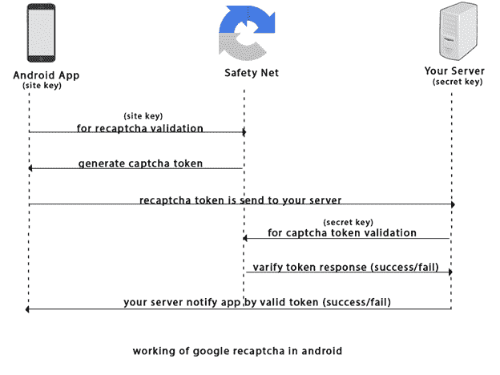
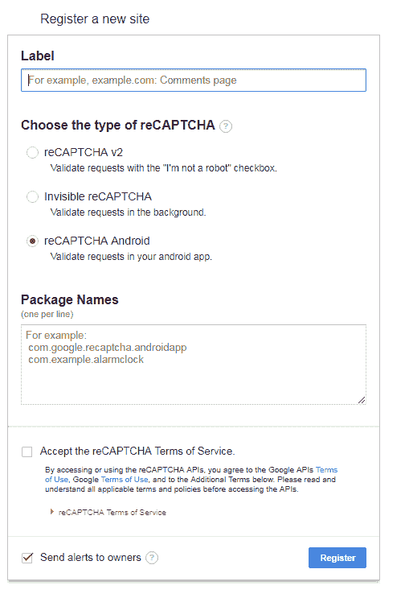
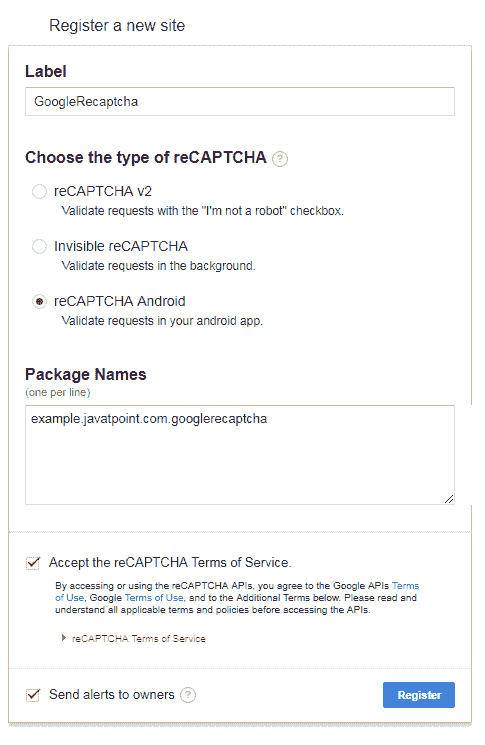
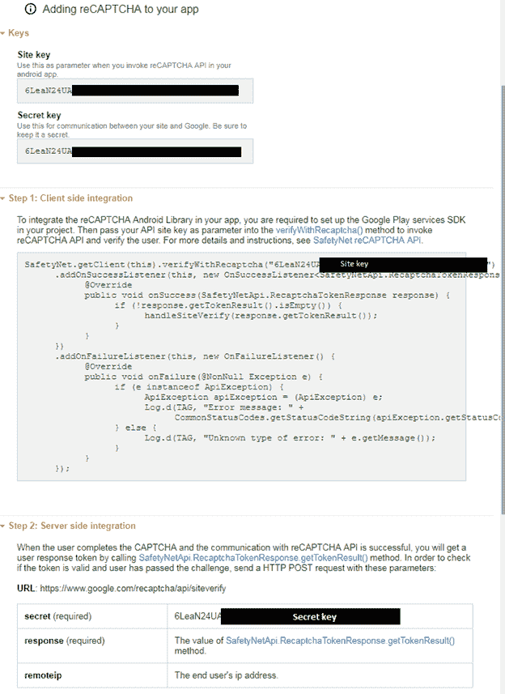
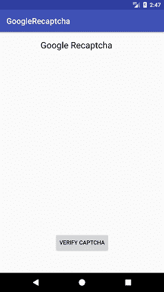
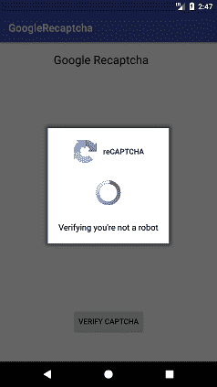
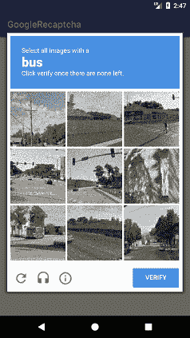
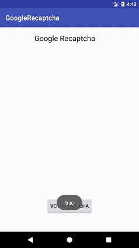

# 谷歌截图在安卓应用中的应用

> 原文：<https://www.javatpoint.com/using-google-recaptcha-in-android-application>

在本教程中，我们将学习谷歌 reCaptcha 的工作过程，并将其集成到我们的安卓应用程序中。谷歌的 reCaptcha 保护我们的应用程序免受恶意流量的攻击。它是使用安全网络应用编程接口实现的。

## 谷歌重组的工作:

通过调用安卓应用程序、安全网服务器和你的服务器之间的网络调用来验证谷歌注册。

*   一个安卓应用程序用**站点密钥**向**安全网**服务器请求重新注册验证。
*   **安全网**服务器使用站点**键**通过验证码令牌生成对安卓应用的响应。
*   验证码令牌被发送到您的服务器进行验证，使用**密钥**。
*   您的安卓服务器向**安全网**请求使用秘密**密钥**验证验证码令牌。
*   **安全网**验证令牌响应，并返回成功或失败的结果。
*   您的安卓服务器通过验证令牌来通知安卓应用程序，并返回成功或失败的结果。



## 生成注册网站密钥和密钥:

在创建应用编程接口密钥之前，请仔细阅读应用编程接口服务条款[https://developers.google.com/terms/](https://developers.google.com/terms/)。

*   注册安卓 reCAPTCHA 网站[https://g.co/recaptcha/androidsignup](https://g.co/recaptcha/androidsignup)。



*   提供标签、包装名称的输入详情，并接受注册条款和服务。
    **标签**:是你钥匙的唯一标签。您可以使用公司或组织的名称。
    **包名**:是你的安卓应用的包名。



*   下一页将生成站点密钥、秘密密钥、客户端集成代码和服务器端代码。



## 集成谷歌 reCAPTCHA 的安卓示例

让我们创建一个在我们的安卓应用程序中集成谷歌 reCAPTCHA 的例子。

**build.gradle**

在 build.gradle 文件中添加以下 SafetyNet 和凌空依赖项。

```

dependencies {
    implementation 'com.google.android.gms:play-services-safetynet:15.0.1'
    implementation 'com.android.volley:volley:1.0.0'
}

```

### AndroidManifest.xml

在 AndroidManifest.xml 文件中添加互联网权限

```

<uses-permission android:name="android.permission.INTERNET" />

```

### activity_main.xml

在 activity_main.xml 文件中添加以下代码。

```

<?xml version="1.0" encoding="utf-8"?>
<android.support.constraint.ConstraintLayout xmlns:android="http://schemas.android.com/apk/res/android"
    xmlns:app="http://schemas.android.com/apk/res-auto"
    xmlns:tools="http://schemas.android.com/tools"
    android:layout_width="match_parent"
    android:layout_height="match_parent"
    tools:context="example.javatpoint.com.googlerecaptcha.MainActivity">

    <TextView
        android:layout_width="wrap_content"
        android:layout_height="wrap_content"
        android:layout_marginBottom="8dp"
        android:layout_marginEnd="8dp"
        android:layout_marginStart="8dp"
        android:layout_marginTop="8dp"
        android:text="Google Recaptcha"
        android:textAppearance="@style/Base.TextAppearance.AppCompat.Large"
        app:layout_constraintBottom_toBottomOf="parent"
        app:layout_constraintEnd_toEndOf="parent"
        app:layout_constraintHorizontal_bias="0.436"
        app:layout_constraintLeft_toLeftOf="parent"
        app:layout_constraintRight_toRightOf="parent"
        app:layout_constraintStart_toStartOf="parent"
        app:layout_constraintTop_toTopOf="parent"
        app:layout_constraintVertical_bias="0.017" />

    <Button
        android:id="@+id/button"
        android:layout_width="wrap_content"
        android:layout_height="wrap_content"
        android:layout_marginBottom="52dp"
        android:layout_marginEnd="8dp"
        android:layout_marginStart="8dp"
        android:text="Verify captcha"
        app:layout_constraintBottom_toBottomOf="parent"
        app:layout_constraintEnd_toEndOf="parent"
        app:layout_constraintStart_toStartOf="parent" />

</android.support.constraint.ConstraintLayout>

```

### MainActivity.java

在 MainActivity.java 类文件中添加以下代码。在这个类中，我们将客户端与安全网服务器集成，并在 JSON 字符串中获得响应。

用您的实际站点密钥和秘密密钥替换站点密钥和秘密密钥的值。当点击按钮时，它调用 SafetyNet.getClient()方法来获取站点密钥，如果返回成功则调用 handleSiteVerify()进行令牌验证。

截击库用于以下目的:

*   凌空库的请求队列将服务器调用保持在队列中。
*   StringRequest 用于从您的服务器以 JSON 字符串的形式获取响应。
*   如果服务器调用在时间限制内失败，setRetryPolicy()方法将重试该调用。

```

package example.javatpoint.com.googlerecaptcha;

import android.support.annotation.NonNull;
import android.support.v7.app.AppCompatActivity;
import android.os.Bundle;
import android.util.Log;
import android.view.View;
import android.widget.Button;
import android.widget.Toast;
import com.android.volley.DefaultRetryPolicy;
import com.android.volley.Request;
import com.android.volley.RequestQueue;
import com.android.volley.Response;
import com.android.volley.VolleyError;
import com.android.volley.toolbox.StringRequest;
import com.android.volley.toolbox.Volley;
import com.google.android.gms.common.api.ApiException;
import com.google.android.gms.common.api.CommonStatusCodes;
import com.google.android.gms.safetynet.SafetyNet;
import com.google.android.gms.safetynet.SafetyNetApi;
import com.google.android.gms.tasks.OnFailureListener;
import com.google.android.gms.tasks.OnSuccessListener;
import org.json.JSONObject;
import java.util.HashMap;
import java.util.Map;

public class MainActivity extends AppCompatActivity implements View.OnClickListener{

    String TAG = MainActivity.class.getSimpleName();
    Button btnverifyCaptcha;
    String SITE_KEY = "6LeaN24UAxxxxx_YOUR_SITE_KEY";
    String SECRET_KEY = "6LeaN24UAxxxxx_YOUR_SECRET_KEY";
    RequestQueue queue;

    @Override
    protected void onCreate(Bundle savedInstanceState) {
        super.onCreate(savedInstanceState);
        setContentView(R.layout.activity_main);
        btnverifyCaptcha = findViewById(R.id.button);
        btnverifyCaptcha.setOnClickListener(this);

        queue = Volley.newRequestQueue(getApplicationContext());
    }

    @Override
    public void onClick(View view) {
        SafetyNet.getClient(this).verifyWithRecaptcha(SITE_KEY)
                .addOnSuccessListener(this, new OnSuccessListener<SafetyNetApi.RecaptchaTokenResponse>() {
                    @Override
                    public void onSuccess(SafetyNetApi.RecaptchaTokenResponse response) {
                        if (!response.getTokenResult().isEmpty()) {
                            handleSiteVerify(response.getTokenResult());
                        }
                    }
                })
                .addOnFailureListener(this, new OnFailureListener() {
                    @Override
                    public void onFailure(@NonNull Exception e) {
                        if (e instanceof ApiException) {
                            ApiException apiException = (ApiException) e;
                            Log.d(TAG, "Error message: " +
                                    CommonStatusCodes.getStatusCodeString(apiException.getStatusCode()));
                        } else {
                            Log.d(TAG, "Unknown type of error: " + e.getMessage());
                        }
                    }
                });

    }
    protected  void handleSiteVerify(final String responseToken){
        //it is google recaptcha siteverify server
        //you can place your server url
        String url = "https://www.google.com/recaptcha/api/siteverify";
        StringRequest request = new StringRequest(Request.Method.POST, url,
                new Response.Listener<String>() {
                    @Override
                    public void onResponse(String response) {
                        try {
                            JSONObject jsonObject = new JSONObject(response);
                            if(jsonObject.getBoolean("success")){
                                //code logic when captcha returns true Toast.makeText(getApplicationContext(),String.valueOf(jsonObject.getBoolean("success")),Toast.LENGTH_LONG).show();
                            }
                            else{
                                Toast.makeText(getApplicationContext(),String.valueOf(jsonObject.getString("error-codes")),Toast.LENGTH_LONG).show();
                            }
                        } catch (Exception ex) {
                            Log.d(TAG, "JSON exception: " + ex.getMessage());

                        }
                    }
                },
                new Response.ErrorListener() {
                    @Override
                    public void onErrorResponse(VolleyError error) {
                        Log.d(TAG, "Error message: " + error.getMessage());
                    }
                }) {
            @Override
            protected Map<String, String> getParams() {
                Map<String, String> params = new HashMap<>();
                params.put("secret", SECRET_KEY);
                params.put("response", responseToken);
                return params;
            }
        };
        request.setRetryPolicy(new DefaultRetryPolicy(
                50000,
                DefaultRetryPolicy.DEFAULT_MAX_RETRIES,
                DefaultRetryPolicy.DEFAULT_BACKOFF_MULT));
        queue.add(request);
    }
}

```

**输出:**

   

* * *