# 在安卓应用中集成谷歌登录

> 原文：<https://www.javatpoint.com/android-googlesignin-integrating>

在本教程中，我们将使用**谷歌应用编程接口**在我们的安卓应用程序中集成*谷歌登录*功能。在安卓应用中结合谷歌 API，帮助用户使用谷歌账号登录。

为了在我们的应用程序中集成谷歌登录应用编程接口，我们需要将我们的应用程序配置为谷歌开发者帐户，并为安卓应用程序下载**‘谷歌服务. JSON’**文件。

## 在谷歌开发者账号上配置安卓应用的步骤

1.在[https://developers . Google . com/identity/登录/Android/start-integration](https://developers.google.com/identity/sign-in/android/start-integrating)创建谷歌开发者账号，点击“GET A CONFIGURATION FILE”。

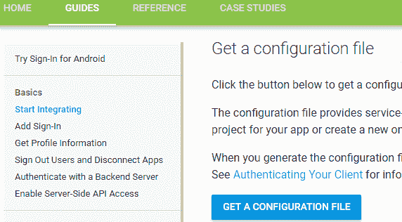

2.填写所有申请详细信息并选择您的国家/地区，然后单击“选择和配置服务”。

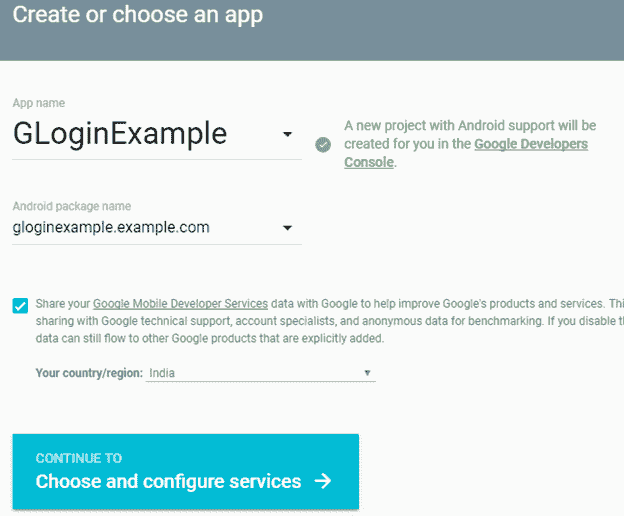

3.在成功创建谷歌应用支持配置后，它将重定向到下一个窗口以选择谷歌服务。我们将选择谷歌登录服务。

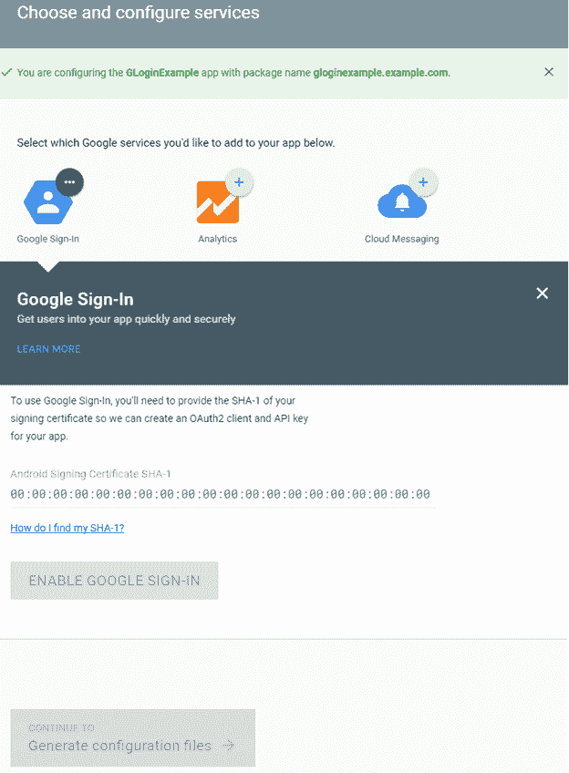

4.现在，我们需要提供我们申请的签署认证 **SHA-1** 密钥。

5.有两种不同的方式生成认证 SHA-1 密钥。

*   通过使用命令提示符。

**窗户:**

```

keytool -exportcert -list -v \
-alias androiddebugkey -keystore %USERPROFILE%\.android\debug.keystore

```

MAC/Linux

```

keytool -exportcert -list -v \
-alias androiddebugkey -keystore ~/.android/debug.keystore

```

*   AndroidStudio 自己做的。
    1.  打开安卓项目。
    2.  从右侧面板打开“渐变”选项卡。
    3.  双击“登录报告”。
    4.  我们将在“格拉德勒控制台”上找到我们的应用 SHA-1 键。

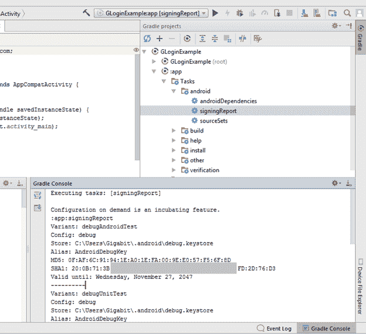

6.将生成的 SHA-1 密钥粘贴到谷歌登录服务，并点击“启用谷歌登录”和“生成认证文件”。

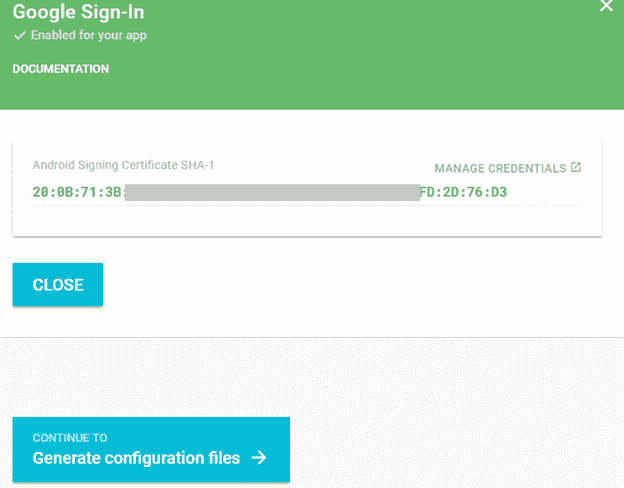

7.现在下载**‘Google-services . JSON’**文件，将其集成到安卓应用中。

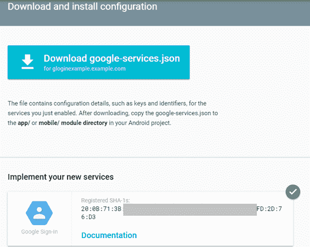

## 安卓应用集成谷歌登录示例

在这个例子中，我们将在安卓应用程序中集成谷歌登录。一旦用户通过谷歌登录成功登录，我们将重定向到下一个活动(ProfileActivity)并检索用户详细信息。

我们需要将下载的“google-services.json”文件粘贴到我们的 Android 项目应用程序目录中。

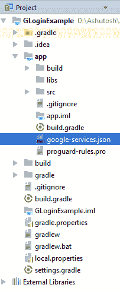

## 必需的权限

在*和*文件中添加互联网权限。

```

<uses-permission android:name="android.permission.INTERNET" />

```

## 构建.梯度(项目)

在*文件中添加以下依赖项。*

```

dependencies{
classpath 'com.google.gms:google-services:3.1.0'
}

```

## 构建.梯度(模块)

```

dependencies {
    implementation 'com.google.android.gms:play-services-auth:11.6.0'
    implementation 'com.github.bumptech.glide:glide:3.7.0'
}
apply plugin: 'com.google.gms.google-services'

```

### activity_main.xml

在 *activity_main.xml* 文件中添加 TextView 和 Google SignInButton。

```

<?xml version="1.0" encoding="utf-8"?>
<RelativeLayout xmlns:android="http://schemas.android.com/apk/res/android"
    xmlns:app="http://schemas.android.com/apk/res-auto"
    xmlns:tools="http://schemas.android.com/tools"
    android:layout_width="match_parent"
    android:layout_height="match_parent"
    tools:context="gloginexample.example.com.MainActivity">

    <TextView
        android:id="@+id/textView"
        android:layout_width="wrap_content"
        android:layout_height="wrap_content"
        android:layout_marginLeft="20dp"
        android:layout_marginRight="20dp"
        android:textSize="20dp"
        android:text="This is main activity, sign in to move next activity." />

    <com.google.android.gms.common.SignInButton
        android:layout_width="match_parent"
        android:layout_height="wrap_content"
        android:id="@+id/sign_in_button"
        android:layout_marginLeft="20dp"
        android:layout_marginRight="20dp"
        android:layout_alignParentBottom="true"
        android:layout_marginBottom="20dp">

    </com.google.android.gms.common.SignInButton>

</RelativeLayout>

```

### MainActivity.java

在 MainActivity.java 课上，我们称之为 *Auth。Google signinapi . getsigninetent()*方法通过 Google 登录 Api 登录。*谷歌地图客户端。谷歌 API 的 OnConnectionFailedListener* 接口覆盖了其未实现的方法*onConnectionFailed(connection result)*，返回连接失败结果。**谷歌客户端**类用于管理安卓应用程序和谷歌登录应用编程接口之间的连接。

```

package gloginexample.example.com;

import android.content.Intent;
import android.support.annotation.NonNull;
import android.support.v7.app.AppCompatActivity;
import android.os.Bundle;
import android.view.View;
import android.widget.TextView;
import android.widget.Toast;

import com.google.android.gms.auth.api.Auth;
import com.google.android.gms.auth.api.signin.GoogleSignInOptions;
import com.google.android.gms.auth.api.signin.GoogleSignInResult;
import com.google.android.gms.common.ConnectionResult;
import com.google.android.gms.common.SignInButton;
import com.google.android.gms.common.api.GoogleApiClient;

public class MainActivity extends AppCompatActivity implements GoogleApiClient.OnConnectionFailedListener {
    SignInButton signInButton;
    private GoogleApiClient googleApiClient;
    TextView textView;
    private static final int RC_SIGN_IN = 1;
    @Override
    protected void onCreate(Bundle savedInstanceState) {
        super.onCreate(savedInstanceState);
        setContentView(R.layout.activity_main);

        GoogleSignInOptions gso =  new GoogleSignInOptions.Builder(GoogleSignInOptions.DEFAULT_SIGN_IN)
                .requestEmail()
                .build();
        googleApiClient=new GoogleApiClient.Builder(this)
                .enableAutoManage(this,this)
                .addApi(Auth.GOOGLE_SIGN_IN_API,gso)
                .build();

        signInButton=(SignInButton)findViewById(R.id.sign_in_button);
        signInButton.setOnClickListener(new View.OnClickListener() {
            @Override
            public void onClick(View view) {
                Intent intent = Auth.GoogleSignInApi.getSignInIntent(googleApiClient);
                startActivityForResult(intent,RC_SIGN_IN);
            }
        });

    }

    @Override
    public void onConnectionFailed(@NonNull ConnectionResult connectionResult) {

    }

    @Override
    protected void onActivityResult(int requestCode, int resultCode, Intent data) {
        super.onActivityResult(requestCode, resultCode, data);
        if(requestCode==RC_SIGN_IN){
            GoogleSignInResult result = Auth.GoogleSignInApi.getSignInResultFromIntent(data);
            handleSignInResult(result);
        }
    }
    private void handleSignInResult(GoogleSignInResult result){
        if(result.isSuccess()){
            gotoProfile();
        }else{
            Toast.makeText(getApplicationContext(),"Sign in cancel",Toast.LENGTH_LONG).show();
        }
    }
    private void gotoProfile(){
        Intent intent=new Intent(MainActivity.this,ProfileActivity.class);
        startActivity(intent);
    }
}

```

### activity_profile.xml

在 *activity_profile.xml* 文件中添加以下组件。

```

<?xml version="1.0" encoding="utf-8"?>
<RelativeLayout xmlns:android="http://schemas.android.com/apk/res/android"
    xmlns:app="http://schemas.android.com/apk/res-auto"
    xmlns:tools="http://schemas.android.com/tools"
    android:layout_width="match_parent"
    android:layout_height="match_parent"
    tools:context="gloginexample.example.com.ProfileActivity">

    <LinearLayout
        android:layout_width="match_parent"
        android:layout_height="match_parent"
        android:gravity="center"
        android:orientation="vertical">
        <ImageView
            android:layout_width="80dp"
            android:layout_height="80dp"
            android:id="@+id/profileImage"
            />
        <TextView
            android:layout_width="wrap_content"
            android:layout_height="wrap_content"
            android:id="@+id/name"
            android:text="name"
            android:textSize="20dp"
            android:layout_marginTop="20dp"/>
        <TextView
        android:layout_width="wrap_content"
        android:layout_height="wrap_content"
        android:id="@+id/email"
        android:textSize="20dp"
        android:text="email"
        android:layout_marginTop="20dp"/>
        <TextView
            android:layout_width="wrap_content"
            android:layout_height="wrap_content"
            android:id="@+id/userId"
            android:textSize="20dp"
            android:text="id"
            android:layout_marginTop="20dp"/>
        <Button
            android:layout_width="wrap_content"
            android:layout_height="wrap_content"
            android:id="@+id/logoutBtn"
            android:text="Logout"
            android:layout_marginTop="30dp"/>
    </LinearLayout>

</RelativeLayout>

```

创建一个*ProfileActivity.java*类，我们将在成功登录后显示用户详细信息。

### ProfileActivity.java

在这个类中，如果用户成功登录，我们将检索用户详细信息。*Google signinginresult*类实现了 Result 接口，该接口表示调用 Google Play Services 的一个 API 方法的最终结果。

*GoogleSignInAccount* 类保存用户的基本信息。

```

package gloginexample.example.com;

import android.content.Intent;
import android.support.annotation.NonNull;
import android.support.v7.app.AppCompatActivity;
import android.os.Bundle;
import android.view.View;
import android.widget.Button;
import android.widget.ImageView;
import android.widget.TextView;
import android.widget.Toast;

import com.bumptech.glide.Glide;
import com.google.android.gms.auth.api.Auth;
import com.google.android.gms.auth.api.signin.GoogleSignInAccount;
import com.google.android.gms.auth.api.signin.GoogleSignInOptions;
import com.google.android.gms.auth.api.signin.GoogleSignInResult;
import com.google.android.gms.common.ConnectionResult;
import com.google.android.gms.common.api.GoogleApiClient;
import com.google.android.gms.common.api.OptionalPendingResult;
import com.google.android.gms.common.api.ResultCallback;
import com.google.android.gms.common.api.Status;

public class ProfileActivity extends AppCompatActivity implements GoogleApiClient.OnConnectionFailedListener {
    Button logoutBtn;
    TextView userName,userEmail,userId;
    ImageView profileImage;
    private GoogleApiClient googleApiClient;
    private GoogleSignInOptions gso;
    @Override
    protected void onCreate(Bundle savedInstanceState) {
        super.onCreate(savedInstanceState);
        setContentView(R.layout.activity_profile);

        logoutBtn=(Button)findViewById(R.id.logoutBtn);
        userName=(TextView)findViewById(R.id.name);
        userEmail=(TextView)findViewById(R.id.email);
        userId=(TextView)findViewById(R.id.userId);
        profileImage=(ImageView)findViewById(R.id.profileImage);

        gso =  new GoogleSignInOptions.Builder(GoogleSignInOptions.DEFAULT_SIGN_IN)
                .requestEmail()
                .build();

        googleApiClient=new GoogleApiClient.Builder(this)
                .enableAutoManage(this,this)
                .addApi(Auth.GOOGLE_SIGN_IN_API,gso)
                .build();

        logoutBtn.setOnClickListener(new View.OnClickListener() {
            @Override
            public void onClick(View view) {
                Auth.GoogleSignInApi.signOut(googleApiClient).setResultCallback(
                        new ResultCallback<Status>() {
                            @Override
                            public void onResult(Status status) {
                                if (status.isSuccess()){
                                    gotoMainActivity();
                                }else{
                                    Toast.makeText(getApplicationContext(),"Session not close",Toast.LENGTH_LONG).show();
                                }
                            }
                        });
            }
        });
    }

    @Override
    protected void onStart() {
        super.onStart();
        OptionalPendingResult<GoogleSignInResult> opr= Auth.GoogleSignInApi.silentSignIn(googleApiClient);
        if(opr.isDone()){
            GoogleSignInResult result=opr.get();
            handleSignInResult(result);
        }else{
            opr.setResultCallback(new ResultCallback<GoogleSignInResult>() {
                @Override
                public void onResult(@NonNull GoogleSignInResult googleSignInResult) {
                    handleSignInResult(googleSignInResult);
                }
            });
        }
    }
    private void handleSignInResult(GoogleSignInResult result){
        if(result.isSuccess()){
            GoogleSignInAccount account=result.getSignInAccount();
            userName.setText(account.getDisplayName());
            userEmail.setText(account.getEmail());
            userId.setText(account.getId());
            try{
                Glide.with(this).load(account.getPhotoUrl()).into(profileImage);
            }catch (NullPointerException e){
                  Toast.makeText(getApplicationContext(),"image not found",Toast.LENGTH_LONG).show();
            }

        }else{
            gotoMainActivity();
        }
    }
    private void gotoMainActivity(){
        Intent intent=new Intent(this,MainActivity.class);
        startActivity(intent);
    }
    @Override
    public void onConnectionFailed(@NonNull ConnectionResult connectionResult) {

    }
}

```

**输出:**

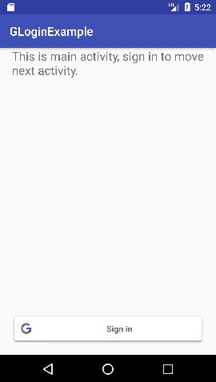 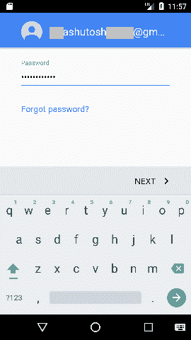
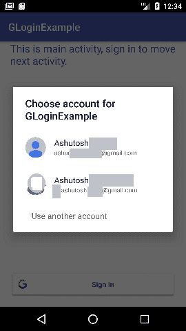 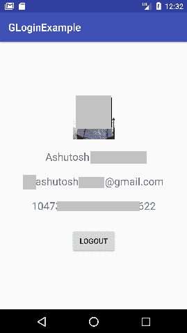

* * **