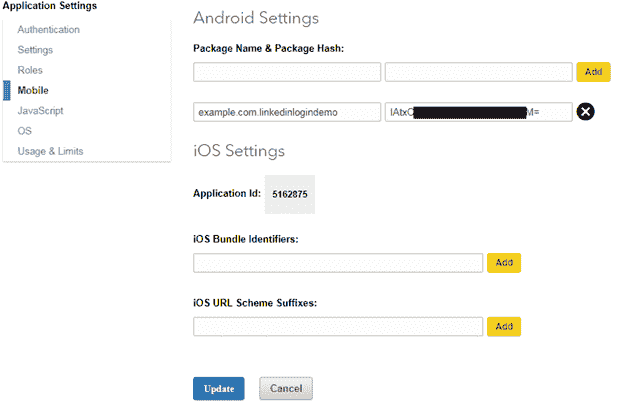

# 将领英应用编程接口集成到安卓应用中

> 原文：<https://www.javatpoint.com/android-linkedin-integrating>

在本教程中，我们将在我们的安卓应用程序中集成**领英登录**功能。在安卓应用中实现*领英 API* 帮助用户使用领英账号登录、分享帖子等。

为了将**领英应用编程接口**集成到我们的安卓应用中，我们需要领英**认证密钥**(客户端标识和客户端密码)和应用**哈希密钥**。

## 生成领英身份验证密钥和应用程序哈希密钥的步骤

1.在[https://www.linkedin.com/developer/apps](https://www.linkedin.com/developer/apps)创建领英开发者账号，点击【创建应用】。


2.在“创建新应用程序”表单中填写安卓应用程序的所有必需详细信息，并接受领英应用程序接口使用条款，然后单击“提交”。


3.提交应用程序详细信息后，它会生成 LinkedIn 身份验证密钥。现在我们将选择**“默认应用权限”**。此权限授权用户帐户的访问权限。在这里，我们选择 *r_basicprofile* ，和*“r _ email address”*，点击**“更新”**。


4.现在，我们的应用程序需要**“哈希键”**。它可以通过两种不同的方式生成。

*   在命令提示符下使用命令。

**窗户:**

```

keytool -exportcert -keystore %HOMEPATH%\.android\debug.keystore -alias androiddebugkey | openssl sha1 -binary | openssl base64

```

MAC/UNIX

```

keytool -exportcert -keystore ~/.android/debug.keystore -alias androiddebugkey | openssl sha1 -binary | openssl base64

```

要通过命令提示符生成哈希密钥，它需要在我们的操作系统中安装 OpenSSL。我们可以从[www.slproweb.com/products/Win32OpenSSL.html](https://slproweb.com/products/Win32OpenSSL.html)下载 Windows，从[http://www.openssl.org/source/](https://www.openssl.org/source/)下载 Mac/Unix。

*   使用 Activity.java 类中的编程代码。

```

PackageInfo info = getPackageManager().getPackageInfo(
                    "Your Package Nane",
                    PackageManager.GET_SIGNATURES);
            for (Signature signature : info.signatures) {
                MessageDigest md = MessageDigest.getInstance("SHA");
                md.update(signature.toByteArray());
                Log.d("KeyHash:", Base64.encodeToString(md.digest(), Base64.DEFAULT));

```

对于这个应用程序，我们将使用编程代码为我们的应用程序生成“哈希键”。

现在创建我们的应用程序，只需编写以下代码并运行以生成我们的“哈希键”。它将在日志中显示应用程序“哈希键”。

### MainActivity.java

```

package example.com.linkedinlogindemo;

import android.content.pm.PackageInfo;
import android.content.pm.PackageManager;
import android.content.pm.Signature;
import android.support.v7.app.AppCompatActivity;
import android.os.Bundle;
import android.util.Base64;
import android.util.Log;

import java.security.MessageDigest;

public class MainActivity extends AppCompatActivity {
    public static final String PACKAGE = "example.com.linkedinlogindemo";
    @Override
    protected void onCreate(Bundle savedInstanceState) {
        super.onCreate(savedInstanceState);
        setContentView(R.layout.activity_main);
        computePakageHash();
    }

    private void computePakageHash() {
        try {
            PackageInfo info = getPackageManager().getPackageInfo(
                    "example.com.linkedinlogindemo",
                    PackageManager.GET_SIGNATURES);
            for (Signature signature : info.signatures) {
                MessageDigest md = MessageDigest.getInstance("SHA");
                md.update(signature.toByteArray());
                Log.d("KeyHash:", Base64.encodeToString(md.digest(), Base64.DEFAULT));
            }
        } catch (Exception e) {
            Log.e("TAG",e.getMessage());
        }
    }
}

```


5.从日志中复制“哈希键”，并将其粘贴到我们的领英应用程序的移动选项卡中。之后点击“添加”和“更新”。这使得我们的应用程序“哈希键”注册了领英应用编程接口。



## 安卓应用集成领英登录示例

让我们创建一个在我们的安卓应用程序中集成 LinkedIn 登录功能的例子。用户成功登录后，它会将用户重定向到另一个活动(ProfileActivity)并显示用户信息。

我们需要在我们的项目中添加安卓的领英软件开发工具包。可以从这里[https://developer.linkedin.com/downloads#androidsdk.](https://developer.linkedin.com/downloads#androidsdk)下载


## 必需的权限

在*和*文件中添加互联网权限。

```

<uses-permission android:name="android.permission.INTERNET" />

```

## settings.gradle

在*设置.梯度*文件中添加 **linkedin-sdk** 。

```

include ':app', ':linkedin-sdk'

```

## 构建.梯度(模块)

在 *build.gradle* 文件中添加**编译项目(路径:‘:LinkedIn-SDK’)**。

```

dependencies {
    implementation fileTree(dir: 'libs', include: ['*.jar'])
    implementation 'com.android.support:appcompat-v7:26.1.0'
    implementation 'com.android.support.constraint:constraint-layout:1.0.2'
    testImplementation 'junit:junit:4.12'
    androidTestImplementation 'com.android.support.test:runner:1.0.1'
    androidTestImplementation 'com.android.support.test.espresso:espresso-core:3.0.1'
    compile project(path: ':linkedin-sdk')
}

```

### activity_main.xml

在 *activity_main.xml* 文件中添加以下代码。从 LinkedIn 开发者网站[https://developer.linkedin.com/downloads](https://developer.linkedin.com/downloads)下载推荐的 LinkedIn 按钮，添加为按钮背景。

```

<?xml version="1.0" encoding="utf-8"?>
<RelativeLayout xmlns:android="http://schemas.android.com/apk/res/android"
    xmlns:app="http://schemas.android.com/apk/res-auto"
    xmlns:tools="http://schemas.android.com/tools"
    android:layout_width="match_parent"
    android:layout_height="match_parent"
    tools:context="example.com.linkedinlogindemo.MainActivity">

    <TextView
        android:id="@+id/textView"
        android:layout_width="wrap_content"
        android:layout_height="wrap_content"
        android:layout_alignParentTop="true"
        android:textSize="20dp"
        android:layout_centerHorizontal="true"
        android:text="This is Login Page" />

    <Button
        android:id="@+id/login_button"
        android:layout_width="wrap_content"
        android:layout_height="wrap_content"
        android:layout_alignParentBottom="true"
        android:layout_centerHorizontal="true"
        android:layout_marginBottom="17dp"
        android:background="@drawable/loginbutton"
        tools:layout_editor_absoluteX="58dp"
        tools:layout_editor_absoluteY="437dp" />

</RelativeLayout>

```

### MainActivity.java

在 MainActivity.java 类中，我们使用 *LISessionManager* 类，它提供了创建和管理 LISession 对象(LinkedIn 会话对象)的所有功能。在构建中，范围添加了**的范围。**和**范围。R_EMAILADDRESS'** 访问用户基本档案信息和 LinkedIn 的邮箱地址。

```

package example.com.linkedinlogindemo;

import android.content.Intent;
import android.support.v7.app.AppCompatActivity;
import android.os.Bundle;
import android.view.View;
import android.widget.Button;
import android.widget.TextView;
import android.widget.Toast;
import com.linkedin.platform.LISessionManager;
import com.linkedin.platform.errors.LIAuthError;
import com.linkedin.platform.listeners.AuthListener;
import com.linkedin.platform.utils.Scope;

public class MainActivity extends AppCompatActivity {
    Button loginBtn;
    TextView textView;
    @Override
    protected void onCreate(Bundle savedInstanceState) {
        super.onCreate(savedInstanceState);
        setContentView(R.layout.activity_main);
        loginBtn = (Button) findViewById(R.id.login_button);
        textView=(TextView)findViewById(R.id.textView);
        loginBtn.setOnClickListener(new View.OnClickListener() {
            @Override
            public void onClick(View view) {
                loginHandle();
            }
        });
    }
    public void loginHandle() {
        LISessionManager.getInstance(getApplicationContext()).init(MainActivity.this, buildScope(), new AuthListener() {
                    @Override
                    public void onAuthSuccess() {
                        // Authentication was successful.  You can now do other calls with the SDK.

                        Intent intent=new Intent(MainActivity.this,ProfileActivity.class);
                        startActivity(intent);
                    }

                    @Override
                    public void onAuthError(LIAuthError error) {
                        // Handle authentication errors
                        Toast.makeText(getApplicationContext(),"Login Error "+error.toString(),Toast.LENGTH_LONG).show();
                    }
                }, true);
    }

    private static Scope buildScope() {
                return Scope.build(Scope.R_BASICPROFILE, Scope.R_EMAILADDRESS);
    }

    @Override
    protected void onActivityResult(int requestCode, int resultCode, Intent data) {
        // Add this line to your existing onActivityResult() method
        LISessionManager.getInstance(getApplicationContext()).onActivityResult(this, requestCode, resultCode, data);
    }

}

```

### activity_profile.xml

现在，在 *activity_profile.xml* 文件中添加以下代码。在本活动中，我们将在成功登录后显示用户信息。

```

<?xml version="1.0" encoding="utf-8"?>
<LinearLayout xmlns:android="http://schemas.android.com/apk/res/android"
    xmlns:app="http://schemas.android.com/apk/res-auto"
    xmlns:tools="http://schemas.android.com/tools"
    android:layout_width="match_parent"
    android:layout_height="match_parent"
    android:orientation="vertical"
    android:gravity="center_horizontal"
    tools:context="example.com.linkedinlogindemo.ProfileActivity">

    <TextView
        android:layout_width="wrap_content"
        android:layout_height="wrap_content"
        android:text="Welcome to profile" />
    <TextView
        android:layout_width="wrap_content"
        android:layout_height="wrap_content"
        android:id="@+id/userDetail"
        android:text="userdetail"
        android:layout_marginTop="20dp"
        />
    <Button
        android:layout_width="wrap_content"
        android:layout_height="wrap_content"
        android:layout_marginTop="30dp"
        android:textColor="#FFF"
        android:text="logout"
        android:id="@+id/logout_button"
        android:background="#022885"
        />
</LinearLayout>

```

### ProfileActivity.java

在 APIHelper 类的 getRequest()方法中添加 LinkedIn API URL*https://API . LinkedIn . com/v1/people/~:(id，名字，姓氏，电子邮件地址)*。它将检索 LinkedIn API 成功的用户信息。

```

package example.com.linkedinlogindemo;

import android.content.Intent;
import android.support.v7.app.AppCompatActivity;
import android.os.Bundle;
import android.view.View;
import android.widget.Button;
import android.widget.TextView;
import android.widget.Toast;

import com.linkedin.platform.APIHelper;
import com.linkedin.platform.LISession;
import com.linkedin.platform.LISessionManager;
import com.linkedin.platform.errors.LIApiError;
import com.linkedin.platform.listeners.ApiListener;
import com.linkedin.platform.listeners.ApiResponse;

import org.json.JSONException;
import org.json.JSONObject;

public class ProfileActivity extends AppCompatActivity {
    TextView user_detail;
    String firstName,lastName,userEmail;
    Button logout;
    @Override
    protected void onCreate(Bundle savedInstanceState) {
        super.onCreate(savedInstanceState);
        setContentView(R.layout.activity_profile);
        user_detail=(TextView)findViewById(R.id.userDetail);
        logout=(Button)findViewById(R.id.logout_button);

        fetchuserData();

        logout.setOnClickListener(new View.OnClickListener() {
            @Override
            public void onClick(View view) {
                LISessionManager.getInstance(getApplicationContext()).clearSession();
                Toast.makeText(getApplicationContext(),"Logout Successfully",Toast.LENGTH_LONG).show();
                Intent intent = new Intent(ProfileActivity.this, MainActivity.class);
                startActivity(intent);
            }
        });
   }

    private void fetchuserData() {
        String url = "https://api.linkedin.com/v1/people/~:(id,first-name,last-name,email-address)";

        APIHelper apiHelper = APIHelper.getInstance(getApplicationContext());
        apiHelper.getRequest(this, url, new ApiListener() {
            @Override
            public void onApiSuccess(ApiResponse apiResponse) {
                // Success!
                try {
                    JSONObject jsonObject = apiResponse.getResponseDataAsJson();
                    firstName = jsonObject.getString("firstName");
                    lastName = jsonObject.getString("lastName");
                    userEmail = jsonObject.getString("emailAddress");

                    StringBuilder stringBuilder = new StringBuilder();
                    stringBuilder.append("First Name " + firstName + "\n\n");
                    stringBuilder.append("Last Name " + lastName + "\n\n");
                    stringBuilder.append("Email " + userEmail);

                    user_detail.setText(stringBuilder);
                } catch (JSONException e) {
                    e.printStackTrace();
                }

            }

            @Override
            public void onApiError(LIApiError liApiError) {
                // Error making GET request!
                Toast.makeText(getApplicationContext(),"API Error"+liApiError.toString(),Toast.LENGTH_LONG).show();
            }
        });
    }
}

```

**输出:**

 
 

* * *