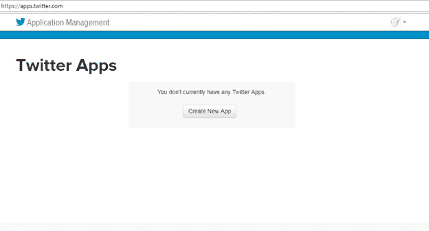
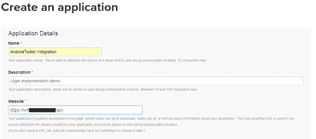
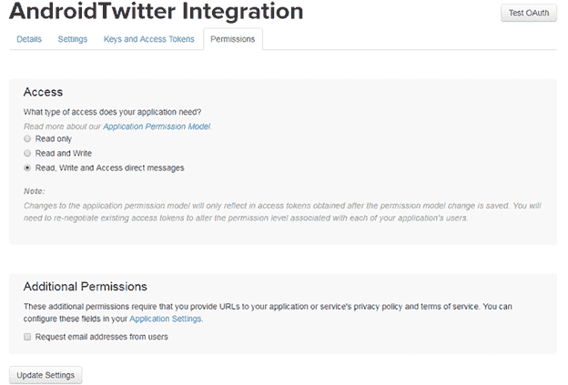
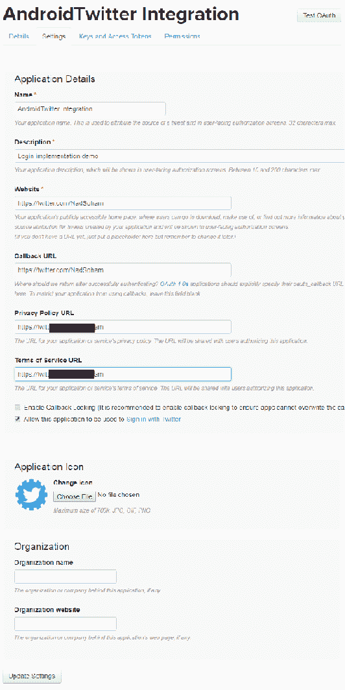
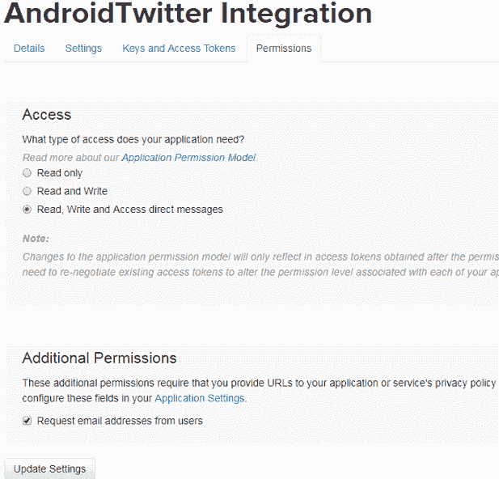
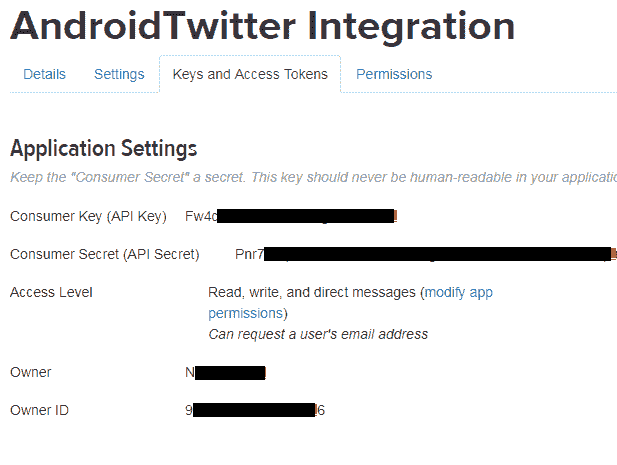
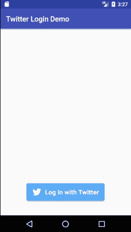
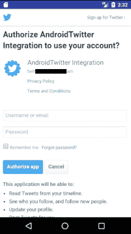
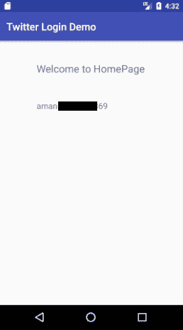

# 在安卓应用中集成推特应用编程接口

> 原文：<https://www.javatpoint.com/android-twitter-integrating>

在本教程中，我们将把 ***推特登录应用编程接口*** 集成到一个安卓应用中。为了将推特应用编程接口集成到安卓应用中，它需要应用**消费者密钥(应用编程接口密钥)**和**消费者秘密(应用编程接口秘密)**。可以从[https://apps.twitter.com/](https://apps.twitter.com/)生成。

在安卓应用中结合推特应用编程接口，帮助用户使用推特账户登录，分享推文等。

## 生成推特应用编程接口密钥和应用编程接口秘密的步骤

1.用你的推特账号登录[https://apps.twitter.com/](https://apps.twitter.com/)，点击“创建新应用”。



2.在新的打开的表格中填写所有需要的细节，然后点击“创建你的推特应用”。



3.为我们的应用程序选择应用程序权限模式。在这里，我们选择读取、写入和访问直接消息，然后单击“更新设置”。



4.现在，打开“设置”选项卡，填写所有必需的详细信息，然后单击“更新设置”。



5.现在，再次打开“权限”选项卡并启用“请求用户发送电子邮件”，然后再次单击“更新设置”。



6.现在，打开“密钥和访问令牌”选项卡，我们将找到我们的应用程序“消费者密钥”和“消费者机密”。



## 在安卓应用中集成推特登录的例子

让我们创建一个在安卓应用程序中通过推特账户集成登录的例子。

创建一个安卓应用程序，并在**‘build . gradel’(Module)**文件中添加以下推特依赖项。

```

compile 'com.twitter.sdk.android:twitter:3.1.1'
compile 'com.twitter.sdk.android:twitter-core:3.1.1'

```

确保**“build . gradel”(项目)**文件中存在*“jcenter()”*。

### strings.xml

将推特生成的我们应用的**【消费者密钥】****【消费者秘密】**放到***【strings . XML】***文件中。

```

<resources>
    <string name="app_name">Twitter Login Demo</string>
    <string name="com.twitter.sdk.android.CONSUMER_KEY">Fw4cXXXXXXXXXXX</string>
    <string name="com.twitter.sdk.android.CONSUMER_SECRET">Pnr7XXXXXXXXXXX</string>
</resources>

```

### activity_main.xml

在*‘activity _ main . XML’*文件中添加 Twitter API 提供的 Twitter 登录按钮。

```

<?xml version="1.0" encoding="utf-8"?>
<RelativeLayout xmlns:android="http://schemas.android.com/apk/res/android"
    xmlns:app="http://schemas.android.com/apk/res-auto"
    xmlns:tools="http://schemas.android.com/tools"
    android:layout_width="match_parent"
    android:layout_height="match_parent"
    tools:context="example.com.twitterlogindemo.MainActivity">

    <com.twitter.sdk.android.core.identity.TwitterLoginButton
        android:id="@+id/login_button"
        android:layout_width="wrap_content"
        android:layout_height="wrap_content"
       android:layout_centerHorizontal="true"
        android:layout_centerVertical="true"
        android:layout_alignParentBottom="true"
        android:layout_marginBottom="40dp"/>

</RelativeLayout>

```

### MainActivity.java

在“MainActivity.java”文件中添加以下代码。我们应该把‘Twitter . initialize(this)’代码放在‘setContentView(r . layout . activity _ main)’之前。如果我们在“setContentView(r . layout . activity _ main)”后面加上“Twitter.initialize(this)”，那么我们的 Twitter 按钮将被禁用。

```

package example.com.twitterlogindemo;

import android.content.Intent;
import android.support.v7.app.AppCompatActivity;
import android.os.Bundle;
import android.widget.Toast;

import com.twitter.sdk.android.core.Callback;
import com.twitter.sdk.android.core.Result;
import com.twitter.sdk.android.core.Twitter;
import com.twitter.sdk.android.core.TwitterAuthToken;
import com.twitter.sdk.android.core.TwitterCore;
import com.twitter.sdk.android.core.TwitterException;
import com.twitter.sdk.android.core.TwitterSession;
import com.twitter.sdk.android.core.identity.TwitterLoginButton;

public class MainActivity extends AppCompatActivity {

    TwitterLoginButton loginButton;
    @Override
    protected void onCreate(Bundle savedInstanceState) {
        super.onCreate(savedInstanceState);
        Twitter.initialize(this);
        setContentView(R.layout.activity_main);

        loginButton = (TwitterLoginButton) findViewById(R.id.login_button);
        loginButton.setCallback(new Callback() {
            @Override
            public void success(Result <twittersession>result) {
                // Do something with result, which provides a TwitterSession for making API calls
                TwitterSession session = TwitterCore.getInstance().getSessionManager().getActiveSession();
                TwitterAuthToken authToken = session.getAuthToken();
                //String token = authToken.token;
              //  String secret = authToken.secret;

                loginMethod(session);
            }

            @Override
            public void failure(TwitterException exception) {
                // Do something on failure
                Toast.makeText(getApplicationContext(),"Login fail",Toast.LENGTH_LONG).show();
            }
        });
    }

    public void loginMethod(TwitterSession twitterSession){
            String userName=twitterSession.getUserName();
            Intent intent= new Intent(MainActivity.this,HomeActivity.class);
            intent.putExtra("username",userName);
            startActivity(intent);
    }
    @Override
    protected void onActivityResult(int requestCode, int resultCode, Intent data) {
        super.onActivityResult(requestCode, resultCode, data);

        // Pass the activity result to the login button.
        loginButton.onActivityResult(requestCode, resultCode, data);
    }
}</twittersession> 
```

现在我们创建另一个活动，用于在成功登录后重定向用户。

### activity_home.xml

```

<?xml version="1.0" encoding="utf-8"?>
<RelativeLayout xmlns:android="http://schemas.android.com/apk/res/android"
    xmlns:app="http://schemas.android.com/apk/res-auto"
    xmlns:tools="http://schemas.android.com/tools"
    android:layout_width="match_parent"
    android:layout_height="match_parent"
    tools:context="example.com.twitterlogindemo.HomeActivity">

    <TextView
        android:id="@+id/textView"
        android:layout_width="wrap_content"
        android:layout_height="wrap_content"
        android:text="Welcome to HomePage"
        android:textSize="20dp"
        android:layout_centerHorizontal="true"
        android:layout_alignParentTop="true"
        android:layout_marginTop="40dp"

       />

    <TextView
        android:id="@+id/nametextView"
        android:layout_width="wrap_content"
        android:layout_height="wrap_content"
        android:layout_alignLeft="@+id/textView"
        android:layout_alignStart="@+id/textView"
        android:layout_below="@+id/textView"
        android:layout_marginTop="48dp"
        android:textSize="16dp"
        android:text="" />
</RelativeLayout>

```

### HomeActivity.java

在这个类中，我们将在 TextView 中显示从*‘mainactivity . Java’*文件接收到的用户名。

```

package example.com.twitterlogindemo;

import android.support.v7.app.AppCompatActivity;
import android.os.Bundle;
import android.widget.TextView;

public class HomeActivity extends AppCompatActivity {
    TextView name;
    String user;
    @Override
    protected void onCreate(Bundle savedInstanceState) {
        super.onCreate(savedInstanceState);
        setContentView(R.layout.activity_home);

        user=getIntent().getStringExtra("username");
        name=(TextView)findViewById(R.id.nametextView);
        name.setText(user);

    }
}

```

**输出:**

 
 

* * *