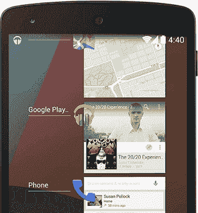

# 安卓 KitKat 4.4

> 原文：<https://www.javatpoint.com/android-kitkat>

**安卓“KitKat”**是安卓操作系统的第四大版本，也是第十一次更新。安卓 KitKat 是 4.4 版本。2013 年 9 月 3 日公开上映。它的主要重点是优化操作系统，从而提高早期设备的性能。它在安卓设备上占用高达 512 兆内存。之前版本的[安卓](https://www.javatpoint.com/android-tutorial)操作系统占用了更多的内存，这与许多旧的设备型号不兼容。

## 安卓 KitKat 历史

安卓 4.4“KitKat”于 2013 年 9 月 3 日正式发布。安卓 KitKat 最初在代号为“ **Key 莱姆派**下工作。安卓全球合作伙伴关系**主任约翰·拉格林**和他的团队决定放弃“关键酸橙派”这个名字，因为后方的人知道它的味道。他的团队将名字从“关键酸橙派”改为“KitKat”。

首款安卓 4.4 KitKat 设备开发为 **LG 电子**于 2013 年 9 月 30 日推出的 **Nexus 5** 。

## 安卓 KitKat 功能

安卓 KitKat 版本有各种各样的功能。其中一些如下:

### 更好的内存管理

安卓 KitKat 的设计也是为了在内存小于或等于 512 兆字节的设备上运行。KitKat 版本改进了内存管理，这一改进也有望带来更流畅的多任务处理。

### 平台

引入了一个新的安卓运行时环境，被称为*安卓运行时(ART)* 来代替*达尔维克虚拟机。*安卓运行时是一个跨平台运行时，支持 32 位和 64 位环境下的 ARM 和 MIPS 架构。

### 只要说“好的谷歌”

使用“确定谷歌”功能，你不需要触摸屏幕来执行任何任务。只需在主屏幕上说“OK Google”，即可启动语音搜索、发送文本、播放歌曲，甚至获得方向。

### Swift 多任务处理

安卓 4.4 KitKat 通过优化内存管理将系统性能提升至历史最高水平，并与之前版本相比改进了触摸屏。与以前相比，它具有更快的响应时间和更高的准确性。这意味着你可以一边听音乐一边浏览网页。

### 未来在召唤

新的手机应用程序会根据你最常联系的人优先考虑你的联系人。你也可以搜索企业或附近的地方，你的联系人。

### 到处都是表情符号

有一个表情符号，在这个词有时不能表达的地方，用丰富多彩的日语字符来表达自己。这个表情符号现在也可以在谷歌键盘上找到。

### 在旅途中打印

谷歌通过在安卓 4.4 中直接创建对谷歌云打印的支持，提供了一种打印手机照片或文档的简单方法。这提供了通过蓝牙或无线网络打印文档和照片的功能。

### 内置传感器

安卓 4.4 KitKat 为复合传感器增加了两个新的支持:**步进检测器**和**步进计数器**。这将允许健身应用开发者无需编写复杂的算法和代码就能访问**计步器数据**。搭载兼容设备的安卓 4.4*非常适合训练和健身目的*。

### 锁屏艺术

安卓 4.4 KitKat 允许用户通过 Chromecast 访问音乐或流媒体电影。届时，您设备的锁定屏幕将显示完整的专辑或电影艺术。锁定屏幕提供对音乐播放、暂停和搜索的直接控制，所有功能都来自锁定屏幕。

安卓 4.4 KitKat 有干净的功能和用户界面。它还支持近场通信协议。安卓 4.4 KitKat 包含一个触摸屏操作按钮，取代了以前版本安卓设备上的物理按钮要求。

* * *