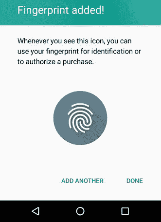

# 安卓棉花糖

> 原文：<https://www.javatpoint.com/android-marshmallow>

**安卓“棉花糖”**(安卓 6.0)是安卓操作系统的第六大版本。在开发过程中，它的代号为**安卓 M.** 这是安卓的第 13 个版本。其首个测试版于 2015 年 5 月 28 日发布，正式发布于 2015 年 10 月 5 日，搭载 Nexus 设备。

棉花糖的主要重点是改善整体用户体验。它引入了新的权限架构、减少后台活动的新电源管理系统、用于上下文助手的新 API、用于本地支持的指纹识别。

## 安卓棉花糖历史

安卓棉花糖最初代号为**“澳洲坚果饼干”。**开发者预览版构建代号为安卓“M”，于 2015 年 5 月 28 日在谷歌 I/O 发布，最初在 Nexus 5 和 Nexus 6 智能手机、Nexus 9 平板电脑和 Nexus Player 机顶盒中更新。

第二次开发者预览发布于 2015 年 7 月 9 日，第三次也是最后一次预览发布于 2015 年 8 月 17 日，宣布安卓 M 将被称为安卓“棉花糖”。安卓棉花糖的最终版本于 2015 年 10 月 5 日发布，针对 Nexus 5、6、7 和 9。

## 安卓棉花糖功能

继安卓棒棒糖之后，安卓棉花糖又增加了几个新功能。下面提到了其中的一些:

### 锁定屏幕略有变化

屏幕锁类似于棒棒糖。这里只有一个小小的改变，就是在底角用相机快捷方式代替拨号器。谷歌已经决定用语音命令取代拨号器应用。

### 通知区域

谷歌总是试图改善通知区；即使有一点，也意味着这里肯定有一些变化。

用一根手指向下滑动一次，您会看到您当前的通知，可以展开或访问。再次向下滑动，您将显示快速设置菜单。

### 打盹模式-更长的电池寿命

打瞌睡模式的引入是为了帮助失望的用户长时间不使用手机，而不用一直充电。打盹模式通过在较长时间不活动时让手机进入深度睡眠来延长待机电池寿命。

### 本机指纹支持

谷歌发布了指纹应用编程接口，让开发者可以利用我们的手机进行生物认证。这意味着指纹识别器更适合解锁设备，并且它提供了与用户的安全连接。

### app 权限

在安卓 6.0 之前，下载一个应用意味着我们必须接受所有应用的许可。有些许可是不合理和不必要的。有了安卓 6.0 棉花糖，你可以下载任何应用，并选择你允许它访问的权限。

### 内存管理器

谷歌在“内存”设置中增加了一个新的部分，设备会向你显示一个应用程序使用了多少内存。如果有任何应用程序出现问题，您可以采取必要的措施。

### 通用串行总线类型 C 和通用串行总线 3.1 支持

USB type C 允许各种交互，例如数据传输、充电、附件连接等等。由于 USB 3.1，它具有更快的速度和存储连接。你不需要考虑它的上下两面。

### directshare

棉花糖启用了一个新的共享功能，称为直接共享。此功能会记住您共享的内容以及您在哪个应用程序中共享的内容。在持续分享的同时，它会推荐那些你通常用来交流的人。这是一件小事，但如果你和同样的人分享，可以节省很多时间。

* * *