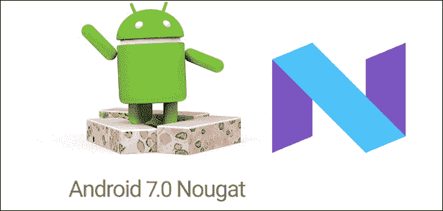
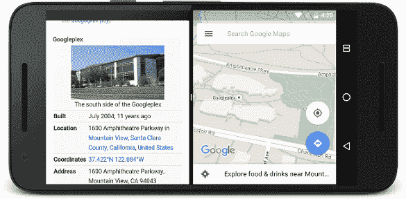
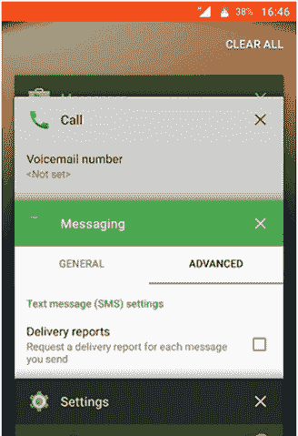
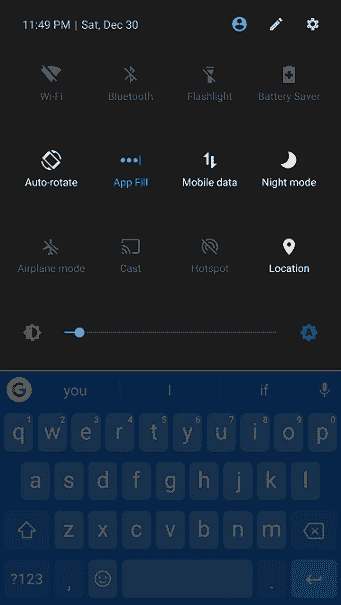
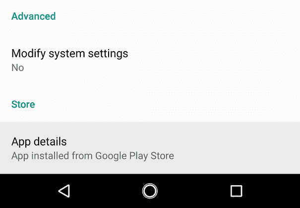
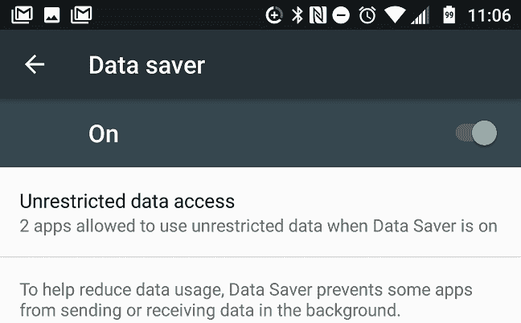

# 安卓努加

> 哎哎哎:# t0]https://www . javatppoint . com/Android-nougat

**安卓“牛轧糖”**是安卓操作系统第七个大版本和第十四个大变化。这个版本在开发过程中代号为**安卓 N** 。其首个 alpha 测试版于 2016 年 3 月 9 日发布，2016 年 8 月 22 日正式发布。 **LG V20** 是首款搭载牛轧糖发布的设备。

安卓牛轧糖对开发平台及其操作系统带来了显著的变化。它在分屏视图中同时在屏幕上显示多个应用程序。它还支持通知的内联回复，并扩展了“打瞌睡”节能模式。

## 安卓牛轧糖的历史

最初，安卓牛轧糖的代号是“纽约芝士蛋糕”。谷歌于 2016 年 3 月 9 日发布了安卓“N”的首个 alpha 版本。开发者预览版仅兼容当前的谷歌 Nexus 设备，如 5X、6P、6、9、像素 C 和 Nexus Player。

安卓“N”Beta 预览版 2 于 2016 年 4 月 13 日发布。Beta Preview 3 于 2016 年 5 月 18 日发布，它引入了一个名为**白日梦的全新**虚拟现实**平台。**2016 年 6 月 15 日，Beta Preview 4 发布，谷歌宣布将 N 的版本命名为“牛轧糖”。牛轧糖将是安卓 7.0 版本。

测试版预览版 5 于 2016 年 7 月 18 日发布。安卓 7.0 于 2016 年 8 月 22 日正式发布，搭载 Nexus 6、5X、6P、9、Nexus Player、Pixel C 都是安卓牛轧糖的首批设备。

## 安卓牛轧糖的特点

安卓牛轧糖增加了几个新功能。其中一些是:

*   分屏镀铬
*   清除多任务处理中的所有应用程序
*   第三方快速设置
*   应用安装源
*   快速应用切换
*   数据保护程序

### 分屏镀铬

安卓 7.0 提供了将屏幕分成两个标签的功能。Chrome 浏览器方便您同时在屏幕上运行两个不同的选项卡。要在分屏中运行两个不同的网页，请打开 Chrome，并确保打开列表中的两个选项卡。要启动分屏模式，您需要长按安卓概述按钮。

### 清除多任务处理中的所有应用程序

有时您需要在概览屏幕中从头开始；您需要关闭所有打开的应用程序。安卓 7.0 在所有设备的概览列表中都有一个“全部清除”选项。

### 第三方快速设置

所有运行安卓 7.0 的手机和平板电脑都有一个定制的快速设置面板。您也可以在任何设备上使用第三方设置。要找到快速设置面板(如果有)，请点击编辑按钮(看起来像铅笔)。

### 应用安装源

谷歌正在逐步阅读你的应用设置界面中的可用信息。牛轧糖增加了一个功能，你可以看到一个应用程序来自哪里:谷歌播放或侧面加载的 APK。

要查找此信息，请转到您的系统设置并选择“应用程序”。从列表中选择任何应用程序，并向下滚动到信息屏幕。它将显示“从谷歌 play 商店安装的应用程序”或“从软件包安装程序安装的应用程序”。

### Swift 应用切换

安卓 7.0 提供了一种新的、更快的在应用程序之间切换的方式。如果您想回到上次打开的应用程序，您不需要在概览屏幕中点击卡片。只需双击概览按钮，您将切换到最后一个应用程序。做同样的事情，你会回到你刚刚离开的应用。

### 数据保护程序

我们大多数人使用移动数据计划；安卓 7.0 增加了一个新功能，帮助你按照计划行事。它的名字是“数据使用”设置菜单下所有牛轧糖手机都有的数据保护程序。它阻止应用程序在后台使用移动数据。只要打开它，唯一活跃的应用程序就会使用移动数据。

* * *