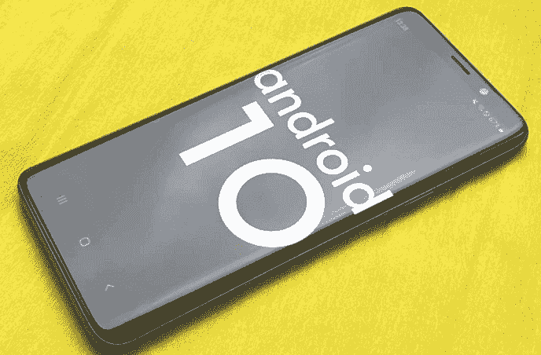

# 安卓 10

> 原文：<https://www.javatpoint.com/android-10>

**安卓 10** 是安卓操作系统的第十大版本，也是第 17 个版本。安卓 10 是以“安卓 Q”为代号开发的。谷歌最初是在 2019 年 3 月 13 日宣布的。安卓 10 的第一个测试版在同一天发布。其第二个测试版于 2019 年 4 月 3 日发布。

**2019 年 9 月 3 日**，稳定版[安卓](https://www.javatpoint.com/android-versions) 10 发布。它包含一些功能，如在后台访问位置的新权限、浮动设置面板、对 AV1 视频编解码器的支持、对生物认证的支持、WPA3 [Wi-Fi](https://www.javatpoint.com/wifi-full-form) 安全性。

## 安卓 10 的特性

安卓 10 版本增加了各种新功能。一些特征如下:

*   改进的文件应用程序
*   通过二维码共享无线网络
*   隐私和安全
*   平台
*   现场字幕
*   智能回复
*   声放大器
*   手势导航
*   黑暗主题
*   位置控制
*   安全更新
*   聚焦模式
*   家庭链接

### 一个改进的文件应用

谷歌以前的文件应用程序不包含填充事件，它在应用程序抽屉里也没有快捷方式。然而，安卓 10 在快捷方式上有一个改进的文件应用程序；它还在顶部提供了一个通用搜索栏，一个反向的 UI，以及快速访问其他应用程序。

### 通过二维码共享无线网络

谷歌采用一项功能，通过二维码分享 Wi-Fi 凭证。这个功能在华为和小米智能手机上已经出现很久了。该功能易于使用；您可以点击 Wi-Fi 连接，然后点击共享按钮。之后，用手机密码或指纹验证无线网络。你会看到一个[二维码](https://www.javatpoint.com/android-qr-code-or-bar-code-scanner)，你朋友的设备需要扫描这个二维码才能实现访问。

### 隐私和安全

安卓 10 中引入了许多重要的隐私和安全变化。当应用程序在前台活动时，用户可以限制应用程序访问该位置。在安卓 10 中，存储访问权限也发生了变化，这就是所谓的“范围存储”。此权限仅允许访问外部存储的文件。

### 平台

安卓 10 支持 WPA3 加密协议技术。这种加密技术为无线网络提供了强加密。同时，安卓 10 还支持双卡双待(DSDS)。第一个 DSDS 最初在像素 3a 和像素 3a XL 上可用。

### 现场字幕

只需轻按一下，实时字幕就会自动为播客、音频消息和视频添加字幕，甚至是您自己录制的内容。实时字幕是使用设备上的[机器学习](https://www.javatpoint.com/machine-learning)创建的，当检测到语音时就会到达。

### 智能回复

在安卓 10 中，你会得到建议的回应，有时甚至更多。您可能还会收到针对它的建议操作。例如，如果你的朋友要求搭车，你的手机会推荐你发短信“”。它还在谷歌地图中显示正确的方向。

### 声放大器

使用声音放大器，安卓 10 手机过滤背景噪音，微调到你听到的最佳效果。插上耳机，你可以听得更清楚，听讲座，看电视。

### 手势导航

安卓 10 有手势导航，比以往更明智、更快捷。您可以向前和向后移动，向上滑动以查看打开的应用程序，并调出主屏幕。所有这些活动都可以超级流畅地进行。

### 黑暗主题

黑暗主题功能被请求了很长时间。最后，安卓 10 增加了黑暗主题。当您启用电池保护选项时，此功能将变为活动状态，或者可以通过快速平铺设置来激活。暗模式也会影响照片、谷歌播客和搜索。黑暗模式当然是安卓 10 最著名的功能之一。

### 隐私控制

使用安卓 10，你可以控制你的隐私。这是因为您获得了一种新的、更智能的控制，使用这种控制，您可以决定何时以及如何共享设备数据。所以，设备完成任务，你将得到休息。

### 安全更新

安卓手机已经定期收到安全更新。然而，在安卓 10 中，在谷歌游戏系统的帮助下，你会更容易、更快地收到它们。更新、隐私修复和重要的安全性可以直接从谷歌游戏发送到你的手机。同样，您的其他应用程序也会获得更新。

### 聚焦模式

聚焦模式是安卓 10 用户面临的突出特点之一。它是数字健康套件的扩展。顾名思义，这种模式通过聚焦和保持应用程序的通知来帮助您弹出分散注意力的应用程序。

### 家庭链接

你甚至可以指导你的孩子在网上玩耍、学习和探索。您必须设置查看应用活动、屏幕时间限制、内容限制和管理应用。你也能看到他们在哪里。

* * *