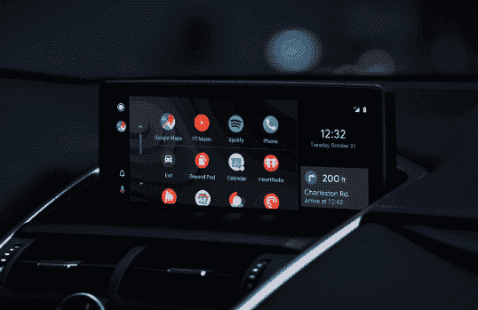
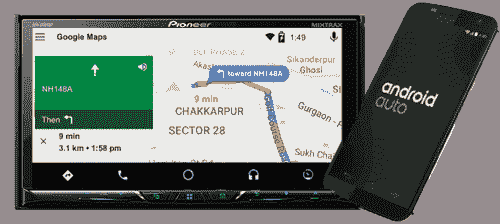
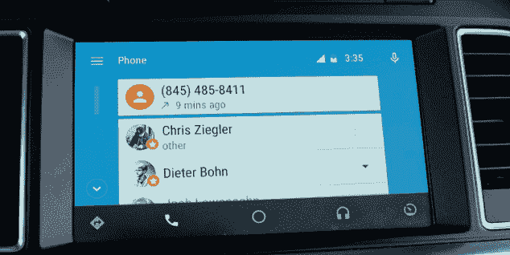

# 安卓汽车

> 原文：<https://www.javatpoint.com/android-auto>

安卓汽车是谷歌开发的安卓移动应用。它可以安装在智能手机上，这个应用程序连接到汽车显示屏上。[安卓汽车应用](https://play.google.com/store/apps/details?id=com.google.android.projection.gearhead&hl=en_IN)可以从谷歌游戏商店下载。现在更有可能是谷歌的简化版。安卓汽车能够打电话、播放存储在我们手机上的音乐、使用谷歌地图，当然，还可以通过 USB 直接向联系人发送消息。

这并不意味着我们的手机界面会出现在汽车的仪表盘屏幕上。电话和消息会传过来，但其他通知完全隐藏在后台。甚至我们在断开手机之前也听不到新的 WhatsApp 消息。

## 历史

*   25 日【2014 年 6 月，谷歌 I/O 首次亮相 Android Auto。
*   19 日【2015 年 3 月，谷歌发布安卓 Auth。
*   2016 年 11 月，谷歌增加了一个在普通安卓设备上运行安卓自动的选项。
*   2019 年 7 月，安卓汽车收到了第一个用其他变化返工的主要用户界面。谷歌还宣布，手机上使用的应用程序将停止使用，取而代之的是谷歌助手的驾驶模式。

## 有效

自 2019 年 5 月起，安卓汽车在 36 个县上市。系统上应用程序的可用性各不相同。

## 安卓汽车是做什么的？

安卓自动在一个熟悉的界面上显示信息，这是一个易于使用的界面，有滑动方式、清晰的菜单和大图标。

安卓汽车最好的部分之一是谷歌地图导航系统。它给出一步一步的方向，如果检测到交通拥挤，它会找到备用路线。

我们也可以说“OK，谷歌，什么是安卓汽车”，或者“OK，谷歌，玩后代”，或者“OK，谷歌什么是印度的首都”。通过语音命令，我们可以使用语音转文本技术回复信息。即使我们的汽车没有配备语音识别技术，它也能工作，并且安卓汽车的功能可以通过您汽车上的触摸屏访问。

### 谷歌地图

安卓汽车使用全球定位系统以最准确的方式显示到达目的地的交通路线。它经常给出我们下一步可能想去的地方，并且由于最新的交通信息，它也给出了更好的路线选择。

### 电话

安卓汽车通过谷歌拨号器提供安全呼叫。安卓自动菜单包括我们手机上列出的最近通话。它还能够触摸“拨打一个号码”来联系经常联系的人以外的人。这款手机应用在左上角有一个“humburger 按钮”，有更多语音邮件、快速拨号和未接来电的选项。

### 信息

安卓自动将收到的消息显示为屏幕顶部的通知，类似于我们的安卓手机。我们可以点击通知阅读我们的信息，点击 X 退出。当我们听完信息后，我们可以点击麦克风图标并说“回复”来决定我们的回应。

## 哪些手机兼容安卓 Auto？

安卓汽车适用于所有运行 5.0(棒棒糖)或更高版本的安卓智能手机。要使用它，我们需要下载免费的安卓汽车应用程序，并使用 USB 电缆将我们的手机与汽车显示器连接起来。

* * *