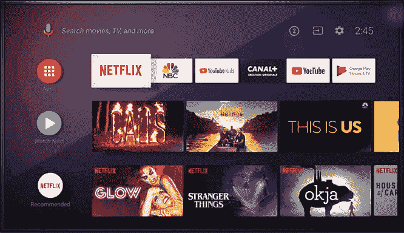
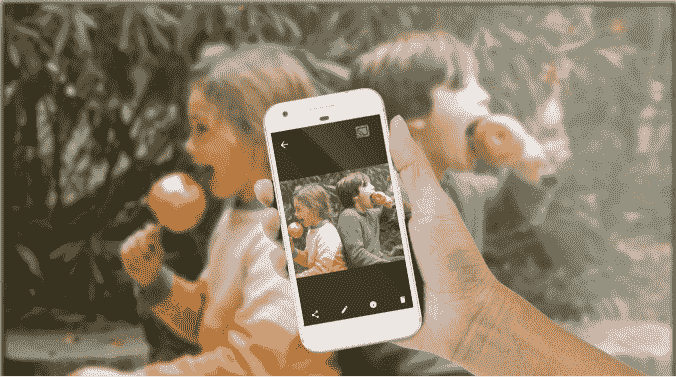

# Android 电视

> 原文：<https://www.javatpoint.com/android-tv>

安卓电视是安卓操作系统的一个版本。它是由谷歌为音棒、机顶盒、数字媒体播放器和带有本地应用程序的电视开发的。它是谷歌电视的替代品。安卓电视平台于 2014 年 6 月首次推出。该平台也被夏普、索尼等公司采用作为智能电视中间件。

## 历史

*   安卓电视于 2014 年 6 月首次在谷歌 I/O 宣布，作为不成功的谷歌电视的继任者。
*   谷歌披露了第一款安卓电视设备，名为 Nexus Player，由华硕在 2014 年 10 月的一次硬件活动中开发。
*   一款 ADT-2 的发布时间早于安卓电视 9.0 的发布时间。
*   安卓电视和 ADT-3 都是在 2019 年 12 月 10 日一起发布的。

## 特征

安卓电视平台是安卓操作系统对机顶盒的改编。它在**智能电视硬件**上集成了软件。安卓电视方便了命令的语音输入和跨多种服务的通用搜索。安卓电视还支持来自“T2”谷歌 Play 商店的软件，包括媒体应用和游戏(然而，并非所有的谷歌游戏应用都与安卓电视兼容)。

安卓电视的一些主要功能如下:

*   通过遥控器进行语音搜索
*   本地谷歌演员支持
*   第一排精选的内容
*   使用顶级应用程序进行通用搜索
*   吨和游戏通过谷歌 Play 商店
*   谷歌助手集成
*   男女演员简介

## 谷歌助手内置安卓电视

在安卓电视中，谷歌助手也集成了视觉响应。我们可以直接说“Ok Google”或者按下 mic 键瞬间找到最新大片，调暗灯光，或者查看大游戏的评分，所有这些都是在不离开你正在看的东西的情况下进行的。

安卓电视平台也在机顶盒中，内置于全尺寸电视中。这个平台上流行的机顶盒包括小米 Mi Box s、英伟达 Shield 电视。

## Chromecast 内置安卓电视

使用安卓电视，我们可以将音乐、视频、照片和其他我们喜欢的内容从我们最喜欢的设备直接播放到电视上。

## 使用安卓电视的产品

### 英伟达盾牌(2017)

英伟达盾是安卓电视用户的最佳选择。它可以玩很多我们在其他流媒体设备上找不到的游戏。它具有以下特点:

*   谷歌助手/家庭集成
*   4K·HDR 流媒体
*   安卓平台上的亚马逊即时视频

### 索尼布拉瓦智能电视

索尼一直在使用安卓电视平台为其中端和高端电视提供智能功能。拥有安卓电视意味着我们拥有数百款游戏、信息、音乐和视频流媒体应用，包括网飞、Youtube 和亚马逊平台。

*   非常适合 4K·HDR 流媒体
*   不系统但优雅的设计
*   最好的电视之一

### 索尼第一频道和 OLED 电视台

索尼 A1E 有机发光二极管是一款绝对的影像电视。它具有最好的对比度，并以完全创新的方式处理声音。

*   快速响应的用户界面
*   绚丽的画质
*   宽视角
*   它相对昂贵

* * *