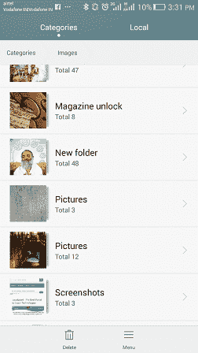

# Android 屏幕截图

> 噻:[https://www . javatppoint . com/Android 屏幕截图](https://www.javatpoint.com/android-screenshot)

有时候你需要给你的安卓手机截图。每个安卓手机都有不同的功能，尽管安卓 4 推出了简单的截图，所有人都可以同时按下电源和音量键。一些手机引入了新的方法。

在本教程中，您将学习捕捉、共享和保存截图的各种方法。

## 谷歌手机

*   **像素:**同时按住电源和调低音量按钮几秒钟。
*   **Nexus:** 同时按住电源和音量降低按钮几秒钟。

## HTC 手机

*   **HTC U12+:** 按住电源键直到手机震动，然后在导航条上点击虚拟主页按钮，同时仍然按下电源键。
*   **HTC U 系列(最高 U12+):** 按住电源和音量降低按钮几秒钟。
*   **HTC 10:** 按住电源和音量降低按钮几秒钟或按住主页和电源按钮。
*   **其他 HTC 手机:**按住电源和调低音量按钮几秒钟。

## 三星手机

*   **Galaxy S8 及更高版本:**按住电源和调低音量按钮几秒钟。
*   **Galaxy S7 及更早版本:**按住主页和电源按钮几秒钟。

## 宏碁手机

*   按住电源和调低音量按钮几秒钟。
*   滑动通知面板，进入快速设置，然后点击屏幕截图图标。

## 华硕手机

*   按住电源和调低音量按钮几秒钟。
*   滑动通知面板，进入快速设置，点击屏幕截图图标。

## 摩托罗拉电话公司

*   按住电源和调低音量按钮几秒钟。

## 一加电话公司

*   **OnePlus 5、5T 和 6:** 在主屏幕上向下滑动三个手指。
*   **所有一加手机:**按住电源和调低音量按钮几秒钟。

## 华为和荣耀手机

*   按住电源和调低音量按钮几秒钟。
*   滑动通知面板，转到快捷方式，并点击屏幕截图图标。

## 联想（电脑的品牌名）

*   按住电源和调低音量按钮几秒钟。
*   向下滑动通知面板，并点击屏幕截图图标。

## LG 手机

*   **LG G7:** 按住电源和调低音量按钮几秒钟。
*   **其他 LG 手机:**向下滑动通知面板，点击**验证码+** 图标。

## 索尼手机

*   按住电源和调低音量按钮几秒钟。
*   按住电源键，直到屏幕出现，然后点击屏幕截图。

## 中兴手机

按住电源和调低音量按钮几秒钟。

  

## 保存并共享

截图后，您可以在通知面板中创建截图的快捷方式。轻按它，您将能够编辑或共享它。

## 如果你运行的是安卓 2.3 及以下版本

安卓 2.3 及以下版本的手机没有内置截图功能。然而，一些设备(许多三星手机)具有这些功能，但因手机而异。

如果你的手机没有内置截图，你需要使用像无根截图这样的第三方应用。在您的手机上安装此应用程序，并在您的电脑上安装其免费配套应用程序。这将启用截图。

* * *