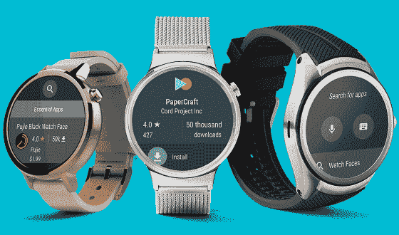

# 安卓手表:最适合你的安卓手机的安卓智能手表(2020)

> 原文：<https://www.javatpoint.com/android-watch>

在本文中，我们将描述连接到您的安卓手机的特定设备(手表)的列表。安卓智能手表的类别有运动蒂森、菲特比特和穿戴操作系统。

下面我们将介绍一些最新安卓手表的几个功能。每块手表都有很好的设计、显示、健身潜力、价格等等。

## 三星银河手表

三星 Galaxy Watch 于 2018 年下半年发布。它是连接到你的安卓手机的智能手表。它运行在蒂森操作系统上。它可以舒适地与安卓设备配合使用，并为您提供了许多可供选择的应用。它有一个健身跟踪系统和一个好看的设计，适合日常穿着。

Galaxy 手表有两种不同的尺寸，比如 46 毫米或 42 毫米，这意味着它适合大多数手腕尺寸。

**功能**

*   **Os:** 输入 Os
*   **显示:** 1.2 英寸或 1.3 英寸 360 x 360 超大 AMOLED
*   **处理器:**双核 1.15GHz
*   **条带尺寸:**22 毫米或 20 毫米
*   **板载存储:** 4GB
*   **电池持续时间:**46 毫米 4 天/42 毫米以下
*   **充电方式:**无线
*   **IP 等级:** 50m
*   **连接:** Wi-Fi、蓝牙

**优点**

*   令人印象深刻的电池寿命
*   有用的旋转挡板

cons

*   烦人的充电器

## 三星 Galaxy Watch Active 2

“三星 Galaxy Watch Active 2”是原“三星 Galaxy Watch”的更新。这款更新的机型拥有更好的设计、出色的电池续航时间和数字触控边框，而这是之前所没有的。

与银河手表相比，这款智能手表更适合锻炼和健身跟踪。它还有剩余的功能来实现你设定的目标。它还防水，适合游泳，处理通知好，电池寿命长。

**功能**

*   **OS:** 输入 OS
*   **兼容性:**安卓、iOS
*   **显示:** 1.2 英寸或 1.4 英寸 360 x 360 超大 AMOLED
*   **处理器:**双核 1.15GHz
*   **条带尺寸:**20 毫米
*   **板载存储:** 4GB
*   **电池持续时间:**约 2 天
*   **充电方式:**无线
*   **IP 等级:** 50m
*   **连接:** Wi-Fi、蓝牙

**优点**

*   出色的表现
*   两天电池续航时间

cons

*   比上一代更贵
*   有限的第三方应用

## 化石运动

化石运动轻巧舒适，适合各种体验。它以健身为目的，配有全球定位系统，并包括精确的心率监测。

它有一个运动的焦点和设计，感觉很高级。它内置最新的高通骁龙穿戴 3100 芯片组。

**功能**

*   **OS:** 穿 OS
*   **显示器:** 1.2 英寸 390 x 390 AMOLED
*   **处理器:**四核 1.2 GHz
*   **表带尺寸:**22 毫米表带
*   **板载存储:** 4GB
*   **电池持续时间:**两天
*   **收费方式:**自营
*   **IP 等级:** IP68
*   **连接:** Wi-Fi、蓝牙、GPS

**优点**

*   轻量化设计
*   强力手表

cons

*   缺乏高端功能
*   全球定位系统可能很慢

## TicWatch E2(电子监控)

TicWatch E2 来自中国厂商 Mobvoi。这并不是第一代手表的巨大进步。它有一些奇妙的特点，包括它的价格。

它有两天的电池寿命和所有其他功能的磨损操作系统，价格低廉。

**功能**

*   **OS:** 穿 OS
*   **显示:** 1.39 英寸 400 x 400 有机发光二极管
*   **处理器:**骁龙穿戴 2100
*   **板载存储:** 4GB
*   **电池持续时间:**约 48 小时
*   **充电方式:**磁连接针
*   **IP 等级:** IP67
*   **连接:** Wi-Fi，蓝牙 4.1

**优点**

*   实惠的价格
*   轻松延长两天电池寿命

cons

*   没有用于支付的 NFC
*   品牌设计

## TicWatch Pro(美国通讯公司)

TicWatch Pro 的价格略高于上面的“TicWatch E2”。它有两个显示屏。其中一个显示屏允许您进入低电量模式，即使电池几乎没电，也能保持基本功能运行。在它上面有一个普通的穿戴操作系统，每隔几天就会打开所有的功能并充电。

**功能**

*   **OS:** 穿 OS
*   **显示器:** 1.4 英寸 400 x 400 有机发光二极管，搭配液晶屏
*   **处理器:**高通骁龙穿戴 2100
*   **板载存储:** 4GB
*   **电池持续时间:**最长 48 小时，基本模式下额外 5 天
*   **充电方式:**磁连接针
*   **IP 等级:** IP68
*   **连接:** Wi-Fi、蓝牙 4.1、NFC

**优点**

*   创新的屏幕技术
*   高级设计

cons

*   受限应用
*   没有长期演进功能

* * *