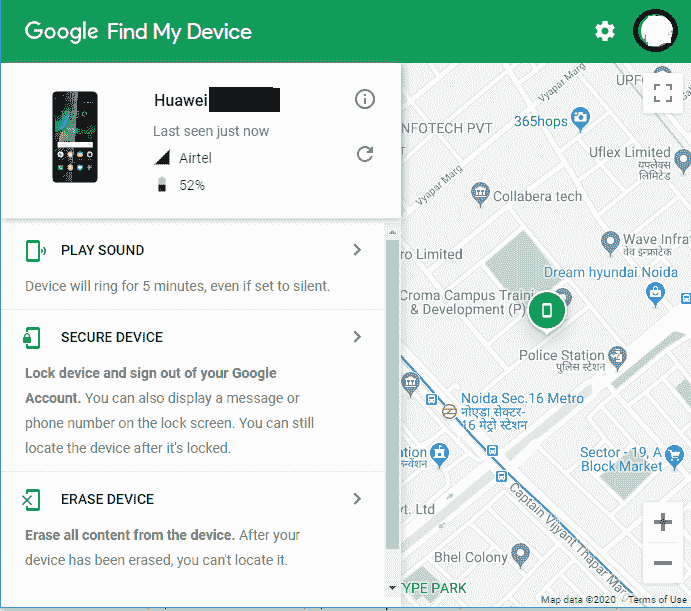
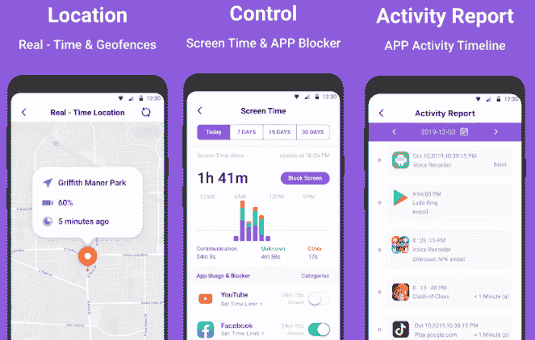
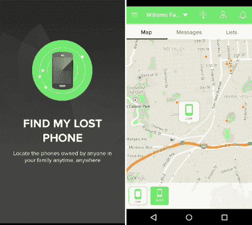
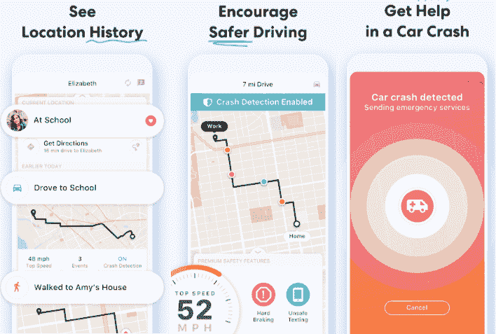
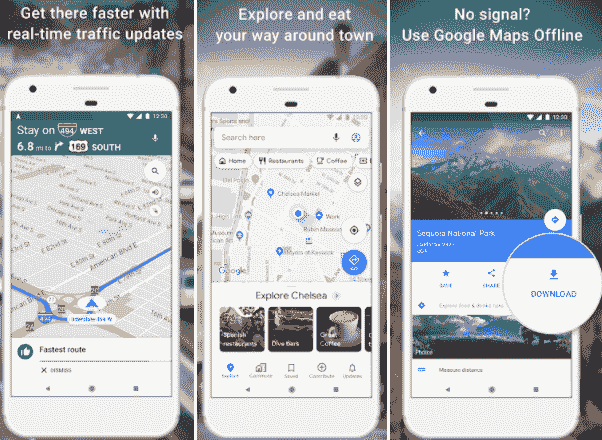
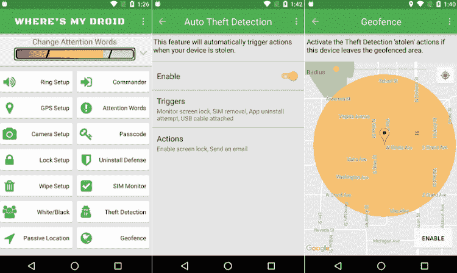

# 安卓找到我的手机(设备)

> 原文：<https://www.javatpoint.com/android-find-my-phone>

丢失或丢失手机，尤其是智能手机，会给你的大脑带来很大的压力。这是因为我们的智能手机保存了大量重要、隐私和敏感的信息。

如果你是安卓手机用户，谷歌 Play 商店和第三方有几个工具可以帮助你在手机丢失时找到手机位置。在这里，我们将讨论一些用户友好的资源，当设备打开并连接到互联网时，这些资源可用于查找丢失和被盗的设备。

我们强烈防止和阻止使用电话追踪器跟踪周围的人或任何非法活动。

如果你曾经丢失了你的安卓智能手机，并在寻找一个关于如何再次找回它的解决方案。下面给出了一些工具或应用来查找或跟踪你的[安卓](https://www.javatpoint.com/android-tutorial)手机。

## 谷歌的“查找我的设备”

谷歌提供了查找、锁定或删除你丢失的安卓手机或平板电脑或穿戴操作系统手表的功能。如果您在丢失的设备上添加了谷歌帐户，“查找我的设备”会自动打开。

要查找、锁定或擦除安卓手机，必须:

*   打开
*   登录谷歌帐户
*   连接到移动数据或无线网络
*   在谷歌游戏上可见
*   位置已打开
*   查找我的设备已打开

## 远程查找、锁定或擦除

1.前往[android.com/find](https://www.google.com/android/find)登录您的谷歌账户。

*   这将在谷歌查找我的设备页面显示你的手机(设备)。

*   如果您有多部手机，请单击屏幕顶部的丢失手机显示屏。
*   如果您丢失的设备上有多个用户配置文件，请使用主配置文件上的谷歌帐户登录。

2.丢失的手机会收到通知。

3.在地图上，你会得到电话在哪里的信息。

*   定位位置是近似的，可能不准确。
*   如果找不到您的手机，您将看到它的最后一个已知位置(如果有)。

4.选择您要执行的操作。

*   **播放声音:**点击“**播放声音**”选项，以最大音量响铃 5 分钟。即使设置为静音或振动，手机也会响起。
*   **锁定:**点击“**安全设备**”使用您的个人识别码、模式或密码锁定您的手机。如果你没有锁，你可以设置它。您可以在锁定屏幕上添加消息或电话号码，这将有助于某人将其退回。
*   **擦除:**点击“**擦除设备**，将永久删除手机上的所有数据(可能不会删除 SD 卡)。擦除设备后，“查找我的设备”将无法在手机上工作。

#### 注意:如果您在擦除后找到您的手机(设备)，您将需要您的谷歌帐户密码才能再次使用它。

其他一些安卓手机追踪应用和工具如下。使用它，您可以轻松跟踪您的智能手机。

## 如何追踪安卓手机

*   故障安全位置跟踪
*   找到我的 iphone
*   家庭定位器和全球定位系统跟踪器
*   谷歌地图
*   我的机器人在哪里

### 故障安全位置跟踪

**Famisafe 位置跟踪**是一款屏幕时间家长控制应用，提供了高精度跟踪设备位置的功能。除了位置追踪，它还屏蔽成人游戏&视频，过滤网站，检测可疑的照片和文本等。这款应用对于担心安全并想关注孩子的父母来说也很有用。使用此应用程序，您可以跟踪孩子的当前位置和位置历史时间线。您甚至可以为您的孩子创建一个安全区域，当他们破坏您计划的区域时，您将收到警报通知。

**功能**

*   它还充当应用程序拦截器，并显示应用程序使用报告。
*   它提供了高精度跟踪设备实时位置的功能。
*   它检测可疑内容。
*   提供网页过滤功能并限制屏幕时间。

**优点**

*   Secrecy 会安装该应用程序，并在后台运行，而在设备上不可见。
*   这是一款针对安卓的免费追踪应用。
*   这款应用支持所有安卓智能手机，包括平板电脑。

cons

*   设备持续运行可能会产生额外的热量。
*   可能会比平时更快耗尽设备电池。

下载安卓的[家庭安全位置追踪](https://play.google.com/store/apps/details?id=com.wondershare.famisafe)

### 找到我的 iphone

**寻找我的手机**是一款针对安卓的位置追踪应用，可以追踪你丢失的智能手机并保持连接。这也使得对你所爱的人和联系人的监控变得简单。“查找我的手机”应用程序使用全球定位系统功能来跟踪智能手机。您可以添加您的家庭成员、朋友和联系人，这样您就可以随时看到他们在哪里。

**功能**

*   该应用程序提供了一个功能，可以通过朋友的方向找到他们的位置。
*   使用此应用程序，您可以随时查看朋友的位置。

**优点**

*   它适用于各种网络或信号载体。
*   它将很容易找到你的电话和你的联系人。
*   该应用显示高度准确的位置，是评级较高的位置跟踪应用之一。
*   该应用程序可以免费下载、安装和使用。

cons

*   与其他应用程序相比，它不包含大量功能。
*   与运行在 6.0 以下操作系统上的安卓设备不兼容。

下载安卓版[查找我的手机](https://play.google.com/store/apps/details?id=com.fsp.android.phonetracker)

### 家庭定位器和全球定位系统跟踪器

**家庭定位器& GPS 追踪器**是一款基于家庭的 [GPS](https://www.javatpoint.com/gps-full-form) 追踪应用，通过添加名为**圈**的家庭成员和朋友的电话号码，您可以创建自己的私人群组。这款应用简化了生活，让你在数字世界中与你所爱的人和关心你的人保持联系变得容易。你可以看到你的圈成员的实时位置(不用发短信“你在哪里？”)在私人家庭地图上也和他们聊天。

每个圈子成员都可以看到对方的位置历史，并设置实时到达和离开警报。该应用程序还显示丢失或被盗智能手机的位置。这款应用可以在 iPhones 和安卓智能手机上运行。安装应用程序并邀请您的家人和联系人。一旦用户注册，每个成员在导航地图上都有一个独特的图标。

**功能**

*   它包括一个全球定位系统，可以定位您的手机和您的家人/朋友的电话位置。
*   方便监控你的亲人，也防止小偷获取你的信息。
*   允许设置自定义文本提醒，以便在有人到达目的地时收到通知。

**优点**

*   这款应用程序非常适合家庭使用。
*   这是免费的，易于使用的简单设置的安卓手机。
*   兼容 iOS 和安卓设备。
*   应用程序设置允许准确快速地显示位置。

cons

*   该应用程序不能被隐藏或应用“删除锁定”以防止人们卸载它。
*   与其他跟踪应用程序相比，此应用程序可能更贵。

下载适用于安卓系统的[家庭定位器&全球定位系统跟踪器](https://play.google.com/store/apps/details?id=com.life360.android.safetymapd)

### 谷歌地图

**谷歌地图**是全球使用最广泛的导航地图服务之一。该应用程序使用[全球定位系统](https://www.javatpoint.com/global-positioning-systems)服务来导航实时位置、交通和探索当地。用户还可以与其他人共享他们的实时位置。谷歌地图应用程序和谷歌帐户使跟踪安卓智能手机和监控您和他人的设备位置变得容易。它的离线地图提供了无需互联网连接即可搜索和导航的功能。它是安卓设备上领先的跟踪应用之一。

**功能**

*   该应用程序允许使用您的谷歌帐户添加您的朋友、家人和联系人。
*   可以看到朋友或联系人的实时 GPS 位置。
*   它还包括谷歌地图中所有可用的功能。

**优点**

*   这个应用是完全免费的，也是无广告的。
*   通过谷歌帐户签名很容易使用。
*   提供准确的位置信息，包括位置历史记录。
*   它包含导航和方向服务的内置功能。

cons

*   人们可以随时隐藏自己的位置。
*   它不包括隐形模式。

下载安卓版[谷歌地图导航](https://play.google.com/store/apps/details?id=com.google.android.apps.maps)

### 我的机器人在哪里

**我的机器人在哪里**是一款完整的防盗应用，可以帮助你追踪丢失或被盗的安卓手机。它可以让你丢失的手机以高音量响起。如果你不在手机附近，听不到铃声，它还会将全球定位系统坐标与谷歌地图联系起来。该应用程序还提供了短信命令功能来锁定您的设备并获取其全球定位系统位置。通过锁定您的手机，您将感到安全，小偷无法访问您手机上的数据。该应用的免费版本允许振铃、锁定、擦拭、跟踪电话位置和全球定位系统闪光。但它的专业版包括更多功能，如运动报警、拍照、访问位置历史等。

**功能**

*   它包括使用短信命令的全球定位系统跟踪功能。
*   它允许您响铃、锁定和擦拭设备。
*   它给出了位置、历史、联系人等。
*   这款应用程序可以根据指令拍照。

下载适用于安卓系统的[我的机器人](https://play.google.com/store/apps/details?id=com.alienmanfc6.wheresmyandroid)应用

* * *