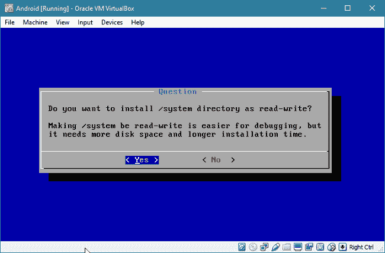

# 安卓 x86(在 PC 上运行安卓应用)

> 原文：<https://www.javatpoint.com/android-x86>

安卓已经成为最受移动设备欢迎的操作系统。然而，桌面操作系统，如苹果电脑、Linux 或视窗，本身并不支持安卓应用。在本文中，我们将学习一种使用安卓-x86 和 VirtualBox 在您的计算机上运行安卓应用程序的替代方法。

**Android-x86** 是一个开源项目，提供谷歌 Android 操作系统的非官方安装，在 AMD 和英特尔 x86 处理器供电的设备上运行。该操作系统基于安卓开源项目(AOSP)。逆境智商

您需要遵循几个步骤才能在使用安卓-x86 的电脑上运行安卓应用程序。

## 第一步:先决条件

**安装 VirtualBox**

VirtualBox 是一个程序，可以帮助你在现有的操作系统上运行不同的操作系统，比如 Mac、Linux 或 Windows。由于安卓-x86 是一个成熟的操作系统，您应该安装 VirtualBox，以便您可以在现有操作系统的同时使用安卓-x86。

[下载 VirtualBox](https://www.virtualbox.org/wiki/Downloads) 并安装在电脑上。

**下载安卓-x86**

Download the ISO file of Android-x86 from this [link](http://www.android-x86.org/download). It comes in both 32-bit (x86) and 64-bit (x64) variant. In this article, we are going to use the **android-x86-6.0-r1.iso** file.

## 步骤 2:设置虚拟机

现在，在 VirtualBox 内部创建一个虚拟机(VM)。打开你的虚拟盒子，点击“新建”图标。您将看到一个对话框，询问虚拟机的详细信息。为它提供一个名称(在我们的例子中是“安卓”)，并使用以下设置:

*   **操作系统类型:** Linux
*   **操作系统版本:** Linux 2.6/3.x/4.x (32 位)
*   **内存大小:** 1024 MB
*   **硬盘:**硬盘设置，选择“立即创建虚拟硬盘”，选择“动态分配”硬盘文件。

你会发现一个名为“安卓”的新虚拟机已经创建。

## 第三步:安装安卓-x86

双击虚拟机(打开电源)，它会要求从一个 ISO 文件启动。选择你下载的安卓-x86 ISO 文件。

如果没有显示此选项，请在虚拟机开始启动时按 F12。然后，右键单击状态栏中的光盘图标，添加一个国际标准化组织文件。然后，按屏幕上显示的键从光盘启动(在我们的情况下，键是“c”)。

当虚拟机启动时，通过向上/向下箭头键选择安装选项，然后按“回车”继续。

现在，您需要创建一个分区来安装 Android。选择“创建/修改分区”选项。

您将看到一个基于文本的分区编辑工具。使用左/右箭头键选择“新建”选项，然后按回车键。然后，选择“主要”选项并点击输入。系统会询问您分区的大小。

因为您在分区中安装了操作系统，所以请将其设置为可引导。选择“可引导”选项，然后按回车键。最后，它看起来像:

选择“写入”选项保存您的更改。你必须输入“是”来确认。最后，您可以使用“退出”选项退出分区编辑器。

现在，选择安卓-x86 应该安装的分区。默认值看起来不错，所以按回车键。

选择“ext4”文件系统，然后选择“是”格式化磁盘。

选择“是”安装引导加载程序 GRUB。之后，选择“否”跳过安装 EFI 版本的 GRUB，因为我们不需要它。

选择“是”以读写方式安装/系统分区。

等待几分钟以完成安装。完成后，右键单击状态栏中的光盘图标，并选择“从虚拟驱动器中删除磁盘”。选择“重新启动”，然后按回车键。如果不这样做，最终将再次从 ISO 启动，而不是从硬盘启动。

重启完成后，安卓系统会像平板电脑或普通智能手机一样向你询问初始设置。

## 第 4 步:初始设置

在尝试设置安卓系统时，你可能会发现一些奇怪的地方。有时你可能会发现鼠标指针没有出现。要解决这个问题，您必须从“输入”菜单中禁用鼠标集成。

当你禁用它时，点击 VirtualBox 窗口使用鼠标。

如果您的屏幕太小，无法显示完整的安卓屏幕，请按下 Ctrl + F 以全屏显示。您可以再次按下右 Ctrl + F 退出全屏。您也可以通过按下右 Ctrl + C 来使用“缩放模式”

您可以通过登录谷歌帐户来完成设置。您可能会在安装过程中收到警告，说没有 WI-Fi 连接；你可以安全地跳过它。

成功完成安装后，您将被移至主屏幕。

现在，你可以安装来自谷歌 Play 商店的应用程序并在网上冲浪。

* * *