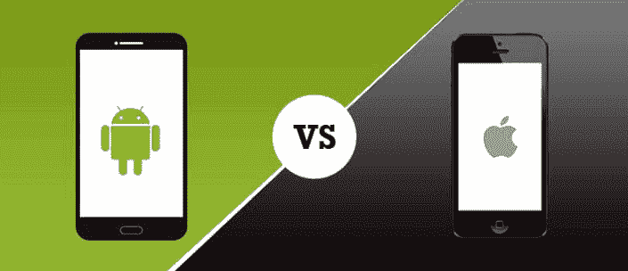

# 安卓与 iPhone

> 原文：<https://www.javatpoint.com/android-vs-iphone>

安卓和 iPhone 哪个更适合你，这是一个复杂的问题。因为这两种操作系统都涵盖了如此多的领域和许多需要探索的特性。无论如何，安卓和 iOS 执行大部分相同的任务，而且大多数也是以相同的方式。

## 安卓与 iPhone:基本

谷歌开发了安卓系统。它在其 Pixel 手机上提供自己的 Pixel 品味版，其他如三星、华为、LG 等。在自己的硬件上添加了自己的皮肤。

iOS 是苹果用于 iPhone、iPad 和 iPod touch 的移动操作系统。它是与硬件一起进化的，所以苹果不必担心让代码适合来自十几家不同制造商的数百种不同设备。

总之，两者非常相似。两者都可以让你拍照、发消息、打电话，并运行数百个应用程序与朋友聊天、看电影、管理日历、阅读新闻等。

还有很多其他问题被用来区分安卓和 iPhone，比如小部件或者通知。不过，还有一些其他关键的区别，我们将在这里看到。

## 安卓与 iPhone:硬件

安卓在硬件方面最大的优势之一就是你会有这么多不同的手机可以选择。像素 3，三星 Galaxy 系列，华为 P30 Pro。如果你选择安卓，那么你会得到很多适合你业务的制造商和型号。

有了 iPhone 和 iOS，你会得到一个可以一分为二的范围。一方面，有 iPhone 7 和 8 带有传统的 home 键。另一方面，你会得到更贵的 iPhone XR、X、XS、XS Max、11、11 pro 和 11 max pro。

## 安卓与 iPhone:特点

正如我们之前讨论的，安卓和 iOS 之间的大多数功能都是相同的。总的来说，它们之间有一些关键的区别。

安卓更可定制；例如，如果你不喜欢默认的网页浏览器，短信 app，你可以更改它。您可以在图标行中留下空白。你完全可以用一个启动器应用程序来改造安卓，而苹果的 iPhone 却做不到这一点。

iOS 和 iPhone 提供了更加精致和安全的体验。他们没有安卓有时(不总是)会有的任何安全问题。

## 安卓与 iPhone:应用

你可以在安卓和苹果手机上找到当今最受欢迎的应用。在一个平台上运行而不在另一个平台上运行的软件主要部分并不多。

许多新应用(或应用更新)通常会首先到达 iOS，尤其是游戏。最近的一个例子是阿尔托的奥德赛。你可能要等一会儿安卓。

## 安卓与 iPhone:电池续航时间

早期的 iPhone 需要每天给电池充电。最近的型号可以一天不充电地运行新版本的操作系统，这往往会缩短电池寿命。

由于硬件制造商的选择更多，安卓系统的电池寿命更复杂。一些安卓机型有 7 英寸显示屏和其他可以延长电池寿命的功能。

得益于安卓机型的广泛，还有超高容量电池等其他功能。因此，如果我们谈论电池寿命，安卓可以提供一种比 iPhone 单次充电工作时间更长的设备。

## 安卓与 iPhone:智能助手

接下来的特性和功能将由人工智能和语音界面驱动。在这种背景下，安卓有明显的领先优势。

谷歌助手是安卓上最优秀的人工智能助手，功能极其强大。谷歌助手使用谷歌知道的关于你的一切，它让你的生活更轻松。例如，如果你的谷歌日历知道你的会议安排在 10:00，流量很糟糕，谷歌助手可以发送通知，告诉你早点离开。

Siri 是苹果的人工智能，并且随着每次新的 iOS 发布都在不断改进。Siri 仍然局限于相当简单的任务，没有提供谷歌助手的高级智能。谷歌助手也适用于 iPhone。

## 安卓和 iOS:对比图

|  | 机器人 | ios |
| **显影剂** | 谷歌，开放手机联盟 | 苹果公司。 |
| **初始释放** | 2008 年 9 月 23 日 | 2007 年 7 月 29 日 |
| **第一版** | 它有安卓 1.0，阿尔法 | 它有 iPhone OS 1，之前被命名为 iOS |
| **最新稳定发布和更新** | 安卓 10(2019 年 9 月 3 日) | iOS 13.2.3 和 iPAd 13 . 2 . 3(2019 年 11 月 18 日) |
| **工作状态** | 目前的 | 目前的 |
| **源型号** | 安卓有开源 | 它有封闭的、开源的组件。 |
| **文件传输** | 使用 USB 端口和安卓文件传输桌面应用。照片也可以通过 USB 传输，无需应用程序。比 iOS 容易。 | 媒体文件使用 iTunes 桌面应用程序传输。照片可以通过 USB 传输，无需应用程序。与安卓相比，这很难。 |
| **\小部件** | 是的，除了锁屏 | 不，除了在通知中心 |
| **互联网浏览** | 谷歌 Chrome(也有其他浏览器)。 | Safari 默认(其他浏览器可用，但不是默认) |
| **地图** | 谷歌地图 | 苹果地图 |
| **可用语言** | 100 多种语言 | 34 种语言 |
| **视频聊天** | 谷歌双核心和其他第三方应用 | FaceTime(苹果设备)和其他 3 个第三方应用 |
| **语音指令** | 谷歌助手 | iPhone4S 上的语音控制功能 |
| **在**上可用 | 很多手机和平板电脑。三星、Honor、Vivo、Oppo、一加、小米等主要厂商。安卓一号设备是纯安卓。 | iPhone、iPad、iPod Tuch、苹果电视(第 2 代和第 3 代第 3 代 |
| **通话和信息传递** | 谷歌消息。3 第三派对应用像 WhatsApp、Facebook Messenger、Google Duo、Skype 都在安卓和 iOS 上运行。 | FaceTime，iMessage。3 第三派对应用像谷歌 Hangouts、WhatsApp、Facebook Messenger、谷歌 Duo、Skype 都可以在安卓和 iOS 上运行。 |
| **应用商店、可负担性和界面** | 谷歌 Play 商店-包含 100，000 多个应用程序。像 Apptoid 和亚马逊这样的其他应用商店也发布安卓应用。 | 苹果应用商店-包含 100，000 多个应用，包含病毒的应用非常罕见。 |
| **替代应用商店和侧装** | 除了官方的谷歌 Play 商店之外，还有其他几个应用商店(如 Apptoide、Galaxy Apps) | 苹果封锁 3 家第 3 家派对应用商店。 |
| **电池寿命** | 许多安卓手机制造商为他们的设备提供更长寿命的大电池。 | 与安卓电池相比，苹果电池通常没有那么贵。然而，苹果也通过硬件/软件优化提供了不错的电池寿命。 |
| **开源** | 内核、用户界面和一些标准应用程序 | iOS 内核不是开源的，但是基于开源的达尔文 OS。 |
| **照片和视频备份** | 应用程序可以自动备份照片和视频。谷歌照片允许无限备份照片。亚马逊照片、OneDrive 和 Dropbox 是其他选择。 | 使用 iCloud 可自动备份高达 5 GB 的照片和视频。谷歌、Dropbox、亚马逊和微软等其他供应商都有安卓和 iOS 的自动备份应用。 |
| **安全** | 每月安全更新 | 偶尔的安全更新 |
| **云服务** | 与谷歌硬盘存储的本机集成。15GB 免费，100GB 美元/月，1TB 10 美元。 | 与 iCloud 的本机集成。5GB 免费，50GB 美元/月，200GB 美元/月。 |
| **界面** | 触摸屏 | 触摸屏 |
| **生物认证** | 指纹和/或面部认证可用，具体取决于硬件制造商。 | iPad (Air 2 及更高版本)和 iPhone (5s 及更高版本)上提供指纹或面部认证。 |

* * *