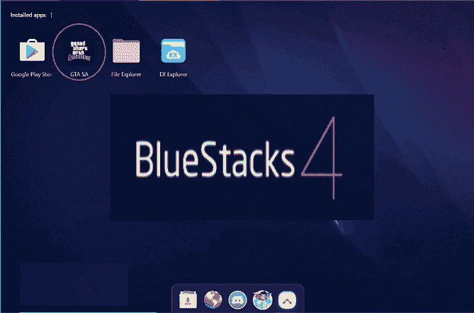
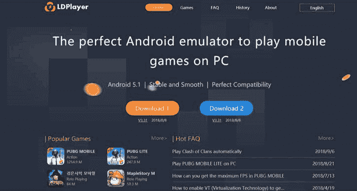

# 个人电脑安卓模拟器

> 原文：<https://www.javatpoint.com/android-emulator-for-pc>

有人想在电脑上运行安卓模拟器有各种各样的原因。应用程序开发人员要求在发布之前测试他们的应用程序。在 PC 上运行安卓仿真器是可能的，我们将讨论最适合 PC 的安卓仿真器。

安卓有各种各样的安卓模拟器，我们将讨论其中的一些:

*   [安卓工作室的模拟器](#Studio)
*   [执政官](#ARChon)
*   [布里斯 OS](#BlissOS)
*   [最蓝的背包](#Bluestacks)
*   游戏循环
*   [元宵节](#Genymotion)
*   [Ko 玩家](#KoPlayer)
*   [LDPlayer](#LDPlayer)
*   [模因](#MEmu)
*   [氮氧化物](#Nox)
*   [凤凰 OS](#PhoenixOS)
*   质数
*   [Remix OS 播放器](#RemixOS)
*   [Xamarin](#Xamarin)
*   [YouWave](#YouWave)
*   [打造自己的](#Build)

## 谁用仿真器？

[安卓模拟器](https://www.javatpoint.com/android-emulator)主要有三种用途。第一个最常见的用例是应用程序开发。安卓应用和游戏开发者喜欢在发布前在许多设备上测试他们的应用和游戏。主要是安卓工作室的模拟器适合它。然而，Genymotion 和 Xamarin 也非常适合这种用途。

模拟器的第二个最常见的用途是游戏。游戏玩家在他们的电脑上使用模拟器，使一些游戏更容易玩。gamming 最好的[安卓](https://www.javatpoint.com/android-tutorial)模拟器是 Bluestacks、KoPlayer、MeMu 和 Nox。

最后也是最主要的类型是生产力。这并不常见，因为 Chromebooks 使用安卓应用程序更好，更便宜，而不是手机，大多数生产力工具都是跨平台的。

## 安卓工作室的模拟器

[安卓工作室](https://www.javatpoint.com/android-studio)是安卓应用的默认开发平台。它附带了一系列工具，帮助开发人员专门为安卓设备制作应用和游戏。它还提供了一个内置仿真器，用来测试你的应用程序需要几分钟才能启动。但是，开发人员使用这个工具来和游戏。安卓工作室模拟器的设置相当复杂，它测试他们的应用程序。这也支持 Kotlin，对于开发人员来说非常优秀。

### 最低系统要求

*   Windows、Linux 或 Mac
*   能够运行 32 位应用程序的 64 位分布
*   3 GB 伽姆
*   2 GB 硬盘空间
*   最低分辨率需要为 1280 x 800

## 统治者

ARChon 不是一个常见的模拟器。您需要将其安装为谷歌 Chrome 扩展。安装后，它提供了 Chrome 运行安卓应用和游戏的能力。你必须为 Chrome 安装一个模拟器。然后，获取 APKs 文件并将其载入。这个模拟器的积极意义在于，它可以与任何操作系统(Windows、Linux、Mac OS 等)一起工作。)，它可以是 Chrome 的一个实例。

## 布莉丝

极乐 [OS](https://www.javatpoint.com/os-tutorial) 与其他略有不同。它是一个使用虚拟机的安卓电脑模拟器。作为一个虚拟机，安装过程变得很容易，但如果你以前从未制作过自己的虚拟机，那就很无聊了。但是，它将通过 u 盘在您的计算机上顺利运行。USB 的安装方式比较复杂，但它让你的电脑实际上从开机就在原生运行 Android。

## 蓝背包

BlueStacks 是所有安卓模拟器中最受欢迎的模拟器。这有很多原因。它兼容 Mac 和 Windows。它仍然会定期更新，并且运行良好。这个模拟器是移动游戏玩家的目标。它是最重的模拟器之一。它有许多特点，使它变得更好更坏。**blustacks 4**的速度较之前版本提升了 6-8 倍，是各大手机的速度。蓝星 4 的最新更新运行在 64 位[版本的安卓](https://www.javatpoint.com/android-history-and-versions) 7.1.2 上，提高了性能和内存使用效率。

### 最低系统要求

*   Windows 7 及以上版本
*   英特尔或 AMD 处理器
*   2 GB 内存
*   5 GB 磁盘空间
*   您必须是旅游电脑的管理员
*   微软或芯片组供应商提供的最新图形驱动程序

## 游戏大观

GameLoop 是一款面向游戏玩家的安卓模拟器。此前被称为**腾讯游戏好友**。模拟器安装简单，游戏运行良好。然而，这个模拟器对于生产力和开发测试来说并不好。这绝对是一个相当不错的游戏模拟器，并且它拥有大量较新的游戏。键盘控制和性能都不错。

### 最低系统要求

*   Windows 7 及以上版本
*   中央处理器:英特尔双核| AMD @ 1.8 千兆赫
*   GPU:基本英伟达 GeForce | AMD 镭龙
*   3 GB RAM
*   2 GP 的可用存储空间

## 精灵尘！精灵尘！精灵尘！精灵尘！精灵尘！精灵尘！精灵尘！精灵尘！精灵尘！精灵尘！精灵尘！精灵尘！精灵尘！精灵尘！精灵尘！精灵尘

开发人员主要使用 Genymotion 仿真器。它提供了在不同设备上测试应用程序的工具，而无需拥有它们。您可以为各种不同版本的安卓设备配置仿真器，以满足您的需求。它不适合客户使用，但 Genymotion 免费提供其服务供个人使用。它可以在你的电脑和云上使用。

## 暴风影音

KOPlayer 是一款安卓游戏模拟器，专注于用轻量级软件提供免费的游戏体验。由于免费，你可能会到处看到一些广告。它支持键盘映射和游戏手柄模拟。这个安卓模拟器的负面影响是它有时会突然冻结。另外，这个模拟器有点小问题，让用户很难安装安卓模拟器。

### 最低系统要求

*   Windows 7 或以上版本
*   英特尔中央处理器的双核 AMD
*   显卡-支持 OpenGL 2.1 的 GPU
*   10 GB 的可用磁盘空间
*   2 GB 内存

## 地板玩家

LDPlayer 也是另一款安卓模拟器，主要是游戏玩家使用。它主要包含面向玩家的功能，包括键盘映射控件，并支持最新的游戏。它每个月都会得到最新的动态。它还支持一系列其他游戏，包括黑沙漠移动，争吵之星，部落冲突，PUBG 移动，以及更多。它的最新更新修复了导致《使命召唤:手机》崩溃的错误。然而，这是一个极好的坚实的体验。

## 梅姆

MEmu 是另一个安卓模拟器，是游戏玩家非常熟悉的。最突出的特点之一是它同时支持 AMD 和英特尔芯片组。大部分开发者特别关注 AMD 的平台。它大部分类似于 BlueStacks 和类似的模拟器。它最近的更新增加了智能密钥映射以及通常的性能改进和错误修复。

### 最低系统要求

*   Windows XP/7/8/8.1/10
*   英特尔、英伟达或 AMD 处理器
*   带有 OpenGL 2.0 或 Windows DirectX 11 的图形驱动程序
*   硬件虚拟化技术应在 BIOS 中启用
*   最小 2GB 系统内存
*   最小 2GB 硬盘可用空间

## 诺克斯(希腊神话中的夜之女神)

Nox 是另一款运行在 PC 上的安卓游戏模拟器。它包括一些常见的任务，比如用键盘进行按键映射，按键映射手势控制的能力，甚至实际的控制器支持。它很有趣，而且似乎大部分时间都在工作。

### 最低系统要求

*   Windows XP/7/8/8.1/10 和 DirectX 9.0C
*   AMD、英特尔或双核
*   OpenGL 2.0 及以上版本
*   1.5 GB RAM
*   硬盘上 2.5 GB 的可用空间

## 凤凰城 OS

凤凰操作系统是较新的安卓模拟器之一，它拥有游戏玩家体验。它提供了类似桌面的体验，因此对于工作效率也很有效。它有谷歌游戏服务；然而，更新这些服务有时会有点烦人。凤凰操作系统也运行[安卓牛轧糖](https://www.javatpoint.com/android-nougat) (7.1)，对于安卓模拟器来说，这是相对现代的。

## PrimeOS

PrimeOS 实际上不是仿真器。它的安装需要在你的电脑上安装一个分区，并且它可以运行原生的安卓系统。它提供了玩家体验，您可以充分利用这一点来提高工作效率。它支持鼠标和键盘，可以访问大多数安卓游戏和应用。它提供多任务处理功能、玩游戏或观看您选择的视频。

## Remix OS 播放器

Remix 操作系统播放器是较新的安卓电脑模拟器之一。它运行安卓棉花糖。它的安装过程和使用相当容易。它主要为游戏玩家提供设施。它包含玩家功能以及可定制的工具栏。它可以同时运行多个游戏。也就是说，它是一个相当干净的模拟器，因此完全可以用作一个生产工具。

### 最低系统要求

*   2 GHz 双核处理器或更好
*   2 GB 系统内存
*   至少 8 GB 的可用硬盘空间
*   有更新的图形吗

## 沙马林

[Xamarin](https://www.javatpoint.com/xamarin) 是一个类似于 Android Studio 的集成开发环境(IDE)。不同的是，它可以插入到一个更大的开发环境中，比如微软的 Visual Studio。它还带有一个用于应用程序或游戏测试的内置仿真器。只建议开发人员使用。对于常规消费使用来说，它的设置相当繁琐。Xamarin 仿真器可以根据您的需要进行配置。个人使用是免费的，公司和其他大型团队可能需要协商支付计划。

## YouWave

YouWave 是较早的安卓 PC 模拟器之一。它的免费版用的是冰淇淋三明治，付费版则是[棒棒糖版](https://www.javatpoint.com/android-lollipop)。它的安装相当容易。它不包含任何类似游戏的功能，但它仍然可以玩游戏，这使得它非常适合轻度游戏和生产力。我们在相当长的时间内没有发现任何有意义的更新，所以棒棒糖版本已经严重过时了。

### 最低系统要求

*   Windows XP/Vista/7/8/10 版
*   英特尔奔腾 1.6 GHz CPU
*   2 GB RAM
*   500 兆磁盘空间

## 打造自己的

您甚至可以构建自己的仿真器。你需要从链接 virtualbox.org/wiki/Downloads.下载 VirtualBox 然后，你需要从 Android-x86.org 下载一个图像。从那里，找到许多在线指南中的一个，并按照步骤操作。这是最困难的方法之一，但仍然没有像 Xamarin 或 Android Studio 那样建立一个完整的 IDE 那么困难。

* * *