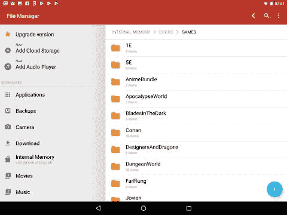

# 安卓文件管理器

> 原文：<https://www.javatpoint.com/android-file-manager>

安卓允许每个用户使用文件管理器访问他们设备的文件系统。他们可以访问安卓文件，并在电脑和智能手机或平板电脑之间传输。这是通过简单地在安卓设备上插入一根 USB 电缆并启动你的桌面文件管理器来实现的。安卓的文件管理应用程序作为设备上软件的重要组成部分做出反应。它提供了浏览文件、管理存储空间、下载、移动文件和许多其他活动的工具。然而，几家[安卓设备](https://www.javatpoint.com/android-device-manager)制造商在其设备上提供了预安装的安卓文件管理器应用程序。与其他第三方文件管理器相比，预安装文件管理器包含的功能更少。

在这里，我们将讨论一些最好的安卓文件管理器。

#### 注意:下面给出的列表不是按照他们的表现顺序排列的；它只是最好的文件浏览器的汇编。你可以根据自己的需要来选择。

## 一些最好的安卓文件管理器:

1.  文件转到(免费)
2.  Mixplorer 银饰(4.79 美元)
3.  Astro 云和文件管理器(免费)
4.  固体探索者(免费试用后 1.99 美元)
5.  磁盘使用(空闲)
6.  文件指挥官(免费，应用内购买)
7.  OI 文件管理器
8.  摩托文件管理器
9.  文件夹同步(免费)
10.  文件专家(免费)
11.  幽灵指挥官(免费)
12.  文件管理器(免费)
13.  惊奇文件管理器(免费)
14.  Tetra Filer(免费)
15.  文件管理器+(免费)
16.  根浏览器(3.99 美元)
17.  总指挥官(免费)
18.  华硕文件管理器(免费)
19.  X-plore 文件管理器(免费)
20.  文件资源管理器(免费)

### 文件转到

文件 Go 文件管理器是谷歌的产品，它的行为不太像文件管理器应用程序，而更像是一个设备助手。此文件管理器通过删除很少使用的应用程序、文件、文档、大容量媒体和文件夹，帮助您管理设备的存储空间。它还提供了缓存清除功能，允许您根据文件的类别查看文件。文件转到支持本地加密文件共享和备份功能，提供了将文件发送到云的工具。

### 混合银

MiXplorer Silver 现在在这个时代有一个强大的文件管理器，但是它最近被放在了 Google Play 商店的高级版本中。这个版本将 MiXplorer 与几个高级插件(如 Mix 存档、tagger 和元数据)结合在一起。它支持多种存档格式，包括 RAR 和 ZIP。MiXplorer Silver 包含一个内置的媒体播放器和图像查看器。它支持网络存储设备和基于云的存储设备。

### Astro 云和文件管理器

ASTRO 文件管理器是安卓文件管理的另一个重要且流行的选择。该文件管理器在一个包中包含云和本地存储管理组件。它为您提供管理您的内部和 SD 卡存储空间。使用 Astro Cloud 文件管理器，您可以在诸如 One Drive、Dropbox 和 Google Drive 等云服务之间移动文件和媒体。它的左侧抽屉包含方便的快捷方式，如云服务和网络存储、书签位置以及媒体文件的快捷方式。除了文件管理功能之外，这个应用还包含一个应用管理器、SD 卡使用空间快速查看器和一个任务杀手。

### 固体探险家

这是一个很有吸引力的文件管理应用程序，它提供了安卓手机和平板电脑上的双面板用户界面。它还支持像 TAR、RAR 和 ZIP 这样的存档文件，以及索引搜索功能。除了一个令人印象深刻的特性之外，Solid Explorer 还支持一系列插件，这些插件添加了新的特性，例如 [FTP](https://www.javatpoint.com/ftp-full-form) 服务器插件、 [USB](https://www.javatpoint.com/usb-full-form) OTG 支持等等。它有两个独立的资源管理器窗格，这两个窗格结合了拖放支持，可以将文件从一个位置复制和移动到另一个位置。

### DiskUsage(磁盘用法)

DiskUsage 不是一个真正完整的文件管理器应用程序；但是，它仍然是一个有吸引力的工具，可以帮助您管理文件系统。这有助于您立即找到设备中占用更多存储空间的文件和文件夹。它作为一个单独的工具来查看和删除文件夹。

### 文件指挥官

文件指挥官是一个优秀的文件管理器，提供额外的功能和应用内购买实用程序。该应用的主屏幕不是打开文件和目录视图，而是为用户提供一系列分类“库”，如文档、音频和视频。该文件管理器还支持远程访问、文件共享和云存储。它包含应用内购买的附加工具。

### OI 文件管理器

OI 文件管理器是一个开源文件管理器，允许您浏览外部设备存储、创建目录、重命名等。该应用程序为文件管理提供了广泛的基础功能，如剪切、复制和粘贴操作。它提供了使用书签和 ZIP 压缩对文件夹的简单访问。它还提供您通过电子邮件服务发送文件。

### 摩托文件管理器

Moto 文件管理器应用程序附带摩托罗拉的手机，也可以从谷歌 Play 商店下载。它既提供了经典的文件夹导航，提供了易于使用的体验，也提供了图片、音频、文档和其他流行文件类型的单独视图。该文件管理器提供基本的文件管理功能，如剪切、复制和粘贴，以及压缩和提取压缩文件。它还包含一些附加功能，如一键将设备的所有照片和媒体文件传输到外部存储 SD 卡。Moto 文件管理器提供远程控制功能，您可以通过该功能从个人电脑远程管理安卓设备文件。

### 文件夹同步

FolderSync 文件管理器附带了基本的文件管理功能。FolderSync 文件管理器的主要目标是确保用户经常使用的文件在他们的安卓设备和云存储选项之间保持同步。文件夹同步文件管理器的用户可以轻松地从各种存储提供商(如 OneDrive、Dropbox 和 Google Drive)备份和同步他们的文件和文件夹。该文件管理器还支持多种文件传输协议。

### 文件专家

除了涵盖[安卓](https://www.javatpoint.com/android-tutorial)文件管理，基础功能是传输和删除文件和文件夹，File Expert 有自己流行的云存储服务，如 DropBox、Google Drive。它还包括对 FTP、WebDAV、SMB 的网络支持。

### 幽灵指挥官

幽灵指挥官是一个受总指挥官启发的文件管理工具。《幽灵指挥官》将其对双窗格导航系统的澄清引入了安卓智能手机和平板电脑。它允许您使用物理按钮快速访问各种功能。这款应用包括 FTP 支持；控件是为左撇子用户和根功能配置的。它包括各种添加额外功能的插件，例如云存储和 WebDAV 支持。

### 文件管理器

文件管理器是另一个安卓文件管理应用，具有谷歌材料设计的迷人风格。文件管理器为安卓智能手机和平板电脑提供了全面的文件管理功能。该文件管理器以干净的单窗格视图和侧边文件夹的形式出现。这个文件管理器为你的文件夹和快捷方式提供书签图片，截图，音乐和电影文件夹以及你的下载文件。用户可以复制、删除、重命名、共享和搜索他们的文件。文件管理器包含内置的媒体画廊和云存储，支持 OneDrive 和 Google Drive 等服务。

### 惊奇文件管理器

惊奇文件管理器是一个开源的应用程序，它有一个吸引人的外观，给人以材料设计的感觉。惊奇文件管理器表现为一个全方位的本地文件管理器。用户可以在网格或列表视图中查看他们的目录和文件。侧抽屉显示常用文件夹，如图片、音乐、电影和下载。此文件管理器的用户可以为他们的文件夹添加书签，并使用侧面抽屉快捷方式查看加载到其内部存储中的所有媒体文件。此文件管理器应用程序支持中小企业和文件传输协议连接。它包括支持 ZIP 文件的额外功能和一个根资源管理器。

### 利乐文件

Tetra Filer 文件管理器以紧凑、图库或详细的视图显示文件和文件夹。Tetra Filer 文件管理器的用户可以为他们经常使用的文件夹添加书签，以便于访问。它还包括一个搜索功能，可以立即找到提到的文件或文件夹。它侧重于本地存储管理，因此这里不包含云存储。如果您正在寻找一个独特而简单的文件管理器来导航您的内部存储，这个文件管理器会很好地为您完成任务。

### 文件管理器+

文件管理器+是一个漂亮的用户界面，各种不同类别的目录均匀分布在其中。这个文件管理器很容易使用，它提供了文件管理器必须具备的所有必要功能。它支持本地和云存储，包括网络连接存储(NAS)。文件管理器+包含一个内置的存储分析器，用于分析哪些文件和文件夹占用了内存中更多的存储空间。

### 根资源管理器

Root Explorer 是一个值得信赖的安卓文件管理器。它允许访问较低级别的文件管理，包括应用程序数据文件夹。它还涵盖了基本的文件管理功能，如复制、剪切、粘贴和删除。根资源管理器内置了对许多归档格式的支持，如 RAR、TAR 和 ZIP 文件。该文件管理器还方便了应用程序管理、云存储管理、文本编辑器和 SQL 数据库查看器功能。

### 总指挥官

Total Commander 提供了用户在文件管理器中可能需要的所有基本功能。它提供了对文件夹和更改权限的高级控制。它包含额外的插件，用于 SFTP 和文件传输协议客户端，局域网，网络访问，等等。Total Commander 文件管理器支持双面板模式窗口，可轻松管理文件。这个应用程序支持各种类型的文件、网络和云存储，以及局域网和文件传输协议支持插件、根功能、书签等等。

### 华硕文件管理器

华硕文件管理器在谷歌 Play 商店适用于所有安卓手机。它是一款 Zen UI 安卓华硕手机的默认文件管理器。它是免费的，但包含广告。它有一个简单的用户界面，因此它变得易于使用，并且文件类别得到了完美的显示。它带有内置的回收站，可以帮助您恢复已删除的文件。华硕文件管理器访问云存储，搜索选项，压缩和提取文件，等等。该文件管理器允许您在其隐藏文件柜中隐藏任何私人文件和目录。

### 文件管理器

文件管理器提供了一个双窗格的文件浏览器界面。它由显示在屏幕中间一列的按钮划分。用户可以同时管理两个窗口。它提供了复制和粘贴文件和文件夹的功能，很容易访问。这个应用是免费的，而且没有广告。这款应用包含网络存储、云存储、根支持、PDF 查看器、应用管理器、ZIP 解压缩器、Auto-ZIP 文件创建器、带字幕的视频播放器等等。文件管理器为网络存储和局域网提供了额外的支持。

### 文件浏览器

文件资源管理器也被称为 FX 文件管理器，它提供了一个很好的浏览用户界面。它从显示文件、书签和其他资源的单窗口开始。可以以拆分视图样式浏览新窗口。它为用户提供了多种功能，如文本编辑器、缩略图查看、无线中小企业共享、回收站和可选的根浏览器插件。

* * *