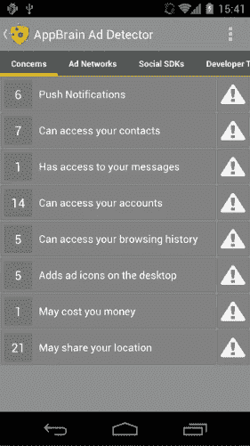
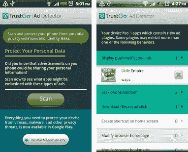

# android adblock

> 原文：<https://www.javatpoint.com/android-ad-blocker>

公司和各种网站都大力发展广告(广告或广告)作为获得销售线索的主要方式。广告在浏览网页、观看视频和玩游戏时显示。大多数产品或服务是在使用应用程序或网站时推送的。弹出广告是为笔记本电脑或台式电脑保留的，但它们也针对智能手机，因为每个人手上都有智能手机。因此，用户的智能手机需要一些好的**广告拦截应用**。

大多数广告拦截应用程序在谷歌游戏商店都不可用。它们可以从任何第三方来源下载和安装。

那么，停止在屏幕上显示广告的最佳安卓广告拦截应用是什么？安装广告拦截器[安卓](https://www.javatpoint.com/android-tutorial)应用将停止在设备上显示广告。

## 顶级安卓广告拦截应用

各种第三方来源甚至谷歌游戏商店都有几个广告拦截应用程序。其中一些如下:

#### 注意:下面提到的广告拦截应用的顺序不是基于它们的性能。这只是一个汇编。所以，根据需求来选择。

### 1.阿德布洛克加

**面向安卓的 Adblock Plus** 是最值得信赖、最好的广告拦截应用之一。它在后台执行，过滤网络流量，就像它的网络浏览器扩展一样。你需要设置一次，它就会在后台自动运行。它适用于有根和无根的安卓设备。

这可以从他们的网站[https://adblockplus.org/](https://adblockplus.org/)或者谷歌游戏商店下载。Chrome 还有一个官方的 **Adblock Plus** 插件和另一个浏览器，安装它，重启 Chrome，享受无广告浏览。

### 2.阿达维

**AdAway** 是一款针对安卓设备的简单广告拦截应用。它利用修改后的主机文件向 12.0.0.1 发送广告请求。，你将看不到广告。这个应用程序是设置了主机文件，击中任何广告，向你的方式与快速改变方向。重定向有效地消除了横幅广告、弹出窗口以及游戏中显示的任何广告。该应用程序支持自定义和修改主机文件。主机文件存储在安卓系统的只读部分。

AdAway 是一款可以从[https://f-droid.org/en/packages/org.adaway/](https://f-droid.org/en/packages/org.adaway/)下载的免费应用，在 Play Store 上没有。

### 3.广告拦截

AdGuard 应用的工作原理与 AdBlock Plus 类似。它在后台运行，过滤所有的网络流量。AdGuard 安卓应用程序声称可以从网络上提炼出整个恶意广告，为您提供优雅且无问题的浏览实践。它需要一些额外的设置和工作没有根。它还有一个好看的“材料设计”用户界面，可以将所有东西整合在一起。它包括提高网页速度、防火墙和恶意软件防护等功能。它有高级版和免费版。你可以从*adguard.com/en/adguard-android/overview.html.*下载 AdGuard 广告拦截器

### 4.封锁这个

**Block 这个**广告拦截 app 是一个有效的、开源的、对用户完全免费的应用。它不是很受欢迎的广告拦截器。这款应用使用的是 DNS 拦截，而不是过滤器。开发商声称[域名系统](https://www.javatpoint.com/dns-full-form)拦截系统比标准的广告拦截器使用更少的电池。这是因为大部分工作是在数据到达你的安卓智能手机之前完成的。你可以从他们 block-this.com 的[网站](https://www.javatpoint.com/website)下载 **Block 这个**安卓应用。

### 5.谷歌浏览器:快速安全(广告拦截器)

**谷歌 Chrome** 浏览器也可以作为广告拦截器。它过滤几个广告流量或至少是最滥用的广告流量。谷歌 Chrome 是一款广告拦截应用；然而，它仍然显示广告，这是最不冒犯观众。还有其他一些网页浏览器可以屏蔽广告，包括火狐分众、勇者浏览器、三星浏览器、奇异果浏览器和海豚浏览器。你可以根据自己的需要来选择。你可以从[https://play.google.com/store/apps/details?下载谷歌浏览器广告拦截器 id=com.android.chrome](https://play.google.com/store/apps/details?id=com.android.chrome) 。

### 6.免费广告拦截器浏览器

免费的**广告拦截器浏览器**是一个很好的选项来拦截设备上的广告。它的图形与普通浏览器不同。它会扼杀任何进入你网站的广告。它扼杀了横幅广告、弹出窗口、视频广告，也阻止了那些试图追踪你脚步的网站。

广告拦截器浏览器涵盖了大多数用户的要求，如自动播放或多云饼干广告设置。该应用及其广告拦截功能可从[谷歌游戏商店](https://play.google.com/store/apps/details?id=com.hsv.freeadblockerbrowser)免费下载。

### 7 . adblocker 浏览器

**安卓设备的广告拦截浏览器**与其他广告拦截应用类似。它自然地屏蔽了所有进入的广告，也为用户提供了一定程度的控制。还有许多其他选项可以帮助您禁用您的隐私以及跟踪、恶意软件域和反广告拦截消息。您可以从[谷歌游戏商店](https://play.google.com/store/apps/details?id=org.adblockplus.browser)下载广告拦截器浏览器应用程序。

### 8.大脑广告检测器

**AppBrain 广告检测器**屏蔽弹出窗口和广告。它的工作功能与其他产品略有不同。它锁定推送通知和垃圾广告，同时检测有害的应用网络。AppBrain Ad Detector 应用程序很容易使用。它有一个“关注”标签，如果有任何伤害向你袭来，它会立即让你看到。你可以从[谷歌游戏商店](https://play.google.com/store/apps/details?id=com.appspot.swisscodemonkeys.detector)下载苹果大脑广告探测器应用。

### 9.信任广告检测器

您是否关注通过应用程序收集您个人数据的移动广告？ **TrustGo Ad Detector** 应用扫描并保护您的安卓设备免受可能的身份泄露和隐私侵犯，这些情况有时会因您的安卓应用上显示的广告而发生。清晰地使用您的安卓设备，以便您的个人信息安全可靠。TrustGo 广告检测器应用程序是一种独特类型的广告拦截器，可保护您的个人信息安全。你可以从*apkmonk.com/app/com.trustgo.addetector/.*下载

### 10.快速 AdBlock

**AdBlock Fast** 是一款广告拦截应用，适用于较老的安卓设备和较老的互联网浏览器。这款广告拦截器最高可达三星互联网 4.0。它被视为领先的广告拦截应用之一。AdBlock Fast 有自己优化的过滤规则集，有助于更快地加载网页。与其他广告拦截器应用程序相比，它消耗更少的内存、 [CPU](https://www.javatpoint.com/cpu-full-form) 周期和磁盘空间。这个应用程序是免费的，安全的，快速的，容易使用的。你可以从[谷歌游戏商店](https://play.google.com/store/apps/details?id=com.rocketshipapps.adblockfast&hl=en)下载 AdBlock Fast 应用。

### 11.Adblock 加三星互联网

**Adblock Plus 三星互联网**让你可以更快地在网络浏览器上冲浪，而且没有广告。这款应用只加载重要信息，避免在浏览器上出现广告，有助于节省电池寿命。它还提供了防跟踪等隐私保护功能。当你去另一个地区旅行时，这个应用程序也会屏蔽特定地区的广告。Adblock Plus 三星提供最好的客户服务和 100%免费。如果你用的是三星手机，那么这款应用绝对适合你。你可以从[谷歌游戏商店](https://play.google.com/store/apps/details?id=com.betafish.adblocksbrowser&hl=en)下载。

### 12.涡轮浏览器

**Turbo Browser** 在浏览器上内置了广告拦截功能。更快地加载网页是很流行的，它可以让你高速下载多个文件。这个应用程序还保存了最大的数据，这样你就可以获得你需要的唯一内容。Turbo Browser 阻止浏览器上的广告，因此与普通浏览器相比，浏览变得更快。

### 13.断开高级虚拟专用网络

**Disconnect Premium** 是安卓设备最好的广告拦截应用之一。它还可以保护您的个人信息，并在使用移动设备上网时阻止广告。它内置了[虚拟专用网](https://www.javatpoint.com/vpn-full-form)(虚拟专用网)，这使得浏览更加安全。虚拟专用网的系统旨在隐藏您的 IP 地址，以便其他来源无法跟踪您。你可以从[谷歌游戏商店](https://play.google.com/store/apps/details?id=me.disconnect.pro&hl=en)下载这个应用。

### Chrome 手机有广告位吗

尽管有几个应用程序承诺在安卓 Chrome 上作为广告拦截器可以正常工作，但是它们可能不会很好地工作。但是你可以选择轻松关闭弹出广告。要禁用 chrome 浏览器上的弹出广告，您必须在安卓上按照以下步骤操作:

1.  在安卓设备上打开你的 Chrome 浏览器应用。
2.  点击地址栏右侧菜单上的三点，向下滚动至**“设置**”。前往**网站设置**。
3.  打开或关闭**弹出窗口下的开关，并重定向**。

* * *