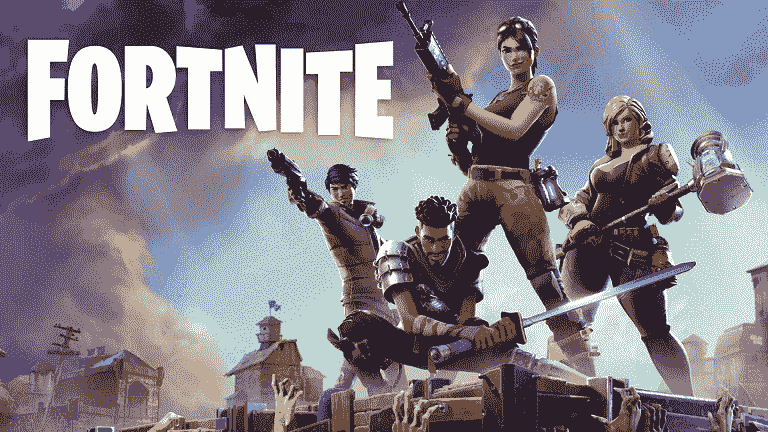

# 堡垒之夜安卓史诗游戏

> 哎哎哎:# t0]https://www . javatppoint . com/fortnite-Android

《堡垒之夜》是史诗游戏玩家现在非常流行的一款皇家战斗游戏。对于各种口袋大小的安卓手机和平板电脑来说，这是全球玩得最多的游戏之一。堡垒之夜游戏有很好的卡通艺术角色，在一个岛上成为最后一个站立的战士。

堡垒之夜安卓游戏大部分看起来像是真的东西。在这里，我们将讨论开始堡垒之夜移动游戏冒险的一步一步的指导方针。

## 手机上的堡垒之夜是什么？

堡垒之夜游戏的控制针对触摸屏进行了优化。它的用户界面在安卓上是不一样的；它带有额外的建筑按钮弹出。它也有一个屏幕上的脚步和射击指示器，以指示任何相邻声音的方向。

## 在安卓系统上下载并安装堡垒之夜

你在谷歌 Play 商店上找不到这个应用。所有玩家都需要在智能手机(安卓设备)上打开一个互联网浏览器，进入网址“**fortnite.com/android**，在那里你会找到堡垒之夜安装程序进行下载。

安装文件 APK 占用高达 2MB 的存储空间；然而，游戏本身需要超过 2GB 的大小。

## 哪些设备将在安卓系统上运行堡垒之夜？

在继续之前，需要检查您的手机是否与安卓系统上的堡垒之夜兼容。由于游戏是为在手机上运行而构建的，旧手机达不到运行游戏所需的性能。

### 堡垒之夜安卓设备公司

| 品牌 | 模型 |
| 谷歌 | 像素/ XL，像素 2/ XL |
| 三星 Galaxy | S9 / S9+、S8 / S8+、S7 / S7 边缘、注释 9、注释 8、标签 S4、标签 S3 |
| 常简称为 HTC 或宏达电 | 10、U Ultra、U11 / U11+、U12+ |
| 索尼 | XZ / Premium、XZ1、XZs / Compact、XZ2 / Premium / Compact、XZ3 经验 |
| OnePlus(一个加一个) | 6、5 / 5T |
| 华硕 | ROG、Zenfone 4 Pro、5Z、v |
| 华为 | 荣誉 10，荣誉玩法，Mate RS，Mate 10 / Pro，Nova 3，P20 / Pro，V10 |
| 小米米 | 5 / 5S / 5S Plus、6 / 6 Plus、Mi 8/ 8 Explorer/ 8SE、Mi Mix、Mi Mix 2、Mi Mix 2S、Mi Note 2 |
| 必要的 | 酸碱度-1 |
| 水平规ˌ水准仪(Level Gauge) | G5、G6、G7 ThinQ、V20、V30/ V30+ |
| 诺基亚（总部设在芬兰） | eight |
| 联想（电脑的品牌名） | Z/ ZDroid 运动、Z2 力运动 |
| 中兴通讯股份有限公司（Zhongxing Telecommunication Equipment Corporation 的缩写） | 7/7s 轴、m 轴、Nubai Z17/Z17s 轴、Nubai Z11 轴 |

堡垒之夜手机游戏对盒子里的整个安卓设备开放。Epic 还建议设备支持启动器，如果它们除了上面提到的设备列表之外还有下面提到的规范:

*   **内存** : 3GB 或更高
*   3GB 的免费板载存储
*   **操作系统**:安卓 8.0(奥利奥)或更高版本，64 位
*   **GPU** 马里-G71 MP20、马里-G72 MP12 或更高、高通肾上腺素 530 或更高

## 为什么史诗游戏不让安卓版本进入游戏商店？

Play Store 是安卓用户安装绝大多数应用的地方。由于 Play Store 上没有 epic 游戏，Epic 可能会失去一些玩家。然而，受欢迎的堡垒之夜游戏玩家并不介意采取一些额外的步骤来获得它在他们的手机上。

此外，通过迫使玩家通过他们的**fortnite.com**网站下载游戏，Epic 不必与谷歌分享任何应用内购买的资金。如果堡垒之夜被放在 Play Store 上，谷歌将收取 30%的费用，就像苹果对 iOS 版本那样。

堡垒之夜游戏在 iOS 上下载了 1 亿次，并从应用内购买中提取了 1.6 亿美元。将堡垒之夜游戏放在谷歌 Play 商店可以证明这是一个明智的商业决策。

Epic 有自己的 Epic 游戏商店，通过自己的数字市场向堡垒之夜等地提供游戏。

* * *