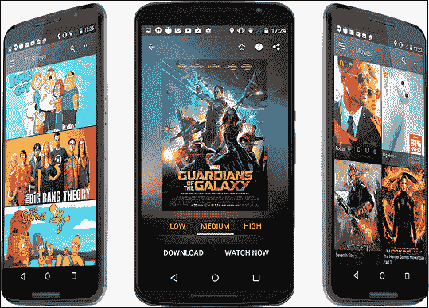

# 安卓展示盒

> 原文：<https://www.javatpoint.com/showbox-for-android>

ShowBox 是最受欢迎的安卓应用之一，你可以在任何地方免费观看体育、新闻、电视节目、电影和卡通。该应用程序可以免费访问无限量的体育、新闻、电视节目和电影以及动画。ShowBox 的官方应用目前在谷歌 Play 商店还没有上市。但是，您可以从任何第三方来源下载此应用程序。你可以从[https://apkpure.com/showbox-app/com.tdo.showbox](https://apkpure.com/showbox-app/com.tdo.showbox)找到最新的 ShowBox 应用。

要了解该应用的更多信息，请浏览完整文章并立即下载，以便在您的安卓设备上欣赏电视节目和电影。在这里，我们将讨论如何设置这个应用程序，以便它在您的安卓设备上工作。ShowBox 提供的不仅仅是看电视剧、电影等。相反，它还提供了免费下载和上传高清电影的设施。

**阅读在安卓设备上下载、安装和播放 ShowBox 的分步说明:**

1.从上面提到的链接下载这个应用程序的最新 APK 文件。

2.转到您的手机**设置>安全>** 并启用**未知来源**(可能因手机而异)以允许您的设备从非谷歌 Play 商店安装应用程序。

3.现在，选择设备上的 ShowBox APK 文件，并单击它来打开和安装应用程序。

4.请等待几秒钟，安装应用程序并将其打开。

5.现在你可以无限制地看电视节目、电影、体育节目。

## ShowBox 应用程序的功能

1.  ShowBox 的 APK 文件更小，更容易安装在安卓设备上。
2.  ShowBox 应用程序提供的所有功能对用户都是免费的。它没有隐藏付款。
3.  它还提供了下载你最喜欢的节目并观看的设施，即使你没有互联网连接。
4.  此应用程序的更新版本还提供了音乐流功能，因此您可以访问无限量的免费音乐。
5.  你也可以把电影、连续剧等剪短。根据他们的头衔和等级。
6.  您可以从外部视频播放器(如 VLC 和其他播放器)观看电影。

## 当您的 ShowBox 不工作时该怎么办

ShowBox 是一款很棒的应用；相反，有时它可能难以运行。如果您在执行过程中遇到问题，请遵循以下步骤:

1.  首先，确保您的设备上安装了最新版本的应用程序。
2.  如果您有最新版本并面临相同的问题，请按照以下步骤操作。
3.  转至您的设备设置。
4.  并找到 ShowBox 应用程序的设置。
5.  转到“存储选项”并清理数据和应用程序缓存。
6.  重新启动您的 ShowBox 应用程序。

## 为什么选择 ShowBox？

选择 ShowBox 应用程序有各种原因。其中一些如下:

*   **无限看电视剧和电影** : ShowBox app 可以让你无限制地看电视剧、电影、新闻。
*   **永远免费** : ShowBox 是一款绝对免费的应用，不收取任何费用。
*   **离线流媒体** : ShowBox app 提供的不仅仅是看电视剧和电影，你还可以从服务器下载文件，无论在哪里都可以观看。
*   **自动更新**:如果你的 ShowBox 应用变旧了，新版本在网上有了，这个应用会自动更新自己。

## 个人电脑展示盒

如果你没有安卓设备，想在个人电脑上使用 ShowBox 应用程序观看免费的电视节目和电影。ShowBox app 也解决了这个问题。

ShowBox 可以在你的个人电脑和使用 Windows 操作系统的笔记本电脑上运行。该应用程序的用户界面类似于安卓设备。

在你的个人电脑中使用 ShowBox 最简单的方法是安卓模拟器。首先，下载一个安卓模拟器，然后在上面下载并安装 ShowBox 应用程序。

### 在电脑上下载和安装 Showbox 的步骤

1.  在您的电脑上下载并安装任何安卓模拟器，如 NOX、Droid4x 或 BlueStack(推荐的 NOX)。
2.  安装后，重新启动计算机以配置模拟器。
3.  打开模拟器，通过你的谷歌帐户登录。
4.  现在，从网站上下载 ShowBox(上面提到的链接)。
5.  在你的安卓模拟器上安装 ShowBox。
6.  现在，您可以在电脑上观看免费的电视节目、电影和连续剧。

## iOS、iPhone 和 iPad 的 ShowBox

如果你有一个 iOS 设备支架，想使用 ShowBox 应用程序观看免费的电影和电视节目，我们有一个解决方案。要在苹果设备上安装 ShowBox，您必须遵循下面提到的说明。在 iOS 设备上安装 ShowBox 有两种最流行的方法。根据你的适合性选择方法。

### 方法 1:使用 iOS 的 vShare 安装 ShowBox 应用程序

1.  首先，您需要安装 vShare 应用程序才能在 iOS 上使用 ShowBox。
2.  在电脑上安装 vShare 后，通过 USB 电缆将手机连接到电脑。
3.  您必须要求越狱才能使用 vShare 没有它，应用程序就无法工作。
4.  安装后，在 vShare 中搜索 ShowBox 应用程序。
5.  安装完成后，ShowBox 应用程序会自动启动。
6.  现在，您可以在 iOS 设备上观看无限数量的电视节目和电影。

### 方法二:使用 IPA 为 iPhone 和 iPad 安装 ShowBox 应用程序

1.  在你的 iOS 设备上下载 ShowBox APK 文件。
2.  现在，打开并点击 IPA ShowBox 文件进行安装。
3.  等待几秒钟以完成安装。
4.  享受 ShowBox 功能。

* * *