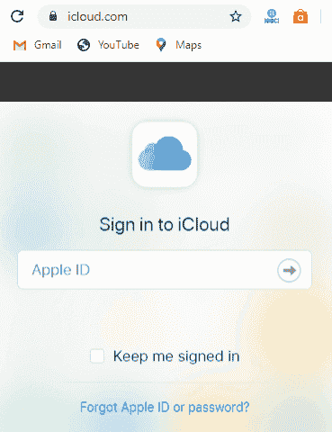
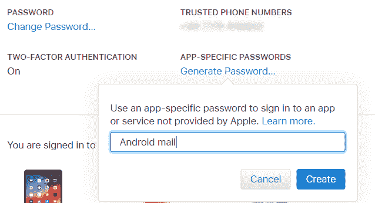
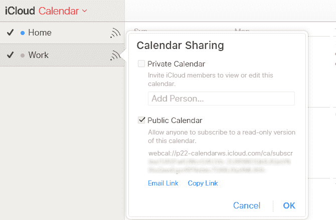

# 安卓如何使用 iCloud

> 原文：<https://www.javatpoint.com/how-to-use-icloud-for-android>

在安卓设备上使用 iCloud 要容易得多。您需要使用现有的苹果身份证登录[iCloud.com](https://www.icloud.com/)或创建一个新账户。登录后，你会发现 iCloud 应用的快捷方式，如笔记、照片、提醒，甚至你会发现 iPhone。您的 iCloud 网络应用程序让您可以管理您的帐户，并查看有多少可用存储空间。

登录 iCloud 帐户后，您可以流畅地查看、上传、下载和共享照片。您也可以像往常一样将照片分组到相册中，隐藏和取消隐藏照片。

## 如何给安卓添加 iCloud 电子邮件地址

在安卓手机上设置 iCloud 电子邮件地址的最简单方法是为 iCloud 电子邮件地址创建特定于应用程序的密码。

### 为您的 iCloud 帐户创建特定于应用程序的密码

1.  在电脑上打开您最喜欢的网络浏览器之一。
2.  访问[applied.apple.com](https://appleid.apple.com)，使用您的苹果 ID 登录。
3.  进入**安全**部分，点击**生成密码。**
4.  输入密码描述。
5.  点击**创建**。
6.  记下生成的**密码**。这个生成的密码需要在你的安卓设备上设置你的 iCloud 电子邮件地址。

### 将您的 iCloud 电子邮件地址添加到您的安卓手机中

1.  进入你的安卓设备**设置**选项，搜索账户。
2.  点击**账户**选项(可能因设备制造商而异)。
3.  点击底部的**添加账户**选项。
4.  点击**个人(IMAP)** 选项，显示一个 Gmail 标志。
5.  输入您的 **iCloud 电子邮件地址**。
6.  点击**下一步**
7.  输入您在网络浏览器上生成的**应用特定密码**。
8.  点击**下一步**。

您的 iCloud 电子邮件地址将出现在您的帐户列表中。现在，您可以在 Gmail 应用程序中访问您的 iCloud 收件箱。

## 将您的 iCloud 联系人列表同步到您的安卓手机

你可以轻松地将你的 iCloud 联系人列表同步到你的安卓手机上。要同步 iCloud 的联系人，请在浏览器中打开**iCloud.com**并登录。打开安卓手机的**联系人**应用，选择想要导出到手机中的联系人。现在，点击档位图标，选择**导出 vCard** ，将 VCF 文件保存到电脑中。

将 VCF 文件保存到电脑后，您需要将这些数据传输到您的安卓手机，或者使用云存储，或者通过 USB 电缆。现在，在你的安卓手机上，打开**联系人**，点击**菜单**选项，访问**设置** > **导入**。现在，浏览到存储在您的安卓手机中的 VCF 文件，并导入联系人。

#### 注意:CVF 文件也可以在你的桌面网络浏览器中导入谷歌联系人。

以这种方式同步联系人是更好的选择。然而，也有应用程序可以将 iCloud 联系人与安卓手机同步。如果您喜欢为此使用应用程序，您可以选择**云联系人平滑同步** ($4)或**卡片同步**(免费)。

## 在安卓手机上查看 iCloud 日历

1.  登录您的 **com** 账户。
2.  点击**日历**选项；现在，从面板左侧选择您希望同步的日历类型。
3.  激活**公共日历**的复选框，点击**邮件链接**，这将提示一个网址。
4.  将此提示网址发送到您可以从安卓手机访问的电子邮件地址。
5.  现在，在你的安卓手机上安装 **CalDAV Sync** 应用。
6.  在安卓手机上打开你的邮件，复制日历网址。
7.  启动 CalDAV 同步应用程序，选择**添加账户** > **网卡**。
8.  粘贴复制的日历网址，点击**下一步**，根据需要配置设置。
9.  设置完成后，点击**完成**。

现在，iCloud 日历将出现在你的安卓手机的日历应用中。

* * *