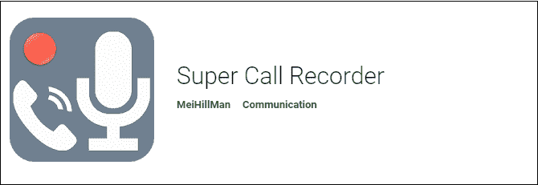

# 安卓最佳通话记录器

> 原文：<https://www.javatpoint.com/best-call-recorder-for-android>

你想在安卓手机上记录你和别人交流时的电话对话吗？大多数安卓手机都提供内置的语音记录功能，而有些则没有。但是还有其他几个选项可以用来记录你的电话。您也可以使用外部录音机。但是，最好使用直接从手机记录语音的应用程序。

首先，我们来讨论一下录制电话对话是否合法，尤其是在没有第二人许可的情况下。对此没有任何明确的答案。这取决于你居住的国家的法律。像美国联邦和其他州这样的国家只允许你记录你这边的通话。然而，一些国家允许两个人记录他们的电话。其他国家在这方面有自己的法律。为了合法地保护自己，在记录你的电话谈话之前，要先征得允许。

您可以使用最新的安卓手机通话记录应用程序来记录您的通话。

## 安卓手机最佳通话录音应用

您大部分时间都听到客户服务部门出于培训和发展目的而记录您的电话。安卓手机上有几个通话记录器应用程序。下面提到了其中的一些:

#### 注意:下面提到的呼叫记录器应用程序的顺序不是基于它们的性能。你可以根据自己的要求选择一个应用。

*   [立方体通话记录仪 ACR App](#Cube)
*   [通过 NLL 调用记录器 ACR](#ACR)
*   [黑盒通话记录仪](#Blackbox)
*   [水獭语音笔记](#Otter)
*   [智能记录仪](#Smart)
*   [自动呼叫记录器](#Auto)
*   [RMC 呼叫记录器](#RMC)
*   [自动呼叫记录器](#Automatic)
*   [通话记录仪 S9 自动通话记录仪 Pro](#S9)
*   [全通话记录仪精简版](#All)
*   [总通话记录仪](#Total)
*   [真实来电者](#Truecaller)
*   [超级通话记录仪](#Super)
*   [语音备忘录](#Voice)
*   [银河通话记录仪](#Galaxy)
*   [简易录音机](#Easy)
*   [洛伐卡拉呼叫记录器](#Lovakara)
*   [录音笔 Pro](#Pro)
*   [索尼录音机](#Sony)
*   [鹦鹉录音机](#Parrot)

* * *

### 立方体呼叫记录器应用

立方体通话记录器 ACR 应用程序是安卓手机中最受欢迎的通话记录器应用程序之一。它会自动记录您的来电和呼出电话。它还记录了用户对其他应用程序(如 WhatsApp、Viber 和 Skype)的呼叫。

### 特征

*   您可以选择要自动记录通话对话的联系人列表。
*   录制的通话可以保存在你的谷歌硬盘上作为备份。
*   大多数安卓手机都支持这个应用。
*   此应用程序的 pin 锁定功能可确保您的录音通话安全。

**价格**:免费下载。

从谷歌 Play 商店下载[立方体通话记录仪 ACR app](https://play.google.com/store/apps/details?id=com.catalinagroup.callrecorder) 。

### 呼叫记录器

NLL app 开发的 Call Recorder ACR 是一款应用广泛的安卓手机通话录音应用。除了通话录音，它还提供了其他一些吸引人的功能。这款动态通话记录仪还可以方便您转接来电，并添加备注以供进一步参考。该应用程序已与多个云存储服务合作，对录音通话进行安全备份。

### 特征

*   它为您提供不同格式的录音通话保存，如 mp4、Ogg、3gp 等。
*   您还可以在谷歌硬盘和 Dropbox 上保留您的通话记录备份。
*   它有密码保护功能来保护您的通话记录。

**价格**:免费下载。

从谷歌 Play 商店通过 NLL 下载[通话记录仪 ACR。](https://play.google.com/store/apps/details?id=com.nll.acr)

### 黑盒呼叫记录器

Blackbox 呼叫记录器应用程序提供了许多独特的功能，包括蓝牙附件支持、领先的呼叫记录设置和云备份支持。但是，这个应用程序不会记录第三方应用程序(如 WhatsApp、Skype、Messenger 和 Viber)的呼叫。

### 特点:

*   它根据时间、日期和持续时间对呼叫记录进行分类。
*   它保护录音电话免受未经授权的访问。
*   它允许您选择那些您不想为其录制通话的联系人。
*   另一方面，它还允许您选择您想要为其录制通话的联系人。

**价格**:免费下载。

从谷歌 Play 商店下载[黑盒通话记录仪应用](https://play.google.com/store/apps/details?id=com.cryok.larva&hl=en_IN)。

### 奥特语音笔记

外部语音笔记是一种转录服务和语音笔记组织者。它允许您收听和整理笔记，传输现有的语音笔记，等等。它的行为不像其他应用程序那样像通话记录器。您可以将其他应用程序中的通话记录导入此，以便存储和组织。

### 特点:

*   它提供工具和其他快捷方式来即时记录通话记录。
*   它有一个可调节的播放速度。
*   您可以在群组内录制通话并实时分享。

**价格**:每月免费通话录音高达 600 分钟。之后还有订阅费。

从谷歌 Play 商店下载[外音音符](https://play.google.com/store/apps/details?id=com.aisense.otter rel=)。

### 智能记录仪

智能录音机提供最新的通话录音功能，包括跳过不需要收听的静音功能。这个通话录音应用程序也被称为智能录音机。您可以根据需要在通话录音和正常录音之间轻松切换。

### 特点:

*   它有一个现场音频频谱分析师。
*   通话录音没有时间限制；这取决于你的手机存储空间。
*   启动应用程序后，您可以一键记录您的电话。
*   它提供了记录电话呼叫的功能，即使在电话显示屏关闭时也是如此。

**价格**:免费下载。

从谷歌 Play 商店下载[智能记录仪应用](https://play.google.com/store/apps/details?id=com.andrwq.recorder)。

### 自动呼叫记录器

自动通话记录器应用程序会自动记录您的通话，并将其存储在手机 SD 卡和内部存储器中。它提供了五种独特的默认设置，即忽略一切、记录一切、记录联系人、记录呼出电话和记录呼入电话。

### 特点:

*   它允许您在一周后自动删除您的录音电话。
*   它会提示一个确认对话框来保存您的录音通话。
*   它给出了不同的记录格式。

**价格**:免费下载。

从谷歌 Play 商店下载[自动通话记录器应用程序](https://play.google.com/store/apps/details?id=com.tool.auto.recorder_apps.callrecorder&hl=en_IN)。

### 呼叫记录器

RMC 通话记录器应用程序让您可以将记录的通话保存到手机存储卡中的“记录我的通话”文件中。要录制通话，您需要打开手机的扬声器。该应用程序带有一个内置的垃圾桶文件夹，消除了对计划外删除您保存的通话记录的担心。

### 特点:

*   它有两种不同的模式来记录您的通话，称为自动和手动。
*   它为录音提供了极好的搜索优势。
*   它以多种格式记录您的通话，如 mp3、mp4、3gp、wav 和 amr。

**价格**:免费下载。

从谷歌 Play 商店下载 [RMC 通话记录仪应用](https://play.google.com/store/apps/details?id=com.record.my.call&hl=en_IN)。

### 自动呼叫记录器

自动电话录音器是一个优秀的应用程序，可以记录你的电话交谈。您需要打开电话的扬声器来记录通话的双方。记录通话后，您可以保存、共享和组织通话。

### 特点:

*   它可以让你在自动驾驶仪上记录通话。
*   它具有搜索和管理所有通话记录的领先功能。
*   它用群组、日期和姓名来组织您的通话记录。
*   它会自动闪现未知来电者的 ID。

**价格**:免费下载。

从谷歌 Play 商店下载[自动通话记录仪](https://play.google.com/store/apps/details?id=il.co.smedia.callrecorder.yoni&hl=en_IN)。

### 全通话记录仪精简版

All Call Recorder Lite 应用程序可记录单人通话和集体通话。它有一个简单的用户界面，只包含基本功能。它记录了双方通话的每一个细节。

### 特点:

*   它以您选择的不同音频格式记录电话通话。
*   它还允许您启用通知以开始录制。
*   有一个关闭通话录音的选项。
*   你也可以很容易地删除录音电话。

**价格**:免费下载。

从谷歌 Play 商店下载[全通话记录仪 Lite](https://play.google.com/store/apps/details?id=com.sbou.callrecorder_2018&hl=en_IN) 。

### 呼叫记录器 S9 自动呼叫记录器专业版

*   它兼容所有最新的安卓智能手机
*   它包含带有高级文件管理器的自动呼叫记录器功能。
*   您可以将录音电话发送到电子邮件地址。
*   录制的通话可以在谷歌驱动、Dropbox、短信、WhatsApp、Skype 等分享。

**价格**:免费下载。

从谷歌 Play 商店下载[通话记录仪 S9 自动](https://play.google.com/store/apps/details?id=com.smsrobot.callu&hl=en_IN)。

### 总通话记录器

总通话记录器应用程序通过其最新功能确保了良好的用户体验。它的通话和录音功能非常值得信赖。这个应用程序不显示广告和垃圾邮件。

### 特点:

*   它在兼容的手机上记录通话。
*   提供高质量的通话录音。

**价格**:免费下载。

从谷歌 Play 商店下载[总通话记录仪](https://play.google.com/store/apps/details?id=com.killermobile.totalrecall&hl=en_IN)。

### 真实来电

Truecaller 已经被大家熟知了。这是一个发现未知数字的流行应用程序。但是，它也提供了通话记录功能。使用此应用程序，您不仅可以知道未知号码，还可以安全地记录通话。

### 特点:

*   您可以使用此应用程序录制重要通话记录。
*   录制的通话会保存到您的手机中。
*   它包括一个 flash 消息功能，允许您共享表情符号和位置。
*   您可以在谷歌硬盘上保留通话录音的备份。

**价格**:Rs 的溢价计划。49/月。

从谷歌 Play 商店下载 [Truecaller](https://play.google.com/store/apps/details?id=com.truecaller&hl=en_IN) 。

### 超级通话记录器

超级通话记录器是安卓手机上流行的免费通话记录器应用。录音通话直接从应用程序中播放。它附带了一个功能，可以通过诸如 WhatsApp 之类的消息分享录制的通话。

### 特点:

*   它可以非常清晰准确地记录来电和去电。
*   它支持安卓操作系统 2.1 及以上版本。
*   您可以将电话录音从手机内存转移到 SD 卡。
*   它提供了与 WhatsApp、电子邮件等共享通话记录的功能。

**价格**:免费下载。

从谷歌 Play 商店下载[超级通话记录仪](https://play.google.com/store/apps/details?id=com.meihillman.callrecorder&hl=en_IN)。

### 语音备忘录

语音备忘录是一个流行的语音和通话记录应用程序。它使用您设备的内置麦克风来记录通话。您也可以使用外置麦克风进行出色的立体声录音。

### 特点:

*   您可以替换录音通话的某些部分，可以对其进行修剪，也可以将其删除。
*   您只需点击录音按钮，就可以简单地记录通话。
*   您可以在社交媒体应用程序或其他消息应用程序上共享录制的通话。
*   您也可以通过一些简单的步骤恢复已删除的通话记录。

**价格**:免费下载。

从谷歌 Play 商店下载语音备忘录。

### 银河呼叫记录器

银河呼叫记录器以手动和自动方式记录呼叫。它提供了禁用某些联系人以禁用其通话记录的功能。它在三星 Galaxy 手机上运行流畅。

### 特点:

*   当耳机与蓝牙设备连接时，您可以禁用耳机通话录音。
*   它让您可以根据预定义的准则自动删除已录制的通话对话。
*   你可以写笔记，把录音标记为重要。
*   它保护人们免受网络威胁和诈骗。

**价格**:免费下载。

从谷歌 Play 商店下载[银河通话记录仪](https://play.google.com/store/apps/details?id=com.oduzhar.galaxycallrecorder&hl=en_IN)。

### 简易录音机

这款应用主要用于商务会议和采访录音。录音通话可以与同事分享。员工可以使用此通话记录应用程序记录公司办公室发生的任何事件。

### 特点:

*   它配备了安卓穿戴支持，有助于直接从您的智能手表记录通话。
*   它提供了在 MP4 中记录声音的设施，并确保高质量。
*   可以通过消息应用程序和电子邮件轻松分享录制的通话对话。

**价格**:免费下载。

从谷歌 Play 商店下载[轻松语音重排序](https://play.google.com/store/apps/details?id=com.coffeebeanventures.easyvoicerecorder&hl=en_IN)。

### 洛夫卡拉的电话录音机

洛伐卡拉的通话记录器自动记录通话。它兼容所有智能手机版本，并以 MP3 格式记录通话。它完全免费下载，但显示广告。

### 特点:

*   它以有组织的方式存储您的录音电话，以便您可以根据时间、日期和群组查看录音电话的对话。
*   录制的通话可以通过在 SD 卡上以 MP3 格式保存来回放。

**价格**:免费下载。

从谷歌 Play 商店下载洛伐卡拉的[通话记录仪。](https://play.google.com/store/apps/details?id=com.enlightment.voicecallrecorder)

### 录音机专业版

录音笔专业版是一款出色的通话录音应用程序，具有高质量记录通话的完整功能。使用此应用程序，您可以长时间录制语音笔记。这使得它成为商务会议记录器的独特应用。

### 特点:

*   这个应用程序以 MP3、MP4、3GP 和 WAV 四种不同的音频格式记录电话。
*   它可以记录从 8 千赫电话质量到 44 千赫光盘质量的通话。
*   它支持立体声和单声道录音。
*   它有一个内置的媒体播放器来控制音量。

**价格**:免费下载。

从谷歌 Play 商店下载[录音笔 Pro](https://play.google.com/store/apps/details?id=com.splendapps.voicerec&hl=en) 。

### 索尼录音机

索尼的录音机有助于流畅的备忘录录制和编辑。它还将录制的通话转移到云平台。这款通话录音应用提供了便捷的通话录音、编辑、音频暂停等功能。它与录制会话和会议兼容。

### 特点:

*   它带有编辑和裁剪功能，可以在需要时编辑和裁剪录制的通话。
*   它还提供了声音过滤器。
*   如果需要，您可以暂停录制。

**价格**:免费下载。

### 鹦鹉录音机

鹦鹉录音机为安卓手机提供定制的高清通话录音。它还提供了根据要求配置高清语音录制的功能。您还可以记录会议、会话和讨论。

### 特点:

*   它使用摄像机麦克风、蓝牙麦克风和标准麦克风记录通话。
*   它允许您与喜爱的应用程序共享通话记录。

**价格**:免费下载。

从谷歌 Play 商店下载[鹦鹉录音机](https://play.google.com/store/apps/details?id=com.SearingMedia.Parrot&hl=en_IN)。

* * *