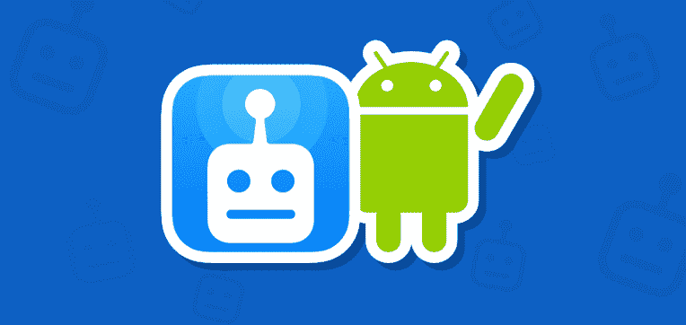
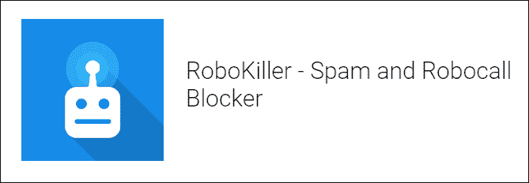

# 安卓的 RoboKiller

> 原文：<https://www.javatpoint.com/robokiller-for-android>

RoboKiller 是一个阻止垃圾邮件和 robocall 呼叫的应用程序。它通过自动阻止任何不想要的来电并将它们添加到黑名单中来帮助您过滤和控制这些来电。RoboKiller 应用由人工智能提供动力。它去除了高达 99%的垃圾邮件和电话。

RoboKiller 应用程序的目标是保护每个智能手机用户免受诈骗和打扰无辜公众的 robocalls。RoboKiller 应用程序附带机器学习功能，可避免从 robocall、电话销售员和其他恼人的电话中拨打您的电话。

## RoboKiller 应用程序的功能

使用 RoboKiller 应用程序，您可以执行以下活动:

*   你可以阻止你的电话不断地响。垃圾电话号码会自动添加到您的垃圾电话拦截器黑名单中，不会打扰您。
*   通过使用垃圾邮件过滤器，在最初的 30 天里，它将不想要的电话减少了 90%。
*   垃圾邮件列表会自动更新，为用户提供最新的保护。
*   它会屏蔽自动电话和电话号码，只要你想，你就不想给它打电话。

## 控制谁能打电话，谁不能

*   将您的联系人列表或新号码安全保存在**允许列表**中。
*   您可以在**最近通话记录**中查看最近错过的电话号码。
*   您可以通过将不想要的呼叫添加到**阻止列表**来阻止它们。
*   如果您认为有来自未知号码的紧急呼叫，可以暂时暂停垃圾邮件拦截。

## 安卓上的应答机器人

RoboKiller 应用程序使用了一个强大的回答机器人工具。这个应答机器人工具由音频指纹和机器学习技术提供动力，它可以找到不想要的呼叫并应答它们。它用自己疯狂、粗鲁、滑稽、搞笑的录音浪费了不受欢迎的人和机器人的时间。

在应答机器人的帮助下，每个 RoboKiller 用户都可以有效地对抗 robocalls。它向垃圾邮件发送者发送了一段由 RoboKiller 录制的长而可笑的视频。

## 其他功能

*   **垃圾短信防护:**除了呼叫拦截，RoboKiller 还通过启用**垃圾短信防护**来提供阻止不需要的短信的功能。
*   **欺骗保护功能，阻止垃圾邮件发送者显示虚假的本地号码**:如果您收到的垃圾电话号码看起来像您所在地区的本地号码，RoboKiller 也将完全保护您免受其害。
*   **个人阻止和允许列表:**除了被 RoboKiller 应用程序阻止的垃圾邮件和自动电话呼叫之外，您还可以创建自己的阻止和允许呼叫者的列表。

## [计] 下载

从谷歌 Play 商店下载安卓的 [RoboKiller 应用](https://play.google.com/store/apps/details?id=com.robokiller.app&hl=en_US)。可以免费下载。该应用需要订阅费才能使用。你可以免费试用 7 天。免费试用到期后，订阅费用会自动按月续订。您可以随时取消订阅。

* * *