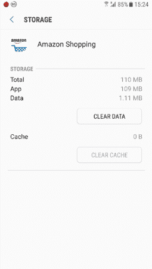

# 清洁我的安卓手机

> 原文：<https://www.javatpoint.com/clean-my-android-phone>

随着时间的推移，每部手机都会被不必要的文件填满，从而降低手机的速度。甚至有时电话拒绝执行某些活动。这款手机在拆箱几个月后出现问题。那么对你的安卓手机进行深度清洗只是解决问题的一种方法。你需要定期用你的安卓手机进行清洁。

每天定期使用移动应用程序会使存储空间变满。它降低了软件的执行速度，设备后台进程使得在一个应用程序和另一个应用程序之间切换变得非常困难。

在本文中，您将了解如何清洁您的安卓手机，以及如何增强移动应用的性能。

## 如何清理安卓手机存储空间

### 清理每个应用程序的缓存

对手机性能的巨大影响是定期清理手机应用缓存和临时文件。这些临时文件在应用程序运行时发挥着重要作用。但是，当应用程序关闭时，这些临时文件会保留在存储区域并填满空间。

要从存储空间中清除安卓应用的临时文件和缓存并释放内存，请执行以下步骤:

1.启动你的安卓手机的设置应用。

2.查看应用程序(或应用程序和通知)设置。

3.选择所有应用程序。

4.轻按您想要清理其临时文件的应用程序。

5.选择清除缓存和清除数据以删除缓存数据。

转到您的所有应用程序，逐一清理每个应用程序的临时文件。

### 删除不再需要的安卓应用程序

当你在你的安卓设备上安装更多的应用程序时，它们会让手机执行速度变慢，并“报废”。所以重新检查你所有的安卓应用，找出哪个应用不再需要，然后从你的手机上卸载。

#### 如何卸载不必要的应用程序

1.启动你的安卓手机的**设置**并访问**应用程序**

2.浏览可用的应用程序，找出哪些应用程序长时间不用。

3.点击不再需要的应用，选择**卸载**点击**确定**确认，该应用从设备中卸载。

上述步骤用于手动卸载应用程序。你可以去找自动找出长时间不用的应用的软件，你可以从你的设备上卸载它们。

### 排序并清理您的下载文件夹

你可以搜索大量的图片、文件、音乐等。并将其下载到手机的下载文件夹中。我们大多数人只在当前使用这些文件和数据，而在未来的方面并不需要它们。但是这些下载的文件会保留在我们的下载文件夹中，并占用存储空间。

#### 如何清理下载文件夹

1.打开你的应用程序，找到**我的文件**或你拥有的任何其他文件浏览器应用程序。

2.在**我的文件**文件浏览器中，找到下载并点击它。

3.按住不再需要的下载文件，如图像、音乐。

4.点击**删除**按钮删除这些文件。

### 使用专用的内存清理程序

如上所述，您可以手动清理手机内存。您也可以为此使用任何第三方应用程序。市场上有许多内存(垃圾和缓存)更干净的应用程序(play store)。你可以用那里的任何人。

从各种垃圾和缓存清理应用，我们将在这里讨论“安卓 Avast 清理”。这是一个免费的工具，可以从上到下扫描你的手机。这个应用程序可以清除手机内存中浪费的手机文件夹、缓存文件和未使用的应用程序。

1.下载[安卓 Avast 清理](https://play.google.com/store/apps/details?id=com.avast.android.cleaner)安装在手机上。

2.启动应用程序，从**显示结果**开始，它显示了从安卓手机中清除临时文件、缓存和其他内容的快速提示和步骤。

3.点击**完成清洗**按钮，完成必要的清洗过程。

然而，上述步骤才刚刚开始；您还可以执行更深入的清洁操作。转到您的主屏幕，访问照片应用程序，找出浪费的截图、相似的图像和糟糕的照片。

### 删除未使用的下载数据，如视频和播客。

另一种清理手机内部或外部存储的方法是删除已经下载到设备上的文件，然后忘记它。一些例子是:

**YouTube Premium** :如果你订阅了 YouTube Premium，以后下载视频离线观看，这些下载的视频会存储在你的设备中，占用存储空间。访问你的 YouTube 应用程序库，查看**下载**部分，删除你已经看过的下载视频；这就腾出了存储空间。

**播客:**如果你订阅了播客应用，当新一集到来时，这些播客会消耗几 MB 的空间。所以，你需要定期去播客，删除那些你不再听的文件。

### 在安卓设备上执行工厂重置

有时候上面提到的清洗过程可能不足以清洗你的安卓手机。你需要对你的手机进行工厂重置。在开始工厂重置之前，请备份所有重要数据。

1.启动手机**设置**

2.点击**综合管理**，点击**重置**。

3.选择**工厂数据重置**

4.现在点击**重置设备**和**删除所有**进行确认。

* * *