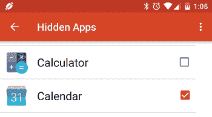
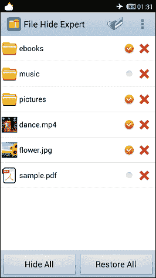

# 如何在安卓系统上隐藏应用、文件和照片

> 原文：<https://www.javatpoint.com/how-to-hide-apps-files-and-photos-on-android>

如果你在把智能手机给别人的时候经常遇到问题。因为您的安卓手机包含敏感的电子邮件、图像、文档或其他您不想被他人访问的文件。有时你的智能手机可能会丢失或被盗。因此，您希望在您的安卓设备中隐藏所有敏感(个人)信息和应用程序，以保护您的个人数据。

将应用程序和文档隐藏在手机中是保护您的个人信息和您在应用程序上执行的活动的好方法。

## 如何在安卓系统上隐藏应用

[安卓](https://www.javatpoint.com/android-tutorial)设备中没有隐藏你的应用的内置应用。然而，这并不意味着你没有任何选择。隐藏应用程序的方式并不是真正的隐藏。您可以从设备设置中禁用它们，以隐藏应用抽屉，并阻止它们使用系统资源。要禁用智能手机中的应用程序，请按照以下步骤操作:

1.  启动你的设备**设置**
2.  访问**应用程序**并点击您想要禁用的应用程序。
3.  在**应用信息**页面，点击**禁用**
4.  一条确认消息提示，如果您确定要禁用某个应用，请点击**禁用**。
5.  该应用被禁用，并且在您的应用抽屉中不可见。

## 如何使用第三方应用隐藏安卓系统上的应用

如果你的安卓设备不允许在设备中隐藏应用，你可以使用第三方应用。市场上有几种应用程序可以隐藏您的应用程序。**新星发射器**就是其中之一。Nova Launcher 提供了一个简单的隐藏应用程序的工具。

### 使用新星启动器隐藏应用程序

从谷歌 Play 商店下载[新星发射器](https://play.google.com/store/apps/details?id=com.teslacoilsw.launcher&hl=en)并安装在你的手机上。

1.  打开应用抽屉。
2.  转到新星**设置**。
3.  找到**应用程序** & **小部件抽屉**并点击**隐藏应用程序**。
4.  在“隐藏应用程序”页面中，选择要隐藏的应用程序。选择的应用程序不会显示在应用程序抽屉中。

要使应用程序再次出现，只需访问相同的菜单位置并取消选中所需的应用程序。

### 使用 Apex 启动器隐藏应用程序

Apex Launcher 是另一个很棒的应用，它提供了一个对设备隐藏安卓应用的选项。你不需要去它的付费版本来访问它的功能。从谷歌 Play 商店下载并安装[顶点发射器](https://play.google.com/store/apps/details?id=com.anddoes.launcher)。启动应用程序，进入 ***设置** > **抽屉设置** > **隐藏应用程序*** 进行控制，在你的应用程序抽屉中可见。在**隐藏应用**界面，勾选你想要隐藏在安卓手机上的应用，点击**保存**。

## 如何隐藏库存安卓应用

最简单的隐藏应用程序和文档的方法是创建一个访客账户，同时将你的安卓智能手机交给别人。您需要从“设置”菜单创建一个来宾帐户。进入 ***系统>高级>多用户*T3 进入菜单。设置完成后，您可以从下拉菜单中轻松地从主帐户切换到来宾帐户，反之亦然。客人用户感受到新购买手机的体验。来宾帐户仅访问预安装的应用程序，这些应用程序显示在应用程序抽屉上，并且没有任何登录。你也可以允许客人打电话或不打电话。**

## 如何在安卓系统上隐藏照片

使用文件隐藏专家，您可以轻松隐藏任何文件，你可以想象在你的安卓手机。但是，这不是隐藏照片的好方法。您可以使用名为 [KeepSafe](https://play.google.com/store/apps/details?id=com.kii.safe&hl=en) 的应用程序。

**KeepSafe** 是最受欢迎、使用最广泛的隐私应用之一。它在你的手机上创建了一个数字盒子，你可以在里面放任何你不想给别人看的东西。你需要创建一个个人识别码来访问你的应用程序，它会将你所有的个人(敏感)文件保存在一个位置。如果你愿意，这款应用还可以将你的私人文件备份到云上。使用这种云备份工具，如果设备丢失或损坏，您可以恢复您的照片。

KeepSafe 绝对可以免费下载，但它的高级版本包含一些额外的吸引人的功能，例如现代 PIN 主题，一个“闯入警报”，它使用失败的访问尝试的日志，以便您可以看到有人试图访问您的私人文件。

## 如何在 Android 上隐藏文件

谷歌 Play 商店有几个安卓应用程序，可以在安卓手机上隐藏你的文件。其中一个就是**文件隐藏专家**，这是一个很好的应用。这款应用是免费的，可以让你轻松隐藏和取消隐藏手机上的任何文件。刚安装完就打开这个应用，会收到一条消息，显示隐藏文件列表为空。单击屏幕右上角的文件夹图标隐藏文件。

这个应用程序作为一个基本的文件管理应用程序运行。浏览您想要隐藏的文件，选中它，然后单击主屏幕上的后退按钮。

在此屏幕上，点击“全部隐藏”按钮隐藏您选择的文件。这些隐藏文件不会出现在任何其他文件管理器或库中。要再次取消隐藏它们，请再次打开文件隐藏专家应用程序并点击“全部恢复”。

上述过程很难保护您的文件。任何人都可以打开您的文件隐藏专家应用程序，并访问您不想与任何人共享的文件。使用文件隐藏专家的密码功能隐藏文件的绝佳方法。

点击菜单按钮并转到设置。首先，您需要启用密码选项。选中该框，它会提示您输入要使用的密码。请记住您输入的密码，因为每次启动文件隐藏专家时都需要输入密码。

#### 注意:保护您的文件、照片和应用程序免受未经授权的访问的最佳方法是，确保您的手机不会落入未经授权的人手中。在设备上使用安全的锁屏。始终将您的敏感数据保存在非移动设备上。

* * *