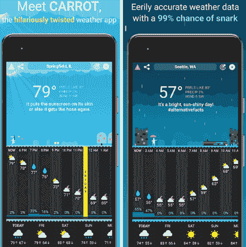

# 安卓最佳天气应用

> 原文：<https://www.javatpoint.com/best-weather-apps-with-widgets-for-android>

即使你呆在家里或者想去外地旅行，了解天气情况也很重要。在了解当前和即将到来的天气情况后，你可以相应地规划你的生活方式。

现在，市场上有很多天气应用程序(play store)。天气应用程序可以告诉你当前和即将到来的天气状况的一切。天气应用程序提供更详细和准确的信息。天气小部件允许您选择您想要使用的不同主题。

在本文中，我们将讨论一些适用于安卓设备的最佳天气应用和小部件。

## 1 天气

天气是[安卓](https://www.javatpoint.com/android-tutorial)用户最古老、最受欢迎的天气应用之一。它提供出色的每日和每小时天气预报信息。它还附带了一些天气小部件。这个应用程序有一个清晰干净的用户界面。它跟踪多达 12 个城市的天气，支持 25 种不同的语言。它提供各种天气预报、天气警报、实况雷达等。这个应用程序的免费版本包含广告，但你可以通过支付 1.99 美元删除它。从谷歌 Play 商店下载[1 天气](https://play.google.com/store/apps/details?id=com.handmark.expressweather)应用。

## 谷歌

谷歌助手也是一个持续的天气应用。你需要在谷歌上搜索当前天气，天气警报，以及更多预报。然而，它没有像其他应用程序那样提供更多功能，比如内置雷达。该应用程序包含一个名为“一目了然”的小部件。它有利于快速更新天气和天气警报。如果你正在寻找一个简单的天气预报应用程序，这个应用程序将成为一个很好的选择。从谷歌 Play 商店下载[谷歌](https://play.google.com/store/apps/details?id=com.google.android.googlequicksearchbox)应用。

## AccuWeather

AccuWeather 也是一款优秀的天气应用，可以更新和提醒你天气情况。它提供诸如每小时预测、扩展预测等功能。它还配备了安卓穿戴支持、雷达等。它有一个名为**分钟播报**的优秀功能，可以每分钟预报一次雨。一旦开始下雨，你也会知道它会持续多久。从谷歌 Play 商店下载[天气预报](https://play.google.com/store/apps/details?id=com.accuweather.android)应用。

## 风暴雷达

风暴雷达与其他天气应用略有不同。它主要关注龙卷风、飓风和几场雷暴。您还可以获得基本的天气特征，如当前温度、天气状况等。该应用是从天气频道发布的，我们假设它比其他天气应用更好。风暴雷达是完全免费的，但包含广告。从谷歌 Play 商店下载[风暴雷达](https://play.google.com/store/apps/details?id=com.twc.radar)应用。

## 胡萝卜天气

胡萝卜天气是一个新的天气应用。它确实包含了一些罕见的天气特征。它提供基本的天气预报、每小时的温度等等。它提供准确详细的天气信息。它的高级版本提供了一些额外的功能。该应用程序包括可定制的天气小部件以及长达 70 年的天气历史。从谷歌 Play 商店下载[胡萝卜天气](https://play.google.com/store/apps/details?id=com.grailr.carrotweather&hl=en_US)应用。

## 诺阿天气

诺阿天气应用程序使用诺阿和国家气象局作为其天气信息的来源。它提供当前的天气预报、每小时的天气信息、雷达等等。它提供你需要的天气信息。该应用程序提供准确、快速和准确的位置天气信息。然而，该应用不支持不同的天气警报。该应用有免费和付费两种版本。从谷歌 Play 商店下载[诺阿天气](https://play.google.com/store/apps/details?id=com.nstudio.weatherhere.free)应用。

## WeatherBug

WeatherBug 是比较老的天气应用之一，对于安卓用户来说是一个不错的选择。它提供了一些你看不到的优秀功能，如热指数、紫外线指数和花粉计数。它还提供基本的天气功能，如温度、雷达、天气预报、天气警报等等。该应用包括 18 种不同的天气地图、交通状况、闪电和雷电警报等。它有一个单独的天气小部件下载。这是一个不错的天气应用程序，包含了足够正常使用的功能。从谷歌 Play 商店下载 [WeatherBug](https://play.google.com/store/apps/details?id=com.aws.android) 应用。

## 今天的天气

今天天气应用程序在几秒钟内为您提供所有与天气相关的信息。它包含了大多数人喜欢的几个特征。该应用程序提供了实际温度、湿度、天气预报、雷达、各种天气警报和天气小部件等功能。它还带有月亮周期，空气质量指数，日出和日落时间。那些手机上有 AMOLED 显示屏的用户，他们特别喜欢这个应用，因为它的主题很暗。这个应用是免费下载的。从谷歌 Play 商店下载[今日天气](https://play.google.com/store/apps/details?id=mobi.lockdown.weather)应用。

## 雅虎天气

雅虎天气应用程序可能是计算准确天气信息的最佳天气应用程序。它有一个很好的用户界面设计。该应用程序提供天气警报、雷达等等。该应用程序跟踪多达 20 个城市的天气信息。此应用仅提供基本功能；如果你想要一些其他优秀的功能，那么你可以选择其他的。该应用程序可以免费下载，但包含广告。从谷歌 Play 商店下载[雅虎天气](https://play.google.com/store/apps/details?id=com.yahoo.mobile.client.android.weather)应用。

## 天气频道

天气频道是一个流行和著名的天气信息应用程序。它提供了您最喜欢的功能。该应用程序附带当前天气状况、扩展预报、风暴警报、雷达地图等。这个应用程序还提供突发新闻、花粉警报和闪电警报。该应用程序还提供了查看当地天气状况的功能。可以免费下载。从谷歌 Play 商店下载[天气频道](https://play.google.com/store/apps/details?id=com.weather.Weather)应用。

* * *