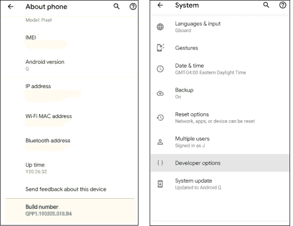
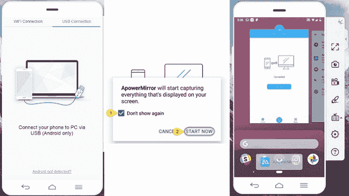
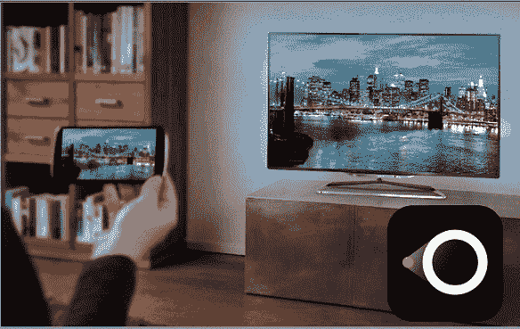
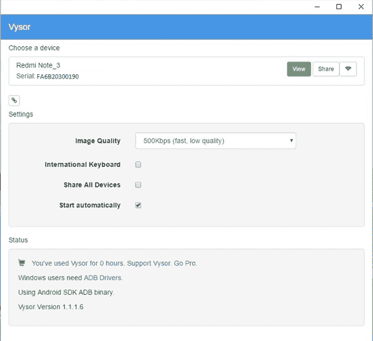
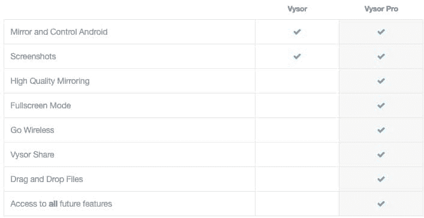
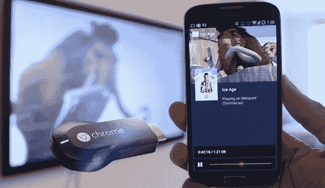
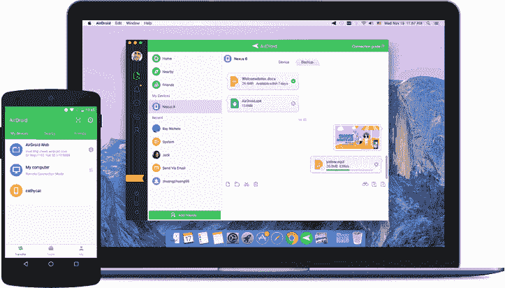

# 安卓系统中的屏幕镜像

> 原文：<https://www.javatpoint.com/screen-mirroring-in-android>

屏幕镜像是一个流行的过程，人们可以通过它从移动设备到电视屏幕观看内容。这意味着你可以简单地开始观看你最喜欢的电视节目，电影从你的手机到大屏幕电视，通过连接它们。

要执行屏幕镜像，请通过 Wi-Fi 或 HDMI 连接将安卓手机连接到智能电视。如果你没有智能电视，那么你必须需要一个选角设备，比如亚马逊 Firestick、三星 AllShare Cast 或 Chromecast。

## 屏幕镜像的必要条件

使用应用程序启动屏幕镜像时，打开安卓手机 USB 调试至关重要。 [USB](https://www.javatpoint.com/usb-full-form) 调试选项出现在安卓开发者选项中。

### 在你的安卓手机中启用开发者选项

我们已经提到了在你的安卓手机中启用开发者选项的步骤。

1.  前往您的设备**设置**并点击**关于电话**。具体路径可能因设备而异。
2.  找到**构建编号**。
3.  找到内部版本号后，连续点击七次以激活开发人员选项。当开发者选项被启用时，它将出现在**设置**的主屏幕上。
4.  点击返回按钮，查看新的**开发者选项**。

### 在你的安卓手机中启用 USB 调试

启用开发者选项后，你需要在你的[安卓手机](https://www.javatpoint.com/android-phones)中开启一个 USB 调试。要在手机中启用 USB 调试，请按照下面提到的步骤操作。

1.  前往您的设备**设置**并访问**开发者**
2.  在开发者选项画面中，启用 **USB 调试**。

## 使用应用程序在电视上镜像安卓手机

谷歌 Play 商店有几个应用程序可以在电视上镜像你的安卓手机。其中一些如下:

*   apowermirror
*   [让视图](#LetsView)
*   [维索](#Vysor)
*   [镀铬](#Chromecast)
*   [机械人](#AirDroid)

### 手机投频

ApowerMirror 是一款出色的应用，它可以将你的安卓手机镜像到你的个人电脑上，反之亦然。你可以用安卓手机控制你的电脑。该应用兼容[安卓](https://www.javatpoint.com/android-tutorial)、 [iOS](https://www.javatpoint.com/ios-full-form) 、Mac、Windows 等所有平台。

ApowerMirror 提供了一个与安卓电视兼容的工具，使用该工具，您可以在不购买外部插件或接收器的情况下屏蔽镜像。

**将安卓屏幕镜像到没有互联网的 PC 上**

1.  在你的[安卓设备](https://play.google.com/store/apps/details?id=com.apowersoft.mirror)和 [Windows](https://download.apowersoft.com/down.php?softid=apowermirror) 上下载并安装 ApowerMirror。
2.  从手机的开发者选项中启用 USB 调试选项。
3.  使用 USB 电缆将您的安卓设备连接到电脑。
4.  启动应用程序，点击权限上的**立即开始**捕捉屏幕。

**无线镜像安卓屏幕**

1.  从安卓手机上拔下你的 USB 线。
2.  在安卓手机上启动 **ApowerMirror** 应用。
3.  点击应用底部出现的 **M** 按钮。
4.  从列表中选择您的个人计算机名。
5.  选择**电话屏幕镜像**选项(如果要镜像电脑窗口，选择**电脑屏幕镜像**)。
6.  点击**立即开始。**

### 列表视图

LetsView 是另一个镜像应用，可以在电视上显示你的安卓手机内容。这是一款多任务镜像应用，兼容 [iOS](https://www.javatpoint.com/ios-development-using-swift) 、Mac、安卓、 [Windows 操作系统](https://www.javatpoint.com/windows)，尤其是智能电视。使用互联网连接，您可以通过一些简单的步骤将您的安卓手机镜像到智能电视。它还允许屏幕录制，这是它的优势之一。

但是，要使用 LetsView 应用程序将安卓设备连接到电视，请遵循以下步骤:

1.  下载 [LetsView](https://play.google.com/store/apps/details?id=com.apowersoft.letsview) 应用，安装在你的电视和手机上。
2.  使用相同的无线网络连接您的手机和电视。
3.  在两台设备上启动应用程序。
4.  搜索要镜像的设备。选择显示为“让视图+您的设备名称”的名称，并点击它。现在，屏幕镜像开始了。
5.  如果无法通过无线网络检测到您的设备，请单击手机右上角的图标，通过二维码或个人识别码连接您的设备。

### 维索

Vysor 在您的个人电脑上提供安卓手机的即时镜像。这款应用的屏幕镜像速度非常快，并且很容易设置。你可以进行游戏、截图、使用应用程序等活动，甚至可以在安卓手机上进行其他活动。

Vysor 应用的缺点是，它在付费版本中给出了必要的功能，比如简单的拖放功能，但这个功能在免费版本中被锁定了，等等。

1.  下载适用于 Windows、Linux、Mac 和 Chrome 的 [Vysor](https://www.vysor.io/download/) 软件，镜像你的安卓手机。
2.  使用 USB 电缆将您的安卓手机连接到电脑。
3.  允许在你的安卓手机上进行 USB 调试。
4.  在电脑上启动 Vysor 安装程序文件。
5.  Vysor 软件显示一条信息，显示“Vysor 检测到一个设备”。
6.  点击**查看**开始在个人电脑屏幕上投你的安卓手机。

### 镀铬

Chromecast 是将您的安卓手机镜像到运行在 5.1 及更高版本上的智能电视的另一种方式。Chromecast 是一款独立的 [HDMI](https://www.javatpoint.com/hdmi-full-form) 加密狗，需要使用谷歌主页应用连接到您的电视。启动应用程序，然后单击“屏幕镜像”启动。

要将您的安卓手机镜像到电视，请打开一个媒体应用程序，如 YouTube，然后单击屏幕右侧出现的投屏图标。要访问 Chromecast，请遵循以下步骤:

1.  访问谷歌 Play 商店，在你的安卓手机上下载一个屏幕镜像应用。
2.  在 Wi-Fi 网络下连接你的安卓手机和智能电视。
3.  从手机启动屏幕镜像应用程序。现在，在您的电视上，启用米拉卡斯特显示器。
4.  现在，点击手机上的蓝色按钮，开始将你的安卓设备镜像到电视上。选择电视，它会自动开始镜像您的手机屏幕。
5.  前往任何媒体应用程序，如 YouTube 或网飞，并开始全屏观看电影。点击 **CAST** 开始镜像。

### 机械人

AirDroid 是最受欢迎的安卓屏幕镜像应用之一。使用这个应用程序，用户可以在电脑上阅读通知、通话记录和未接来电。该应用程序提供的功能有限，这意味着您无法运行应用程序、玩游戏。该应用程序允许你将安卓手机流式传输到电脑，并允许屏幕录制和截图。

1.  在你的[安卓设备](https://play.google.com/store/apps/details?id=com.sand.airdroid&referrer=utm_source%3Dwww_get)和你的 [Windows 或 Mac](https://www.airdroid.com/en/get.html) 上下载并安装该应用。
2.  启动 Windows 应用程序，并在其中创建一个 AirDroid 帐户。
3.  现在，通过登录 AirDroid 应用程序将设备添加到您的帐户中。

* * *