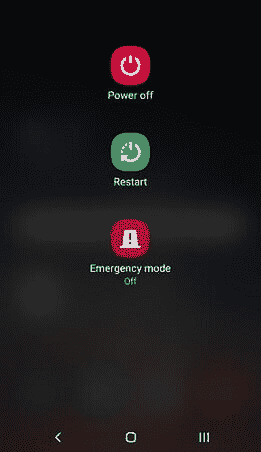

# 如何在安卓上打开或关闭安全模式

> 原文：<https://www.javatpoint.com/turn-on-or-off-safe-mode-on-android>

当你打开安卓设备的电源时，它会自动加载你的应用程序，如日历、时钟、音乐小部件等。在主屏幕上。但是，有时，你的安卓手机和平板电脑经常崩溃，有时运行缓慢。在这种情况下，您可能希望在没有这些应用程序的情况下运行设备，以便进行故障排除。这种执行模式被称为**安全模式**。

无论如何，在安全模式下运行你的安卓设备都不能解决问题。然而，它给出了一个关于问题可能出在哪里的想法。

当您打开(启用)您的[安卓](https://www.javatpoint.com/android-tutorial)设备的安全模式时，您可以知道它崩溃或运行缓慢的原因。另一方面，如果你的安卓设备在安全模式下运行完美，这意味着设备硬件不会产生任何问题。设备崩溃或运行缓慢的问题可能是由于您的任何一个应用程序。

要在安全模式下启动您的安卓设备，请按照以下步骤操作。这样，您就可以了解设备崩溃和变慢的深层原因。

## 如何引导安卓进入安全模式

在安卓设备中，有两种不同的方法来引导进入或退出安全模式。这取决于安卓设备的版本和设备型号。

### 方法 1

1.按住安卓手机的电源按钮，直到屏幕上出现**关机**菜单。

2.从设备屏幕上的软件中点击并按住**关闭**电源按钮，直到您获得安全模式选项。

3.现在，您的设备重新启动(重启)并进入安全模式。您可以看到一个**安全模式**文本出现在设备屏幕的左下角。

### 方法 2

如果您的安卓设备无法使用上述方法(方法 1)进入安全模式，请尝试以下步骤:

1.  从硬件上按下电源按钮，并从屏幕菜单中选择关机选项，即可击落您的安卓手机。
2.  当你的安卓设备关机时，长按电源按钮重新开机，直到看到安卓标识或设备制造商名称。
3.  安卓徽标或设备制造商名称出现后，长按音量按钮，直到设备重新启动。
4.  当设备重新启动时，松开电源按钮，您现在将进入安卓设备的安全模式。

## 在安全模式下做什么

当您到达安全模式时，您的设备运行更平稳或停止崩溃。这意味着一个应用程序可能会在正常模式下产生问题。找出造成问题的应用程序并卸载它。要找到损坏的应用程序，请查看一些可能的疑点:

*   **在安全模式下自动启动的应用**:这些应用包括出现在主屏幕上的安卓小部件，比如日历、时钟等。
*   **最近下载的 app**:如果你注意到最近出现了一个问题，罪魁祸首可能是你最近下载的一个 app 或者是你最近更新的一个 app。
*   **非必要应用**:尝试卸载不经常使用的应用。

## 如何在安卓设备上从安全模式退出到正常模式

进入安全模式后，需要退出，相当简单。在安卓设备上，按照以下步骤从安全模式退出到正常模式。

1.  长按安卓设备的电源按钮，直到屏幕上出现关机菜单。
2.  从菜单中选择重启选项。
3.  现在，您的设备重新启动，退出安全模式，并再次进入正常模式。

* * *