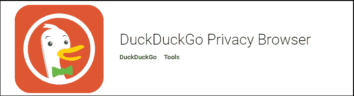

# 安卓最佳浏览器

> 原文：<https://www.javatpoint.com/best-browsers-for-android>

网络浏览器应用程序在任何安卓设备中都发挥着至关重要的作用。选择合适的浏览器应用程序，其中包含优秀的功能，这将提供出色的性能，这可以改变你的整个浏览体验。为安卓设备选择合适的浏览器应用程序有点困难，因为有很多应用程序可用，网络的面貌也在不断变化。

在本文中，我们将根据安卓设备的特性和功能来讨论一些最好的浏览器。这使得您可以根据自己对安卓设备的要求选择最佳浏览器。

根据用户的评论和应用测试，**谷歌 Chrome** 浏览器是安卓设备的优秀浏览器。然而，手机版的 **Opera** 和**火狐**也为用户提供了出色的服务。

## 安卓最佳浏览器列表

在这里，我们为安卓设备提供了一些最好的浏览器。下面提到的浏览器应用程序的顺序不是基于它们的性能。你可以根据需要选择。

1.  [谷歌铬](#Chrome)
2.  [Opera 的浏览器](#Opera)
3.  [火狐浏览器](#Firefox)
4.  [猕猴桃浏览器](#Kiwi)
5.  [海豚浏览器](#Dolphin)
6.  [duck 浏览器](#DuckDuckGo)
7.  [勇敢的浏览器](#Brave)
8.  [Ecosia 浏览器](#Ecosia)
9.  [微软边缘](#Microsoft)
10.  [闪电浏览器](#Lightning)
11.  [三星互联网浏览器](#Samsung)
12.  [冲浪浏览器](#Surfy)

### 谷歌 Chrome

谷歌 Chrome 浏览器是一款受欢迎的应用，也是手机浏览的绝佳选择。在大多数安卓设备中，它都是预装的。Chromebrowser 在移动版和桌面版浏览器之间同步。它提供了巨大的附加功能，如数据保护模式，支付方式的安全存储，滥用广告拦截器。谷歌 Chrome 还提供了与[安卓](https://www.javatpoint.com/android-tutorial)更深层次的集成和无限的浏览标签。它还为安全浏览提供了“匿名浏览”。还有其他版本的[谷歌 Chrome](https://www.javatpoint.com/google-chrome) 可用；这些是 **Chrome Beta，Chrome Dev** 和 **Chrome Canary** 。

从谷歌 Play 商店下载 [Chrome 浏览器](https://play.google.com/store/apps/details?id=com.android.chrome)。

### Opera 浏览器

Opera 浏览器也是用户最喜欢的手机浏览器之一。它为安卓提供了两种不同的浏览器。第一个是已知标准**戏曲浏览器**，第二个是**戏曲迷你**。经典的 Opera 浏览器带有部分广告拦截、保存数据的视频压缩和仪表板功能。这些特性使得加载页面更快。Opera Mini 浏览器是一个轻量级的选项，尺寸更小。Opera Mini 提供了脸书通知栏、部分广告拦截和许多其他功能。Opera 最新浏览器 **Opera Touch** ，提供桌面同步等强大功能。Opera 还提供了一个内置的免费虚拟专用网络，为您提供了一个虚拟的 IP 地址，保护您的位置跟踪。

从谷歌 Play 商店下载[歌剧浏览器](https://play.google.com/store/apps/details?id=com.opera.touch)。

### 火狐浏览器

[火狐浏览器](https://www.javatpoint.com/mozilla-firefox)速度快得惊人，而且非常安全。它允许您通过自定义浏览器来阻止加载项。该应用通过累积跟踪保护来保护您的隐私。火狐提供两种不同的浏览器，分别是标准的**火狐浏览器**和**火狐焦点**。标准和常用的火狐浏览器包含跨平台同步、跟踪保护、内置密码管理器和更多功能。火狐福克斯也被称为隐私浏览器，具有安全和隐私的意义。

从谷歌 Play 商店下载[火狐浏览器](https://play.google.com/store/apps/details?id=org.mozilla.firefox)。

### 猕猴桃浏览器

Kiwi 浏览器是一款较新的安卓浏览器，可以很好地加载网页。它包括诸如 100%对比度的夜间模式、弹出窗口拦截器、本地广告拦截和密码劫持保护等功能。猕猴桃浏览器是基于铬和网络工具包。它声称显示网页非常快。这款应用程序可以阻挡缓慢而激进的追踪器，保护您的隐私。这款应用绝对可以成为最佳选择之一。

从谷歌 Play 商店下载[猕猴桃浏览器](https://play.google.com/store/apps/details?id=com.kiwibrowser.browser)。

### 海豚浏览器

海豚浏览器在安卓设备上变得非常成功。它包含出色的功能，如广告块，主题化，隐私保护隐姓埋名模式，闪存支持，手势控制多个标签栏，个性化搜索，快速下载。app 提供高速页面加载、 [HTML5](https://www.javatpoint.com/html5-tutorial) 视频播放器、flash 播放器等。

从谷歌 Play 商店下载[海豚浏览器](https://play.google.com/store/apps/details?id=mobi.mgeek.TunnyBrowser)。

### Ecosia 浏览器

Ecosia 浏览器是一个用户友好的移动网络应用程序，有很多功能。它包含多个选项卡、书签、下载和私人浏览模式等功能。Ecosia 浏览器从 Chromium 的开源项目中拖动。app 捐赠高达 80%的利润用于植树，因此也是环保的。

从谷歌 Play 商店下载 [Ecosia 浏览器](https://play.google.com/store/apps/details?id=com.ecosia.android)。

### duck 浏览器

DuckDuckGo 浏览器为其用户提供了完全的隐私保护。它可以让你在网上浏览时控制你的个人信息。在搜索和浏览网页的时候，DuckDuckGo 浏览器会给你显示一个**隐私等级**。这个隐私等级让你知道你受到了多少保护。

该应用程序为您提供了标准的浏览功能，包括选项卡、自动完成和书签。该应用程序阻止广告跟踪。除了上面讨论的隐私保护，它还提供了 **Fire 按钮**，可以让你一键清除所有数据和标签。

从谷歌 Play 商店下载 [DuckDuckGo 浏览器](https://play.google.com/store/apps/details?id=com.duckduckgo.mobile.android)。

### 勇敢的浏览器

勇者浏览器是 2016 年推出的最新安卓浏览器之一，提供多种功能。它包含一个内置的广告拦截器。它还阻止第三方 cookies，阻止脚本。它拥有更快的浏览速度和更长的电池寿命。这个应用程序功能强大，使用起来很有趣。它还带有基本功能，如历史，书签，隐姓埋名(隐私)模式。

从谷歌 Play 商店下载[勇敢浏览器](https://play.google.com/store/apps/details?id=com.brave.browser&hl=en_US)。

### 微软边缘

老实说，微软边缘是一个不错的移动设备网络浏览器。它包含二维码阅读器、集线器功能、语音搜索和私人浏览模式等功能。这款应用与微软 Launcher 和 Windows 10 完美配合。微软边缘包含基于扩展的应用程序，如密码管理器、广告拦截器、翻译服务。该应用程序有效地与您的桌面版本同步。

从谷歌 Play 商店下载[微软 Edge](https://play.google.com/store/apps/details?id=com.microsoft.emmx) 。

### 闪电浏览器

闪电浏览器是最好的也是最受欢迎的安卓浏览器。它设计简单，使用起来轻巧。这个应用程序提供了几个功能，如主题化、屏蔽、隐私保护、阅读模式等等。它提供了一个隐姓埋名的浏览模式，这样你就可以保护你的位置和隐私。

闪电浏览器有免费和付费两种版本。免费版本提供无限的开放标签，以及自定义广告拦截等。阻止定制广告可以提高速度并保护您的浏览活动。付费版提供各种其他功能，包括全屏、广告块、书签、历史、阅读模式、搜索建议等。

从谷歌 Play 商店下载[闪电浏览器](https://play.google.com/store/apps/details?id=acr.browser.lightning)。

### 三星互联网浏览器

三星网络浏览器是一款非常好的安卓设备浏览器，尤其是三星。该浏览器提供快速菜单、滑动手势、插件和一些材质设计元素。它的一些插件便于广告拦截。它还提供了其他功能，如亚马逊的在线购物网络助手，支持 360 度视频。该应用程序提供了一个内置的下载管理器，允许下载视频、音乐等。这款应用即将推出测试版；然而，它比其他非测试版浏览器更稳定。

从谷歌 Play 商店下载[三星网络浏览器](https://play.google.com/store/apps/details?id=com.sec.android.app.sbrowser.beta)。

### 冲浪浏览器

Surfy 浏览器是安卓设备的另一款优秀浏览器。它提供了历史、书签和多个搜索提供者等基本功能。它还提供了一些高级功能，如主题化、广告拦截器、文本到语音转换、有趣的工具栏定制等等。冲浪浏览器声称它提供了文本到语音功能，如果你愿意，它可以为你阅读网站页面。浏览器受指纹和密码保护。它提供了一个隐姓埋名的模式，以防止您的位置和隐私。冲浪浏览器让你可以通过选择颜色或你最喜欢的照片来即时改变背景。这个应用程序阻止网站跟踪你。

从谷歌 Play 商店下载[冲浪浏览器](https://play.google.com/store/apps/details?id=com.outcoder.browser)。

* * *