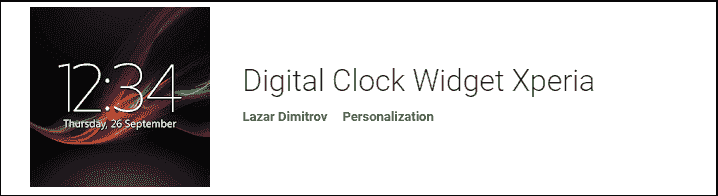
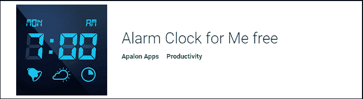
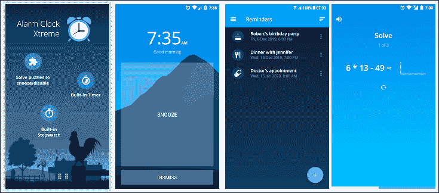
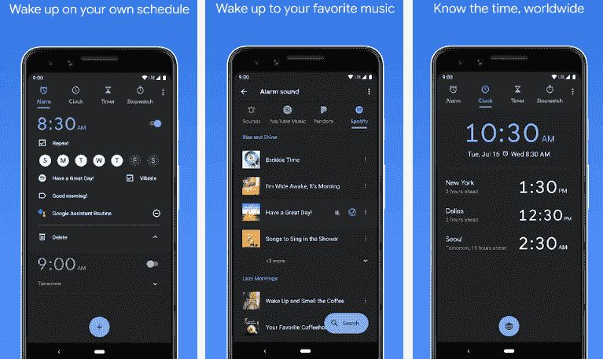
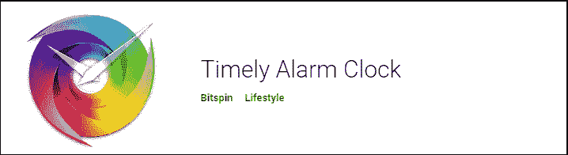

# 安卓最佳时钟

> 原文：<https://www.javatpoint.com/best-clocks-for-android>

谷歌 Play 商店有几个时钟应用程序，但从中选择一个最好的是相当困难的。然而，我们已经讨论了一些流行的和广泛使用的安卓时钟。你可以为你的安卓设备选择任何人。

**安卓设备的一些最佳时钟如下:**

*   [数字钟小部件 Xperia](#Xperia)
*   [沉睡者闹钟](#Heavy-Sleepers)
*   [我的闹钟](#Me)
*   [闹钟极限](#Xtreme)
*   [大数字时钟](#Big)
*   [谷歌时钟](#Google-Clock)
*   [KWGT 和 KLWP](#KWGT-and-KLWP)
*   [及时](#Timely)
*   [漂亮的小部件](#Beautiful)

### 数字时钟小部件 Xperia

数字时钟小部件 Xperia 是一个最小的数字时钟，包含大量的设置、小部件和功能。这款应用的用户界面由索尼 Xperia 设计。它允许自定义字体颜色、大小、日期和时间显示以及背景。其操作系统大部分是[安卓](https://www.javatpoint.com/android-tutorial) 4.2 或更高版本。它的完整版本包含设备的自动位置检测，最准确的天气预报，包括额外的 9 字体风格，以及背景的调整。

从谷歌 Play 商店下载[数字钟小工具 Xperia](https://play.google.com/store/apps/details?id=com.sonyericsson.digitalclockwidget2&hl=en) 应用。

### 重型睡眠者闹钟

重度睡眠者闹钟是一款针对深度睡眠者的应用。该应用程序提供了在其中设置多个警报的选项。每个警报都有自己单独的可定制设置。它还支持特定位置警报、安卓穿戴等。它还提供了一个被称为贪睡挑战拼图的功能。实际上，你会在闹钟关闭前醒来并解决一个难题。这款应用可以从谷歌 Play 商店免费下载。

从谷歌 Play 商店下载[重度睡眠者闹钟](https://play.google.com/store/apps/details?id=com.amdroidalarmclock.amdroid)应用。

### 我的闹钟

闹钟为我是另一个流行的和更好的安卓设备时钟应用。该应用程序允许在其中设置无限数量的警报。它提供了基本功能，如睡眠定时器、手电筒开关等。它还提供了一些附加功能，如主题、亮度滑块和天气信息。一些独特的功能包括床头柜模式，以便您可以将手机用作数字时钟。它可以在你的主屏幕上用作可定制的时钟部件。它还提供了完美的睡前提醒功能，建议您在晚上的正确时间睡觉。

从谷歌 Play 商店下载[我的闹钟](https://play.google.com/store/apps/details?id=com.apalon.myclockfree)应用。

### 闹钟极限

闹钟 Xtream 是安卓设备另一款流行的闹钟应用。它提供不同类型的警报，包括渐强警报、音乐、在线广播等。该应用程序还包含内置计时器、简单的睡眠跟踪和秒表。如果你还没有准备好醒来，它会给你一个额外的小睡按钮。您可以最小化暂停间隔时间，并设置最大警报暂停次数。从谷歌 Play 商店下载[闹钟 Xtreme](https://play.google.com/store/apps/details?id=com.alarmclock.xtreme.free) 应用。

### 大数字时钟

大数字时钟是一个数字的，大的，不言自明的时钟。这款应用非常适合那些想要在咖啡桌和床头柜上安装数字时钟的人。它提供了一个主题来改变它的外观，使用你想要的颜色。这款应用非常适合纵向和横向模式。该应用程序使用完整的屏幕宽度显示时间。您可以从系统设置中读取上午/下午模式。它提供了在屏幕上移动时钟的选项，以防止老化。从谷歌 Play 商店下载[大数字钟](https://play.google.com/store/apps/details?id=de.andreas1724.bigdigitalclock)应用。

### 谷歌时钟

谷歌时钟可能是安卓最可靠的时钟应用。它提供了时钟应用程序的所有基本功能。该应用程序配有计时器、时钟、秒表和闹钟。在里面设置警报很容易。秒表和计时器很容易使用。谷歌时钟自带材质设计，外观好看，工作优雅。该应用支持安卓穿戴以及世界时钟功能。它是轻量级的，对于那些想要一个简单的时钟应用程序的人来说更可取。从谷歌 Play 商店下载[谷歌时钟](https://play.google.com/store/apps/details?id=com.google.android.deskclock)应用。

### KWGT 和 KLWP

KWGT 和 KLWP 是一个定制的小部件应用。这是一个不错的安卓设备时钟和小部件应用。它让你可以自定义你的应用程序。该应用程序包括不同的工具、主题和功能，可以根据您的需要进行定制。这款应用最受主题爱好者的喜爱，因为他们可以立即获得自己想要的外观。用户可以自定义时钟，如数字和模拟，天气小部件，电池和记忆表等。KLWP 也由同一家开发商推出。它提供实时壁纸，可以添加到你的主屏幕时钟。从谷歌 Play 商店下载 [KWGT](https://play.google.com/store/apps/details?id=org.kustom.widget) 时钟应用。

### 及时的

及时是安卓设备有史以来最受欢迎的时钟之一。这款应用一上市就迅速走红。谷歌最终购买了一款“及时时钟”应用，并免费提供给用户。它提供了一个吸引人的用户界面。适时提供三个屏幕，时钟出现在中央。右屏显示计时器，左屏显示警报。该应用程序附带了配置它的主题。该应用程序提供了设计工具来创建全新的外观。从谷歌 Play 商店下载[及时](https://play.google.com/store/apps/details?id=ch.bitspin.timely)时钟应用。

### 漂亮的小部件

漂亮的小部件在喜欢小部件的用户中很受欢迎。它提供了各种不同颜色和风格的时钟部件。该应用程序包含一组主题，您可以下载并在应用程序中使用。该应用程序提供了其他功能，如天气小部件、时钟组合小部件等。它呈现的主题并不伟大，但它提供了一些最新的设计，你可以从应用程序中选择。该应用相当旧，因此它可能无法与安卓设备的一些最新版本完美配合。从谷歌 Play 商店下载[漂亮小部件](https://play.google.com/store/apps/details?id=com.levelup.beautifulwidgets)时钟应用。

* * *