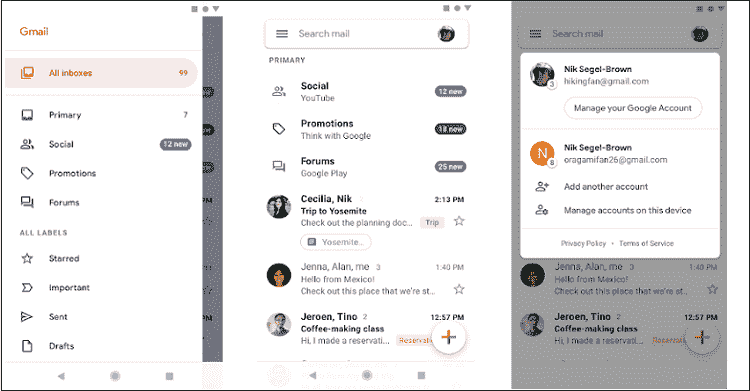

# 安卓最佳电子邮件应用

> 原文：<https://www.javatpoint.com/best-email-apps-for-android>

电子邮件是最古老、最著名、最重要的在线交流方式之一。它可以用于个人或官方目的。有许多电子邮件服务提供商，电子邮件应用程序是可用的。人们可以在一些流行的电子邮件服务提供商上创建他们的电子邮件帐户，如 Gmail、雅虎、Outlook 等。

看到电子邮件通信的重要性，大多数安卓智能手机和平板电脑都预装了一个电子邮件应用程序(主要是 Gmail)。谷歌 Play 商店还有其他几个第三方安卓电子邮件应用程序，与股票或预装的电子邮件应用程序相比，它们提供了更好的功能。

## 安卓最佳电子邮件应用列表

如果你正在为安卓设备寻找最好的电子邮件应用，我们收集了一些你可能想在手机上尝试的最好的电子邮件应用。

*   [蓝色邮件](#BlueMail)
*   [Gmail](#Gmail)
*   [质子〔t1〕](#ProtonMail)
*   [牛顿邮件](#NewtonMail)
*   [展望](#Outlook)
*   [K-9 邮报](#K-9Mail)
*   [九](#Nine)
*   [TypeApp Email](#TypeAppEmail)
*   [密函](#myMail)
*   [爱迪生邮件](#EdisonMail)

### 蓝色邮件

蓝色邮件是[安卓](https://www.javatpoint.com/android-tutorial)的热门且优秀的选择邮件应用。它支持各种客户端，包括 Gmail、雅虎、Office 365 和其他几个客户端，如 IMAP、POP3。该应用程序为您不同的电子邮件帐户提供了多种通知设置。您还可以同步来自不同电子邮件提供商的多个邮箱。该应用程序还支持一些有趣的活动，如可配置菜单、安卓穿戴和时间锁定屏幕，以保护您的私人电子邮件和黑暗主题。

从谷歌 Play 商店下载[蓝色邮件](https://play.google.com/store/apps/details?id=me.bluemail.mail)应用。

### 谷歌邮箱

Gmail 是谷歌最受欢迎的电子邮件应用程序，它预装在大多数安卓手机上。Gmail 有一个用户友好的界面，可以将你的电子邮件分为不同的类别，如社交邮件、更新邮件和促销邮件。它允许您管理多个 Gmail 帐户以及来自其他电子邮件提供商的电子邮件服务，如雅虎、微软 Outlook、iCloud 等。该应用程序提供了电子邮件书签、小组讨论、闲逛等功能。Gmail 应用很简单，提供 15GB 的自由存储空间。谷歌还增加了一个可以自毁电子邮件的功能。Gmail 应用程序的缺点是它显示赞助电子邮件，这使得很难将这些电子邮件与原始邮件区分开来。

从谷歌 Play 商店下载 [Gmail](https://play.google.com/store/apps/details?id=com.google.android.gm) 应用。

### 质子机

质子邮件是一款非常适合注重安全的用户在安卓设备上使用的电子邮件应用。质子邮件应用程序提供端到端的电子邮件加密，以保护您的通信。这意味着您发送的电子邮件只能由您和您邮寄的人阅读。该应用程序还通过设置定时器、基本标签和组织来提供自毁电子邮件功能。这些电子邮件存储在完全加密的服务器上，没有人能够阅读它们，甚至质子邮件也不能。

从谷歌 Play 商店下载[质子邮件](https://play.google.com/store/apps/details?id=ch.protonmail.android)应用。

### 牛顿邮报

牛顿邮件是一个功能强大的电子邮件应用程序，可以成为取代普通 Gmail 应用程序的更好选择。这封邮件也兼容 macOS、 [iOS](https://www.javatpoint.com/ios-full-form) 和 [Chrome](https://www.javatpoint.com/google-chrome) 操作系统。这款应用因其跨平台支持、智能搜索能力和用户界面而广受欢迎。

这个应用程序有一个干净、清晰和有用的用户界面。它提供了稍后发送电子邮件的功能、双因素身份验证、单击取消订阅功能等等。

牛顿邮件支持所有标准电子邮件提供商，并集成了多个工作工具，如 Pocket、 [OneNote](https://www.javatpoint.com/onenote) 、Zendesk、Evernote 和 Trello。安卓电子邮件应用有一个普通的收件箱，可以使用密码进行保护。

从谷歌 Play 商店下载[牛顿邮件](https://play.google.com/store/apps/details?id=com.cloudmagic.mail)应用。

### 观点

Outlook 是最受欢迎的安卓客户端电子邮件之一，它帮助数百万用户在一个地方管理他们的所有电子邮件帐户和文件。这封电子邮件是由微软提供的。它可以让您轻松管理您的电子邮件帐户。该应用程序是最好的安卓电子邮件应用程序之一，从谷歌 Play 商店获得了数百万次下载。

Outlook 应用程序包括一个吸引人的收件箱，可以将重要消息放在列表的最上面，用户只需轻按几下就可以在电子邮件和微软日历之间切换。它有一个简单和用户友好的界面，并允许同步几个电子邮件帐户。该应用支持标准邮件服务，如 Gmail、Outlook、雅虎邮件、iCloud，并集成了云存储服务。

从谷歌 Play 商店下载 [Outlook 电子邮件](https://play.google.com/store/apps/details?id=com.microsoft.office.outlook)应用。

### K-9 邮报

K-9 邮件是一个免费的开源电子邮件应用程序。许多用户喜欢它简单的界面和统一的收件箱。此应用程序支持大多数 POP3、IMAP 和 Exchange 2003/2007 帐户。

这款应用程序很轻，并带有一些出色的功能。这个应用程序很简单，但包含了所有的基本功能。K-9 邮件包括 IMAP 推送电子邮件、标记、多文件夹同步、密件抄送、PGP/MIME 等等。甚至，你可以自己创建这封邮件，或者通过 Github 向社区投稿。

从谷歌 Play 商店下载 [K-9 邮件](https://play.google.com/store/apps/details?id=com.fsck.k9)电子邮件应用。

### 九

如果您担心安全性，“九”电子邮件应用程序将成为更好的电子邮件应用程序选择之一。该应用程序是专门为那些需要随时随地与客户和同事高效沟通的企业家设计的。九个电子邮件应用程序包括混合电子邮件搜索、多帐户搜索、SSL 等。Nineemail 不是基于云的应用程序，它将所有电子邮件数据存储在设备本身上。

从谷歌 Play 商店下载[九](https://play.google.com/store/apps/details?id=com.ninefolders.hd3&hl=en_US)电子邮件应用。

### TypeApp 电子邮件

TypeApp 是一款精心设计的电子邮件应用程序，可以执行您期望的全部任务。它从一个完整的定制电子邮件应用程序管理多个账户。它支持推送通知、电子邮件服务、统一收件箱、富文本电子邮件、无线打印支持等等。它还提供了穿戴操作系统支持、黑暗模式主题和其他定制功能。该应用程序还有一个材料设计用户界面和一个相对简单的账户切换方法。

从谷歌 Play 商店下载 [TypeApp](https://play.google.com/store/apps/details?id=com.trtf.blue&hl=en_US) 电子邮件应用。

### 我的邮件

myMail 是安卓设备上另一个流行的电子邮件应用程序，在谷歌 Play 商店获得了数百万次下载。这个应用程序可以轻松地同时管理您所有的电子邮件帐户。它支持标准的电子邮件提供商，以及其他支持 POP3 或 IMAP 的邮箱服务。这个电子邮件应用程序最大的优点是它提供了无限的存储空间，这对业务活动很有帮助。

该应用程序为发送和接收电子邮件提供实时定制通知、智能搜索功能和数据压缩。该应用程序不包含高级功能，但提供电子邮件应用程序所需的所有必要功能。

从谷歌 Play 商店下载[我的邮件](https://play.google.com/store/apps/details?id=com.my.mail&hl=en_US)电子邮件应用。

### 爱迪生邮件公司

爱迪生邮件被优雅地设计为安卓设备上最好的电子邮件应用之一。该应用程序支持几个电子邮件服务提供商，如 Gmail、雅虎邮件、美国在线邮件等。它包含一个内置的智能助手，提供无与伦比的速度。该应用程序提供实时旅行通知、自动将电子邮件分类等。爱迪生邮件也可以通过谷歌穿戴操作系统智能手表使用。

从谷歌 Play 商店下载[爱迪生邮件](https://play.google.com/store/apps/details?id=com.easilydo.mail)应用。

* * *