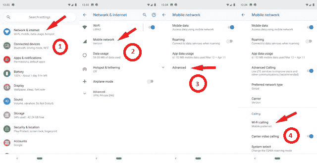

# 安卓系统上的无线通话

> 原文：<https://www.javatpoint.com/wi-fi-calling-on-android>

大多数人都在这样一个手机不工作的地方度过他们的小时光。这些可能是他们最喜欢的地下室咖啡厅，他们的房间，或其他一些信号受阻的位置。在这样的地方，无线电话可以节省你的时间。您可以使用可用的无线网络通过互联网进行无线呼叫和短信(发送和接收)，而不是依赖于蜂窝电话网络。

如果您没有蜂窝网络或连接不良，您只能选择拨打无线电话。但是，这是安卓上使用 Wi-Fi 通话的唯一理由吗？

## 如何拨打无线网络电话

默认情况下，您的智能手机不会启用 Wi-Fi 通话功能。你需要自己打开你的设备。根据设备版本和型号，启用[无线网络](https://www.javatpoint.com/wifi-full-form)呼叫的步骤可能略有不同。一般在**设置** > **网络** & **互联网** > **移动网络** > **高级** > **Wi-Fi 呼叫**下找到。在这里，打开无线电话。

您还可以选择使用移动网络或无线网络拨打电话。当两个网络都可用时，设备将与您的首选连接。如果一个网络不可用，则该网络切换到其他网络。

## Wi-Fi 通话是消耗还是节省设备电池寿命？

当您的蜂窝网络很差，但接收到极好的无线信号时，拨打无线电话将有助于节省设备电池寿命。当你收到一个低或没有移动信号，你可能要考虑关闭手机，以节省电池。另一方面，当您的[安卓](https://www.javatpoint.com/android-tutorial)设备没有连接到 Wi-Fi 网络时，启用 Wi-Fi 选项会消耗您的电池。

## 您的设备制造商支持无线电话吗？

大多数手机厂商都支持 Wi-Fi 通话。这里有一些关于支持无线网络电话的手机的简要信息，这些手机是为各大设备制造商提供的。在四大运营商中，T-Mobile 是 Wi-Fi 呼叫的最大支持者，如 T-Mobile、美国电话电报公司、Sprint 和威瑞森无线。

**T-Mobile** :所有最新的 T-Mobile 智能手机都允许我们进行 Wi-Fi 通话。您可以通过访问[设备页面](https://www.t-mobile.com/support/external-link.jspa?url=https%3A%2F%2Fsupport.t-mobile.com%2Fcommunity%2Fphones-tablets-devices%2Ftutorials)了解您现有的型号是否支持该功能。您可以从列表中搜索手机，并从“按类别浏览”中选择“无线”。现在，选择“呼叫，联系人&日历”选项，选择“打开/关闭无线呼叫”，并按照说明进行操作。

**AT & T** :它有 [49 款支持 Wi-Fi 呼叫](https://www.att.com/buy/phones/?taxoFeatures=Wi-Fi-CALLING)的待售设备。这包括最新型号的 LG 和三星手机。访问[设备支持](https://www.att.com/device-support/selector)查找您的手机，无论它是否支持无线网络通话。

**Sprint** :最新的 Sprint 手机(安卓和 iPhone)提供 Wi-Fi 通话。您可以通过访问设置并查看无线呼叫选项来检查它。要设置无线呼叫，请访问[设备支持](https://www.sprint.com/en/support/device/select-device.html)并选择您的电话，向下滚动至“呼叫”并选择“激活无线呼叫”。

**威瑞森无线**:没有提供这么具体的设备列表，但是新推出的安卓和 iPhones 都支持 Wi-Fi 通话。您可以按照[无线通话常见问题](https://www.verizonwireless.com/support/wifi-calling-faqs/)页面上的说明打开无线通话。

* * *