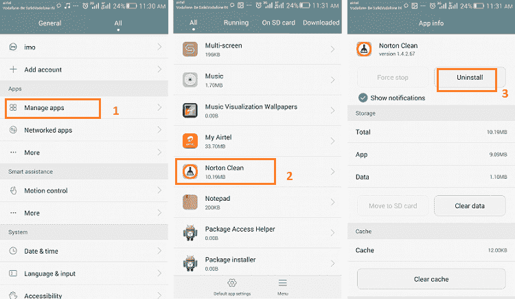
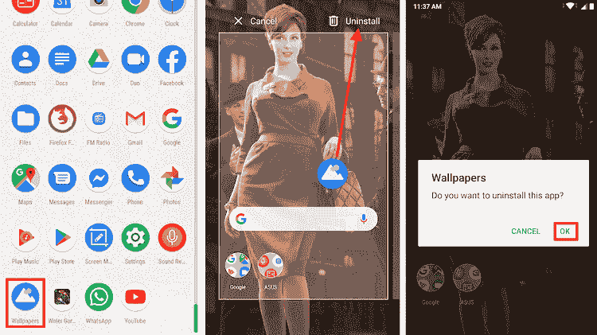
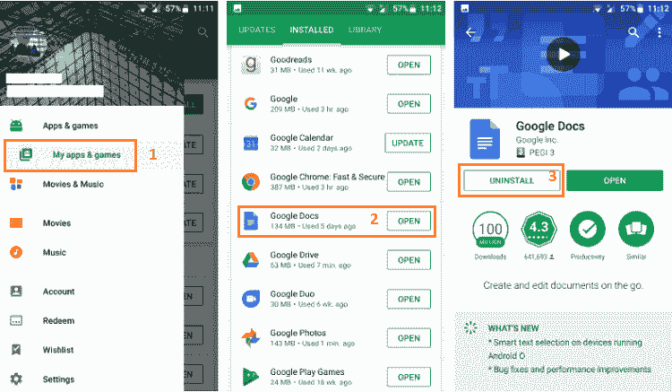
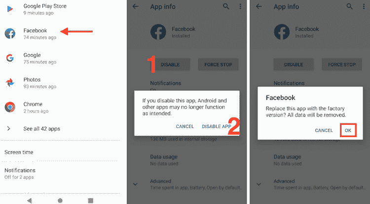
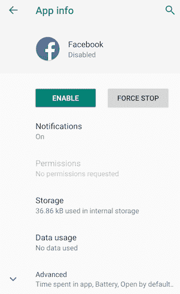

# 如何删除安卓系统上的应用

> 原文：<https://www.javatpoint.com/how-to-delete-apps-on-android>

如果您的安卓设备存储空间不足，您可能需要从手机中删除一些应用程序。删除一个应用很容易，只需要几秒钟。但是，删除应用程序有不同的过程，具体取决于设备及其版本。

在本文中，您将了解到在设备上删除应用程序的不同方法。

## 1.删除设置中的应用程序

从设置中删除应用程序适用于所有版本的[安卓](https://www.javatpoint.com/android-tutorial)设备。首先需要启动设备**设置**菜单。现在，转到您的**管理应用程序**或**应用程序管理器**或**应用程序**(因设备型号或版本而异)。现在，选择要删除的应用，点击**卸载**按钮。这款应用会在几秒钟内从你的智能手机或平板电脑上删除。一旦卸载过程完成，您将返回到**应用程序**菜单。

**分步说明**

1.  启动安卓设备**设置**。
2.  点击**管理应用程序**或**应用程序管理器**或
3.  选择要卸载的应用程序。
4.  点击**卸载**

## 2.从应用抽屉中删除应用

从应用程序抽屉中删除应用程序是从智能手机或平板电脑中删除应用程序的一种更快、最直接的方法。然而，这个过程在那些运行在旧版本安卓操作系统上的设备上不起作用。

只要打开你的应用抽屉，你就会看到你所有可用的应用。轻按并按住其中一个要从设备中移除的图标，将其拖到屏幕上出现的**卸载**框中。现在，点击提示窗口上的**确定**选项，确认应用卸载。

**从应用抽屉中删除应用的分步说明**

1.  打开你的应用抽屉，里面有你所有的应用。轻按并按住要从设备中移除的应用程序。
2.  将应用拖到屏幕上出现的**卸载**框中。
3.  现在，点击**确定**选项确认卸载。

## 3.使用谷歌 Play 商店删除应用程序

从你的安卓设备上删除应用的另一种方法是使用谷歌 Play 商店。启动智能手机的谷歌 Play 商店应用，进入**设置**选项，选择**我的应用&游戏**。现在，进入**已安装**部分，找到一个你想删除的应用，点击**卸载**。几秒钟后，您选择的应用程序将从您的安卓设备上卸载。

**分步说明**

1.  启动你的安卓设备的 Play Store 应用程序。
2.  打开**设置**
3.  点击**我的应用&游戏**。
4.  现在，访问**已安装的**
5.  单击要删除的应用程序。
6.  点击**卸载**。

## 4.如何删除预装的应用程序

一些安卓应用没有显示**卸载**按钮。这意味着该应用程序是安卓操作系统的一部分，并且作为预安装在您的手机上，因此您无法卸载它。但是，您可以**禁用**它。这些应用包括 Gmail、脸书、YouTube、一些厂商应用等。因此，如果您试图使用上述任何方法卸载这些应用程序，您将看不到**卸载**按钮。要禁用预安装的应用程序，请按照以下步骤操作。

**逐步指令禁用**

1.  启动安卓设备**设置**。
2.  点击**管理应用程序**或**应用程序管理器**或
3.  选择要禁用的预装应用程序。
4.  点击**禁用**按钮，按**禁用应用**确认。
5.  现在，点击**确定**确认。

看下面的屏幕；无法删除该应用程序，但该应用程序使用的存储空间减少了。

* * *