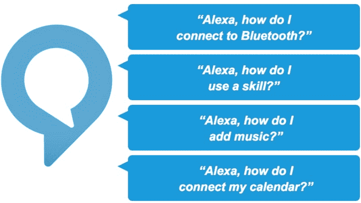
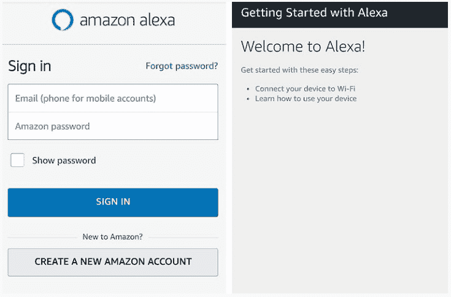

# 安卓的 Alexa 应用

> 原文：<https://www.javatpoint.com/alexa-app-for-android>

Alexa app 是一款由亚马逊提供动力的人工智能语音助手。这个应用程序可以回答你所有的问题，还可以帮助你在网上搜索答案。这款应用近年来大受欢迎。用户还可以使用 Alexa 应用程序来控制所有家庭智能设备的活动。有几个与 Alexa 相关的技巧，用户可以用来下载 Alexa 应用。Alexa 功能是由亚马逊和其他 [IT](https://www.javatpoint.com/it-full-form) 开发者合作开发的。

Alexa 目前提供 75000 种不同特性的技能。要激活你的 Alexa 设备，你需要说出一个命令**“WAKE”**。你可以随时用其他如**电脑**或**回声**等来更改这个 **WAKE** 字。

## Alexa 亚马逊技能

Alexa 允许你问各种各样与网络相关的问题，比如天气、购物、新闻、音乐等。它以语音命令的形式接受用户的指令。Alexa 应用的用户通过不同的语言交流，英语、德语、西班牙语、意大利语、法语等等。

在连接了智能灯、恒温器、 [Wi-Fi](https://www.javatpoint.com/wifi-full-form) 使能设备、连接到 Alexa 的摄像头以及其他智能家居设备等日常事物之后；您可以向您的 Echo 设备发出指令来控制和管理它们。例如，在西班牙这样的国家，用户用西班牙语提问，Alexa 设备只用西班牙语回答。它还可以用来控制和管理闹钟和音乐，管理你的常规购物清单。

## 亚马逊阿列克谢的特点

*   它允许在您的收音机上播放 Spotify 的音乐。
*   它设置警报并控制您所有的智能家居设备。
*   它还提供新闻报道。
*   Alexa 给出了你所有基于网络的问题的答案。
*   它允许在你的智能手机上打电话和播放音乐。

## 亚马逊 Alexa 设置

有几个应用程序可以通过接收用户的语音命令来执行各种不同的任务和活动。比如 OK 谷歌、Siri、微软 Cortana 等。但是，亚马逊 Alexa 比上面提到的所有虚拟助手都好。在你的智能手机上下载并安装 Alexa 应用来设置它。

Alexa 允许你使用一个名为**的选项将你所有可用的技能添加到其中，Alexa 打开技能寻找器**。如果 Alexa 设备显示红灯，这意味着它没有信号。当它收到信号时，它会显示绿灯。

1.  从[Alexa.amazon.com](https://www.downloadappsetup.com/)下载 Alexa 应用。
2.  完成应用程序的安装过程后，您可以通过插入亚马逊亚历克斯的用户名和密码来设置您的 Alexa 设备。
3.  Alexa 应用程序是免费的，您将使用它来设置您的智能家居设备。
4.  注册后，访问亚马逊 Alexa 登录并选择您的语言。
5.  选择可用的无线网络。
6.  现在，点击连接按钮，该按钮提供了如何将 Alexa 连接到 Wi-Fi 的信息。

## 你能用智能手机上的 Alexa 做什么

Alexa 应用程序通过网络搜索给你不同的信息，比如发送天气报告，告诉时间。它还提供来自各种媒体的定期新闻摘要，如美国有线电视新闻网、NPR、美联社等。以下是 Alexa 支持的一些命令:

*   Alexa，把 5 美元兑换成英镑。
*   Alexa，几点了？
*   Alexa，12 乘 35。
*   Alexa 滚出去。
*   Alexa，在购物清单上加糖。
*   阿列克谢，给迈克讲一个睡眠时间的故事。
*   Alexa 设置了 10 分钟的计时器。
*   Alexa，开始 10 分钟的锻炼。
*   Alexa，我的日历上有什么？

## 如何在 windows 上设置 Alexa

亚马逊 Alexa 发布了不同版本的 Alexa 应用。你可以为你的个人电脑下载 Alexa 应用程序。首先需要检查 PC 的兼容性。用户可以用可用的无线互联网路由器连接他们的设备。以下是下载和安装[阿列克谢应用程序窗口](https://www.downloadappsetup.com/)的一些步骤。

*   首先，安装。ext 文件，然后点击下载按钮下载 Alexa 亚马逊设置。
*   现在，使用您的亚马逊凭据运行该文件。
*   要启动应用程序，点击蓝色按钮或说出单词，Alexa。
*   你可以在安卓和 iOS 设备上下载 Alexa.Amazon.com。

* * *