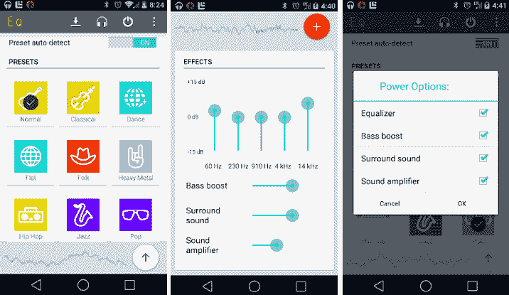
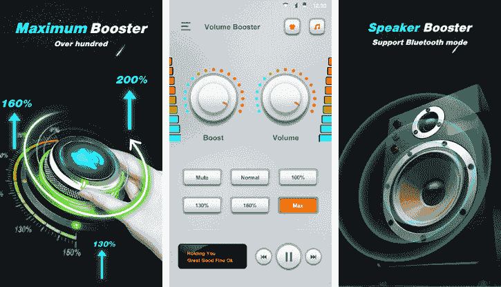
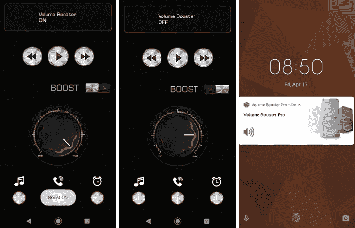
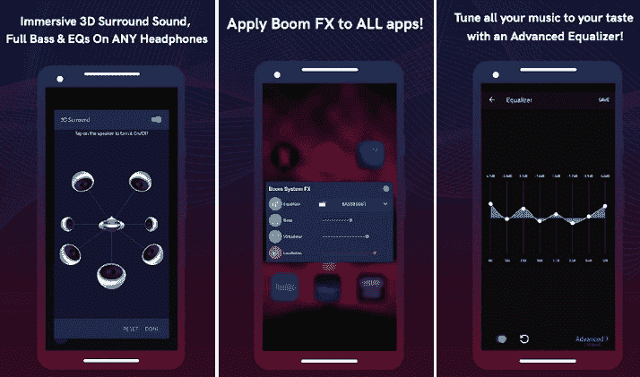
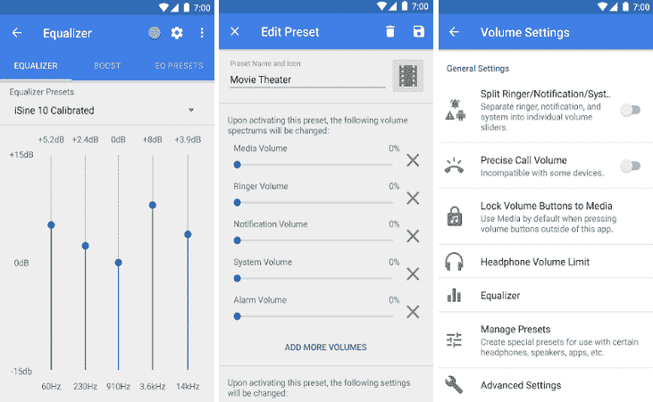
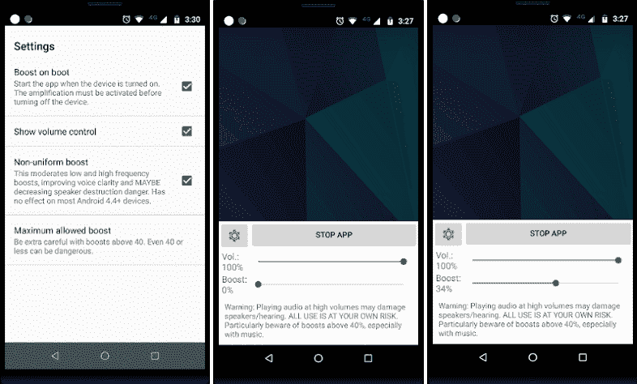
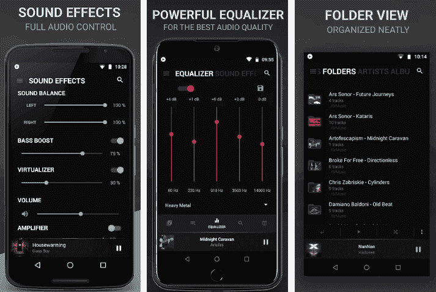
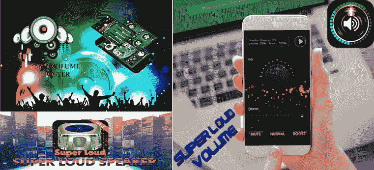
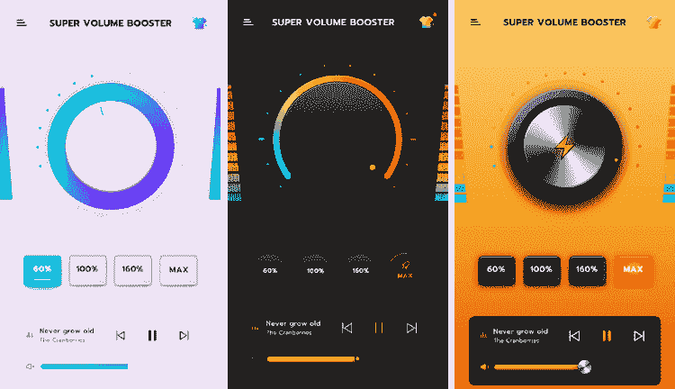

# 安卓的音量增强器

> 原文：<https://www.javatpoint.com/volume-booster-for-android>

如果你正在为安卓设备寻找最好的音量增强应用，试着在谷歌 Play 商店找到它。你会得到很多同名的音量增强 app 的优秀评级的结果，而且都获得了大量的下载量。

#### 注意:提高安卓智能手机的音量可能会永久损坏手机扬声器或伤害您的耳朵(如果您使用的耳机带有以下提到的所有应用程序)。在手机上安装这些应用程序，风险自负。

如果你想为你的安卓设备搜索一款优秀的音量增强应用，试着在谷歌 Play 商店搜索一下。对于收视率高、下载量大的[安卓](https://www.javatpoint.com/android-tutorial)来说，你会得到几个关于最佳音量增强器的结果。

## 安卓最佳音量增强应用

### 均衡器

均衡器音量增强应用是改善安卓设备音质的绝佳选择。它将增加设备的音量，并允许您使用频率滑块来管理任何失真(如果发生的话)。该应用程序简单易操作。使用均衡器应用程序，您可以从可用的 11 个预设声音配置文件中选择任何声音配置文件。付费版本允许您创建自己的声音均衡器。要启动声音放大器，请单击右上角的电源按钮。如果你有一个高质量的耳机，它的基本增强功能可以提供出色的声音体验。

从谷歌 Play 商店下载[均衡器](https://play.google.com/store/apps/details?id=com.smartandroidapps.equalizer)应用。

### 音量放大器-扬声器放大器

音量增强器是一个安卓应用程序，它可以比原生系统增加手机扬声器的音量。它允许您通过将耳机插孔连接到手机来增加扬声器的最大音量。无论您是在听音乐、使用其他应用程序看电影，还是玩任何游戏，该应用程序都会增加所有声音功能。该应用程序还包括音乐播放器控件，允许播放、暂停、查看歌曲信息，如艺术家和标题，并允许跳过歌曲。这个应用是免费使用的，但包含广告。

从谷歌 Play 商店下载[增压器](https://play.google.com/store/apps/details?id=com.cool.volume.sound.booster&hl=en_IN)应用。

### 音量增强专业版

音量增强专业版是安卓设备的另一个音量增强应用，可以增强设备的整体音频输出。它有一个干净清晰的用户界面，在中央有许多音量旋钮，可以控制主音量。该应用程序提供了一个切换按钮来启用增强声音放大。它还包括专用按钮，可以增加通话、报警和媒体播放的音量。

您为音量增强专业版选择的设置将应用于整个系统，并增加或减少您用来播放的任何应用程序的声音输出。它包含一个增强声音放大器的切换按钮，以及三个控制通话音量、闹铃和媒体播放的专用按钮。然而，该应用程序显示令人讨厌的全屏广告和弹出窗口，对大多数用户造成干扰。Volume Booster Pro 可提升所有三种类型的音量:媒体播放器音量、电话铃声音量和闹钟音量。

从谷歌 Play 商店下载[增压器专业版](https://play.google.com/store/apps/details?id=vintage.audio.tools.volumeboosterpro)应用。

### 繁荣

Boom 基本上是一个音乐播放器，同时也充当 3D 环绕声和 EQ(均衡器)。它为您的安卓系统提供了强大的低音和高级均衡器。它允许您定制和改进您的安卓设备的整体声音配置文件。该应用程序还支持在线电台、播客、Tidal 和 Spotify 的直接流媒体。Boom volume booster 还提供了 3D 环绕声设置功能，通过这些功能，您可以对音频输出进行更精细的控制。

从谷歌 Play 商店下载 [Boom](https://play.google.com/store/apps/details?id=com.globaldelight.boom) 增压器应用。

### 精确音量(+均衡器/助推器)

精确音量是另一个出色的音量增强器和均衡器，有助于改善您的安卓设备的音频声音。这个应用程序包含一个五频带均衡器，可以更精确地控制音频输出。它的一些均衡器预设和增强功能允许用户为音频添加环绕音效，提高低音，并增加设备的整体音量。这个音量增强应用程序的设置应用于整个设备，这意味着音量增强将与播放音频的整个应用程序一起工作。除了它的功能，它还允许你创建和保存你的均衡器预置。

从谷歌 Play 商店下载[精确卷](https://play.google.com/store/apps/details?id=com.phascinate.precisevolume)。

### 增压器 GOODEV

Volume Booster GOODEV 很简单，有一个小界面，还有免费的音量增强应用，可以增强你的设备扬声器或耳机的声音。该应用程序包含一个增强滑块，默认情况下可将声音放大 60%，并提供从设置进一步增加音量的选项。但是，长时间持续高音量播放音频可能会损坏扬声器和/或损坏耳朵。用户应该自担风险使用它。您选择的声音设置适用于音乐、电影和应用程序，但不适用于免提电话的通话音量。将增压器设置为零将关闭它。

从谷歌 Play 商店下载[增压器固特异](https://play.google.com/store/apps/details?id=com.goodev.volume.booster)应用。

### 音乐播放器

BlackPlayer [音乐播放器](https://www.javatpoint.com/music-player-for-android)是另一个可以作为安卓设备音量增强器的选项。它有一个干净、一致的用户界面，看起来很漂亮。该应用程序包括五通道均衡器功能和音效，这将允许您自定义设备的音频输出。该应用的放大器可以将声音提高到 4dB，并增强低音，从而提高您的聆听体验。它还提供了一个虚拟器，当您使用外部扬声器或耳机时，可以控制声音效果。

**功能**

*   它支持 MP3、WAV、M4A、FLAC、OGG 等音乐播放器文件。
*   它包含一个低音增强器、五波段均衡器、3D 环绕虚拟器和放大器。
*   它提供了自定义主题、颜色、字体和动画的功能。
*   支持穿戴操作系统和安卓自动。
*   它包括一个睡眠定时器。

从谷歌 Play 商店下载 [BlackPlayer 音乐播放器](https://play.google.com/store/apps/details?id=com.musicplayer.blackplayerfree&hl=en_IN)。

### 超大声电话音量(扬声器、音量增强器)

超级大声手机音量应用是安卓设备的另一个音量助推器，运行良好。它允许您调整设备的音效级别，以享受最佳的音频或音乐质量。这款应用改善了您对不同音乐来源的音频体验，例如收听播客、流媒体音乐、有声读物或观看电影。它还包含一个内置音乐播放器，允许您通过设置不同的均衡器和音乐频谱来播放音乐歌曲。这款应用可以增强手机扬声器和耳机。该应用程序承诺将手机的声音输出提高 30-40%。您可以控制手机的声音效果，如闹铃、音乐、声音和系统。

从谷歌 Play 商店下载[超大声手机音量](https://play.google.com/store/apps/details?id=super.superhigh.volume.loud.speakerloud&hl=en)应用。

### 超大容量助推器

超级音量助推器是另一个提升安卓设备音量的应用。这个应用是为那些喜欢听超大音量的用户准备的。它的用户界面真的很好，很干净。该应用还提供了不同的主题，可以改变应用的外观。由于轻量级，它不会占用更多的系统资源。该应用程序支持所有不同的声音，如音频、视频和游戏，并在不影响设备音频质量的情况下增强声音。它的一个特点是，它增加了立体声音量，而不会扭曲立体声效果。该应用程序还提供了在播放歌曲时控制音频的功能，以便您可以播放/暂停或轻松更改歌曲。

**功能**

*   播放音乐时给出现场声音频谱。
*   该应用包含耳机、蓝牙和外置扬声器的低音增强器。
*   它支持音频、视频和游戏音量暴涨。
*   音量增强器适用于铃声音量、警报音量和通知音量。

从谷歌 Play 商店下载[超级增压器](https://play.google.com/store/apps/details?id=com.soulapps.superloud.volume.booster.sound.speaker)应用。

* * *