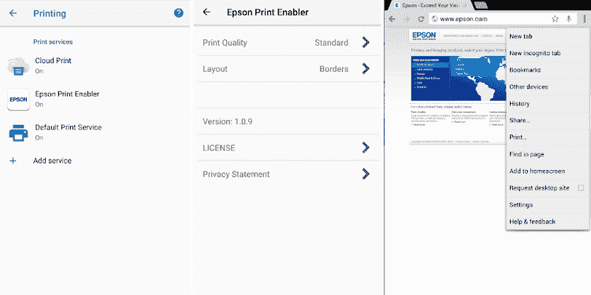
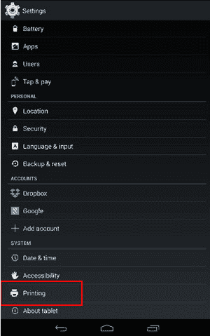
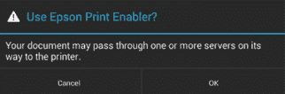

# 爱普生安卓打印启用程序

> 原文：<https://www.javatpoint.com/epson-print-enabler-for-android>

爱普生打印启用程序是一个应用程序，允许用户从您的安卓手机和平板电脑打印文档、照片、网页、电子邮件和其他内容。这款应用支持安卓 4.4 或更高版本。爱普生软件增强了内置的安卓打印设备，这些设备通过爱普生喷墨和激光打印机在[无线网络](https://www.javatpoint.com/wifi-full-form)上打印。在您的[安卓](https://www.javatpoint.com/android-tutorial)设备上下载并安装该应用程序后，您可以轻松打印电子邮件、网页、照片和文档。该应用程序有多种语言版本，如英语、德语、西班牙语等。在应用程序上录制几次后，您的安卓设备将检测到附近的爱普生产品进行打印。

## 爱普生打印启用程序的功能

爱普生打印启用程序软件提供了各种功能。下面提到了其中的一些:

*   该应用程序可直接从兼容的手机和平板电脑打印到爱普生喷墨和激光打印机上。
*   您还可以通过智能手机或平板电脑管理打印作业。
*   它提供了选择打印选项的功能，例如颜色、要打印的份数、打印质量、页面大小和双面打印。
*   该应用程序还允许直接从网页、设备库、照片、Gmail、谷歌驱动和其他支持打印功能的应用程序中打印。

## 此应用支持的应用

此应用程序支持以下应用程序:

*   走廊
*   铬
*   照片
*   谷歌邮箱
*   谷歌驱动
*   移动办公

**下载**

您可以从谷歌 Play 商店下载适用于安卓设备的[爱普生打印启用程序](https://play.google.com/store/apps/details?id=com.epson.mobilephone.android.epsonprintserviceplugin&hl=en_IN)应用程序。

## 如何用爱普生 Print Enabler 设置安卓设备？

要在您的安卓设备上设置爱普生打印启用程序应用程序，您需要执行以下操作:

1.从谷歌 Play 商店下载爱普生打印启用程序插件。

2.现在，访问您的设备**设置**并选择**打印**选项。

3.现在，选择**爱普生打印启用程序**，点击**关闭**选项(这将启用应用程序插件)。

4.出现“使用爱普生打印启用程序”窗口时，点击**确定**选项。

5.使用相同的无线网络连接您的打印产品和安卓设备。

6.现在，您的爱普生**打印**启用码已经设置好，可以打印了。你可以从安卓应用程序打印，如 Gmail 或 Chrome。要从这些应用程序中打印，您必须单击菜单图标并打印设备屏幕上出现的任何内容。

7.打开打印选项后，您需要选择想要打印的份数，或者单击“更多选项”来选择其他功能，如颜色模式和纸张大小和方向。

8.接下来，点击**打印**打印您的文档。

## 支持的介质和纸张尺寸

爱普生打印启用程序支持的介质和纸张尺寸如下:

*   信件(照片纸/普通纸)
*   A4 尺寸(相纸/普通纸)
*   4 x 6 英寸(相纸)
*   3.5 x 5 英寸(相纸)
*   明信片(光泽纸/喷墨纸)

## 爱普生打印启用程序相对于爱普生 iPrint 的优缺点

**爱普生打印使能器的优势**

*   使用爱普生打印启用程序，我们可以轻松方便地打印照片、电子邮件和其他网页。

**爱普生打印使能器的缺点**

*   这个软件只支持有限数量的纸张尺寸和类型。
*   它不提供任何预览功能，其布局也无法编辑。

**爱普生 iPrint 的优势**

*   爱普生 iPrint 支持多种不同的纸张尺寸和类型。
*   它提供了打印预览功能的功能，并允许编辑布局。

* * *