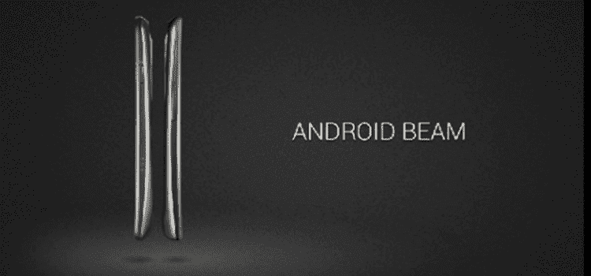
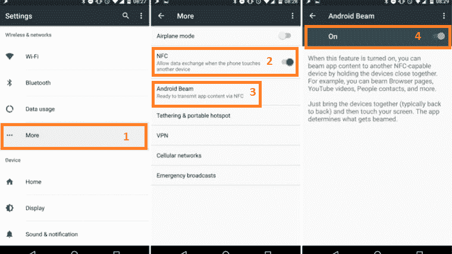
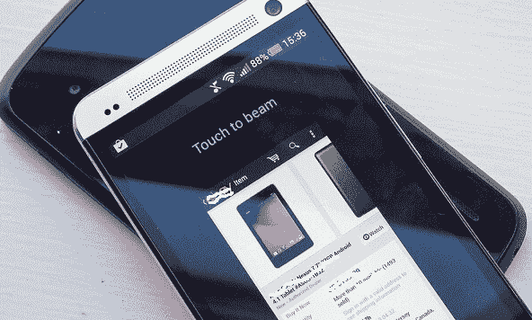
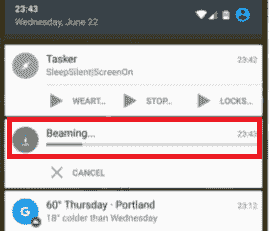
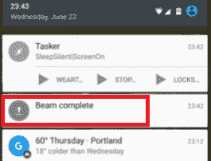

# 安卓光束

> 原文：<https://www.javatpoint.com/android-beam>

**安卓 Beam** 是安卓移动操作系统的一个特色。它用于传输数据(文档、图像、网址等)。)使用**近场通信** (NFC)从一台设备传输到另一台设备。为了在两个设备之间传输和接收数据，每个设备都需要其上的近场通信(NFC)硬件。Android Beam 于 2011 年在 Android 4.0 版本(冰淇淋三明治)中首次推出，所以你的智能手机和平板电脑必须有这个版本或更高版本。

要在[安卓](https://www.javatpoint.com/android-tutorial)设备之间传输数据，将两台设备靠近，在屏幕上打开想要共享的数据。如果您的数据支持传输，设备屏幕会缩小，并在屏幕顶部显示“轻敲至光束”。当您点击屏幕时，内容将从一台设备发送到另一台设备。如果数据被成功转发到另一个设备，将会播放确认声音，如果失败，将会播放否定声音。

## 检查手机上安卓波束和 NFC 硬件的可用性

Android Beam 的功能是从 Android 4.0 版本开始在 Android OS 中首次引入的。所以，你的安卓设备必须安装在 OS 4.0 或更高版本上。如果您的设备包含 [NFC](https://www.javatpoint.com/nfc-full-form) ，默认情况下可能会关闭。

在安卓系统上查看这些功能非常简单。只需进入手机或平板电脑的设置，点击**“更多”**选项，该选项位于无线&网络部分。在这里，您将看到 NFC 功能。默认情况下，此选项处于禁用状态，请打开切换按钮以启用它。在同一个屏幕上(更多)，您还可以看到**安卓光束**选项。点击它，并允许切换按钮，使安卓光束工作。现在，您的设备可以使用支持安卓波束和 NFC 的安卓波束将数据传输到另一台设备。

## 如何使用 Android Beam 将内容从一个 Android 设备发送到另一个设备

1.确保在这两个设备上成功完成安卓系统和 NCF 系统的设置。现在，打开你想发送的内容。

2.身体接触手机，使两部手机背对背。

3.现在，看看你想在屏幕上传输的内容。如果您的内容准备好移动，您将在屏幕顶部看到一个**“触摸到光束”**(或在某些手机中点击**到光束**)。

4.点击屏幕，你的内容(图像、文档、视频等。)会转移到另一个安卓设备。当内容传输成功时，您将收到确认声音，如果传输失败，您将收到一个否定的声音。

一些设备，如 HTC 10，不支持使用安卓系统传输大文件。在这种情况下，你可能想通过超级波束这样的应用程序尝试直接无线网络。另一种分享内容的方法是通过谷歌驱动或 DropBox 等云存储服务上传内容并分享。

## 什么是 S 光束？

三星为其较旧的智能手机扩展了安卓波束的功能，并将其命名为 **S 波束**。首先，在 Galaxy S III 手机中使用了 S Beam 技术。这项技术还通过使用无线直接连接连接两个设备，使用近场通信进行数据传输。分享内容比安卓 Beam 快。

* * *