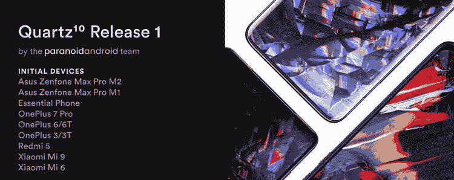
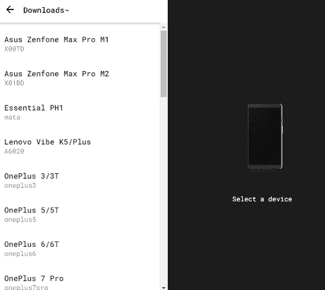
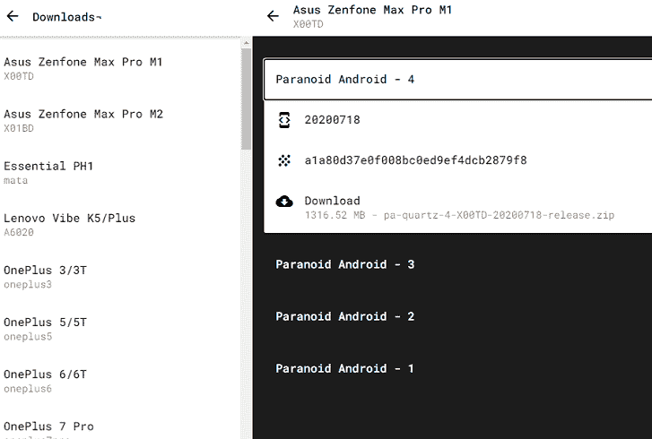

# 偏执的安卓

> 原文：<https://www.javatpoint.com/paranoid-android>

**偏执安卓**是一个定制 ROM，目标是扩展或增强现有安卓的系统和工作。这是一个面向智能手机和平板电脑的开源操作系统，基于[安卓](https://www.javatpoint.com/android-tutorial)平台。偏执的安卓宣布**石英**是自牛轧糖以来发布的稳定版本。这款操作系统最新的官方版本是基于[安卓 10](https://www.javatpoint.com/android-10) 的**Quartz 3**；于 2020 年 6 月 12 日发布。

## 偏执安卓的特点

这个[操作系统](https://www.javatpoint.com/operating-system)最受欢迎和最引人注目的两个特性是**光环**和**派**。光环功能允许用户在不离开当前屏幕的情况下查看通知。另一方面，Pie 取代了远离屏幕的屏幕导航按钮，允许用户横向滑动以查看按钮。它还提供意外触摸拒绝和口袋锁功能，避免按下用户口袋中的任何按钮。它还允许用户只需滑动三个手指就可以截图。

## 其他功能

*   内置屏幕记录器。
*   指纹显示。
*   屏幕外的手势。
*   口袋模式检测到你的设备在你的口袋里，并阻止它工作。
*   快速充电指示器。
*   导航栏定制。
*   提高锁屏安全性。
*   虚拟专用网络、无线网络限制和每个应用的蜂窝数据。
*   向下滑动三个手指获取截图。
*   长按音量键跳过曲目。
*   警报滑块用户界面。

## 偏执安卓支持的设备列表

| 制造商 | 模型 |
| 索尼 | 紧凑 Z1 体验、紧凑 Z3 体验、紧凑 Z2 Tab LTE 体验、wifi z2 tab 体验、Z1 体验、Z3+/Z4 体验、Z4 平板电脑体验(LTE)、紧凑 x 体验、高级 Z5 体验、紧凑 Z3 Tab 体验、紧凑 wifi z2 体验、Z5 体验、x 体验、超 z 体验 |
| 华为 | 向 5X 致敬， |
| 水平规ˌ水准仪(Level Gauge) | Nexus 5X，Nexus 5，Nexus 4， |
| 华硕 | Nexus 7 2013 (4G)，每 m1×00 TD 的最大值，每 m2×01 BD 的最大值，Nexus 7 2013 WiFi，Nexus 7 2012 WiFi，Nexus 7 2012 (3G)，Nexus 7 2012 WiFi |
| 谷歌 | 像素，像素 XL，像素 c |
| 同僚 | Find5，Find7，N1， |
| 常简称为 HTC 或宏达电 | Nexus 9， |
| 小米 | Mi 5、Mi 6、Mi 9、Redmi 4A、Redmi 5、Redmi 6 Pro、Note 8 / 8T、Redmi K20 Pro / Mi 9T Pro、Mi MIX 2 |
| 三星电子 | Galaxy Nexus，Nexus 10，Galaxy Nexus(威瑞森)，Galaxy Nexus(冲刺) |
| OnePlus(一个加一个) | 一，2，X，3/3T，5/5T，6/6T，7 Pro，7T Pro， |
| Nextbit(下一位) | 下一位罗宾 |
| 摩托罗拉 | Nexus 6 |
| 莉科 | Le Pro3 |
| 必要的 | 基本 PH1 |
| 联想（电脑的品牌名） | K5/K5 plus vibe |

## [计] 下载

从其官方网站[paranoidandroid.co](https://paranoidandroid.co/downloads)下载你的安卓智能手机的偏执安卓应用。您需要从左侧面板选择您的设备类型，然后点击**下载**。

* * *