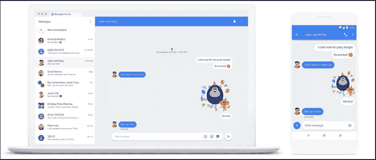
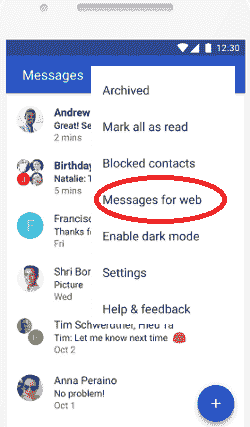
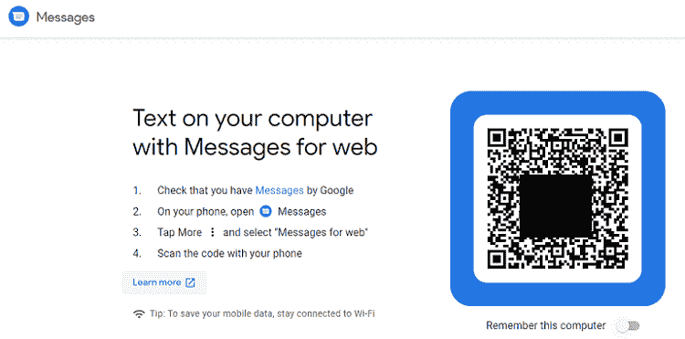
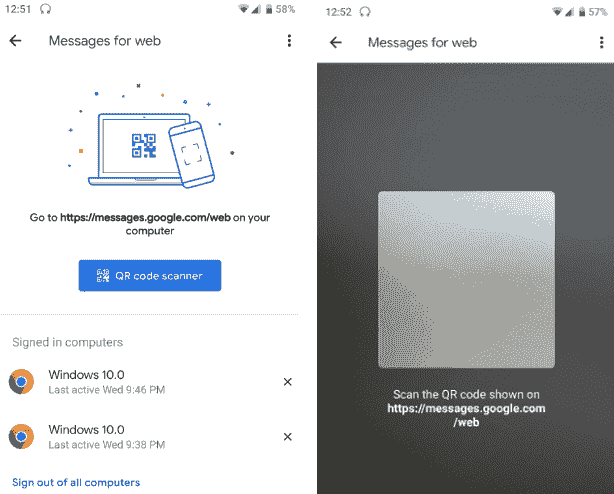
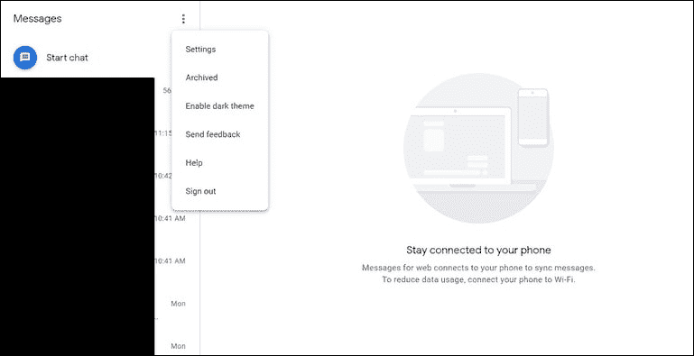
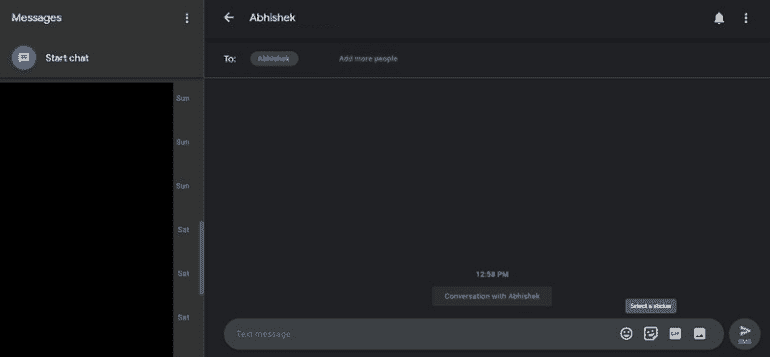

# 如何在电脑上获取安卓消息

> 原文：<https://www.javatpoint.com/how-to-get-android-messages-on-pc>

是否可以在您的电脑上查看和发送安卓消息？是的，你可以，通过使用“网络安卓消息”。“网络信息”允许你将你的安卓智能手机与你的个人电脑配对。您可以从每个设备发送和接收消息。您还可以将您的“信息”应用程序与多台电脑配对。但是，一次只有一台设备处于活动状态才能发送短信。

## 将你的安卓消息应用程序与你的电脑连接起来

您必须在手机和电脑上执行以下活动，才能将“信息”应用程序与电脑链接起来:

1.  从谷歌 Play 商店下载最新版本的[消息应用](https://play.google.com/store/apps/details?id=com.google.android.apps.messaging)并安装。
2.  现在，在手机上启动消息应用程序。
3.  点击菜单图标(屏幕右上角有三个垂直点)并点击“**网页信息**”选项。

4.现在，打开你的电脑，使用你最喜欢的任何一个[浏览器](https://www.javatpoint.com/browsers)访问[网页信息](https://messages.google.com/web/) [网址](https://www.javatpoint.com/url-full-form)。

5.可选步骤:要自动下次登录，请启用切换按钮“记住这台电脑”。如果不这样做，那么登录后进入选项**更多>设置**并启用**的切换按钮记住这个设备**。

6.点击[安卓](https://www.javatpoint.com/android-tutorial)手机上的**扫描二维码**，现在，将手机靠近网页并按住二维码。当扫描过程完成时，你的手机会震动。

现在，您已成功将智能手机的“信息”应用程序连接到电脑上的“网络信息”。现在，您将在个人电脑的浏览器中看到消息界面。您可以在电脑左侧面板上看到对话历史记录，并在右侧看到展开的消息。

单击菜单图标(三个垂直点)以访问设备设置、存档、启用浏览器的暗主题、发送反馈、帮助部分和注销。您也可以通过设置菜单启用深色主题。您也可以从设置选项中更改通知和邮件预览设置。你也可以用手机配对或解锁电脑，也可以看到数据使用提醒，而不是 [Wi-Fi](https://www.javatpoint.com/wifi-full-form) 。

## 如何在电脑上查看和回复“信息”中的对话

要查看和回复传入的消息，请点击历史列表窗口中的消息以打开消息。

## 如何在电脑上的“网络信息”中开始新对话

要开始您的新对话，请点击位于消息历史列表顶部的“**开始聊天**”按钮。现在，输入您想要发送消息的联系人的号码、姓名或电子邮件地址。您还可以在屏幕左侧看到顶级联系人列表。

要向联系人发送消息，请在窗口底部的文本字段中键入您的消息，然后单击右箭头图标发送。您还可以在对话中添加表情符号、贴纸和附件。

#### 注意:您的联系人列表、最新的对话消息以及其他设置都在“网络消息”中加密，并作为缓存存储在浏览器中。如果您的“消息”帐户由于任何原因一周内无法使用，出于安全原因，您的“消息”帐户将自动注销。

## 始终保持手机开机

安卓消息应用程序不能与你的手机分开工作。因此，如果你的手机因为任何原因关机或电池没电，你就不能从你的电脑发送任何信息。

## 注销网站消息

注销您的“信息”帐户可以保护您的帐户免受他人攻击。他们看不到你的敏感信息和个人细节。

### 在电脑上

如果您在公共或共享计算机上使用网络消息，请在完成对话后注销或离开。

1.  打开电脑，访问[网页消息](https://messages.google.com/web/)。
2.  在屏幕左上方，点击**更多**菜单(三个垂直点)并点击**退出**。

### 在你的安卓手机上

1.  在你的安卓智能手机上，启动消息应用。
2.  在屏幕左上方，点击**更多**菜单(三个垂直点)并转到选项**网页消息**。
3.  选择要注销的设备表单:
    *   **从单台计算机注销**:在您要断开连接的设备旁边，点击**删除**，然后**注销**。
    *   **注销所有电脑**:点击**注销所有电脑**

* * *