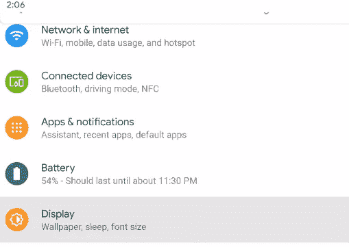

# 安卓黑暗模式

> 原文：<https://www.javatpoint.com/android-dark-mode>

谷歌安卓操作系统在安卓 10 (Q)或更高版本中引入**黑暗模式**(或**黑暗主题**)。你可以在所有的 Pixel 设备中看到黑暗模式功能，它也在向其他安卓手机发展。根据设备的屏幕技术，启用设备的暗模式可以降低功耗。它还提高了屏幕可视性，并帮助对强光或低视力敏感的用户。

用户可以在[安卓](https://www.javatpoint.com/android-tutorial)操作系统用户界面和设备上运行的应用程序上应用黑暗模式(黑暗主题)。黑暗模式改变了设备和其他本地谷歌应用的所有菜单的主要主题颜色，包括[浏览器](https://www.javatpoint.com/google-chrome)和 YouTube。

## 你的安卓手机有暗模式功能吗？

由于越来越多的手机公司在其设备中提供安卓 10 操作系统，具有黑暗模式功能的手机数量不断增加。因此，您的智能手机可能很快就会包含本机黑暗模式功能。旧手机或一些低价设备可能还无法获得此更新。

## 如何在安卓 10 中启用黑暗模式

在[安卓 10](https://www.javatpoint.com/android-10) 或更高版本中，有三种不同的方法可以启用黑暗模式。这些方法如下所示:

1.  更改您的系统设置
2.  快速设置
3.  在像素设备上(省电模式)

### 更改您的系统设置。

您可以直接从设备**设置**中启用黑暗模式主题。点击屏幕上的设置图标，您会发现**显示**选项，点击它。这将打开一个显示屏，在那里你会看到黑暗主题的切换按钮。

激活暗主题切换按钮，设置手机的暗模式功能。

### 快速设置

如果你不喜欢浏览设置，有另一种方法可以在你的安卓设备中启用黑暗模式主题，方法是将它固定到你的快速设置中。这样做将在通知面板上设置暗模式图标，您将通过下拉通知栏看到它。

要将暗主题添加到快速设置，只需通过将暗主题图标拖到通知栏的上部来编辑通知面板。看下图。点击后退按钮退出。

现在，您可以通过下拉通知栏并点击**黑暗主题**图标，在设备中启用黑暗模式。

### 在像素设备上(使用省电模式)

当您从谷歌像素智能手机的下拉通知面板中启用**省电模式**时，它会自动激活您设备上的黑暗主题。

启用省电功能还会禁用其他一些应用程序，因此当您的电池电量不足时，请真正使用它。允许黑暗主题让你享受新的外观，它也可能提高设备的电池寿命。这个主题自动适用于所有谷歌的原生应用，如 YouTube、 [Gmail](https://www.javatpoint.com/gmail) 和谷歌照片。

黑暗主题还将与许多其他第三方应用程序一起工作；然而，它可能需要额外的步骤。例如，在 Reddit 应用程序中，您需要从应用程序的设置菜单中设置“自动夜间模式”来跟随系统。当您的一些应用程序本身没有设置为黑暗模式时，请向下滚动到它们的设置来自己设置黑暗主题。

## 如何在 iPhone 上启用暗模式

黑暗模式主题现已在 iOS 13 及以上版本的 iPhone 上推出。现在，苹果的所有主要应用都在向黑暗主题发展。其他一些第三方开发者仍在开发他们的应用程序。应用它的方法主要有两种。一种是使用切换按钮在正常模式和黑暗模式之间切换。另一种方式是自动功能，根据日落和日出进行合理的来回切换。要在 iOS 13 上启用暗模式，请执行以下设置:

1.  启动设备的**设置** app。
2.  看一个选项**“显示&亮度”**，点击。
3.  选择**“黑暗模式”**选项。

另一种方法是打开设置应用程序并访问“控制中心”。现在，看看“自定义控件”，你会发现一个选项，添加黑暗模式到你的控制中心。

* * *