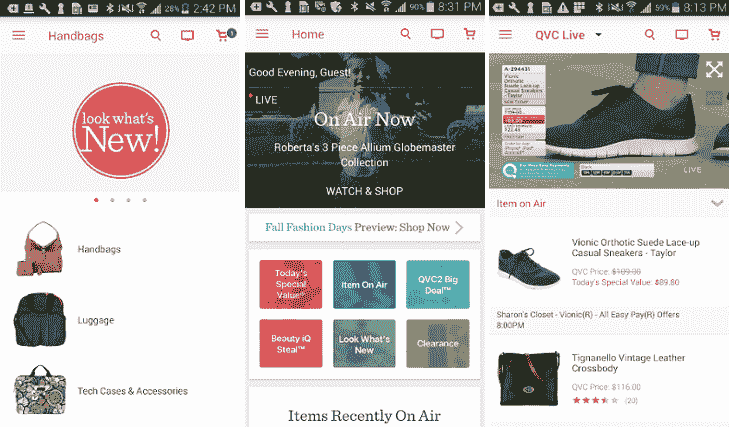

# 安卓系统的 QVC 应用

> 原文：<https://www.javatpoint.com/qvc-app-for-android>

QVC 是一款购物应用，允许用户在线购物。任何人都可以从谷歌 Play 商店或安卓市场免费下载。这款应用支持[安卓](https://www.javatpoint.com/android-tutorial)5.0 版及更高版本，体验更好。它允许您跟踪订单，并提供安全的支付选项。你也可以爱他们的**T3【今日特价】T5【当日最佳优惠】部分。QVC app 增加了过滤功能，使得搜索结果更加有效。**

## QVC 购物应用提供的基本功能

*   该应用程序允许跟踪您的订单。
*   您可以轻松编辑和取消订单。
*   查看和编辑轻松支付选项。
*   你可以进入你的购物愿望清单。
*   你可以随时更新你的个人信息。

在 QVC 应用程序上，你可以从 100，000 多种商品中找到你想要的东西，包括类别、品牌、商品编号、产品描述和单词。您可以在搜索中应用过滤器。该应用还包括 ***购买更多、保存更多优惠*** 部分。用户可以通过电子邮件、脸书和推特与他们的朋友和联系人分享产品。

QVC 致力于提供高质量的服务，并通过使用安全套接字层(SSL)对您的信息进行加密来对其保密。如果您对购买的商品不满意或收到了错误的产品，他们会在收到后 30 天内毫无疑问地退款。

## 安装说明

您可以从不同的来源在设备上安装 QVC 购物应用程序。

### 从安卓市场安装

1.  在你的设备上打开安卓市场。
2.  搜索“QVC”购物应用。
3.  从显示的列表中选择“QVC”购物应用。
4.  点击**安装**按钮，开始在您的设备上安装。

### 从谷歌 Play 商店安装

1.  打开设备上的谷歌 Play 商店。
2.  搜索“QVC”购物应用。
3.  从显示的列表中选择“QVC”购物应用。
4.  点击**安装**按钮，开始在您的设备上安装。

或者，直接访问位于谷歌 Play 商店的 [QVC 购物](https://play.google.com/store/apps/details?id=com.qvc&hl=en_IN) app 链接进行安装。

### 在安卓设备上使用网络浏览器安装

1.  将 [QVC.apk 文件](https://download.qvc.com/QVC_1.8.0.apk)直接下载到你的安卓设备上。
2.  双击它进行安装。按照屏幕上显示的说明完成安装。

### 使用笔记本电脑、台式机或电脑进行安装

1.  下载 [QVC.apk 文件](https://download.qvc.com/QVC_1.8.0.apk)复制到你的设备上。
2.  如果文件下载为。zip 文件，将其重命名为. apk。
3.  访问安卓市场，搜索“应用安装程序”应用程序。
4.  选择应用程序并点击安装按钮。
5.  成功安装应用程序后，将其打开。它将显示所有的。内存卡根目录中的 apk 文件。
6.  单击您在步骤 1 中下载的 QVC.apk 文件，它就会被安装。

* * *