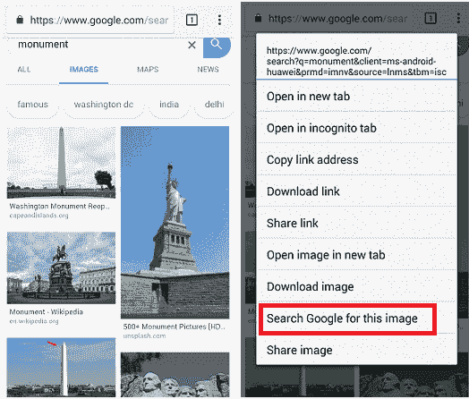
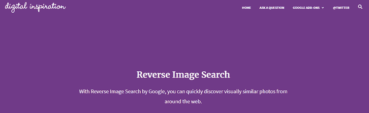
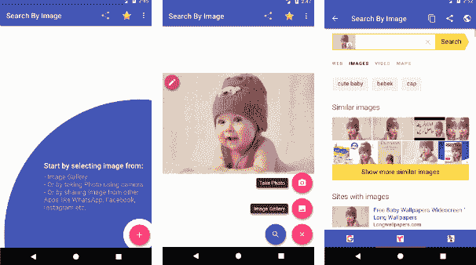
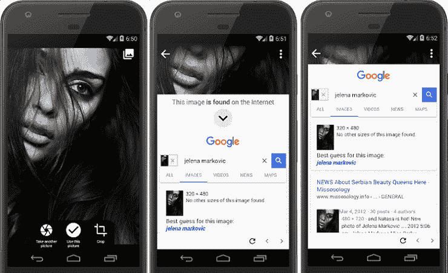
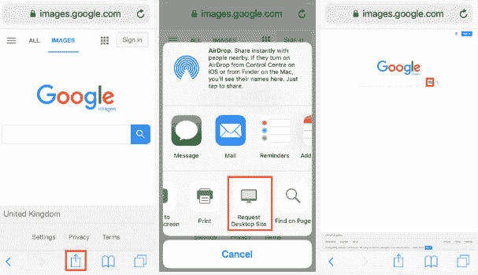
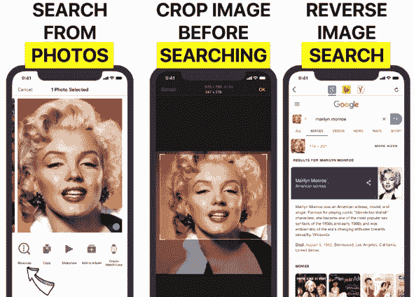

# 按图像搜索:谷歌反向图像搜索

> 原文：<https://www.javatpoint.com/search-by-image-google-reverse-image-search>

使用谷歌反向图像技术进行图像搜索是近年来最好的创新之一。使用反向图像搜索技术，你会通过谷歌、必应、Yandex 等多个反向图像搜索引擎找到相似的图片或图像。谷歌的**“按图像搜索”**功能最好，在台式电脑上工作简单；然而，对于移动设备上的许多用户来说，这是一个巨大的痛苦。

**“按图像搜索”**多被记者用来寻找图像的原始来源及其相关信息。这项技术有助于确定图片首次在互联网上发布的大致日期。其他专业人士，如摄影师和图像所有者，使用“按图像搜索”来确定未经许可使用其照片的网站。婚姻网站使用这种反向搜索来找出虚假上传的个人资料图片。

要在您的个人电脑上执行谷歌反向图像搜索，您需要执行以下活动:

1.  首先，你必须参观 images.google.com。
2.  现在，点击相机的小图标。它将打开一个窗口，您需要从计算机上传图像或粘贴图像的网址。
3.  之后，点击搜索按钮，谷歌将显示所有使用上传图片的网站。它还显示与您的搜索图像相似的结果，以及该图像的其他大小。

以上在[安卓](https://www.javatpoint.com/android-tutorial)设备上搜索图片的流程和步骤比较类似。然而，还有其他几种方法可以做谷歌反向图像搜索，这给一些用户带来了困惑。

## 使用 Chrome 按图像搜索

[谷歌的 Chrome 浏览器](https://www.javatpoint.com/google-chrome)在你的安卓设备上执行谷歌反向图像搜索最快最简单的方式。比如你在[网](https://www.javatpoint.com/internet)上冲浪，找到一张你想了解的令人兴奋的图片，进行反向搜索。要执行反向图像搜索，长按该图像，直到设备屏幕上出现带有各种选项的弹出窗口，单击**“在谷歌上搜索该图像”**。

### 逐步说明

1.  打开你的 Chrome 浏览器，找到一个你想反向搜索的图片。
2.  点击并按住该图像，直到弹出窗口出现。
3.  从弹出的窗口中点击**“在谷歌上搜索该图片”**选项，将会收集关于它的详细信息。

## 使用 ctrlq.org 按图像搜索

如果你想谷歌反向搜索保存在你的安卓设备中的图像，那么你必须使用不同的工具来完成你的任务。登陆[ctrlq.org/google/images](https://ctrlq.org/google/images/)[网址](https://www.javatpoint.com/url-full-form)点击**【上传图片】**。现在，从设备库中选择要反向搜索的图像。一旦图像上传，点击**“显示匹配”，**你会找到结果。这个网站还提供了拍照和反向搜索的功能。

### 逐步说明

1.  前往网址[ctrlq.org/google/images](https://ctrlq.org/google/images/)。
2.  现在，点击**“上传图片”**选项。
3.  从设备库中选择要反向搜索的图像。
4.  之后，点击**“显示匹配”**。

## 使用“按图像搜索”应用程序搜索图像

如果您可能正在使用谷歌反向图像搜索您的安卓设备上的图像。建议使用专用的应用程序来节省您的时间。最好的图像搜索应用之一是**按图像搜索**，它的工作原理大多类似于 ctrlq.org。你可以从谷歌 Play 商店下载[图片搜索](https://play.google.com/store/apps/details?id=com.palmteam.imagesearch)应用。

要使用该应用程序进行谷歌反向图像搜索，请启动该应用程序，然后单击屏幕右下角的**“+”**图标。现在，从设备图像库中选择一个图像，然后单击搜索按钮。它将显示与该图像相关的所有信息。它还允许用户使用相机而不是图库来拍照。

### 逐步说明

1.  从谷歌 Play 商店下载按图像搜索，并将其安装在您的设备上。
2.  启动应用程序，点击应用程序右下角的“+”图标。
3.  现在，选择你的安卓设备的**“图片库”**。
4.  从图库中选择要反向搜索的图像。
5.  点击屏幕的**搜索**按钮。

### “按图像搜索”应用程序的功能

*   这个应用程序使用起来很简单。
*   快速可靠。
*   它还提供相机支持来捕捉图像。
*   它显示来自各种搜索引擎的结果，如谷歌、Yandex 和必应。
*   它允许我们垂直和水平旋转图像。
*   它还允许我们裁剪图像。

**搜索结果**

*   它会找到所有相似的图像。
*   如果有，确定假图像。
*   此应用程序确定修改后的图像还是原始图像。
*   它也从它的部分搜索图像。当一幅图像由多幅图像组合而成时，从图像的某一部分搜索图像是很有用的。

## 图片夏洛克应用程序

照片夏洛克应用程序允许从图库上传从你的相机拍摄的图像，并通过搜索引擎(谷歌和 Yandex)进行即时反向图像搜索。这个应用程序简单易用。如果需要，您只需点击底部的相机或图库图标并进行裁剪。执行搜索活动，找出信息及其来源。

从谷歌 Play 商店下载安卓的[照片夏洛克](https://play.google.com/store/apps/details?id=hippeis.com.photochecker)反向图片搜索应用。

## 使用浏览器在 iPhone 中搜索图像

iOS 浏览器上的图片搜索也可以像我们在安卓手机上一样完成。但这些步骤略有不同。请看下面的步骤:

1.  访问您浏览器中的[images.google.com](https://images.google.com/)网址。
2.  假设你想要一个桌面版本，请求它。在 **Safari** 浏览器中，点击**共享**图标(向上箭头)打开共享菜单。在 Chrome 浏览器中，点击屏幕右下角的**更多**(三个点)图标。
3.  向下滚动，直到您看到一个选项**请求桌面站点**并点击它。
4.  点击小摄像头图标上传图像。

## 使用反向应用程序在 iphone 上反向搜索图像

Reversee 应用是 iPhone 设备的另一个绝佳选择。该应用程序还为用户提供了在开始网络搜索之前旋转和裁剪图像的功能。该应用程序还可以作为 iOS 扩展，在 Chrome、照片和 Safari 等应用程序中使用。然而，它的免费版本包含广告。你也可以选择它的专业版，它提供了更多的附加功能，没有广告。Reversee 应用程序的专业版允许我们编辑图像、粘贴图像网址，并从谷歌、Yandex 和必应等多个引擎进行搜索。该应用程序收集显示结果的图像的详细信息。

从 apple.com 下载 iPhone 和 iPad 的 [Reversee](https://apps.apple.com/us/app/reversee-reverse-image-search/id875678494) 应用。

* * *