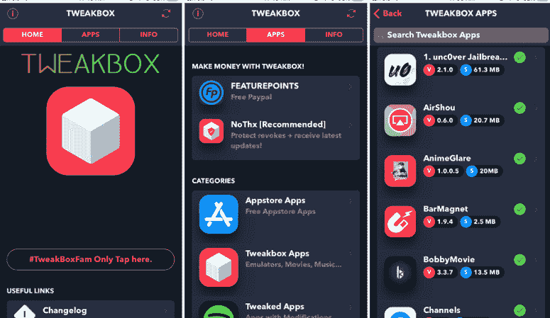

# 安卓的 TYPebox

> 原文：<https://www.javatpoint.com/tweakbox-for-android>

**安卓设备的 TweakBox 应用程序(APK)** 可以绝对免费下载和使用谷歌 Play 的付费和其他应用程序。使用这个应用，你可以下载并安装被黑的游戏，比如**口袋妖怪 Go++** ，甚至像 **WhatsApp++，Instagram++** 这样的微调应用，而不用扎根你的安卓设备。

谈论“[TYPebox](https://tweakbox-download.com/)”，是一个第三方应用安装程序，提供免费下载付费[安卓](https://www.javatpoint.com/android-tutorial)应用的功能。它是 **TutuApp、AppVally、vShare** 等类似应用的绝佳替代品。可能会出现一个问题，如果已经有这么多的应用可以试用和测试，我们为什么要使用“调整盒”？这个问题的答案是 TYPebox 的独特功能。

## 微调框 APK 的特点

**TweakBox APK** (应用)的因素和性能以及应用的频繁更新使其在用户中比其他相关应用更受青睐。它的一些特点如下:

*   TweakBox 应用程序的用户界面是简单性和风格的结合，它大部分类似于谷歌 Play 商店。这样第一次用户在导航应用时就不会遇到任何困难。
*   下载的应用程序将定期更新；您不需要手动检查更新。
*   如果有可用的更新，它们会立即通知您。你可以选择现在就更新，或者推迟到以后方便的时候。
*   TweakBox 是免费使用的，没有隐藏成本。
*   更新后的微调盒 APK 是轻量级的，它不会占用你的安卓设备太多空间。
*   最新的调整盒 APK 是巨大的，包含所有调整的游戏和应用程序，他们工作完美。
*   该应用程序中的应用程序和游戏分为 5 类，分别是应用商店应用程序、闪存应用程序、调整框应用程序、黑客游戏和调整应用程序。

## 下载适用于 Android 的 TweakBox APK

*   TweakBox 应用程序在谷歌 Play 商店无法直接下载。由于它是第三方应用程序(APK)，您需要在智能手机中进行额外设置，才能从未知来源安装该应用程序。访问**设置>安全**并启用切换按钮“**允许从未知来源安装**
*   现在，从链接[这里](https://tweakbox-download.com/download/)下载你的安卓智能手机中最新的 TYPebox APK 文件。
*   下载 APK 文件后，导航到下载部分，双击 APK 文件开始安装。
*   在下一个屏幕中，您必须允许 TweakBox 在智能手机上流畅运行而不崩溃所需的权限；点击**安装**。
*   完成安装需要一些时间；一旦它成功完成，您将看到 TweakBox 图标出现在您设备的主屏幕上。

## 使用 APK 微调盒在安卓设备上免费下载无限量应用

当你成功地在你的安卓设备上安装了 TYPebox 应用程序后，你可以很容易地从中下载你最喜欢的应用程序。浏览应用程序列表，并单击要下载和安装的应用程序。在这里，你会发现一个下载和安装类似谷歌 Play 商店的应用程序的选项。接下来，点击下载并安装选项，在你的安卓设备上安装一个应用。

好消息是，TweakBox 的开发人员正通过日夜努力不断更新它。他们在庞大的 TYPebox 库存中增加了每天新的应用程序。在其他商店找到你想要的应用程序可能会遇到一些问题，但是你在 TYPebox 中从来没有遇到过这样的问题。

### TweakBox 合法吗？

是的，TYPebox 是一款合法且 100%安全的应用。市场上有许多第三方安装程序，像 AppVally 和 TuTuApp 就是其中之一。TweakBox 作为一个来源，你会发现几个修改的游戏和应用程序。

### 我可以信任 TYPebox 吗？

是的，100%安全，一切都很完美。如果你想从 Play Store 免费下载付费应用和其他应用，强烈推荐使用 TweakBox。

### TweakBox 没有病毒吗？

是的，twinbox App 100%安全，完全没有病毒，你可以用它来替代 ACMarekt 和 TuTuApp。

### 我如何信任 TYPebox 应用程序？

要信任智能手机上的任何第三方安装程序，您必须在启动前进行一些设置。请执行以下活动来信任 TYPebox 应用程序。

*   打开设备的设置，访问通用**设置**。
*   点击**配置文件**和**设备管理**
*   选择“**调整框**”配置文件等。
*   现在，点击**信任**，并确认使其在你的安卓设备上可信。

### TweakBox 越狱你的 iPhone 还是安卓？

不，TYPebox 应用程序不需要任何越狱或根你的设备。这款应用在 iOS 和安卓设备上使用是完全安全的。它甚至不会损坏您设备的保修。

## 在 iOS 和电脑上下载 TYPebox

要在您的 iOS 和 PC 设备中下载 TweakBox，您必须访问以下链接。在这个链接上，你会找到最新版本的 iOS TYPebox。你也可以从这个链接下载 TweakBox 的配置文件。同时，您还会看到一个**安装**选项。点击此安装选项，为您的视频设备获取最新版本的 TYPebox 应用程序。下载完成后，请完成 iOS TYPebox 指南中给出的步骤。指南的链接在下面提到，在这里你可以找到更多关于 iOS tweak box 下载过程的信息。强烈建议使用 Safari 浏览器下载 TYPebox 应用程序，并确保高速互联网连接。

[**下载 iOS 的 TweakBox 手机配置**](https://www-tweakbox.com/dl/)

[**调整框应用程序配置配置文件 2**](https://tweakboxapp.ams3.digitaloceanspaces.com/TweakBox.mobileconfig)

如果你想在你的个人电脑或笔记本电脑上享受 twinbox 提供的所有应用程序，你必须从下面给出的链接下载你电脑或笔记本电脑上的 twinbox 应用程序。使用 **Nox 模拟器**安装 **TweakBox** 并尝试其他应用商店的付费或免费游戏和应用。

**下载 NOX I TweakBox 到 PC**

* * *