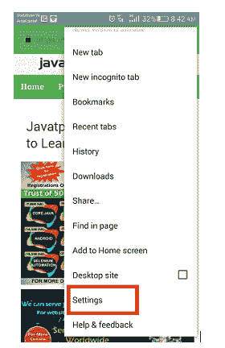
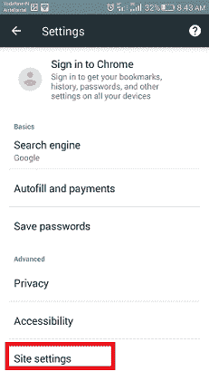
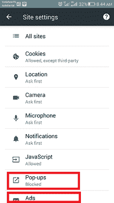
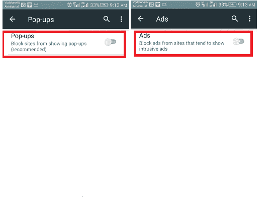
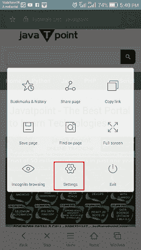
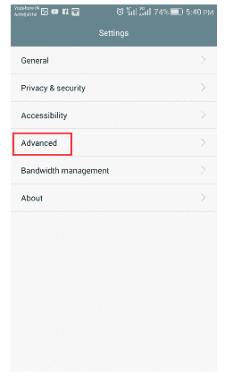
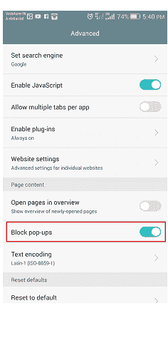

# 安卓系统中的弹出窗口拦截器

> 原文：<https://www.javatpoint.com/pop-up-blocker-in-android>

在你的安卓设备上阅读网络上的一篇有趣的文章时，有时当弹出窗口出现时，你会感到讨厌。一些弹出广告在屏幕上飞来飞去，阻止你的内容被看到。更令人沮丧的情况是，当你滚动页面时不小心点击了一个弹出广告。然而，你可以在安卓智能手机或平板电脑上停止这些弹出广告。

但是没有任何弹出阻止方法可以保证 100%完全证明。然而，你可以在你的[安卓](https://www.javatpoint.com/android-tutorial)手机上用正确的安全措施避开大多数弹出窗口。下面列出了其中一些方法，可以在安卓设备上浏览时禁用弹出窗口。

## 如何在 Chrome 浏览器中禁用弹出窗口

Chrome 是安卓智能手机最好的浏览器之一，它提供了一个内置功能来禁用不想要的弹出窗口和广告。默认情况下，您可以在 Chrome 设置中禁用此功能来阻止弹出广告。让我们通过使用这个特性来检查它是否正常工作。在 Chrome 浏览器中进行以下设置:

1.在安卓智能手机上打开你的 [Chrome 浏览器](https://www.javatpoint.com/google-chrome)。

2.点击浏览器右上角的更多选项(三个垂直点)。

3.点击**设置**。

4.向下滚动菜单直到**站点设置**。

5.触摸**弹出窗口**，重定向关闭弹出窗口。

6.点击**弹出窗口**和**广告**选项，并将其禁用以停止广告。

7.再次触摸并滑动切换按钮以禁用该功能。

## 在 Chrome 中检查网站的通知权限。

可能您已经被授予了浏览器上某个网站的某些通知权限，现在您想删除它们。如果是这样的话，那么打开 Chrome 并导航到该网站，然后按照以下步骤操作。

1.  打开你安卓手机的默认浏览器 Chrome 浏览器。
2.  点击屏幕右上角的**更多**图标(三个垂直点)。
3.  你需要点击顶部的信息图标“I”，然后点击**站点设置**。
4.  如果您看到**权限**部分下列出的**通知**，请点击关闭。

## 如何在其他安卓浏览器上阻止弹出广告

要停止(或阻止)其他浏览器上的广告和弹出窗口，您需要使用任何第三方浏览器。安卓 Chrome 浏览器的移动版本不能与任何其他第三方插件一起工作。不过，其他一些浏览器也可以，比如三星互联网、[火狐](https://www.javatpoint.com/mozilla-firefox)。

在默认的[安卓浏览器](https://www.javatpoint.com/best-browsers-for-android)上，也可以屏蔽弹出广告。要阻止默认安卓浏览器上的弹出窗口，请执行以下步骤:

1.启动默认安卓浏览器，点击**菜单**。

2.现在，点击**设置**选项。

3.转至**高级**设置。

4.最后，启用**阻止弹出**。

* * *