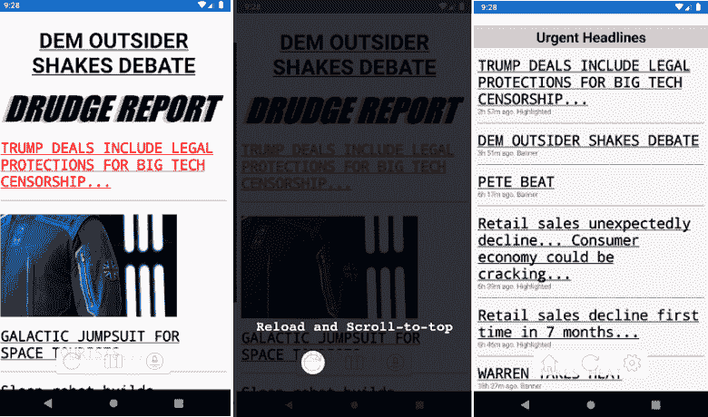
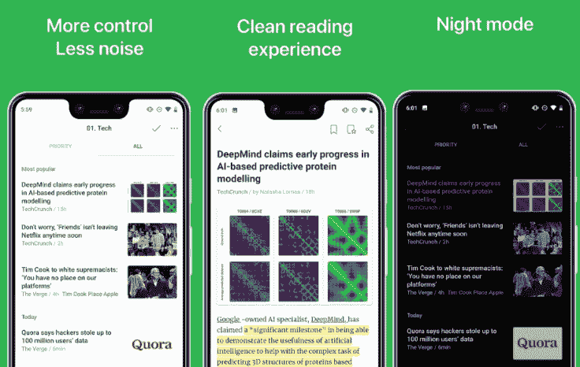

# 苦力报告安卓应用

> 原文：<https://www.javatpoint.com/drudge-report-android-apps>

[Drudge Report](https://www.drudgereport.com/) 是美国一个很受欢迎的网站，发布各种来源的不同种类的新闻。由于其简单的设计，用户界面和有争议的内容，这个网站变得更加受欢迎。**德拉吉报道**网站将最新的新闻内容放在上面。

事实上，由于互联网上的各种信息来源，很难对可靠和不可靠的来源进行分类。在本文中，我们将讨论一些 **Drudge 报告应用程序**，这样您就可以从可靠的来源获得信息。无论你对政治还是其他感兴趣，你都会发现下面的应用程序，它们对你很有用。我们还将在这里讨论药物报告(官方)的其他替代应用。

*   报告
*   动画板
*   苦工
*   苦力报告(官方)
*   保守新闻
*   日报单
*   谷歌新闻
*   福克斯新闻
*   Feedly
*   智能新闻

## 报告

**The Report** 是一款通用的新闻 app，提供了一种最舒适的阅读 Drudge Reader 新闻的方式。这款应用可以在你的智能手机上很好地显示内容，包括文章、图片和视频。它有一个包含几乎纯文本和一些图像的简单设计。

这款应用最大的好处就是你可以在上面找到可靠真实的信息。该应用从各种来源收集新闻，如**德拉吉报道、福克斯新闻频道、自由日报、布莱巴特、邦吉诺报道、公民自由新闻、**等。你会在主页上找到最重要的新闻，位置很好。快速滚动应用，你会看到文章的标题和描述。这个应用的内容每天都在更新。你也可以和其他读者分享你的想法和评论。

从谷歌 Play 商店下载[报告](https://play.google.com/store/apps/details?id=apps.cn&hl=en)应用。

## 动画板

**Flipboard** 是一款热门应用，涵盖所有话题的新闻。它包括阅读新闻的有用信息，允许评论热门话题和讨论。用户会在一个地方找到他们感兴趣的信息。由于其内容的多样性，用户会发现流行的科学话题或鼓舞人心的文章。

**Flipboard**应用的用户界面简单易用。所有最新消息都放在主页上。打开应用程序的菜单，你会根据你感兴趣的话题对新闻进行分类。该应用声称，可信来源提供他们的新闻内容。下载后，当你第一次启动这个应用程序时，勾选你感兴趣的整个主题。使用名为“T2”的标签，你将永远不会错过世界上任何有趣的话题。

从谷歌 Play 商店下载 [Flipboard](https://play.google.com/store/apps/details?id=flipboard.app&hl=en) 应用。

## 苦工

**Drudgely** 是一款简单的应用，但为安卓智能手机或平板电脑上的 Drudge Report 新闻提供了出色的服务。它提供了几个有用的功能，如**阅读器模式、离线阅读、摘要、文本到语音和翻译**。这款应用是那些喜欢阅读而不是观看的用户的首选，因为与图像或视频相比，文本量很高。内容在你的安卓智能手机上组织得很漂亮，每篇文章都有 100 字的概述。当你启动 Drudgely 应用程序时，你会在主页上看到所有重要的新闻和文章。当你点击任何一篇文章时，它会很快加载，你现在可以开始阅读了。该应用程序还提供了一个功能来过滤掉你阅读的文章。

从谷歌 Play 商店下载[drug ly](https://play.google.com/store/apps/details?id=net.solomob.android.drudgly)应用。

## 苦力报告(官方)

**德拉吉报告**是由***DrudgeReport.com***网站本身发布的官方 app。这款应用的目标是及时向你的智能手机发送高质量的文章和标题。当您第一次启动此应用程序时，它会要求您允许通知。一旦您允许通知权限，每当上传新内容时，它都会发送警报。用户还可以通过点击设置图标自定义他们希望在设备上接收的警报类型。

**德拉吉报告**应用程序具有简单的用户界面、快速的导航和针对移动屏幕的全面优化。

**功能**

*   点击重新加载按钮滚动到顶部。
*   轻按列图标一次将带您到第一列的顶部；你可以根据需要重复。

从谷歌 Play 商店下载[苦力报告](https://play.google.com/store/apps/details?id=com.idrudgereport.iDrudgeReportUniversal&hl=en_IN)。

## 保守新闻

**保守新闻**提供优质服务，轻松在您的[安卓](https://www.javatpoint.com/android-tutorial)设备上显示内容。这个应用程序从不同的来源提取新闻，如**德拉吉报道，市政厅，每周标准，福克斯新闻频道**和更多。它以其完美的设计和直观的用户界面而闻名。使用该应用程序，您可以访问所有的新闻杂志、趋势主题和政治文章。

如果你想查看内容的实际来源页面，点击文章的标题。这个应用加载信息非常快，而且绝对免费。如果你愿意的话，你还会收到通知，了解新的热门标题。8960936373

从谷歌 Play 商店下载[保守新闻](https://play.google.com/store/apps/details?id=com.sspencer10.news_app)。

## 日报单

**每日报道**是阅读来自保守新闻网站的著名和趋势新闻的最佳应用之一。该应用程序从各种可信来源提取信息，如**福克斯新闻频道、网关权威人士、德拉吉报告、班吉诺报告、每日电讯**和许多其他来源。该应用程序简单、快速、轻便，可以显示最新的头条新闻。它也方便你评论和查看其他人对新闻文章的评论。新闻文章的栏被分成标签，并且页面被很好地组织用于移动设备。如果你想查看实际的内容来源，点击文章标题。你也可以通过脸书、电子邮件、推特和其他分享平台分享文章。

**其他功能**

*   也可以自定义字体大小，让阅读体验令人满意。
*   发布突发新闻时收到通知。
*   该应用程序允许将文章保存到收藏夹供以后阅读。
*   该应用程序为舒适阅读提供了黑暗主题(夜间模式)。

从谷歌 Play 商店下载[日报](https://play.google.com/store/apps/details?id=us.dreport.free) app。

## 谷歌新闻

**谷歌新闻** app 旨在满足每个用户在不同智能手机和连接类型下的需求。它组织和突出世界上发生的新闻，这样你就可以随时更新自己。它的“**为你**”标签包含你最喜欢的话题的顶级新闻和文章在一个地方。它提供了关于时尚、科学、体育、娱乐、金融和您感兴趣的其他主题的深入信息。你也可以找到你想关注的不同来源，并获得关于它们的每日简要内容。

在**头条**标签中，你会看到来自世界各地的未经过滤的头条和突发新闻文章。另一部分提供商业新闻、科技文章、旅游新闻、健康、国内和国际新闻等。您还可以快速发现新的可信来源和主题，并在“T2”新闻和“T3”选项卡中浏览。

从谷歌 Play 商店下载[谷歌新闻](https://play.google.com/store/apps/details?id=com.google.android.apps.magazines&hl=en)。

## 福克斯新闻

**FoxNews** app 让你随时随地点播看新闻。从观众数量来看，它是美国最受欢迎的信息来源之一。该应用程序包含不同类型的信息，如趋势文章、突发新闻、美国和世界新闻，以及来自最喜欢的新闻人物的娱乐。

您将全天候获得独家新闻和现场头条的提醒。福克斯新闻还包括直播活动和独家视频流节目。下载这个应用程序，让自己了解各种新闻并获得娱乐。

从谷歌 Play 商店下载[福克斯新闻](https://play.google.com/store/apps/details?id=com.foxnews.android&hl=en_US)。

## Feedly

**Feedly** 是一款允许你整理、阅读和分享信息的应用。这款应用面向各类读者，如共和党人、民主党人、右翼和左翼。数百万人使用这个应用程序阅读新闻、杂志、博客等。在手机和平板电脑上。这个应用程序很容易使用。使用 Feedly，你可以很容易地在一个地方组织你的出版物、热点故事和更多内容。

这个应用程序工作起来很有趣；首先，你需要选择你想要跟随的源和标签。之后，它会根据您的选择为您创建一个独特的提要，您可以一点一点地阅读。这个应用程序加载新闻和其他信息非常快。Feedly 连接了 4000 多万个 feeds 你将获得深度和利基内容。您还可以搜索和浏览热门话题。Feedly 有免费和付费两种版本；然而，它的免费版本包含广告，而付费版本是无广告的。

从谷歌 Play 商店下载 [Feedly](https://play.google.com/store/apps/details?id=com.devhd.feedly&hl=en) 应用。

## 智能新闻

**智能新闻**是谷歌新闻和 Feedy 的绝佳替代品，后者提供**突发新闻头条**。这个应用程序通过互联网从最可信的来源收集新闻。它有一个干净简单的用户界面，它的信息被分成不同的类别，使导航变得简单。体育爱好者直接潜入体育板块，其他新闻爱好者(政治和经济)在其他板块寻找新闻。

**SmartNews** app 已经受到全球数百万用户的喜爱。你会发现当地新闻、政治新闻、世界新闻等等。该应用还提供了方便的设置功能，用于快速查看标题、接收通知、离线阅读内容等。它让你了解世界上正在发生的事情。

从谷歌 Play 商店下载[智能新闻](https://play.google.com/store/apps/details?id=jp.gocro.smartnews.android)。

* * *